# Use Case Diagram — Video Streaming Platform

## Introduction

This document presents the use case model for the Video Streaming Platform. It identifies every actor that interacts with the system — human users and external systems alike — and maps each actor to the set of goals (use cases) they pursue. The diagram uses a Mermaid `flowchart LR` with dedicated subgraphs per actor, which faithfully represents the relationships that a UML Use Case diagram would show: associations between actors and use cases, `<<include>>` dependencies, and `<<extend>>` extensions.

### Scope

The platform covers the full lifecycle of streamed video content: ingest, transcoding, DRM packaging, catalog management, subscription billing, VOD playback, live streaming, content moderation, and analytics. Both consumer-facing (Viewer) and creator-facing (Content Creator) journeys are in scope, together with platform administration and the external integrations that make delivery, security, and monetization possible.

### Reading the Diagram

- **Solid arrows** from an actor node to a use-case node represent the UML **association** (the actor participates in that use case).
- **Dashed arrows labeled `<<include>>`** show a use case that is *unconditionally* included in the base use case's flow.
- **Dashed arrows labeled `<<extend>>`** show optional or conditional behaviour that augments a base use case.
- **External actor subgraphs** (CDN, Payment Gateway, DRM Provider, Analytics Service) are placed on the right and connected to the use cases they fulfil.

---

## Actor Descriptions

### Human Actors

| Actor | Role | Authentication |
|---|---|---|
| **Viewer** | End-user who consumes content; may hold a free or paid subscription tier | OAuth 2.0 / OIDC token via Identity Provider |
| **Content Creator** | Uploads, publishes, and manages video content; may monetise | OAuth 2.0 with elevated creator scope |
| **Platform Administrator** | Manages platform configuration, user accounts, DMCA, and system health | Internal RBAC with MFA enforced |

### External System Actors

| Actor | Technology Examples | Role |
|---|---|---|
| **CDN** | Cloudflare Stream, Akamai Adaptive Media Delivery | Delivers video segments and manifests at the edge |
| **Payment Gateway** | Stripe, Braintree | Processes subscription payments and refunds |
| **DRM Provider** | Google Widevine, Apple FairPlay, Microsoft PlayReady | Issues licences that decrypt encrypted video streams |
| **Analytics Service** | Segment, Snowflake, ClickHouse pipeline | Collects playback telemetry and business events |

---

## Use Case Diagram

```mermaid
flowchart LR
    %% ── ACTORS ────────────────────────────────────────────────────────────────
    subgraph VIEWER["👤 Viewer"]
        V(Viewer)
    end

    subgraph CREATOR["🎬 Content Creator"]
        C(Creator)
    end

    subgraph ADMIN["🛡️ Platform Admin"]
        A(Admin)
    end

    subgraph CDN_ACTOR["🌐 CDN (External)"]
        CDN(CDN)
    end

    subgraph PAY_ACTOR["💳 Payment Gateway (External)"]
        PG(Payment Gateway)
    end

    subgraph DRM_ACTOR["🔑 DRM Provider (External)"]
        DRM(DRM Provider)
    end

    subgraph ANALYTICS_ACTOR["📊 Analytics Service (External)"]
        AS(Analytics Service)
    end

    %% ── VIEWER USE CASES ──────────────────────────────────────────────────────
    subgraph VIEWER_UC["Viewer Use Cases"]
        UC_SEARCH[Search Content]
        UC_BROWSE[Browse Catalog]
        UC_PLAY[Play Video]
        UC_RESUME[Resume Playback]
        UC_DOWNLOAD[Download Offline]
        UC_PLAYLIST[Manage Playlist]
        UC_SUBSCRIBE[Subscribe to Plan]
        UC_LIVE_WATCH[Watch Live Stream]
        UC_LIVE_CHAT[Chat in Live Stream]
        UC_RATE[Rate / Review Content]
        UC_PARENTAL[Set Parental Controls]
    end

    %% ── CREATOR USE CASES ─────────────────────────────────────────────────────
    subgraph CREATOR_UC["Creator Use Cases"]
        UC_UPLOAD[Upload Video]
        UC_TRANSCODE_MON[Monitor Transcoding]
        UC_PUBLISH[Publish Content]
        UC_SCHEDULE[Schedule Content]
        UC_GO_LIVE[Go Live]
        UC_ANALYTICS[View Analytics]
        UC_COMMENTS[Manage Comments]
        UC_MONETIZE[Set Monetization]
        UC_GEO[Configure Geo-Restrictions]
    end

    %% ── ADMIN USE CASES ───────────────────────────────────────────────────────
    subgraph ADMIN_UC["Admin Use Cases"]
        UC_FLAGGED[Review Flagged Content]
        UC_DMCA[Process DMCA Takedown]
        UC_USERS[Manage Users]
        UC_CONFIG[Configure Platform]
        UC_HEALTH[Monitor System Health]
        UC_SUB_MGMT[Manage Subscriptions]
    end

    %% ── SHARED / INCLUDED USE CASES ──────────────────────────────────────────
    subgraph SHARED_UC["Shared / Included Use Cases"]
        UC_AUTH[Authenticate User]
        UC_ENTITLEMENT[Check Entitlement]
        UC_DRM_LICENSE[Acquire DRM License]
        UC_MANIFEST[Fetch Playback Manifest]
        UC_SEGMENT[Deliver Video Segments]
        UC_PAYMENT_PROC[Process Payment]
        UC_NOTIFY[Send Notification]
        UC_TRANSCODE[Transcode Content]
        UC_CONTENT_ID[Fingerprint / Content ID Check]
    end

    %% ── VIEWER ASSOCIATIONS ───────────────────────────────────────────────────
    V --> UC_SEARCH
    V --> UC_BROWSE
    V --> UC_PLAY
    V --> UC_RESUME
    V --> UC_DOWNLOAD
    V --> UC_PLAYLIST
    V --> UC_SUBSCRIBE
    V --> UC_LIVE_WATCH
    V --> UC_LIVE_CHAT
    V --> UC_RATE
    V --> UC_PARENTAL

    %% ── CREATOR ASSOCIATIONS ──────────────────────────────────────────────────
    C --> UC_UPLOAD
    C --> UC_TRANSCODE_MON
    C --> UC_PUBLISH
    C --> UC_SCHEDULE
    C --> UC_GO_LIVE
    C --> UC_ANALYTICS
    C --> UC_COMMENTS
    C --> UC_MONETIZE
    C --> UC_GEO

    %% ── ADMIN ASSOCIATIONS ────────────────────────────────────────────────────
    A --> UC_FLAGGED
    A --> UC_DMCA
    A --> UC_USERS
    A --> UC_CONFIG
    A --> UC_HEALTH
    A --> UC_SUB_MGMT

    %% ── INCLUDE RELATIONSHIPS ─────────────────────────────────────────────────
    UC_PLAY -. "<<include>>" .-> UC_AUTH
    UC_PLAY -. "<<include>>" .-> UC_ENTITLEMENT
    UC_PLAY -. "<<include>>" .-> UC_MANIFEST
    UC_PLAY -. "<<include>>" .-> UC_DRM_LICENSE
    UC_PLAY -. "<<include>>" .-> UC_SEGMENT

    UC_RESUME -. "<<include>>" .-> UC_PLAY

    UC_DOWNLOAD -. "<<include>>" .-> UC_AUTH
    UC_DOWNLOAD -. "<<include>>" .-> UC_ENTITLEMENT
    UC_DOWNLOAD -. "<<include>>" .-> UC_DRM_LICENSE

    UC_SUBSCRIBE -. "<<include>>" .-> UC_AUTH
    UC_SUBSCRIBE -. "<<include>>" .-> UC_PAYMENT_PROC

    UC_UPLOAD -. "<<include>>" .-> UC_AUTH
    UC_UPLOAD -. "<<include>>" .-> UC_CONTENT_ID
    UC_UPLOAD -. "<<include>>" .-> UC_TRANSCODE

    UC_GO_LIVE -. "<<include>>" .-> UC_AUTH
    UC_GO_LIVE -. "<<include>>" .-> UC_ENTITLEMENT

    UC_LIVE_WATCH -. "<<include>>" .-> UC_AUTH
    UC_LIVE_WATCH -. "<<include>>" .-> UC_SEGMENT

    %% ── EXTEND RELATIONSHIPS ──────────────────────────────────────────────────
    UC_RESUME -. "<<extend>>" .-> UC_PLAY
    UC_LIVE_CHAT -. "<<extend>>" .-> UC_LIVE_WATCH
    UC_RATE -. "<<extend>>" .-> UC_PLAY
    UC_SCHEDULE -. "<<extend>>" .-> UC_PUBLISH
    UC_GEO -. "<<extend>>" .-> UC_PUBLISH

    %% ── EXTERNAL SYSTEM ASSOCIATIONS ──────────────────────────────────────────
    CDN --> UC_SEGMENT
    CDN --> UC_MANIFEST
    PG --> UC_PAYMENT_PROC
    DRM --> UC_DRM_LICENSE
    AS --> UC_ANALYTICS

    %% ── NOTIFY CONNECTIONS ────────────────────────────────────────────────────
    UC_TRANSCODE -. "<<include>>" .-> UC_NOTIFY
    UC_PUBLISH -. "<<extend>>" .-> UC_NOTIFY
    UC_DMCA -. "<<include>>" .-> UC_NOTIFY
```

---

## Use Case Groupings / Packages

### Package: Content Consumption
Encompasses all use cases a Viewer exercises to find and watch content.

| ID | Use Case | Priority |
|---|---|---|
| UCP-01 | Search Content | High |
| UCP-02 | Browse Catalog | High |
| UCP-03 | Play Video | Critical |
| UCP-04 | Resume Playback | High |
| UCP-05 | Download Offline | Medium |
| UCP-06 | Manage Playlist | Medium |
| UCP-07 | Watch Live Stream | High |
| UCP-08 | Chat in Live Stream | Medium |
| UCP-09 | Rate / Review Content | Low |
| UCP-10 | Set Parental Controls | Medium |

### Package: Subscription and Access
Covers entitlement management and payment flows.

| ID | Use Case | Priority |
|---|---|---|
| UCS-01 | Subscribe to Plan | Critical |
| UCS-02 | Acquire DRM License | Critical |
| UCS-03 | Check Entitlement | Critical |
| UCS-04 | Process Payment | Critical |

### Package: Content Ingest
All use cases for getting content into the platform.

| ID | Use Case | Priority |
|---|---|---|
| UCI-01 | Upload Video | Critical |
| UCI-02 | Transcode Content | Critical |
| UCI-03 | Monitor Transcoding | High |
| UCI-04 | Fingerprint / Content ID Check | High |

### Package: Content Publishing and Management
Creator controls over when and how content is available.

| ID | Use Case | Priority |
|---|---|---|
| UCPM-01 | Publish Content | Critical |
| UCPM-02 | Schedule Content | Medium |
| UCPM-03 | Configure Geo-Restrictions | Medium |
| UCPM-04 | Set Monetization | High |
| UCPM-05 | Manage Comments | Low |

### Package: Live Streaming
| ID | Use Case | Priority |
|---|---|---|
| UCL-01 | Go Live | High |
| UCL-02 | Watch Live Stream | High |
| UCL-03 | Chat in Live Stream | Medium |

### Package: Platform Administration
| ID | Use Case | Priority |
|---|---|---|
| UCA-01 | Review Flagged Content | High |
| UCA-02 | Process DMCA Takedown | Critical |
| UCA-03 | Manage Users | High |
| UCA-04 | Configure Platform | High |
| UCA-05 | Monitor System Health | Critical |
| UCA-06 | Manage Subscriptions | High |

---

## Relationship Notes

### `<<include>>` Relationships

An `<<include>>` relationship indicates that the behaviour of the included use case is **always** incorporated into the base use case. It is not optional.

| Base Use Case | Included Use Case | Rationale |
|---|---|---|
| Play Video | Authenticate User | No unauthenticated playback is permitted |
| Play Video | Check Entitlement | Subscription tier or purchase must be validated |
| Play Video | Fetch Playback Manifest | The HLS/DASH manifest must be retrieved before segments can play |
| Play Video | Acquire DRM License | Encrypted segments require a valid Widevine/FairPlay licence |
| Play Video | Deliver Video Segments | CDN segment delivery is integral to playback |
| Upload Video | Authenticate User | Creator must be authenticated |
| Upload Video | Fingerprint / Content ID Check | Every upload is scanned for copyright violations before storage |
| Upload Video | Transcode Content | All uploads are transcoded to multi-bitrate ABR profiles |
| Subscribe to Plan | Authenticate User | Subscription requires a known identity |
| Subscribe to Plan | Process Payment | Payment collection is mandatory to activate subscription |
| Transcode Content | Send Notification | Creator is always notified of transcoding completion or failure |

### `<<extend>>` Relationships

An `<<extend>>` relationship indicates **optional or conditional** behaviour that adds to a base use case under specific conditions.

| Base Use Case | Extending Use Case | Extension Condition |
|---|---|---|
| Play Video | Resume Playback | When the viewer has a saved resume position for the content item |
| Play Video | Rate / Review Content | When the viewer reaches the end of the video |
| Watch Live Stream | Chat in Live Stream | When the creator has enabled live chat for the broadcast |
| Publish Content | Schedule Content | When the creator selects a future publish date rather than immediate |
| Publish Content | Configure Geo-Restrictions | When the creator restricts availability by territory |
| Publish Content | Send Notification | When subscribers have opted in to new content alerts from the creator |

---

## External System Interaction Summary

### CDN (Cloudflare / Akamai)

The CDN is a passive but critical actor. It does not initiate use cases; instead, it fulfils the **Deliver Video Segments** and **Fetch Playback Manifest** use cases. The platform pushes origin content to CDN edge nodes; viewers pull content from edge PoPs. The CDN enforces signed URL tokens that the platform generates, preventing unauthorised hotlinking.

**Protocols:** HTTPS (manifests, thumbnails), HTTP/2 + QUIC (segment delivery), RTMP/SRT (live ingest edge).

### Payment Gateway (Stripe)

The Payment Gateway fulfils the **Process Payment** use case. It receives tokenised card data from the Viewer's browser (never touching platform servers directly), charges the card, and returns a payment intent confirmation. The platform listens for Stripe webhook events (`invoice.paid`, `invoice.payment_failed`, `customer.subscription.deleted`) to update entitlements.

**Protocols:** REST over HTTPS, Stripe Webhooks (HMAC-SHA256 verified).

### DRM Provider (Widevine / FairPlay / PlayReady)

The DRM Provider fulfils the **Acquire DRM License** use case. When a player encounters an encrypted segment, it generates a licence challenge and sends it to the platform's DRM proxy. The proxy forwards it to the appropriate licence server (Widevine for Android/Chrome, FairPlay for Apple devices, PlayReady for Edge/Smart TVs). The licence server returns an encrypted licence containing content keys.

**Protocols:** HTTPS, EME (Encrypted Media Extensions) in browser, custom binary protocol for native SDKs.

### Analytics Service (Segment / ClickHouse)

The Analytics Service fulfils the **View Analytics** use case for Creators and the platform's internal data pipeline. Players emit heartbeat events every 10 seconds with quality metrics (bitrate, rebuffering count, CDN PoP). These events are forwarded through the platform's event ingestion endpoint to Segment, which fans them out to ClickHouse for real-time dashboards.

**Protocols:** REST over HTTPS (event ingestion), gRPC (internal pipeline), WebSocket (real-time creator dashboards).

---

## Notes on Implicit Use Cases

Several system-level use cases are not directly triggered by a human actor but are essential to overall platform operation. They appear in the **Shared / Included Use Cases** subgraph and are always reached via inclusion from higher-level use cases:

- **Authenticate User** — Validates the JWT / OIDC token on every protected request.
- **Check Entitlement** — Queries the entitlement service to confirm the viewer's active subscription permits access to the requested content tier (SD, HD, 4K, or download).
- **Deliver Video Segments** — The CDN performs range-request delivery of `.ts` and `.m4s` segments to the player.
- **Fetch Playback Manifest** — The manifest service generates a signed, personalised HLS or DASH manifest URL.
- **Transcode Content** — A background job pipeline converts uploaded raw video into ABR profiles; this is not an interactive actor-initiated action but is modelled here because Creators do monitor and re-trigger it.
- **Fingerprint / Content ID Check** — Automated fingerprinting via an external Content ID system runs immediately after upload to catch third-party copyright material before it reaches transcoding.

---

## Constraints and Assumptions

1. **Authentication** is always a prerequisite for any stateful use case. Unauthenticated browsing (Browse Catalog, Search Content) is permitted to a limited extent for discovery but full metadata and playback require a valid session.
2. **Parental Controls** are enforced at the Entitlement Check step; a rating filter stored against the viewer profile gates access to age-restricted content.
3. **Concurrent stream limits** are enforced as part of the Entitlement Check. A Basic plan may allow 1 concurrent stream, Standard 2, and Premium 4.
4. **Geo-Restrictions** configured by a Creator are evaluated at the Fetch Playback Manifest step by comparing the viewer's IP-to-country mapping against the content's allowed territory list.
5. **DMCA Takedown** is exclusively an Admin use case. Creators may flag a video for review, but only an Admin can issue a takedown, disable a video, and notify the affected creator through the formal DMCA process.
6. All external systems communicate exclusively over mutually authenticated TLS 1.3 connections.
