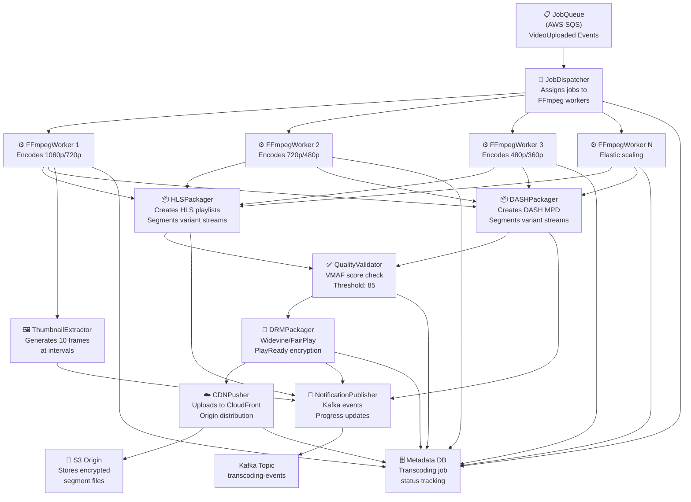

# Video Streaming Platform - C4 Component Diagrams

## TranscodingService Components

### Overview
The TranscodingService is responsible for accepting uploaded videos and converting them into multiple adaptive bitrate profiles. It orchestrates a complex pipeline involving validation, transcoding, packaging, DRM encryption, and CDN distribution.



### JobQueue (AWS SQS)
- Receives `VideoUploaded` events from upload service
- Message format: `{content_id, s3_path, filename, file_size_bytes, upload_session_id}`
- Long polling with 20-second wait time
- Auto scaling based on queue depth (>100 msgs = scale up)
- Dead-letter queue for failed messages (retry 3 times)
- Visibility timeout: 3600 seconds (1 hour per job)
- Message retention: 1,209,600 seconds (14 days)

### JobDispatcher
- Polls SQS queue every 5 seconds
- Maintains pool of available FFmpegWorkers
- Implements fairness queue: distributes jobs by worker load
- Tracks job state: {queued, assigned, in_progress, completed, failed}
- Timeout detection: jobs >3600 seconds marked as zombie
- Retry logic: automatically re-queues failed jobs up to 3 times
- Metrics collection: queue depth, dispatch latency, worker utilization
- Health check: pings each worker every 30 seconds

### FFmpegWorker (Autoscaling Pool)
Each worker instance:
- Docker container running FFmpeg 6.0 + custom encoding scripts
- Encodes assigned profile subset (e.g., Worker1 handles 1080p+720p)
- Uses hardware acceleration when available (GPU h264_nvenc, hevc_nvenc)
- Encoding parameters:
  - 1080p: h264, 8000 kbps, 60fps
  - 720p: h264, 4500 kbps, 60fps
  - 480p: h264, 2500 kbps, 30fps
  - 360p: h264, 1200 kbps, 30fps
- Temporary storage on EBS volume (500GB hot, 1TB overflow)
- Cleanup: deletes source after successful packaging
- Process monitoring: restart on crash
- Metrics: encoding time, CPU usage, output file size
- Configurable quality parameters via environment variables
- Output codec selectable: h264 (broader compatibility) or h265 (better compression)

### HLSPackager
- Consumes transcoded variants from FFmpegWorker outputs
- Creates master playlist:
  ```m3u8
  #EXTM3U
  #EXT-X-STREAM-INF:BANDWIDTH=8000000,RESOLUTION=1920x1080,AVERAGE-BANDWIDTH=7500000
  1080p/variant.m3u8
  #EXT-X-STREAM-INF:BANDWIDTH=4500000,RESOLUTION=1280x720
  720p/variant.m3u8
  ```
- Segments streams into 6-second chunks (configurable 2-10s range)
- Creates variant playlists for each bitrate
- Media segment format: `segment_XXXXXXXX.ts` with sequential numbering
- Live playlists (LL-HLS): include EXT-X-PRELOAD-HINT for low-latency
- DVR support: maintains sliding window of segments (24-72 hours)
- Keyframe synchronization: enforces IDR frames at segment boundaries
- Output directory structure: `s3://bucket/content/{content_id}/hls/{bitrate}/`

### DASHPackager
- Consumes transcoded variants
- Generates DASH Media Presentation Description (MPD) XML:
  ```xml
  <MPD xmlns="urn:mpeg:dash:schema:mpd:2011">
    <Period id="p0">
      <AdaptationSet>
        <Representation id="h1" mimeType="video/mp4" codecs="avc1.4d4028">
          <SegmentTemplate media="segment_$Number$.m4s" .../>
        </Representation>
      </AdaptationSet>
    </Period>
  </MPD>
  ```
- Supports dynamic MPD (live updates) and static (VOD)
- Segment format: fMP4 (fragmented MP4) for efficiency
- Initialization segment (init.mp4) for codec headers
- On-Demand profile for VOD, Live profile for HLS to DASH conversion
- Ad insertion points: Period boundaries for mid-roll ads
- Output location: `s3://bucket/content/{content_id}/dash/{bitrate}/`

### ThumbnailExtractor
- Generates 10 evenly-spaced preview frames from source video
- Resolution: 320x180 (aspect-ratio preserved)
- Format: JPEG, quality 85%
- Frame extraction at: 0%, 10%, 20%, 30%, 40%, 50%, 60%, 70%, 80%, 90% duration
- Creates sprite sheet: 5x2 grid (10 thumbs) for efficient client loading
- Sprite dimensions: 1600x360 pixels (5*320 x 2*180)
- Individual thumbnail URLs:
  ```
  https://cdn.vsp.com/thumbnails/{content_id}/frame_{index:02d}.jpg
  https://cdn.vsp.com/thumbnails/{content_id}/sprite.jpg#xywh=0,0,320,180
  ```
- Storage: S3 CloudFront origin with 1-year cache
- Fallback: first frame used if video <10s duration

### QualityValidator
- Validates transcoded output quality using VMAF (Video Multimethod Assessment Fusion)
- Comparison: original vs. 480p variant (most lossy profile)
- VMAF score scale: 0-100 (higher is better)
- Quality threshold: 85 minimum
- Failure actions:
  - Score <85: reject transcoding, re-encode with adjusted parameters
  - Re-encode: increase bitrate +20%, retry transcoding
  - Max retries: 2 before failing job
- Metrics collected: mean_score, harmonic_mean, min_score, percentile_25
- Spot check: validate 5-minute clip (5min-10min mark) for efficiency
- Performance: VMAF computation ~15 minutes for 90-minute video on single CPU
- Output format: JSON report with per-frame scores
- Integration: failure triggers automatic re-queue with updated encoder params

### DRMPackager
- Encrypts transcoded variants with Widevine, FairPlay, PlayReady
- Workflow:
  1. Request DRM keys from Key Management Service (KMS)
  2. Generate Content Encryption Key (CEK) per content
  3. Encrypt HLS/DASH segments using AES-128-CBC + PKCS7 padding
  4. Create DRM license metadata:
     - Content key ID
     - Key derivation function (HDKF-SHA256)
     - License server endpoint
     - License TTL
- Widevine integration:
  - License server: Google Widevine Cloud
  - Key format: CENC (Common Encryption)
  - Protection scheme: cenc scheme
- FairPlay integration:
  - Certificate: Apple FairPlay certificate per domain
  - AES-128-CBC encryption
  - SKD (Stream Key Data) derivation
- PlayReady integration:
  - License server: Microsoft PlayReady
  - PIFF format (Protected Interoperable File Format)
- Key rotation: every 24 hours, old keys maintained for 72-hour grace period
- Output: encrypted segments + manifest with DRM info
- Storage: encrypted files in S3 with ACL restrictions
- Metrics: encryption time, key request latency, license generation count

### CDNPusher
- Uploads encrypted content to CloudFront origin
- Workflow:
  1. Creates S3 origin bucket (content-us-east-1, content-eu-west-1, etc.)
  2. Uploads encrypted HLS/DASH playlists and segments
  3. Invalidates CloudFront cache (prepopulation)
  4. Verifies content reachability via HEAD requests from multiple PoPs
  5. Updates content status to "published"
- S3 bucket structure:
  ```
  s3://vsp-content-origin-us-east-1/
  ├── content/
  │   ├── {content_id}/
  │   │   ├── hls/
  │   │   │   ├── 1080p/
  │   │   │   ├── 720p/
  │   │   │   └── master.m3u8
  │   │   ├── dash/
  │   │   │   └── manifest.mpd
  │   │   └── thumbnails/
  │   │       ├── sprite.jpg
  │   │       └── frame_XX.jpg
  ```
- CloudFront distribution:
  - Origin domain: s3.amazonaws.com
  - Behaviors:
    - `*.m3u8` → Cache TTL 5 minutes, gzip enabled
    - `*.mpd` → Cache TTL 5 minutes, gzip enabled
    - `*.ts` → Cache TTL 30 days, no compression
    - `*.m4s` → Cache TTL 30 days, no compression
    - `*.jpg` → Cache TTL 365 days, webp format-conversion
  - Origin shield: us-east-1 (protects origin from traffic spikes)
  - HTTP/2 push: preload video segments
- Geo-distribution: multi-region (us-east-1, eu-west-1, ap-southeast-1)
- Redundancy: failover to secondary origin after 1-second timeout
- Analytics: track cache hit ratio, edge latency, bandwidth usage
- Monitoring: alert if cache hit ratio <90% (content churn indicator)

### NotificationPublisher
- Publishes transcoding events to Kafka topic `transcoding-events`
- Event schema:
  ```json
  {
    "event_id": "evt_abc123",
    "content_id": "content_xyz789",
    "event_type": "transcoding_started|transcoding_progress|transcoding_completed|transcoding_failed",
    "timestamp": "2024-04-15T14:32:22Z",
    "stage": "transcoding|packaging|drm_packaging|cdn_distribution",
    "status": "in_progress|completed|failed",
    "metadata": {
      "profile": "720p",
      "progress_percent": 45,
      "bitrate_kbps": 4500,
      "encoding_speed": "2.5x",
      "estimated_completion_seconds": 1800
    }
  }
  ```
- Partition key: content_id (ensures ordering per content)
- Retention: 7 days
- Subscribers:
  - ContentService (updates status)
  - PlayerService (updates availability)
  - MonitoringService (tracks metrics)
  - NotificationService (user alerts)
- Error handling: retry with exponential backoff (2s, 4s, 8s)
- Batching: publishes every 10 events or 5 seconds
- Monitoring: alert if lag >1 minute

---

## PlayerService Components

### PlaybackController
- Orchestrates playback sessions
- Responsibilities:
  - Parse playback request (content_id, device_id, user_prefs)
  - Retrieve content metadata
  - Invoke SessionManager for session creation
  - Determine optimal ABR parameters
  - Generate DRM license requests
  - Return playback manifest + token
- Session creation:
  - Generate session_id (UUID)
  - Record device fingerprint
  - Bind to user_id + subscription_tier
  - Set playback timeout (6 hours)
- State management: in-memory + Redis backup
- Metrics: session create latency (<200ms target)
- Error handling: graceful degradation if metadata unavailable

### SessionManager
- Maintains playback session lifecycle
- Session state:
  ```json
  {
    "session_id": "sess_xyz789",
    "user_id": "user_abc123",
    "content_id": "content_def456",
    "device_id": "device_ghi789",
    "device_fingerprint": "hash(user_agent+ip+hardware_id)",
    "subscription_tier": "premium",
    "created_at": "2024-04-15T14:32:22Z",
    "expires_at": "2024-04-15T20:32:22Z",
    "last_activity": "2024-04-15T14:45:00Z",
    "playback_state": "playing|paused|stopped",
    "current_position_seconds": 1234,
    "current_bitrate_kbps": 4500,
    "current_resolution": "720p",
    "buffer_health": 0.85,
    "network_bandwidth_kbps": 5200
  }
  ```
- Session persistence: Redis (TTL 6 hours)
- Concurrent streams enforcement: 
  - Free tier: 1 stream max
  - Premium tier: 4 streams max
  - Enterprise: configurable per account
- Activity tracking: update last_activity every 30 seconds
- Cleanup: auto-expire idle sessions after 30 minutes inactivity
- Device binding: reject playback on new device without re-auth
- Metrics: session count, average duration, churn rate

### ABRAlgorithm
- Adaptive Bitrate selection based on network conditions
- Algorithm: HOLA (Hybrid Optimization for Latency and Adaptive bitrate)
- Inputs:
  - Last 10 segment download times
  - Segment sizes (actual bitrate)
  - Buffer occupancy (seconds)
  - Network bandwidth estimate
  - User bandwidth preference cap
- Output: recommended bitrate for next segment
- Decision logic:
  ```
  if buffer < 10 seconds:
    select bitrate = (network_bandwidth * 0.8) [conservative]
  else if buffer > 30 seconds:
    select bitrate = (network_bandwidth * 0.95) [aggressive]
  else:
    select bitrate = (network_bandwidth * 0.85) [balanced]
  
  apply user preference cap:
  select bitrate = min(select bitrate, user_max_bitrate)
  ```
- Bitrate ladder: [360p:1200, 480p:2500, 720p:4500, 1080p:8000] kbps
- Hysteresis: only switch if new rate >30% different (prevents thrashing)
- Startup behavior: start at 720p, allow 3 segments before measuring bandwidth
- Quality decay: reduce by one step if 3 consecutive failed downloads
- Quality recovery: increase by one step if 10 consecutive successful downloads
- Maximum quality: capped by subscription tier
- Session-specific: calculate per session_id, not per IP

### DRMLicenseProxy
- Proxies DRM license requests to backend KMS/license servers
- Request flow:
  1. Client sends PSSH (Protection System Specific Header) data
  2. Proxy validates playback_token (JWT)
  3. Proxy checks device binding + subscription tier
  4. Proxy requests license from appropriate KMS:
     - Widevine: Google Widevine Cloud API
     - FairPlay: Apple FairPlay KMS (on-premises)
     - PlayReady: Microsoft PlayReady service
  5. Proxy validates license server response
  6. Proxy returns license to client
- Caching: licenses cached per (content_id, device_id, license_type)
  - TTL: 1 hour or license expiry (whichever is sooner)
  - Invalidation: manual on license revocation
- Security:
  - Rate limit: 10 license requests per session per minute
  - Geo-validation: check session geo vs. content geo restrictions
  - Device quota: enforcer concurrent stream limit before issuing license
- Error handling:
  - KMS timeout (>5s): return cached license if available, else 503
  - License server error: retry with exponential backoff
  - Invalid PSSH: return 400 Bad Request
- Metrics: license request latency, KMS availability, cache hit ratio
- Monitoring: alert if KMS latency >2 seconds or error rate >1%

### QoEMonitor
- Collects Quality of Experience metrics during playback
- Metrics collected (send every 10 seconds):
  ```json
  {
    "session_id": "sess_xyz789",
    "timestamp": "2024-04-15T14:32:22Z",
    "video_metrics": {
      "bitrate_kbps": 4500,
      "resolution": "720p",
      "frame_rate_fps": 30,
      "codec": "h264"
    },
    "network_metrics": {
      "bandwidth_estimate_kbps": 5200,
      "segment_download_time_ms": 1250,
      "connection_type": "wifi|4g|5g|wired"
    },
    "buffer_metrics": {
      "buffer_occupancy_seconds": 15.3,
      "stall_count": 0,
      "stall_duration_total_ms": 0
    },
    "playback_metrics": {
      "current_position_seconds": 1234,
      "playback_rate": 1.0,
      "is_playing": true
    },
    "performance_metrics": {
      "segment_request_latency_ms": 180,
      "cdn_latency_ms": 45,
      "player_latency_ms": 50
    },
    "error_metrics": {
      "http_errors": 0,
      "timeout_errors": 0,
      "drm_errors": 0,
      "decoder_errors": 0
    }
  }
  ```
- Aggregation: batch metrics every 30 seconds to analytics backend
- Computed KPIs:
  - Video Startup Time (VST): time from play() to first frame <2s target
  - Time to First Byte (TTFB): manifest request latency <1s target
  - Rebuffer Ratio: stall_duration / total_duration <5% target
  - Bitrate Score: average_bitrate / max_available_bitrate >0.85 target
  - QoE Score: weighted formula combining above metrics (0-100 scale)
- Storage: ClickHouse for time-series analytics
- Alerting: if QoE score <60, correlate with error metrics
- Use cases:
  - Identify problematic CDN PoPs
  - Detect network congestion patterns
  - Evaluate ABR algorithm effectiveness
  - Support customer troubleshooting

---

## Supporting Services Integration

### Metadata Service
- Stores content metadata (title, description, duration, etc.)
- Updates from transcoding pipeline completion
- API: `/metadata/{content_id}`
- Cache layer: Redis (TTL 1 hour)

### DRM Key Management Service
- Securely stores content encryption keys
- Generates keys per content
- Rotates keys daily
- Integrates with CloudHSM for key storage
- API: internal only, requires service-to-service auth

### Analytics Service
- Ingests QoE metrics from PlayerService
- Stores in ClickHouse time-series database
- Dashboards: CDN performance, ABR effectiveness, error rates
- Real-time alerts on anomalies

### Notification Service
- Consumes transcoding events from Kafka
- Sends user notifications:
  - "Your video is ready to watch"
  - "Transcoding failed - please reupload"
- Integration: email, SMS, push notifications

---

## Deployment & Scaling

### Resource Requirements
- FFmpegWorker:
  - CPU: 4 vCPU (2 for FFmpeg, 2 for overhead)
  - Memory: 8GB (4GB FFmpeg, 4GB system)
  - Storage: 500GB EBS (hot), 1TB overflow
  - Cost: $0.18/hour per instance (on-demand)
  - Auto-scaling: +1 worker per 50 pending jobs
- JobDispatcher:
  - CPU: 2 vCPU (stateless, high availability)
  - Memory: 4GB
  - Deployment: 3 replicas across zones
- PlayerService:
  - CPU: 4 vCPU per 1000 concurrent sessions
  - Memory: 8GB per 1000 sessions
  - Deployment: regional pods, auto-scale by concurrent session count

### High Availability
- JobDispatcher: 3-replica active-active
- FFmpegWorker: stateless, replaceable
- SessionManager: Redis Sentinel + passive replica
- DRMLicenseProxy: multi-region failover
- Monitoring: automated scaling + manual escalation on failure

