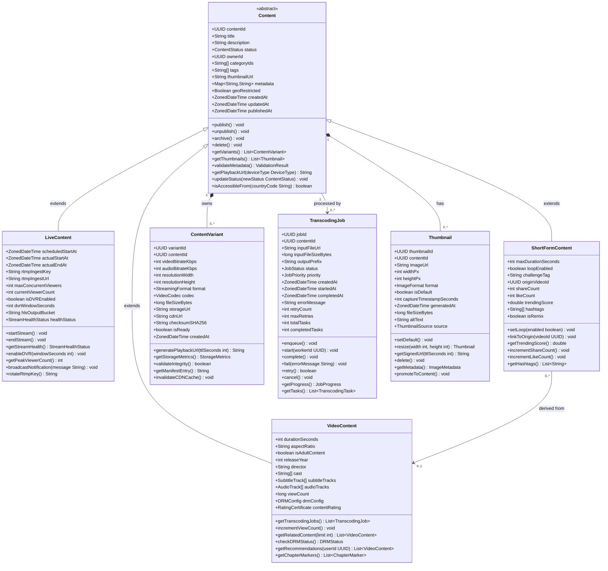
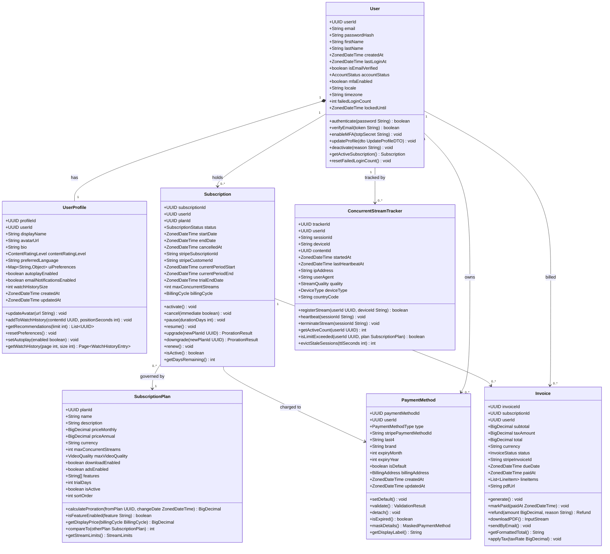

# Class Diagrams — Video Streaming Platform

This document presents the domain model of the Video Streaming Platform through three UML class
diagrams. The first models the content hierarchy — the central abstraction around which all
streaming features are organised. The second captures user identity, subscription entitlements,
and concurrent stream enforcement. The third maps the transcoding pipeline from job orchestration
down to individual worker tasks and encoding profiles.

All diagrams use Mermaid `classDiagram` syntax. Visibility prefixes follow UML convention:
`+` public, `-` private, `#` protected. Generic type parameters use tilde notation (`List~T~`).
Relationship types: filled diamond (`*--`) for composition, open diamond (`o--`) for aggregation,
solid arrow (`-->`) for directed association, and open triangle (`<|--`) for inheritance.

---

## Content Hierarchy

The platform manages three distinct content types — long-form video on demand, live broadcasts,
and short-form vertical clips — unified under an abstract `Content` base class. Centralising
shared concerns (status lifecycle, metadata enrichment, geo-restriction resolution, playback URL
signing) in the base ensures these behaviours are implemented once and inherited consistently by
all subtypes. Each concrete subclass adds type-specific attributes and behaviours without
duplicating base-class logic.

`VideoContent` is the primary type. It carries the DRM configuration referencing
Widevine/FairPlay/PlayReady key identifiers, subtitle track manifests for accessibility
compliance, and a `viewCount` maintained atomically in Redis before batch flush to PostgreSQL.
`LiveContent` adds real-time operational attributes — RTMP ingest keys issued per-stream, DVR
window configuration, and current viewer count refreshed by the concurrent stream tracker.
`ShortFormContent` extends the base for vertical short-form clips and carries engagement signals
(shares, likes, trending score) together with an optional reference to the long-form
`VideoContent` from which it was clipped.

`ContentVariant` is a first-class entity representing a single transcoded rendition at a specific
bitrate, resolution, and codec combination. Its `generatePlaybackUrl` method produces
time-bounded signed CDN URLs, preventing hotlinking. `TranscodingJob` tracks the asynchronous
lifecycle of converting raw uploaded source into streaming-ready variants. `Thumbnail` manages
preview images generated by FFmpeg at regular intervals or uploaded manually by creators.

The composition (`*--`) between `Content` and `ContentVariant` enforces cascade-delete semantics:
removing a `Content` record removes all its variant renditions from both the database and S3 —
implemented as a two-phase saga to ensure storage consistency under partial failure. The
dependency from `ShortFormContent` to `VideoContent` is a soft reference via `originVideoId`; if
the origin is deleted, the short-form clip survives as a standalone asset.

---

## User and Subscription Management

The user domain cleanly separates authentication identity from viewer personalisation. `User`
holds credentials, account status, MFA configuration, and security counters (failed login
attempts, lockout timestamps). `UserProfile` — linked one-to-one — owns display preferences,
parental control settings, and watch history references. This separation allows the authentication
service to operate with lightweight `User` projections without loading personalisation data on
every token validation request.

`Subscription` models the contractual billing relationship, synchronised with Stripe via
`stripeSubscriptionId`. It encapsulates the full lifecycle including trial periods, plan changes
with proration, and end-of-period cancellation. `SubscriptionPlan` is the product catalogue; its
`isFeatureEnabled` method drives feature flags platform-wide without hardcoded tier checks in
application code. `ConcurrentStreamTracker` is a Redis-backed entity that enforces the
`maxConcurrentStreams` limit. Each heartbeat from the player client refreshes a TTL-bound key;
expiry automatically frees a slot without a shutdown callback from the client.

`PaymentMethod` stores a tokenised Stripe reference — never raw card data — alongside display
metadata for the billing UI. `Invoice` captures the full billing cycle including line items, tax
amounts, PDF URL, and settlement timestamps.

The `ConcurrentStreamTracker` lives outside the `Subscription` aggregate because stream
enforcement is a sub-millisecond, high-frequency operation — heartbeats arrive every 30 seconds
per active session — requiring Redis rather than PostgreSQL. The tracker carries only the state
necessary to enforce the plan limit; rich viewing-behaviour analytics are written asynchronously
to the data warehouse via Kafka.

---

## Transcoding Pipeline Classes

The transcoding subsystem decomposes a `TranscodingJob` into parallel `TranscodingTask` records,
each targeting one bitrate/audio profile combination. Workers are stateless pool members that
claim tasks from a priority queue, invoke FFmpeg with derived arguments, report progress, and
complete or fail independently. Spot-instance interruptions are handled transparently by task
reassignment when the worker heartbeat expires.

`BitrateProfile` and `AudioProfile` are configuration-first value objects. Their `toFFmpegArgs()`
methods generate the exact CLI argument arrays passed to FFmpeg, meaning all encoding decisions
are captured declaratively in the database and are fully reproducible. `TranscodingQueue`
abstracts over AWS SQS, exposing a uniform interface for priority-ordered enqueue,
visibility-timeout-based in-flight tracking, and dead-letter routing for poison messages.

```mermaid
classDiagram
    direction TB

    class TranscodingJob {
        +UUID jobId
        +UUID contentId
        +String inputFileUrl
        +long inputFileSizeBytes
        +String outputPrefix
        +JobStatus status
        +JobPriority priority
        +ZonedDateTime createdAt
        +ZonedDateTime startedAt
        +ZonedDateTime completedAt
        +String errorMessage
        +int retryCount
        +int maxRetries
        +int totalTasks
        +int completedTasks
        +Map~String,String~ inputMetadata
        +enqueue() void
        +start(workerId UUID) void
        +complete() void
        +fail(errorMessage String) void
        +retry() boolean
        +cancel() void
        +getProgress() JobProgress
        +getTasks() List~TranscodingTask~
        +estimateCompletionTime() Duration
    }

    class TranscodingTask {
        +UUID taskId
        +UUID jobId
        +UUID bitrateProfileId
        +UUID audioProfileId
        +TaskStatus status
        +UUID workerNodeId
        +ZonedDateTime startedAt
        +ZonedDateTime completedAt
        +String outputUrl
        +int progressPercent
        +String errorMessage
        +long outputFileSizeBytes
        +String outputChecksumSHA256
        +int segmentCount
        +start(workerId UUID) void
        +complete(outputUrl String, checksum String) void
        +fail(errorMessage String) void
        +updateProgress(percent int) void
        +getElapsedSeconds() long
        +requiresRetry() boolean
        +generateOutputKey() String
    }

    class BitrateProfile {
        +UUID profileId
        +String name
        +int videoBitrateKbps
        +int maxBitrateKbps
        +int bufSizeKbps
        +int resolutionWidth
        +int resolutionHeight
        +double frameRate
        +VideoCodec codec
        +EncoderPreset preset
        +int keyframeIntervalSeconds
        +int gopSize
        +boolean hardwareAccelerated
        +boolean isActive
        +toFFmpegArgs() String[]
        +validate() ValidationResult
        +clone() BitrateProfile
        +getResolutionLabel() String
        +calculateBitrateLadderEntry() BitrateEntry
        +isHDR() boolean
    }

    class AudioProfile {
        +UUID audioProfileId
        +String name
        +int bitrateKbps
        +int channels
        +int sampleRateHz
        +AudioCodec codec
        +boolean normalizationEnabled
        +double loudnessTargetLUFS
        +double loudnessTruePeakDBFS
        +String language
        +boolean isDefault
        +String channelLayout
        +toFFmpegArgs() String[]
        +validate() ValidationResult
        +getChannelLayout() String
        +isCompatibleWith(codec VideoCodec) boolean
        +getDisplayName() String
    }

    class TranscodingWorker {
        +UUID workerId
        +String hostname
        +WorkerStatus status
        +UUID currentJobId
        +int maxConcurrentTasks
        +int activeTasks
        +ZonedDateTime lastHeartbeatAt
        +String[] capabilities
        +boolean gpuEnabled
        +String gpuModel
        +int availableMemoryMB
        +String awsInstanceType
        +pickupTask(queueName String) TranscodingTask
        +reportProgress(taskId UUID, percent int) void
        +releaseTask(taskId UUID, result TaskResult) void
        +sendHeartbeat() void
        +getDiagnostics() WorkerDiagnostics
        +shutdown(graceful boolean) void
        +isHealthy() boolean
    }

    class TranscodingQueue {
        +String queueId
        +String name
        +QueueBackend backendType
        +int priorityLevels
        +int maxRetries
        +int visibilityTimeoutSeconds
        +String deadLetterQueueUrl
        +int currentDepth
        +int inFlightCount
        +ZonedDateTime lastPolledAt
        +enqueue(message QueueMessage, priority int) String
        +dequeue(maxMessages int) List~QueueMessage~
        +acknowledge(receiptHandle String) void
        +nack(receiptHandle String, delaySeconds int) void
        +getDepth() int
        +purge() void
        +getMetrics() QueueMetrics
        +moveToDeadLetter(receiptHandle String) void
    }

    TranscodingJob "1" *-- "1..*" TranscodingTask : decomposes into
    TranscodingTask "0..*" --> "1" BitrateProfile : uses
    TranscodingTask "0..*" --> "1" AudioProfile : uses
    TranscodingWorker "1" --> "0..*" TranscodingTask : executes
    TranscodingQueue "1" --> "0..*" TranscodingJob : holds
    TranscodingWorker --> TranscodingQueue : polls
```

The composition between `TranscodingJob` and `TranscodingTask` signals lifecycle coupling: tasks
are meaningless outside the context of their parent job, and the job `status` is derived — it
reaches `COMPLETED` only when all tasks reach terminal states. A single task failure after
exhausting retries marks the whole job `FAILED`, triggering an alert and optionally re-enqueueing
only the failed tasks without discarding already-completed S3 objects.

`TranscodingWorker` instances register in the service registry on startup and emit heartbeats
every 15 seconds. The orchestrator marks a worker `DEAD` after 60 seconds without a heartbeat
and reassigns its in-flight tasks — a key resilience property when AWS Spot instances are
reclaimed with a two-minute warning.

---

## Cross-Cutting Design Principles

All entity identifiers use UUID v4 to support distributed generation without a central sequence
authority — essential for multi-region deployments where content IDs must be assigned before
database writes are committed.

Timestamps are typed as `ZonedDateTime` (stored as UTC, localised on read) throughout the domain
model, ensuring that scheduling, billing cycle calculations, and DVR window arithmetic remain
correct regardless of creator or viewer timezone.

Value objects such as `BitrateProfile`, `AudioProfile`, `BillingAddress`, and `StreamLimits` are
treated as immutable. Modifications produce a new instance rather than mutating in place,
supporting snapshot-based audit trails and safe concurrency in multi-threaded worker processes.
