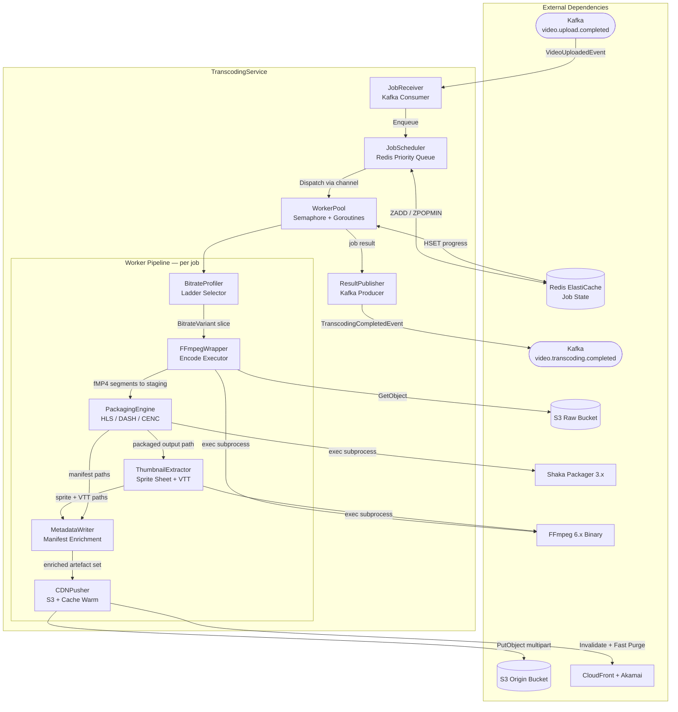
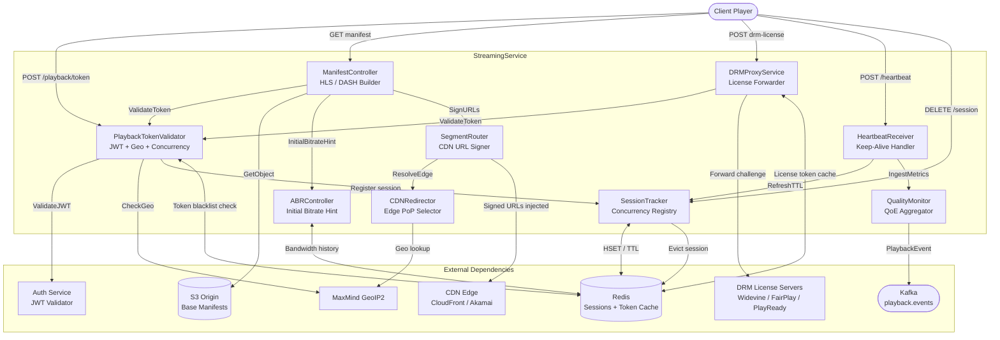

# Component Diagrams

This document provides detailed internal component breakdowns for the **TranscodingService** and the **StreamingService**. Each section contains a Mermaid component flowchart, a sub-component reference table, interface contracts, error-handling patterns, observability hooks, and deployment notes.

---

## TranscodingService Internal Components

The TranscodingService ingests raw video uploads from Kafka, orchestrates multi-bitrate transcoding via FFmpeg, packages output into HLS and DASH with DRM encryption via Shaka Packager, extracts thumbnails, enriches manifests, pushes artefacts to CDN origin, and publishes completion events.



### Sub-Component Reference Table

| Sub-Component | Responsibility | Interface | Technology |
|---|---|---|---|
| **JobReceiver** | Polls `video.upload.completed`; deserialises `VideoUploadedEvent`; validates required fields; routes invalid messages to DLQ | Kafka Consumer Group `transcoding-workers` | Go, `confluent-kafka-go` |
| **JobScheduler** | Redis sorted-set priority queue; concurrency semaphore; exponential back-off retry (max 5, cap 30 min) | `Enqueue(job)`, `Dispatch() → Job` | Go, Redis `ZADD`/`ZPOPMIN` |
| **WorkerPool** | Bounded goroutine pool controlled by `WORKER_CONCURRENCY`; context with 4-hour deadline; 5 % progress updates to Redis | `chan Job`; calls pipeline steps sequentially | Go `sync.Semaphore` |
| **BitrateProfiler** | Reads MediaInfo source metadata; returns bitrate ladder subset matching source resolution (skips variants above source) | `Profile(meta SourceMeta) []BitrateVariant` | Go, MediaInfo |
| **FFmpegWrapper** | Per-variant FFmpeg subprocess; streams stderr progress; writes CMAF fMP4 to per-job staging directory | `Transcode(job Job, v BitrateVariant) []SegmentPath` | Go `os/exec`, FFmpeg 6.x |
| **PackagingEngine** | Shaka Packager for CMAF HLS + DASH; CENC CBCS encryption when `drmRequired = true`; inserts Widevine and PlayReady PSSH boxes | `Package(segs []SegmentPath, keys DRMKeys) ManifestSet` | Go `os/exec`, Shaka Packager 3.x |
| **ThumbnailExtractor** | Keyframes at 10 % intervals via FFmpeg; ImageMagick `montage` sprite sheet; WebVTT track file with spatial coordinates | `Extract(src string, dur int) (sprite, vtt string)` | Go, FFmpeg, ImageMagick |
| **MetadataWriter** | Injects `EXT-X-SESSION-DATA` into HLS master playlist; `<ProgramInformation>` into MPD; writes `metadata.json` sidecar for MetadataService | `Enrich(ms ManifestSet, meta ContentMeta) ManifestSet` | Go, `m3u8`, `encoding/xml` |
| **CDNPusher** | Parallel S3 multipart upload (8 goroutines); CloudFront `CreateInvalidation`; Akamai Fast Purge for content path prefix | `Push(arts []Artefact, cid string) []CDNUrl` | Go, `aws-sdk-go-v2`, HTTP client |
| **ResultPublisher** | Builds `TranscodingCompletedEvent` protobuf with variant URLs, thumbnail URLs, duration, and status; publishes keyed by `contentId` | Kafka Producer, topic `video.transcoding.completed` | Go, `confluent-kafka-go` |

### Component Interface Contracts — TranscodingService

The pipeline steps are composed via the following Go interfaces, enabling independent testing and future substitution:

```go
// JobScheduler interface — implemented by RedisScheduler
type JobScheduler interface {
    Enqueue(ctx context.Context, job TranscodingJob) error
    Dispatch(ctx context.Context) (TranscodingJob, error)
    Complete(ctx context.Context, jobID string) error
    Fail(ctx context.Context, jobID string, reason error) error
}

// TranscodingPipeline interface — executed by WorkerPool per job
type TranscodingPipeline interface {
    Transcode(ctx context.Context, job TranscodingJob) ([]SegmentPath, error)
    Package(ctx context.Context, segs []SegmentPath, keys DRMKeys) (ManifestSet, error)
    ExtractThumbnails(ctx context.Context, src string, dur int) (ThumbnailSet, error)
    Enrich(ctx context.Context, ms ManifestSet, meta ContentMeta) (ManifestSet, error)
    Push(ctx context.Context, arts []Artefact, contentID string) ([]CDNUrl, error)
}
```

### Error Handling and Resilience — TranscodingService

- **Dead-letter queue:** Malformed `VideoUploadedEvent` messages are written to `video.upload.completed.dlq` with the original payload and a validation error reason before committing the Kafka offset.
- **Job retries:** The `JobScheduler` tracks `retryCount` in Redis. On non-fatal errors (S3 transient 5xx, FFmpeg OOM), the job is re-enqueued with `delay = min(30, 2^retryCount)` minutes. After 5 failures the job is marked `failed` and a `TranscodingFailedEvent` is published.
- **Context cancellation:** All pipeline stages accept `context.Context`. On `SIGTERM`, the context is cancelled, FFmpeg and Shaka Packager subprocesses are killed via `cmd.Process.Kill()`, and the job is re-enqueued for another worker.
- **Staging directory cleanup:** A `defer` at the WorkerPool level removes the per-job staging directory on the ephemeral volume regardless of success or failure, preventing disk exhaustion.
- **S3 multipart abort:** If CDNPusher fails mid-upload, all in-progress multipart uploads are aborted via `AbortMultipartUpload` to avoid storage charges from orphaned parts.

### Observability — TranscodingService

| Metric | Type | Labels |
|---|---|---|
| `transcoding_job_duration_seconds` | Histogram | `variant`, `codec`, `status` |
| `transcoding_queue_depth` | Gauge | `priority` |
| `transcoding_worker_active` | Gauge | `pod` |
| `cdn_push_duration_seconds` | Histogram | `provider` |
| `ffmpeg_stderr_errors_total` | Counter | `error_type` |

Structured JSON logs are emitted to stdout and shipped via Fluent Bit to CloudWatch Logs. Every log line carries `traceId`, `jobId`, `contentId`, and `step` for end-to-end correlation.

### Deployment Notes — TranscodingService

- **EKS Deployment** with `podAntiAffinity` rules spreading workers across all three availability zones.
- Instance type: `c6i.2xlarge` on-demand (baseline) + `c6i.4xlarge` Spot (burst); FFmpeg is CPU-bound.
- Pod resources: request `4 vCPU / 8 GiB`, limit `8 vCPU / 16 GiB`; ephemeral storage `200 GiB` NVMe for staging.
- **KEDA** `KafkaTopic` trigger scales on consumer-group lag; target lag < 500 messages.
- All binaries (`ffmpeg`, `shaka-packager`, `mediainfo`) are baked into the container image at `/usr/local/bin/`; no runtime downloads.
- `LivenessProbe: GET /healthz`; `ReadinessProbe: GET /readyz` (checks Redis connectivity + Kafka consumer assignment).
- `PodDisruptionBudget`: minimum 1 pod available during rolling updates.

---

## StreamingService Internal Components

The StreamingService handles all client-facing playback: token issuance, manifest generation with CDN-signed URLs, DRM licence proxying, session lifecycle management, ABR initial bitrate hints, and real-time QoE telemetry ingestion.



### Sub-Component Reference Table

| Sub-Component | Responsibility | Interface | Technology |
|---|---|---|---|
| **PlaybackTokenValidator** | Validates short-lived ES256 JWT; enforces geo-restriction; checks concurrent stream count vs plan tier; issues `sessionId` | `POST /playback/token` → `{ playbackToken, sessionId, expiresAt }` | Go, `golang-jwt/jwt`, Redis |
| **ManifestController** | Fetches base HLS/DASH manifest from S3 (cached 60 s in Redis); rewrites segment URLs with signed CDN tokens; injects `EXT-X-KEY` DRM tags | `GET /playback/{contentId}/manifest?pt=&format=` | Go, `net/http`, `m3u8` / `mpd` parsers |
| **DRMProxyService** | Reverse proxy for Widevine / FairPlay / PlayReady; attaches server-side auth credentials before forwarding; caches licence tokens 10 min | `POST /playback/{contentId}/drm-license` | Go, `httputil.ReverseProxy`, CPIX |
| **SegmentRouter** | Generates time-limited (300 s) CDN-signed URLs for every segment path in the manifest; selects CloudFront vs Akamai by viewer region | `Sign(path string, ttl int) string` | Go, CloudFront URL signer, Akamai EdgeAuth |
| **ABRController** | Returns initial bitrate hint from `Accept-CH: Downlink` header and Redis session bandwidth history | `HintInitialBitrate(ctx SessionCtx) int` | Go, Redis |
| **CDNRedirector** | Maps viewer IP to nearest CDN PoP; constructs correct edge base URL prefix | `ResolveEdge(ip string) string` | Go, MaxMind GeoIP2 |
| **SessionTracker** | Creates / refreshes / terminates sessions; enforces plan stream limits (Basic: 1, Premium: 4) via Redis `INCR` counter | Redis Hash `session:{id}` with 30 s TTL | Go, Redis |
| **HeartbeatReceiver** | HTTP handler for 10 s client keep-alive pings; delegates to SessionTracker (TTL refresh) and QualityMonitor (metric ingest) | `POST /playback/{sessionId}/heartbeat` | Go, `net/http` |
| **QualityMonitor** | Aggregates QoE fields (buffer health, current bitrate, startup latency, error count); publishes `PlaybackEvent` to Kafka asynchronously | Kafka producer, topic `playback.events` | Go, `confluent-kafka-go` |

### Component Interface Contracts — StreamingService

```go
// TokenValidator interface
type TokenValidator interface {
    Issue(ctx context.Context, req TokenRequest) (PlaybackToken, error)
    Validate(ctx context.Context, raw string) (Claims, error)
    Revoke(ctx context.Context, sessionID string) error
}

// ManifestBuilder interface
type ManifestBuilder interface {
    BuildHLS(ctx context.Context, contentID string, claims Claims) ([]byte, error)
    BuildDASH(ctx context.Context, contentID string, claims Claims) ([]byte, error)
}

// SessionRegistry interface
type SessionRegistry interface {
    Create(ctx context.Context, userID, contentID string, tier PlanTier) (Session, error)
    Refresh(ctx context.Context, sessionID string) error
    Terminate(ctx context.Context, sessionID string) error
}
```

### Error Handling and Resilience — StreamingService

- **Token expiry and refresh:** Playback tokens have a 300-second TTL. The client player re-calls `POST /playback/token` before expiry; the StreamingService issues a refreshed token while keeping the active session intact.
- **Concurrent stream enforcement:** `SessionTracker` uses Redis `INCR` on `user:{userId}:active_streams`. If the count exceeds the plan limit, token issuance returns `CONCURRENT_STREAM_LIMIT` (429). A background goroutine reconciles stale session counters every 60 seconds.
- **DRM licence retries:** `DRMProxyService` retries upstream licence requests up to 3 times with 1-second jitter delay. After exhausting retries it returns `DRM_SERVER_ERROR` (502) with `Retry-After: 5`.
- **S3 manifest fallback:** `ManifestController` serves from Redis cache if S3 `GetObject` fails with 5xx within the 60-second cache window. On cache miss + S3 failure, it returns `CONTENT_NOT_READY` (503) with `Retry-After: 3`.
- **Heartbeat loss tolerance:** Session TTL is set to 60 seconds (6 missed heartbeats) before a session expires, accommodating brief client network interruptions without disrupting playback.

### Observability — StreamingService

| Metric | Type | Labels |
|---|---|---|
| `manifest_request_duration_seconds` | Histogram | `format`, `cache_hit` |
| `drm_proxy_duration_seconds` | Histogram | `drm_type`, `status` |
| `active_sessions_total` | Gauge | `plan_tier` |
| `heartbeat_rate_per_second` | Gauge | — |
| `qoe_buffering_ratio` | Histogram | `network_type`, `bitrate_variant` |

OpenTelemetry spans are emitted for `ManifestController`, `DRMProxyService`, and `PlaybackTokenValidator` and exported to AWS X-Ray for end-to-end latency tracing from token request through first segment fetch.

### Deployment Notes — StreamingService

- **EKS Deployment** behind AWS Network Load Balancer; TLS terminated at NGINX Ingress Controller with cert from AWS Certificate Manager.
- Pod resources: request `1 vCPU / 512 MiB`, limit `2 vCPU / 1 GiB`; I/O-bound and network-heavy, not CPU-bound.
- **HPA** scales on RPS targeting 200 req/s per pod; minimum 3 replicas across 3 AZs.
- Redis connection pool: 20 connections per pod; eviction policy `allkeys-lru`; `WAIT 1 0` on session writes.
- CloudFront private key for URL signing is stored in AWS Secrets Manager and rotated every 90 days with zero-downtime key rollover (dual-key window of 5 minutes).
- `PodDisruptionBudget`: minimum 80 % of pods available during rolling updates.
- Graceful shutdown: on `SIGTERM` the pod drains in-flight requests within 15 seconds before exiting, preventing mid-stream 502 errors.
