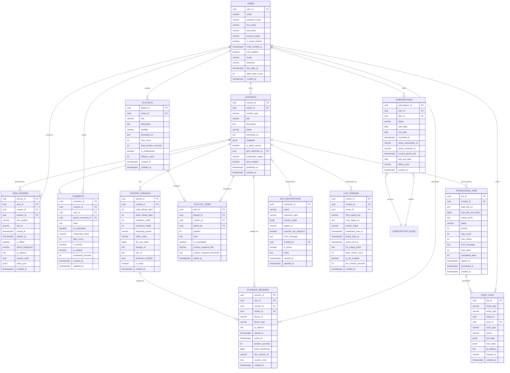

# ERD and Database Schema — Video Streaming Platform

This document specifies the full relational schema for the Video Streaming Platform. It begins
with an entity-relationship diagram showing all tables and their associations, followed by
PostgreSQL DDL for each table, an index strategy reference, and a partitioning strategy for the
two highest-volume append-only tables.

---

## Entity-Relationship Diagram



---

## DDL — Table Definitions

### users

```sql
CREATE TABLE users (
    user_id               UUID          PRIMARY KEY DEFAULT gen_random_uuid(),
    email                 VARCHAR(254)  NOT NULL,
    password_hash         VARCHAR(255)  NOT NULL,
    first_name            VARCHAR(100)  NOT NULL,
    last_name             VARCHAR(100)  NOT NULL,
    account_status        VARCHAR(20)   NOT NULL DEFAULT 'active'
                              CHECK (account_status IN ('active','suspended','deactivated','banned')),
    is_email_verified     BOOLEAN       NOT NULL DEFAULT FALSE,
    email_verified_at     TIMESTAMPTZ,
    mfa_enabled           BOOLEAN       NOT NULL DEFAULT FALSE,
    mfa_secret_encrypted  TEXT,
    locale                VARCHAR(10)   NOT NULL DEFAULT 'en',
    timezone              VARCHAR(50)   NOT NULL DEFAULT 'UTC',
    last_login_at         TIMESTAMPTZ,
    failed_login_count    INTEGER       NOT NULL DEFAULT 0 CHECK (failed_login_count >= 0),
    locked_until          TIMESTAMPTZ,
    stripe_customer_id    VARCHAR(255)  UNIQUE,
    created_at            TIMESTAMPTZ   NOT NULL DEFAULT NOW(),
    updated_at            TIMESTAMPTZ   NOT NULL DEFAULT NOW()
);

CREATE UNIQUE INDEX idx_users_email ON users (LOWER(email));
```

### contents

```sql
CREATE TABLE contents (
    content_id            UUID          PRIMARY KEY DEFAULT gen_random_uuid(),
    owner_id              UUID          NOT NULL REFERENCES users(user_id) ON DELETE RESTRICT,
    content_type          VARCHAR(20)   NOT NULL
                              CHECK (content_type IN ('video','live','short')),
    title                 VARCHAR(500)  NOT NULL,
    description           TEXT,
    status                VARCHAR(30)   NOT NULL DEFAULT 'draft'
                              CHECK (status IN ('draft','uploaded','transcoding_queued',
                                                'transcoding','transcoding_failed',
                                                'awaiting_review','published',
                                                'unpublished','archived','deleted')),
    category_ids          UUID[]        NOT NULL DEFAULT '{}',
    tags                  TEXT[]        NOT NULL DEFAULT '{}',
    thumbnail_url         TEXT,
    metadata              JSONB         NOT NULL DEFAULT '{}',
    is_adult_content      BOOLEAN       NOT NULL DEFAULT FALSE,
    geo_restriction_id    UUID          REFERENCES geo_restrictions(restriction_id),
    moderation_status     VARCHAR(20)   NOT NULL DEFAULT 'pending'
                              CHECK (moderation_status IN ('pending','approved','rejected','flagged')),
    moderation_reviewed_at TIMESTAMPTZ,
    drm_enabled           BOOLEAN       NOT NULL DEFAULT FALSE,
    published_at          TIMESTAMPTZ,
    deleted_at            TIMESTAMPTZ,
    created_at            TIMESTAMPTZ   NOT NULL DEFAULT NOW(),
    updated_at            TIMESTAMPTZ   NOT NULL DEFAULT NOW()
);

CREATE INDEX idx_contents_owner_status     ON contents (owner_id, status);
CREATE INDEX idx_contents_published        ON contents (status, published_at DESC)
    WHERE status = 'published';
CREATE INDEX idx_contents_tags             ON contents USING GIN (tags);
CREATE INDEX idx_contents_category_ids     ON contents USING GIN (category_ids);
CREATE INDEX idx_contents_metadata        ON contents USING GIN (metadata);
```

### content_variants

```sql
CREATE TABLE content_variants (
    variant_id            UUID          PRIMARY KEY DEFAULT gen_random_uuid(),
    content_id            UUID          NOT NULL REFERENCES contents(content_id) ON DELETE CASCADE,
    video_bitrate_kbps    INTEGER       NOT NULL CHECK (video_bitrate_kbps > 0),
    audio_bitrate_kbps    INTEGER       NOT NULL CHECK (audio_bitrate_kbps > 0),
    resolution_width      INTEGER       NOT NULL CHECK (resolution_width > 0),
    resolution_height     INTEGER       NOT NULL CHECK (resolution_height > 0),
    streaming_format      VARCHAR(10)   NOT NULL CHECK (streaming_format IN ('HLS','DASH','MP4')),
    video_codec           VARCHAR(20)   NOT NULL CHECK (video_codec IN ('h264','h265','vp9','av1')),
    audio_codec           VARCHAR(20)   NOT NULL DEFAULT 'aac',
    file_size_bytes       BIGINT        NOT NULL CHECK (file_size_bytes >= 0),
    storage_url           TEXT          NOT NULL,
    cdn_url               TEXT,
    checksum_sha256       CHAR(64)      NOT NULL,
    is_ready              BOOLEAN       NOT NULL DEFAULT FALSE,
    duration_seconds      INTEGER       CHECK (duration_seconds > 0),
    segment_count         INTEGER,
    created_at            TIMESTAMPTZ   NOT NULL DEFAULT NOW()
);

CREATE INDEX idx_variants_content_ready    ON content_variants (content_id, is_ready);
CREATE INDEX idx_variants_format_codec     ON content_variants (content_id, streaming_format, video_codec);
```

### subscription_plans

```sql
CREATE TABLE subscription_plans (
    plan_id               UUID          PRIMARY KEY DEFAULT gen_random_uuid(),
    name                  VARCHAR(100)  NOT NULL,
    description           TEXT,
    price_monthly         NUMERIC(10,2) NOT NULL CHECK (price_monthly >= 0),
    price_annual          NUMERIC(10,2) NOT NULL CHECK (price_annual >= 0),
    currency              CHAR(3)       NOT NULL DEFAULT 'USD',
    max_concurrent_streams INTEGER      NOT NULL CHECK (max_concurrent_streams BETWEEN 1 AND 10),
    max_video_quality     VARCHAR(10)   NOT NULL
                              CHECK (max_video_quality IN ('SD','HD','FHD','UHD')),
    download_enabled      BOOLEAN       NOT NULL DEFAULT FALSE,
    ads_enabled           BOOLEAN       NOT NULL DEFAULT TRUE,
    features              TEXT[]        NOT NULL DEFAULT '{}',
    trial_days            INTEGER       NOT NULL DEFAULT 0 CHECK (trial_days >= 0),
    is_active             BOOLEAN       NOT NULL DEFAULT TRUE,
    sort_order            INTEGER       NOT NULL DEFAULT 0,
    stripe_price_id_monthly VARCHAR(255),
    stripe_price_id_annual  VARCHAR(255),
    created_at            TIMESTAMPTZ   NOT NULL DEFAULT NOW(),
    updated_at            TIMESTAMPTZ   NOT NULL DEFAULT NOW()
);
```

### subscriptions

```sql
CREATE TABLE subscriptions (
    subscription_id       UUID          PRIMARY KEY DEFAULT gen_random_uuid(),
    user_id               UUID          NOT NULL REFERENCES users(user_id) ON DELETE RESTRICT,
    plan_id               UUID          NOT NULL REFERENCES subscription_plans(plan_id),
    status                VARCHAR(20)   NOT NULL DEFAULT 'pending'
                              CHECK (status IN ('pending','active','past_due','suspended',
                                                'cancelled','reactivated','expired')),
    billing_cycle         VARCHAR(10)   NOT NULL DEFAULT 'monthly'
                              CHECK (billing_cycle IN ('monthly','annual')),
    start_date            DATE          NOT NULL,
    end_date              DATE,
    trial_end_date        DATE,
    cancelled_at          TIMESTAMPTZ,
    stripe_subscription_id VARCHAR(255) UNIQUE,
    stripe_customer_id    VARCHAR(255)  NOT NULL,
    current_period_start  TIMESTAMPTZ   NOT NULL,
    current_period_end    TIMESTAMPTZ   NOT NULL,
    max_concurrent_streams INTEGER      NOT NULL DEFAULT 1,
    dunning_attempt_count INTEGER       NOT NULL DEFAULT 0,
    past_due_since        TIMESTAMPTZ,
    created_at            TIMESTAMPTZ   NOT NULL DEFAULT NOW(),
    updated_at            TIMESTAMPTZ   NOT NULL DEFAULT NOW()
);

CREATE INDEX idx_subscriptions_user_status  ON subscriptions (user_id, status);
CREATE UNIQUE INDEX idx_subscriptions_stripe ON subscriptions (stripe_subscription_id)
    WHERE stripe_subscription_id IS NOT NULL;
CREATE INDEX idx_subscriptions_period_end   ON subscriptions (current_period_end)
    WHERE status IN ('active','past_due');
```

### playback_sessions

```sql
CREATE TABLE playback_sessions (
    session_id            UUID          NOT NULL DEFAULT gen_random_uuid(),
    user_id               UUID          NOT NULL REFERENCES users(user_id) ON DELETE RESTRICT,
    content_id            UUID          NOT NULL REFERENCES contents(content_id) ON DELETE RESTRICT,
    variant_id            UUID          REFERENCES content_variants(variant_id),
    device_id             VARCHAR(255)  NOT NULL,
    device_type           VARCHAR(20)   NOT NULL
                              CHECK (device_type IN ('web','ios','android','tv','desktop')),
    ip_address            INET          NOT NULL,
    user_agent            TEXT,
    started_at            TIMESTAMPTZ   NOT NULL DEFAULT NOW(),
    ended_at              TIMESTAMPTZ,
    last_heartbeat_at     TIMESTAMPTZ,
    position_seconds      INTEGER       NOT NULL DEFAULT 0 CHECK (position_seconds >= 0),
    bytes_transferred     BIGINT        NOT NULL DEFAULT 0 CHECK (bytes_transferred >= 0),
    drm_session_id        VARCHAR(255),
    country_code          CHAR(2),
    quality_switches      INTEGER       NOT NULL DEFAULT 0,
    rebuffer_ratio        NUMERIC(5,4)  CHECK (rebuffer_ratio BETWEEN 0 AND 1),
    created_at            TIMESTAMPTZ   NOT NULL DEFAULT NOW(),
    PRIMARY KEY (session_id, started_at)
) PARTITION BY RANGE (started_at);

CREATE INDEX idx_ps_user_content     ON playback_sessions (user_id, content_id, started_at DESC);
CREATE INDEX idx_ps_content_started  ON playback_sessions (content_id, started_at DESC);
CREATE INDEX idx_ps_device           ON playback_sessions (user_id, device_id, started_at DESC);
```

### live_streams

```sql
CREATE TABLE live_streams (
    stream_id             UUID          PRIMARY KEY DEFAULT gen_random_uuid(),
    content_id            UUID          NOT NULL REFERENCES contents(content_id) ON DELETE RESTRICT,
    owner_id              UUID          NOT NULL REFERENCES users(user_id) ON DELETE RESTRICT,
    rtmp_ingest_key       VARCHAR(255)  NOT NULL UNIQUE,
    rtmp_ingest_url       TEXT          NOT NULL,
    stream_status         VARCHAR(20)   NOT NULL DEFAULT 'created'
                              CHECK (stream_status IN ('created','configured','waiting',
                                                       'live','interrupted','recovering',
                                                       'ended','archived')),
    scheduled_start_at    TIMESTAMPTZ,
    actual_start_at       TIMESTAMPTZ,
    actual_end_at         TIMESTAMPTZ,
    hls_output_prefix     TEXT,
    max_concurrent_viewers INTEGER      NOT NULL DEFAULT 0,
    peak_viewer_count     INTEGER       NOT NULL DEFAULT 0,
    is_dvr_enabled        BOOLEAN       NOT NULL DEFAULT TRUE,
    dvr_window_seconds    INTEGER       NOT NULL DEFAULT 10800 CHECK (dvr_window_seconds > 0),
    transcoder_instance_id VARCHAR(255),
    reconnect_grace_seconds INTEGER     NOT NULL DEFAULT 30,
    created_at            TIMESTAMPTZ   NOT NULL DEFAULT NOW(),
    updated_at            TIMESTAMPTZ   NOT NULL DEFAULT NOW()
);

CREATE INDEX idx_live_streams_owner_status ON live_streams (owner_id, stream_status);
CREATE INDEX idx_live_streams_scheduled    ON live_streams (scheduled_start_at)
    WHERE stream_status IN ('configured','waiting');
```

### drm_licenses

```sql
CREATE TABLE drm_licenses (
    license_id            UUID          PRIMARY KEY DEFAULT gen_random_uuid(),
    user_id               UUID          NOT NULL REFERENCES users(user_id) ON DELETE RESTRICT,
    content_id            UUID          NOT NULL REFERENCES contents(content_id) ON DELETE RESTRICT,
    session_id            UUID,
    drm_system            VARCHAR(20)   NOT NULL
                              CHECK (drm_system IN ('widevine','fairplay','playready')),
    key_id                VARCHAR(255)  NOT NULL,
    issued_at             TIMESTAMPTZ   NOT NULL DEFAULT NOW(),
    expires_at            TIMESTAMPTZ   NOT NULL,
    is_offline            BOOLEAN       NOT NULL DEFAULT FALSE,
    device_fingerprint    VARCHAR(255),
    ip_address            INET          NOT NULL,
    country_code          CHAR(2),
    policy_json           JSONB         NOT NULL DEFAULT '{}',
    revoked_at            TIMESTAMPTZ,
    renewal_count         INTEGER       NOT NULL DEFAULT 0 CHECK (renewal_count >= 0),
    created_at            TIMESTAMPTZ   NOT NULL DEFAULT NOW()
);

CREATE INDEX idx_drm_user_content     ON drm_licenses (user_id, content_id, drm_system);
CREATE INDEX idx_drm_expires          ON drm_licenses (expires_at) WHERE revoked_at IS NULL;
CREATE INDEX idx_drm_session          ON drm_licenses (session_id) WHERE session_id IS NOT NULL;
```

### comments

```sql
CREATE TABLE comments (
    comment_id            UUID          PRIMARY KEY DEFAULT gen_random_uuid(),
    content_id            UUID          NOT NULL REFERENCES contents(content_id) ON DELETE CASCADE,
    user_id               UUID          NOT NULL REFERENCES users(user_id) ON DELETE RESTRICT,
    parent_comment_id     UUID          REFERENCES comments(comment_id) ON DELETE CASCADE,
    body                  TEXT          NOT NULL CHECK (char_length(body) BETWEEN 1 AND 10000),
    is_moderated          BOOLEAN       NOT NULL DEFAULT FALSE,
    moderation_label      VARCHAR(100),
    moderation_score      NUMERIC(4,3)  CHECK (moderation_score BETWEEN 0 AND 1),
    likes_count           INTEGER       NOT NULL DEFAULT 0 CHECK (likes_count >= 0),
    is_pinned             BOOLEAN       NOT NULL DEFAULT FALSE,
    is_deleted            BOOLEAN       NOT NULL DEFAULT FALSE,
    deleted_at            TIMESTAMPTZ,
    timestamp_seconds     INTEGER       CHECK (timestamp_seconds >= 0),
    created_at            TIMESTAMPTZ   NOT NULL DEFAULT NOW(),
    updated_at            TIMESTAMPTZ   NOT NULL DEFAULT NOW()
);

CREATE INDEX idx_comments_content_created  ON comments (content_id, created_at DESC)
    WHERE is_deleted = FALSE;
CREATE INDEX idx_comments_parent           ON comments (parent_comment_id)
    WHERE parent_comment_id IS NOT NULL;
CREATE INDEX idx_comments_user             ON comments (user_id, created_at DESC);
```

### playlists

```sql
CREATE TABLE playlists (
    playlist_id           UUID          PRIMARY KEY DEFAULT gen_random_uuid(),
    owner_id              UUID          NOT NULL REFERENCES users(user_id) ON DELETE CASCADE,
    title                 VARCHAR(500)  NOT NULL CHECK (char_length(title) >= 1),
    description           TEXT,
    visibility            VARCHAR(10)   NOT NULL DEFAULT 'private'
                              CHECK (visibility IN ('private','unlisted','public')),
    thumbnail_url         TEXT,
    item_count            INTEGER       NOT NULL DEFAULT 0 CHECK (item_count >= 0),
    total_duration_seconds INTEGER      NOT NULL DEFAULT 0 CHECK (total_duration_seconds >= 0),
    is_collaborative      BOOLEAN       NOT NULL DEFAULT FALSE,
    follower_count        INTEGER       NOT NULL DEFAULT 0 CHECK (follower_count >= 0),
    sort_order_type       VARCHAR(20)   NOT NULL DEFAULT 'manual'
                              CHECK (sort_order_type IN ('manual','date_added','alphabetical')),
    created_at            TIMESTAMPTZ   NOT NULL DEFAULT NOW(),
    updated_at            TIMESTAMPTZ   NOT NULL DEFAULT NOW()
);

CREATE INDEX idx_playlists_owner            ON playlists (owner_id, created_at DESC);
CREATE INDEX idx_playlists_public_updated   ON playlists (updated_at DESC)
    WHERE visibility = 'public';
```

### playlist_items

```sql
CREATE TABLE playlist_items (
    item_id                    UUID         PRIMARY KEY DEFAULT gen_random_uuid(),
    playlist_id                UUID         NOT NULL REFERENCES playlists(playlist_id) ON DELETE CASCADE,
    content_id                 UUID         NOT NULL REFERENCES contents(content_id) ON DELETE RESTRICT,
    added_by                   UUID         NOT NULL REFERENCES users(user_id) ON DELETE RESTRICT,
    position                   INTEGER      NOT NULL CHECK (position >= 0),
    note                       TEXT         CHECK (char_length(note) <= 500),
    is_unavailable             BOOLEAN      NOT NULL DEFAULT FALSE,
    content_snapshot_title     VARCHAR(500),
    content_snapshot_thumbnail TEXT,
    metadata                   JSONB        NOT NULL DEFAULT '{}',
    added_at                   TIMESTAMPTZ  NOT NULL DEFAULT NOW(),
    UNIQUE (playlist_id, content_id)
);

CREATE INDEX idx_playlist_items_playlist    ON playlist_items (playlist_id, position);
CREATE INDEX idx_playlist_items_content     ON playlist_items (content_id);
```

### transcoding_jobs

```sql
CREATE TABLE transcoding_jobs (
    job_id                UUID          PRIMARY KEY DEFAULT gen_random_uuid(),
    content_id            UUID          NOT NULL REFERENCES contents(content_id) ON DELETE RESTRICT,
    input_file_url        TEXT          NOT NULL,
    input_file_size_bytes BIGINT        NOT NULL CHECK (input_file_size_bytes > 0),
    output_prefix         TEXT          NOT NULL,
    status                VARCHAR(20)   NOT NULL DEFAULT 'queued'
                              CHECK (status IN ('queued','running','completed','failed','cancelled')),
    priority              INTEGER       NOT NULL DEFAULT 5 CHECK (priority BETWEEN 1 AND 10),
    retry_count           INTEGER       NOT NULL DEFAULT 0 CHECK (retry_count >= 0),
    max_retries           INTEGER       NOT NULL DEFAULT 3 CHECK (max_retries >= 0),
    worker_id             UUID,
    error_message         TEXT,
    error_code            VARCHAR(50),
    total_tasks           INTEGER       NOT NULL DEFAULT 0 CHECK (total_tasks >= 0),
    completed_tasks       INTEGER       NOT NULL DEFAULT 0 CHECK (completed_tasks >= 0),
    input_metadata        JSONB         NOT NULL DEFAULT '{}',
    started_at            TIMESTAMPTZ,
    completed_at          TIMESTAMPTZ,
    created_at            TIMESTAMPTZ   NOT NULL DEFAULT NOW(),
    updated_at            TIMESTAMPTZ   NOT NULL DEFAULT NOW()
);

CREATE INDEX idx_jobs_content_status        ON transcoding_jobs (content_id, status);
CREATE INDEX idx_jobs_status_priority       ON transcoding_jobs (status, priority DESC, created_at ASC)
    WHERE status IN ('queued','running');
CREATE INDEX idx_jobs_worker                ON transcoding_jobs (worker_id)
    WHERE worker_id IS NOT NULL AND status = 'running';
```

### audit_logs

```sql
CREATE TABLE audit_logs (
    log_id                UUID          NOT NULL DEFAULT gen_random_uuid(),
    event_type            VARCHAR(100)  NOT NULL,
    entity_type           VARCHAR(100)  NOT NULL,
    entity_id             UUID          NOT NULL,
    actor_id              UUID          REFERENCES users(user_id) ON DELETE SET NULL,
    actor_type            VARCHAR(20)   NOT NULL DEFAULT 'user'
                              CHECK (actor_type IN ('user','admin','service','system')),
    action                VARCHAR(100)  NOT NULL,
    old_state             JSONB,
    new_state             JSONB,
    ip_address            INET,
    user_agent            TEXT,
    request_id            VARCHAR(255),
    created_at            TIMESTAMPTZ   NOT NULL DEFAULT NOW(),
    PRIMARY KEY (log_id, created_at)
) PARTITION BY RANGE (created_at);

CREATE INDEX idx_audit_entity               ON audit_logs (entity_type, entity_id, created_at DESC);
CREATE INDEX idx_audit_actor                ON audit_logs (actor_id, created_at DESC)
    WHERE actor_id IS NOT NULL;
CREATE INDEX idx_audit_event_type           ON audit_logs (event_type, created_at DESC);
```

### geo_restrictions

```sql
CREATE TABLE geo_restrictions (
    restriction_id        UUID          PRIMARY KEY DEFAULT gen_random_uuid(),
    name                  VARCHAR(255)  NOT NULL,
    restriction_type      VARCHAR(10)   NOT NULL
                              CHECK (restriction_type IN ('allowlist','blocklist')),
    country_codes         CHAR(2)[]     NOT NULL DEFAULT '{}',
    applies_to            VARCHAR(20)   NOT NULL DEFAULT 'all'
                              CHECK (applies_to IN ('all','subscription_tier','specific_plan')),
    plan_ids              UUID[]        NOT NULL DEFAULT '{}',
    override_vpn_detection BOOLEAN      NOT NULL DEFAULT FALSE,
    error_message         TEXT          NOT NULL DEFAULT 'This content is not available in your region.',
    is_active             BOOLEAN       NOT NULL DEFAULT TRUE,
    notes                 TEXT,
    created_by            UUID          REFERENCES users(user_id) ON DELETE SET NULL,
    created_at            TIMESTAMPTZ   NOT NULL DEFAULT NOW(),
    updated_at            TIMESTAMPTZ   NOT NULL DEFAULT NOW()
);

CREATE INDEX idx_geo_active                 ON geo_restrictions (is_active, restriction_type)
    WHERE is_active = TRUE;
CREATE INDEX idx_geo_country_codes          ON geo_restrictions USING GIN (country_codes);
```

---

## Index Strategy

The following table summarises the primary indexes across the schema, the columns they cover, the
index type, and the query pattern they optimise.

| Table | Index Name | Columns | Type | Rationale |
|---|---|---|---|---|
| `users` | `idx_users_email` | `LOWER(email)` | UNIQUE BTREE | Case-insensitive login lookup by email |
| `contents` | `idx_contents_owner_status` | `owner_id, status` | BTREE | Creator dashboard — list own content by status |
| `contents` | `idx_contents_published` | `status, published_at DESC` | PARTIAL BTREE | Public catalogue queries filtered to published only |
| `contents` | `idx_contents_tags` | `tags` | GIN | Tag-based content discovery and search |
| `contents` | `idx_contents_category_ids` | `category_ids` | GIN | Category drill-down queries |
| `content_variants` | `idx_variants_content_ready` | `content_id, is_ready` | BTREE | Playback manifest assembly — find ready variants |
| `subscriptions` | `idx_subscriptions_user_status` | `user_id, status` | BTREE | Active subscription check on every API request |
| `subscriptions` | `idx_subscriptions_stripe` | `stripe_subscription_id` | UNIQUE PARTIAL BTREE | Stripe webhook correlation |
| `subscriptions` | `idx_subscriptions_period_end` | `current_period_end` | PARTIAL BTREE | Renewal reminder job — find subscriptions expiring soon |
| `playback_sessions` | `idx_ps_user_content` | `user_id, content_id, started_at DESC` | BTREE | Resume playback position lookup |
| `playback_sessions` | `idx_ps_content_started` | `content_id, started_at DESC` | BTREE | Per-content analytics aggregation |
| `drm_licenses` | `idx_drm_user_content` | `user_id, content_id, drm_system` | BTREE | License lookup before issuing new license |
| `drm_licenses` | `idx_drm_expires` | `expires_at` | PARTIAL BTREE | Background job to flag expired licenses |
| `comments` | `idx_comments_content_created` | `content_id, created_at DESC` | PARTIAL BTREE | Comment thread fetch — excludes deleted rows |
| `comments` | `idx_comments_parent` | `parent_comment_id` | PARTIAL BTREE | Reply thread traversal |
| `transcoding_jobs` | `idx_jobs_status_priority` | `status, priority DESC, created_at ASC` | PARTIAL BTREE | Worker task pickup — highest priority, oldest first |
| `transcoding_jobs` | `idx_jobs_worker` | `worker_id` | PARTIAL BTREE | Heartbeat check — find in-flight jobs per worker |
| `audit_logs` | `idx_audit_entity` | `entity_type, entity_id, created_at DESC` | BTREE | Entity audit trail lookup in compliance portal |
| `audit_logs` | `idx_audit_actor` | `actor_id, created_at DESC` | PARTIAL BTREE | Per-user activity log |
| `geo_restrictions` | `idx_geo_country_codes` | `country_codes` | GIN | Geo-check on content request path |
| `playlists` | `idx_playlists_owner` | `owner_id, created_at DESC` | BTREE | User's playlist library page |
| `playlist_items` | `idx_playlist_items_playlist` | `playlist_id, position` | BTREE | Ordered playlist item fetch |
| `live_streams` | `idx_live_streams_scheduled` | `scheduled_start_at` | PARTIAL BTREE | Scheduler job — upcoming streams to notify |

Partial indexes (those with a `WHERE` clause) reduce index size substantially for tables where
most queries target a small, well-defined subset of rows. For example, the
`idx_jobs_status_priority` index covers only rows in `queued` or `running` states; completed
and cancelled jobs are never scanned by workers, so excluding them keeps the B-tree compact and
hot in the shared buffer cache.

GIN indexes on `ARRAY` and `JSONB` columns (`tags`, `category_ids`, `metadata`,
`country_codes`) enable containment and overlap operators (`@>`, `&&`) that are used by the
content discovery and geo-restriction resolution paths. These are more expensive to update than
BTREE indexes but they power queries that cannot be expressed as simple equality predicates.

---

## Partitioning Strategy

### playback_sessions — Range Partition by started_at

`playback_sessions` is the highest-volume table in the schema. At scale, the platform records
tens of millions of sessions per day. Retaining a flat, unpartitioned table would make routine
operations — analytics aggregations, VACUUM, index rebuilds, and long-term archival — prohibitively
slow. The table is therefore partitioned by `RANGE` on `started_at` with one partition per month.

```sql
-- Parent table defined above with PARTITION BY RANGE (started_at)

CREATE TABLE playback_sessions_2025_01
    PARTITION OF playback_sessions
    FOR VALUES FROM ('2025-01-01') TO ('2025-02-01');

CREATE TABLE playback_sessions_2025_02
    PARTITION OF playback_sessions
    FOR VALUES FROM ('2025-02-01') TO ('2025-03-01');

-- New partitions are created by a monthly maintenance job 30 days in advance.
-- Partitions older than 24 months are detached and attached to a cold-storage
-- logical replica, then VACUUM-ANALYZEd before being archived to S3 via
-- pg_dump --table.
```

Queries that filter on `started_at` benefit from partition pruning — PostgreSQL plans will skip
all partitions whose range does not overlap the query predicate without reading a single block.
A query for "sessions in the last 30 days" touches at most two monthly partitions rather than
scanning the full multi-billion-row heap. Each monthly partition carries its own set of local
indexes, keeping index sizes proportional to monthly volume and enabling fast `VACUUM` runs that
operate on a single month's worth of dead tuples.

### audit_logs — Range Partition by created_at

`audit_logs` follows the same monthly range partitioning scheme for the same reasons: high
append volume, bounded query windows (compliance queries rarely look back more than 90 days),
and a need for efficient bulk archival. Unlike `playback_sessions`, `audit_logs` are subject to
regulatory retention obligations: partitions must be retained for a minimum of seven years and
cannot be deleted until the retention window expires.

```sql
-- Parent table defined above with PARTITION BY RANGE (created_at)

CREATE TABLE audit_logs_2025_01
    PARTITION OF audit_logs
    FOR VALUES FROM ('2025-01-01') TO ('2025-02-01');

CREATE TABLE audit_logs_2025_02
    PARTITION OF audit_logs
    FOR VALUES FROM ('2025-02-01') TO ('2025-03-01');

-- After 90 days, partitions are detached from the live cluster and attached
-- to the compliance replica. After 7 years, partitions are dumped to S3
-- (Glacier Deep Archive) and dropped from all database clusters.
```

Both tables use `(log_id/session_id, created_at/started_at)` as a composite primary key rather
than a single UUID because PostgreSQL requires the partition key to be included in the primary
key of a partitioned table. The ordering places the UUID first so that the constraint still
functions as a unique identifier for row-level references in application code.
