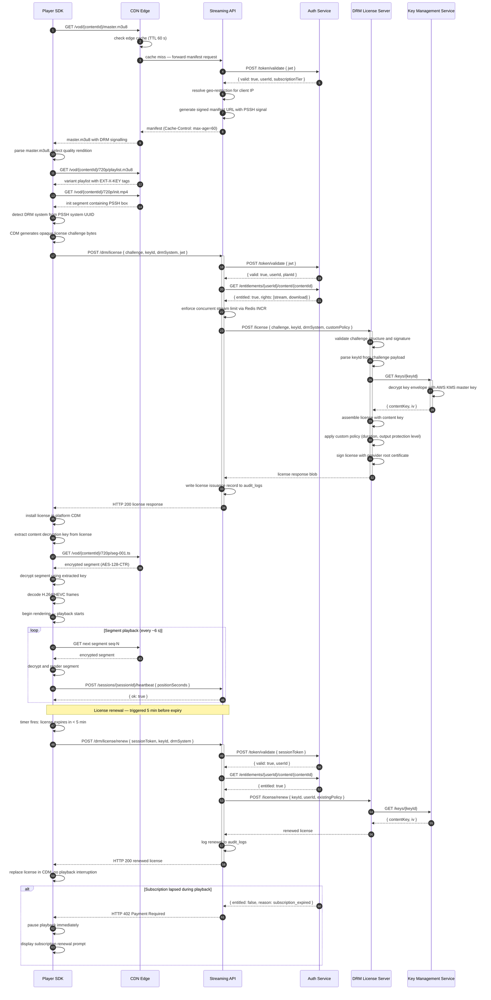
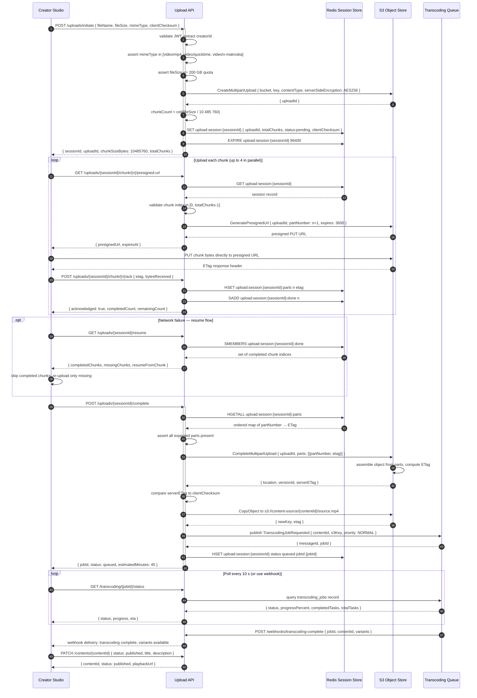
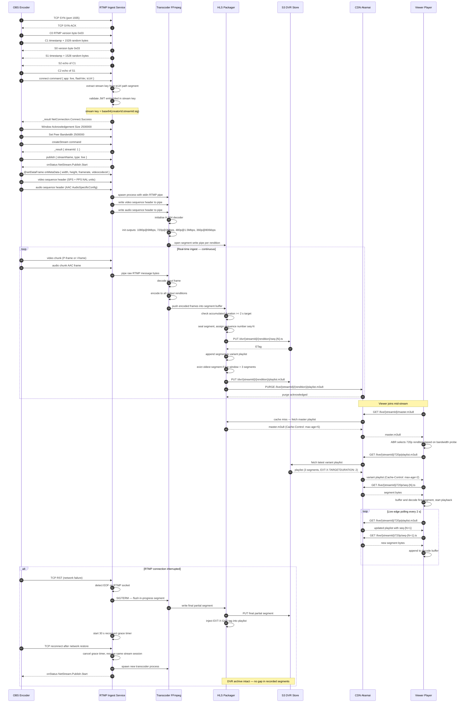

# Sequence Diagrams — Video Streaming Platform

This document captures three critical runtime flows of the Video Streaming Platform using Mermaid
`sequenceDiagram` notation. The first traces the full DRM license acquisition and playback
lifecycle. The second covers the resumable chunked upload pipeline used by creators. The third
maps the path from a live RTMP broadcast to viewer HLS delivery.

---

## DRM License Acquisition and Playback

The DRM flow begins when the player fetches a manifest and discovers which protection systems are
required. Each DRM scheme (Widevine, FairPlay, PlayReady) embeds a Protection System Specific
Header (PSSH) box in the manifest or the media init segment. The player's Content Decryption
Module (CDM) generates an opaque challenge blob that the player submits to the platform license
endpoint alongside a valid JWT. The license endpoint validates the user's entitlement before
forwarding the challenge to the appropriate DRM vendor server.

The license response flows back through the platform — never directly from the vendor to the
player — giving the platform audit control, geo-restriction enforcement, and the ability to embed
custom policy fields such as rental window duration, output protection level, and offline download
rights. The Key Management Service (KMS) stores content encryption keys encrypted at rest; the
DRM server requests keys by `keyId` and assembles the license without ever persisting plaintext
keys to disk. License renewal runs proactively five minutes before expiry so that legitimate
subscribers experience zero-interruption playback.

The platform enforces that license responses always pass through the Streaming API rather than
being returned directly by the DRM vendor. This ensures every license issuance is logged in
`audit_logs` with the userId, contentId, deviceId, IP address, and country code — a requirement
for GDPR compliance and content-rights auditing. Default streaming license duration is 24 hours;
offline download licenses carry a 48-hour validity window and an explicit
`offline_lease_duration` field in the Widevine/PlayReady policy JSON.

---

## Video Upload Chunking (Resumable Upload)

Large source files — up to 200 GB for 4K HDR raw footage — cannot be transferred reliably in a
single HTTP request. The platform implements a resumable upload protocol inspired by the TUS
open standard. The creator client splits the file into 10 MB chunks client-side and uploads each
independently. The server tracks chunk acknowledgements in Redis so that any network interruption
can be recovered from without re-uploading already-transferred data.

AWS S3's native multipart upload API is used as the storage backend, mapping each chunk directly
to an S3 part. When all parts are acknowledged, the client posts a completion request, triggering
S3 to assemble the object server-side. The Upload API then verifies the checksum, copies the
object to the permanent content bucket, and enqueues a `TranscodingJobRequested` event on Kafka.
The creator receives a job ID immediately and polls for progress or awaits a webhook notification
when transcoding completes.

The presigned URL model removes the Upload API from the data path for chunk bytes — all data
flows directly from the creator's browser or native app to S3, eliminating the Upload API as a
bandwidth bottleneck and reducing per-upload egress costs to near zero. The 24-hour Redis TTL on
the session gives creators a generous window to resume uploads on slow or intermittent
connections. Orphaned S3 multipart uploads (sessions abandoned before completion) are cleaned up
by an S3 lifecycle rule set to abort incomplete uploads after 48 hours.

---

## Live RTMP Ingest to HLS Delivery

The live streaming pipeline begins with a broadcaster connecting from OBS, Streamlabs, or any
RTMP-capable encoder. The RTMP Ingest Service performs the standard RTMP handshake, authenticates
the stream key (which embeds a signed JWT with the creator's identity), and proxies the AV data
into a spawned FFmpeg process. FFmpeg simultaneously transcodes the input into multiple bitrate
renditions in real time, writing fixed-duration MPEG-TS segments to the HLS Packager.

The HLS Packager assembles variant playlists with a rolling three-segment window, pushes each new
segment to S3 for DVR storage, and cache-busts updated manifests on the Akamai CDN by setting a
short `Cache-Control: max-age=2` header. Viewers poll the variant playlist every two seconds to
discover new segments. If the RTMP connection drops, the ingest service holds the stream slot
open for 30 seconds before marking the stream interrupted — giving the encoder time to reconnect
without losing the DVR archive or the viewer session.

The two-second segment duration balances end-to-end latency (approximately six seconds at the
live edge: three segments in the playlist window) against the HTTP request overhead of frequent
segment fetches. For latency-critical events such as sports or auctions, the platform can switch
to Low-Latency HLS by reducing the chunk boundary to 200 ms partial segments and enabling HTTP/2
server push on the Akamai tier, driving live latency below two seconds. DVR archival reuses the
same segment files written for live delivery with no second encode pass, so catch-up viewers
experience identical quality to those watching live.
