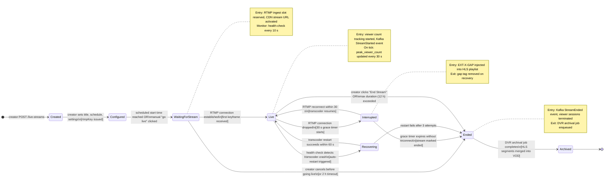
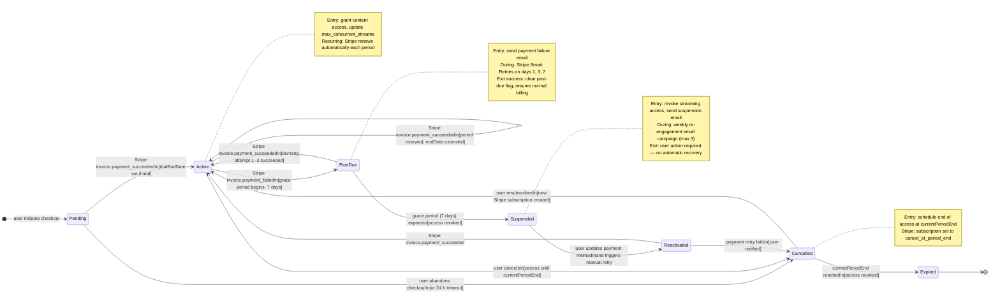

# State Machine Diagrams — Video Streaming Platform

This document defines the authoritative state machines for three core domain entities: the
content lifecycle, the live stream operational lifecycle, and the subscription billing lifecycle.
Each state machine is rendered as a Mermaid `stateDiagram-v2` diagram followed by a narrative
explaining the business significance of each state, the conditions that trigger transitions, and
the side effects that execute on entry or exit.

---

## Content Lifecycle States

Every piece of content — whether a long-form film, a live-stream recording, or a short-form clip
— travels through a defined sequence of states from initial creation to final archival or
hard-deletion. The state machine acts as the single source of truth for what operations are
permitted on a content item at any point in time, preventing inconsistent states such as a
partially transcoded video appearing in the public catalogue.

```mermaid
stateDiagram-v2
    direction LR

    [*] --> Draft : creator opens upload dialog

    Draft --> Uploaded : source file upload complete\n[checksum verified]
    Uploaded --> TranscodingQueued : TranscodingJobRequested event published\n[file passes virus scan]
    Uploaded --> Draft : virus scan fails\n[quarantine file]

    TranscodingQueued --> Transcoding : worker claims job\n[worker heartbeat active]
    Transcoding --> TranscodingFailed : all retry attempts exhausted\n[errorMessage recorded]
    Transcoding --> AwaitingReview : all tasks complete\n[all variants validated]
    TranscodingFailed --> TranscodingQueued : operator triggers manual retry\n[retryCount reset]

    AwaitingReview --> Published : moderation approved\n[AWS Rekognition score < threshold]
    AwaitingReview --> Draft : moderation rejected\n[rejection reason recorded]
    AwaitingReview --> Published : auto-approve after 24 h\n[no flags raised]

    Published --> Unpublished : creator or admin unpublishes\n[CDN cache purged]
    Unpublished --> Published : creator re-publishes\n[CDN cache warmed]
    Published --> Archived : retention policy triggers OR manual archive\n[variants moved to Glacier]
    Unpublished --> Archived : manually archived by admin\n[variants moved to Glacier]

    Archived --> Deleted : hard-delete after retention period OR GDPR request\n[S3 objects deleted]
    Deleted --> [*]

    note right of TranscodingQueued
        Entry: jobId assigned, Kafka event published
        Exit: worker heartbeat registered
    end note

    note right of AwaitingReview
        Entry: AWS Rekognition scan triggered
        Exit: moderation result written to audit_logs
    end note

    note right of Published
        Entry: CDN cache primed, search index updated
        Exit: CDN cache purged, search index removed
    end note

    note right of Archived
        Entry: S3 lifecycle rule applied (→ Glacier)
        Exit: Glacier restore initiated
    end note
```

**Draft** is the initial state for any content item. It exists as a database record but has no
associated media files and is invisible to viewers. Creators can freely edit metadata while in
this state. The `Uploaded` state is reached the moment the source file upload completes and the
server-side checksum matches the client-provided value. A virus scan runs asynchronously against
the raw file — a failed scan returns the item to `Draft` and quarantines the S3 object, alerting
the security team via PagerDuty.

**TranscodingQueued** and **Transcoding** represent the asynchronous media processing phase.
The former means the `TranscodingJobRequested` event has been published to Kafka and a worker has
not yet claimed it; the latter means a worker has acquired the job and FFmpeg processes are
actively encoding. `TranscodingFailed` is a terminal sub-state within the processing phase — it
does not advance to `AwaitingReview` and requires an explicit operator action to retry, ensuring
that silently broken encodes never reach the moderation queue.

**AwaitingReview** triggers an automatic content moderation scan using AWS Rekognition. The scan
evaluates for explicit content, violence, and hate symbols. Low-risk scores auto-approve within
24 hours; high-risk scores route to a human moderation queue. **Published** is the only state
in which a content item is visible in the public catalogue, returned by the recommendations
engine, and accessible to viewers. The `Archived` state stores all variant files in Amazon S3
Glacier Instant Retrieval — they can be restored to `Unpublished` state within milliseconds for
re-publication. `Deleted` is a terminal state: S3 objects are deleted, database rows are
soft-deleted with a `deleted_at` timestamp, and a GDPR erasure record is written to the
compliance log.

---

## Live Stream States

A live stream goes through a distinct lifecycle that interleaves pre-broadcast configuration,
real-time operational states, graceful recovery from RTMP interruptions, and post-broadcast
archival into the VOD catalogue. Unlike content lifecycle states, which are driven primarily by
background jobs, live stream state transitions are triggered in real time by encoder events,
health-check results, and administrative actions.

**Created** and **Configured** are pre-broadcast planning states. In `Created`, the stream
exists as a database record with a title and schedule. Moving to `Configured` issues a unique
RTMP ingest key (a signed JWT bound to the stream ID) that the creator configures into their
encoder. The key is one-time-use per session — rotating it invalidates any existing encoder
connection, allowing creators to revoke access if a key is compromised.

**WaitingForStream** activates the RTMP ingest slot on the media server, warms the CDN stream
URL, and sends a push notification to subscribers who have set a reminder for this stream. The
stream page shows a pre-roll countdown to viewers. On receiving the first valid keyframe
(confirming the encoder is sending a compatible codec), the system transitions to **Live** and
publishes a `StreamStarted` Kafka event. The concurrent viewer count begins tracking, and the
recommendation engine boosts the stream's ranking in the "Live Now" section.

**Interrupted** is a transient operational state entered the moment the RTMP TCP connection
drops. A 30-second grace timer starts immediately. During this window, the HLS packager injects
an `EXT-X-GAP` tag so that players aware of the RFC 8216 spec pause gracefully rather than
abandoning playback. If the encoder reconnects within the window, the transcoder resumes
without any manifest discontinuity visible to the viewer. If the grace timer expires, the stream
transitions to **Ended**. The **Recovering** state is entered specifically when the
RTMP connection is healthy but the FFmpeg transcoder process has crashed — the ingest service
attempts an automatic restart up to three times before surrendering and ending the stream.

Once **Ended**, the DVR archival job stitches the rolling HLS segments stored in S3 into a
complete VOD-compatible `VideoContent` item. The stream metadata (title, description, thumbnail)
is automatically copied over. The resulting VOD record enters the content lifecycle at the
`AwaitingReview` state, subject to the same moderation policy as creator-uploaded content.

---

## Subscription States

The subscription state machine governs the billing contract between a viewer and the platform.
It integrates tightly with Stripe webhook events, which drive most of the asynchronous
transitions. The machine must handle real-world billing complexity: failed payments, grace
periods, dunning retries, voluntary cancellations, and reinstatements — all while ensuring
that viewers retain or lose access in strict accordance with the terms they agreed to.

**Pending** is the state between a user clicking "Subscribe" and the first payment succeeding.
During checkout, the platform creates a Stripe Customer and a `SetupIntent` to collect and
validate the payment method before creating the subscription. If the user abandons the flow or
the browser tab closes, a 24-hour background job transitions orphaned `Pending` records to
`Cancelled` and releases the held Stripe resources. Trial subscriptions pass through `Pending`
into `Active` with `trialEndDate` set and a zero-amount initial invoice — the first real charge
occurs at the end of the trial period.

**Active** is the steady state for a paying subscriber. It grants full access to the content
catalogue at the tier defined by the linked `SubscriptionPlan`. Stripe's automatic billing
renews the subscription at the start of each billing period, triggering an
`invoice.payment_succeeded` webhook that the platform uses to extend `currentPeriodEnd`.
The **PastDue** state is entered when Stripe reports a payment failure. The platform immediately
sends a payment failure email, and Stripe's Smart Retries algorithm reattempts the charge
on days 1, 3, and 7. During the seven-day grace period, the subscriber retains full access —
abruptly revoking service on the first failed attempt would create poor user experience for
transient card declines such as insufficient funds on payday cycles.

**Suspended** represents a subscriber who has exhausted the grace period without a successful
payment. Access is revoked: active playback sessions are terminated via the
`ConcurrentStreamTracker`, CDN tokens for signed URLs are invalidated, and the user receives
a suspension notification. The platform sends up to three weekly re-engagement emails during
the suspended state but takes no further automated billing action — the user must visit the
billing portal and update their payment method to trigger a retry. This avoids Stripe
charging without consent. **Cancelled** preserves access until the paid-for period ends,
honouring the subscription term already charged. **Expired** is the terminal state after access
ends, at which point the user's content library access, download rights, and profile preferences
are preserved in the database for 90 days to ease resubscription before eventual data archival.
