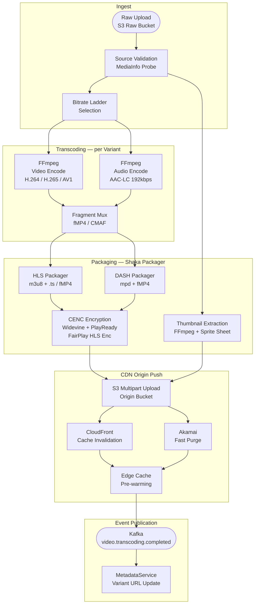
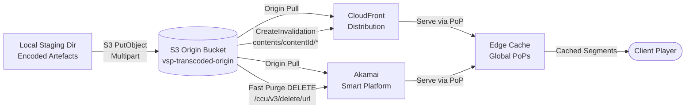
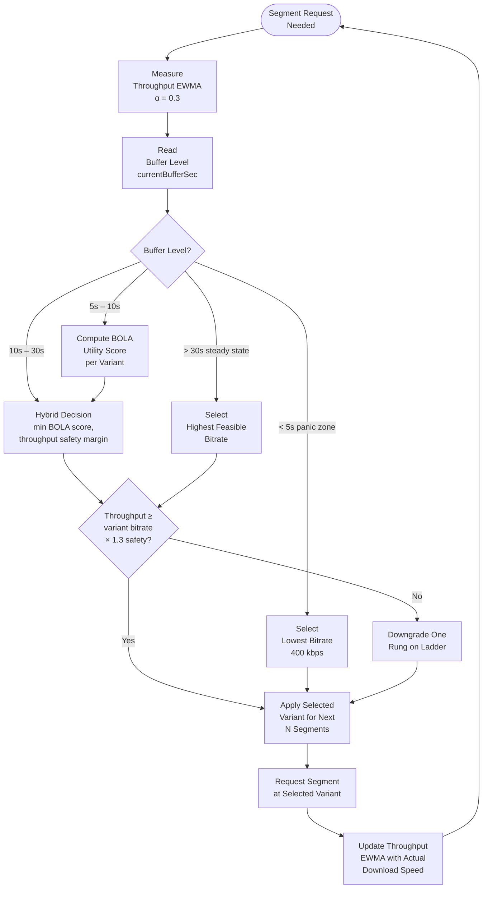
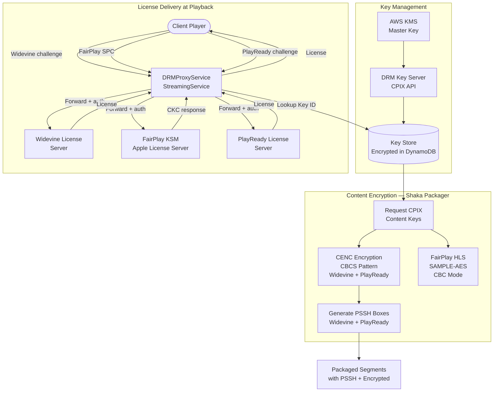

# Transcoding and Delivery Pipeline

This document provides a comprehensive specification of the video transcoding and CDN delivery pipeline for the Video Streaming Platform. It covers the FFmpeg encoding configuration, bitrate ladder definition, packaging into HLS and DASH adaptive formats, DRM encryption, thumbnail extraction, CDN origin push, cache invalidation, and the ABR algorithm used by the client player.

---

## End-to-End Pipeline Overview



---

## FFmpeg Pipeline Configuration

### Video Codec Configuration

FFmpeg is invoked once per bitrate variant. The command template used by `FFmpegWrapper` is:

```bash
ffmpeg \
  -i pipe:0 \
  -c:v libx264 \
  -profile:v high \
  -level:v 4.1 \
  -preset slow \
  -tune film \
  -b:v {BITRATE_KBPS}k \
  -minrate {BITRATE_KBPS * 0.8}k \
  -maxrate {BITRATE_KBPS * 1.2}k \
  -bufsize {BITRATE_KBPS * 2}k \
  -vf "scale={WIDTH}:{HEIGHT}:flags=lanczos,format=yuv420p" \
  -r {FRAMERATE} \
  -g {FRAMERATE * 2} \
  -keyint_min {FRAMERATE} \
  -sc_threshold 0 \
  -c:a aac \
  -b:a 192k \
  -ar 48000 \
  -ac 2 \
  -movflags +faststart+frag_keyframe+empty_moov \
  -f mp4 \
  pipe:1
```

For H.265 (HEVC) variants (`1080p` and above when `h265` is selected):
```bash
  -c:v libx265 \
  -preset slow \
  -crf 23 \
  -x265-params "keyint=48:min-keyint=48:no-scenecut=1" \
```

For AV1 variants (`4K` when source quality permits):
```bash
  -c:v libaom-av1 \
  -crf 30 \
  -b:v 0 \
  -cpu-used 4 \
  -row-mt 1 \
  -tiles 2x2 \
```

Key encoder parameter rationale:

- `preset slow` — trades encoding speed for compression efficiency; acceptable for background batch jobs.
- `-g {FRAMERATE * 2}` — forces a keyframe every 2 seconds (at 24 fps: every 48 frames), aligning with the 2-second segment duration to ensure every segment starts with an IDR frame.
- `-sc_threshold 0` — disables scene-cut based keyframe insertion to maintain strict segment alignment across all bitrate variants.
- `-movflags +frag_keyframe+empty_moov` — produces CMAF-compatible fragmented MP4 output suitable for Shaka Packager input.
- `bufsize = 2 × maxbitrate` — VBV buffer window of 2 seconds, balancing quality variance against client buffer requirements.

### Audio Configuration

All variants share a single AAC-LC audio track at 192 kbps, 48 kHz, stereo. Where source content includes Dolby Atmos or Dolby Digital Plus (E-AC3), an additional audio rendition is packaged separately in Shaka Packager and referenced as an alternate audio group in the HLS master playlist:

```bash
  -c:a:1 eac3 \
  -b:a:1 384k \
  -ar 48000 \
```

### Source Validation Filters

Before transcoding begins, MediaInfo is called on the source file to extract:
- Container format, codec, colour space, HDR metadata (HDR10 / Dolby Vision)
- Duration, bitrate, frame rate, SAR/DAR, audio track count
- Interlacing flag (triggers `-vf yadif=mode=1` deinterlace filter when set)

---

## Multi-Bitrate Ladder

The bitrate ladder defines the set of quality variants produced for every piece of content. The `BitrateProfiler` selects the applicable subset based on source resolution: variants with a resolution higher than the source are skipped.

| Variant | Resolution | Bitrate (kbps) | Video Codec | Audio Codec | Frame Rate | Segment Duration | Profile |
|---|---|---|---|---|---|---|---|
| 240p | 426 × 240 | 400 | H.264 Baseline 3.0 | AAC-LC 128k | 24 fps | 2 s | Mobile / Low bandwidth |
| 360p | 640 × 360 | 800 | H.264 Main 3.1 | AAC-LC 128k | 24 fps | 2 s | Mobile |
| 480p | 854 × 480 | 1200 | H.264 Main 3.1 | AAC-LC 192k | 24 fps | 2 s | SD |
| 720p | 1280 × 720 | 2500 | H.264 High 4.0 | AAC-LC 192k | 24 / 30 fps | 2 s | HD |
| 1080p | 1920 × 1080 | 5000 | H.265 Main 4.1 | AAC-LC 192k | 24 / 30 fps | 2 s | Full HD |
| 1440p | 2560 × 1440 | 8000 | H.265 Main 5.0 | AAC-LC 192k | 24 / 30 / 60 fps | 2 s | QHD |
| 4K | 3840 × 2160 | 15000 | AV1 / H.265 Main10 | E-AC3 384k | 24 / 30 / 60 fps | 2 s | UHD HDR10 |

HDR10 variants (1440p and 4K) additionally include:
- `-vf zscale=t=linear:npl=100,format=gbrpf32le,zscale=p=bt2020:t=smpte2084:m=bt2020nc,format=yuv420p10le`
- `x265-params hdr-opt=1:repeat-headers=1:hdr10=1:colorprim=bt2020:transfer=smpte2084:colormatrix=bt2020nc`

---

## HLS and DASH Packaging

### Shaka Packager Configuration

Shaka Packager is invoked once per content item after all variant segments are encoded. A representative invocation:

```bash
shaka-packager \
  "in=video_240p.mp4,stream=video,output=seg_240p_$Number$.m4s,playlist_name=240p.m3u8,iframe_playlist_name=240p_iframe.m3u8" \
  "in=video_360p.mp4,stream=video,output=seg_360p_$Number$.m4s,playlist_name=360p.m3u8" \
  "in=video_1080p.mp4,stream=video,output=seg_1080p_$Number$.m4s,playlist_name=1080p.m3u8" \
  "in=video_240p.mp4,stream=audio,output=seg_audio_$Number$.m4s,playlist_name=audio_en.m3u8,hls_group_id=audio,hls_name=English" \
  --protection_scheme cbcs \
  --enable_raw_key_encryption \
  --keys "label=:key_id={KEY_ID_HEX}:key={KEY_HEX}" \
  --hls_master_playlist_output master.m3u8 \
  --mpd_output manifest.mpd \
  --segment_duration 2 \
  --fragment_duration 2 \
  --generate_static_live_mpd \
  --output_media_info
```

Key packaging parameters:

- `--protection_scheme cbcs` — uses the CBCS (AES-128 in CBC mode with pattern encryption) protection scheme, compatible with FairPlay, Widevine, and PlayReady.
- `--segment_duration 2` — 2-second segments balance startup latency against adaptation granularity.
- `--fragment_duration 2` — every fragment is also a segment (no sub-segmenting) for maximum CDN cache efficiency.
- `--generate_static_live_mpd` — produces a `type="static"` DASH MPD suitable for VOD on-demand playback.

### HLS Master Playlist Structure

The generated master playlist includes `EXT-X-STREAM-INF` tags with `BANDWIDTH`, `RESOLUTION`, `CODECS`, `FRAME-RATE`, and `HDCP-LEVEL` attributes. Subtitle and audio alternate renditions are declared before the variant streams:

```
#EXTM3U
#EXT-X-VERSION:7
#EXT-X-SESSION-DATA:DATA-ID="com.vsp.contentId",VALUE="cnt_01HXZ..."
#EXT-X-SESSION-KEY:METHOD=SAMPLE-AES,URI="skd://keyid_{KEY_ID}",KEYFORMAT="com.apple.streamingkeydelivery",KEYFORMATVERSIONS="1"
#EXT-X-MEDIA:TYPE=SUBTITLES,GROUP-ID="subs",NAME="English",DEFAULT=YES,AUTOSELECT=YES,LANGUAGE="en",URI="subs_en.m3u8"
#EXT-X-MEDIA:TYPE=AUDIO,GROUP-ID="audio",NAME="English",DEFAULT=YES,AUTOSELECT=YES,LANGUAGE="en",URI="audio_en.m3u8"
#EXT-X-STREAM-INF:BANDWIDTH=400000,RESOLUTION=426x240,CODECS="avc1.64001e,mp4a.40.2",AUDIO="audio",SUBTITLES="subs"
240p.m3u8
#EXT-X-STREAM-INF:BANDWIDTH=2500000,RESOLUTION=1280x720,CODECS="avc1.640028,mp4a.40.2",FRAME-RATE=24,AUDIO="audio",SUBTITLES="subs"
720p.m3u8
#EXT-X-STREAM-INF:BANDWIDTH=15000000,RESOLUTION=3840x2160,CODECS="hev1.2.4.L153.B0,ec-3",FRAME-RATE=24,AUDIO="audio",SUBTITLES="subs",HDCP-LEVEL=TYPE-1
4k.m3u8
```

---

## Thumbnail Extraction and Sprite Sheets

Thumbnails are extracted at 10 % intervals of the content duration, producing 11 frames for any video (at 0 %, 10 %, 20 %, … 100 %). The extraction command:

```bash
ffmpeg -i source.mp4 \
  -vf "fps=1/{INTERVAL_SECONDS},scale=160:90" \
  -vsync vfr \
  -q:v 2 \
  thumb_%04d.jpg
```

Where `INTERVAL_SECONDS = floor(durationSeconds / 10)`.

ImageMagick assembles the 11 JPEG frames into a single sprite sheet PNG with 10 columns:

```bash
montage thumb_*.jpg \
  -tile 10x2 \
  -geometry 160x90+0+0 \
  -background black \
  sprite.png
```

The corresponding WebVTT thumbnail track file maps each time range to a sprite cell:

```
WEBVTT

00:00:00.000 --> 00:07:18.000
https://cdn.vsp.io/thumbnails/cnt_01HXZ.../sprite.png#xywh=0,0,160,90

00:07:18.000 --> 00:14:36.000
https://cdn.vsp.io/thumbnails/cnt_01HXZ.../sprite.png#xywh=160,0,160,90
```

A higher-resolution poster image (1280 × 720) and backdrop image (1920 × 1080) are also extracted at the 10 % mark using:

```bash
ffmpeg -ss {POSTER_TIMESTAMP} -i source.mp4 -vframes 1 -q:v 1 \
  -vf "scale=1280:720:flags=lanczos" poster.jpg
```

---

## CDN Origin Push Workflow



### S3 Upload Configuration

- Bucket: `vsp-transcoded-origin` in `us-east-1`; replicated to `eu-west-1` via S3 Cross-Region Replication.
- Path structure: `contents/{contentId}/{variantId}/seg_{number}.m4s`, `contents/{contentId}/master.m3u8`, `contents/{contentId}/manifest.mpd`, `contents/{contentId}/thumbnails/sprite.png`.
- Content-Type headers: `video/mp4` for segments, `application/x-mpegURL` for HLS playlists, `application/dash+xml` for MPD, `image/png` for sprites.
- Cache-Control: `public, max-age=31536000, immutable` for segments (content-addressed); `public, max-age=60, stale-while-revalidate=300` for manifests.
- Multipart upload threshold: 100 MB; part size: 50 MB; parallelism: 8 concurrent parts.

---

## Cache Invalidation Strategy

Cache invalidation is triggered in two scenarios: (a) after initial transcoding completes, to remove any stale "not found" cache entries from CDN; (b) when a content item's metadata is updated (title, DRM keys), requiring manifest refresh.

**CloudFront invalidation** is performed via `CreateInvalidation` with the path pattern `contents/{contentId}/*`. CloudFront invalidations are free for the first 1,000 path patterns per month; beyond that, versioned paths (below) are preferred.

**Versioned path strategy** for manifests: manifests are uploaded with a version suffix when updated — e.g., `master_v2.m3u8`. The `MetadataService` tracks the current active manifest version; the `StreamingService` resolves the correct versioned URL at serve time. This avoids invalidation costs for routine metadata updates and allows instant rollback.

**Akamai Fast Purge** is called via the `DELETE /ccu/v3/delete/url` endpoint with a JSON body listing up to 100 URLs per request. For large invalidations (e.g., when a global DRM key rotation is required), URLs are batched into groups of 100.

**TTL hierarchy:**

| Artefact | CDN TTL | S3 Cache-Control |
|---|---|---|
| Video segments (fMP4) | 365 days (immutable) | `max-age=31536000, immutable` |
| HLS variant playlist | 2 seconds | `max-age=2` |
| HLS master playlist | 60 seconds | `max-age=60, stale-while-revalidate=300` |
| DASH MPD | 60 seconds | `max-age=60, stale-while-revalidate=300` |
| Thumbnail sprite PNG | 7 days | `max-age=604800` |
| WebVTT thumbnail track | 7 days | `max-age=604800` |

---

## ABR Algorithm

The client player implements a hybrid ABR (Adaptive Bitrate) algorithm combining buffer-based control (BOLA) with throughput estimation.



### BOLA Utility Score

BOLA (Buffer-Occupancy-Based Lyapunov Algorithm) assigns a utility score to each variant based on the current buffer level and the variant's encoded bitrate. The score for variant *i* is:

```
BOLA_score(i) = ( V × (utility(i) + γ_p) ) / buffer_level  -  (V × γ_p)
```

Where:
- `utility(i) = log(bitrate_i / bitrate_lowest)` — logarithmic utility function normalised to the lowest variant.
- `V` — a tuning parameter controlling the trade-off between buffer conservation and quality; set to `buffer_target / (utility_highest + γ_p)`.
- `γ_p` — rebuffering penalty coefficient; set to `1 / segment_duration`.
- `buffer_level` — current buffer occupancy in seconds.

The variant with the highest `BOLA_score` that also satisfies the throughput safety margin (`estimated_throughput ≥ variant_bitrate × 1.3`) is selected.

### Throughput Estimation (EWMA)

Download throughput is estimated using an exponentially weighted moving average:

```
throughput_ewma = α × last_segment_throughput + (1 - α) × throughput_ewma
```

Where `α = 0.3` gives more weight to historical measurements, smoothing over transient bandwidth spikes. The safety factor of 1.3× prevents selecting a variant that would exactly saturate the available bandwidth, leaving headroom for TCP retransmissions and network jitter.

### Startup Heuristic

On session start, before any throughput measurement is available, the player uses the initial bitrate hint provided by the `ABRController` server component (derived from `Accept-CH: Downlink` header and historical session data). This reduces the probability of a startup quality switch within the first 3 segments.

---

## DRM Encryption Workflow



### CPIX Key Provisioning

Before packaging, the `PackagingEngine` requests content encryption keys from the internal DRM Key Server using the CPIX 2.3 protocol. A CPIX document is submitted specifying:
- `ContentKeyPeriodList` — one period covering the full content duration (VOD).
- `ContentKeyList` — one key per DRM system (Widevine, PlayReady, FairPlay), or a single key shared across systems when CBCS multi-DRM is used.
- `DRMSystemList` — system IDs for Widevine (`edef8ba9-79d6-4ace-a3c8-27dcd51d21ed`), PlayReady (`9a04f079-9840-4286-ab92-e65be0885f95`), FairPlay (`94ce86fb-07ff-4f43-adb8-93d2fa968ca2`).

The key server returns the CPIX document with `ContentKey` elements containing the key value encrypted under KMS. The decrypted key material is passed to Shaka Packager via `--keys` flags.

### FairPlay HLS Encryption

FairPlay uses `SAMPLE-AES` mode in HLS playlists (not CENC). The `EXT-X-KEY` tag in each variant playlist specifies:

```
#EXT-X-KEY:METHOD=SAMPLE-AES,URI="skd://{KEY_ID}",IV=0x{IV_HEX},KEYFORMAT="com.apple.streamingkeydelivery",KEYFORMATVERSIONS="1"
```

The `skd://` scheme is resolved by the AVFoundation framework on Apple devices, which sends a Server Playback Context (SPC) request to the licence URL configured in the master playlist's `EXT-X-SESSION-KEY` tag. The `DRMProxyService` receives the SPC, retrieves the content key from the key store using the key ID, wraps it in a Content Key Context (CKC) response, and returns it to the player.

### Widevine and PlayReady (CENC/CBCS)

DASH and fMP4-based HLS variants use CENC with the CBCS pattern encryption scheme:
- **CBCS pattern**: 1-in-9 pattern (1 encrypted NAL unit followed by 8 clear units), reducing CPU load on constrained devices.
- **PSSH boxes**: Both Widevine and PlayReady PSSH boxes are embedded in the `moov` atom of every initialisation segment.
- The `DRMProxyService` attaches a server-side Widevine authentication token (derived from a service certificate stored in AWS Secrets Manager) before forwarding licence requests to the Widevine licence server at `license.widevine.com`.
