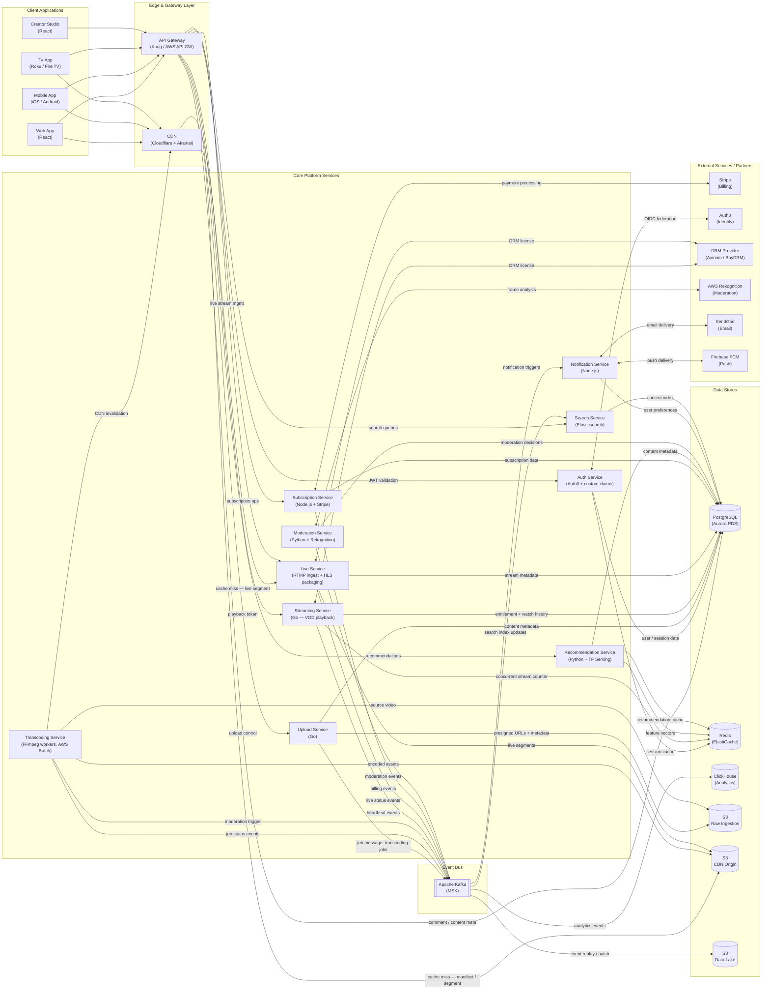
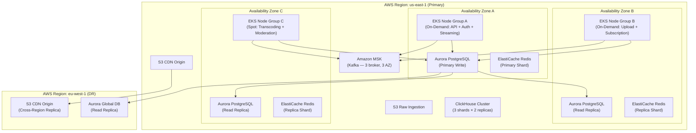

# Architecture Diagram

## Architecture Overview

The Video Streaming Platform is built as a collection of purpose-built microservices deployed on
AWS Elastic Kubernetes Service (EKS). Each service owns its data store, exposes a versioned REST
or gRPC API, and communicates asynchronously through a Kafka event bus for cross-domain workflows.
This eliminates runtime coupling between services while preserving data consistency through
event-sourced state machines. The entire ingestion and delivery path is optimised for high
throughput and low latency: raw video is stored in S3, served through Cloudflare and Akamai CDN
edge networks, and protected by multi-DRM (Widevine, FairPlay, PlayReady) at the license layer.

Authentication and authorisation are centralised through Auth0 (OIDC/OAuth 2.0) at the perimeter.
Every inbound API request passes through the API Gateway, which validates JWTs, enforces rate
limits, and routes to the appropriate downstream service. Internal service-to-service calls use
mTLS with short-lived workload identity certificates issued by AWS ACM Private CA, so no service
implicitly trusts another based on network position alone. Secrets are managed through AWS Secrets
Manager with automatic rotation; no credentials are baked into container images or ConfigMaps.

The data tier is intentionally heterogeneous: PostgreSQL (via Amazon RDS Aurora) holds relational
transactional data (users, subscriptions, content metadata, comments); Redis (ElastiCache) handles
ephemeral caching, session state, real-time counters, and recommendation caches; ClickHouse stores
the immutable analytics event ledger and powers sub-second OLAP queries over billions of rows.
S3 is the durable object store for raw video, encoded segments, manifests, and the data lake.
This polyglot persistence strategy matches each workload to the data engine it performs best on
rather than forcing all data into a single general-purpose store.

---

## High-Level Architecture Diagram

---

## Service Responsibilities

| Service | Core Responsibility | Primary Tech Stack | Scaling Strategy |
|---|---|---|---|
| **API Gateway** | Inbound routing, JWT validation, rate limiting, TLS termination, request/response transformation | Kong on EKS, AWS API Gateway (public endpoints) | Horizontal pod autoscale on RPS; CDN absorbs static traffic |
| **Auth Service** | Session management, JWT issuance, entitlement resolution, device registration | Go, Auth0 OIDC, Aurora PostgreSQL, ElastiCache | Stateless pods; read replicas for entitlement queries |
| **Upload Service** | Multipart upload orchestration, checksum validation, virus scanning, transcoding job dispatch | Go, AWS S3 SDK, ClamAV sidecar | Scale on active upload count; S3 transfer acceleration |
| **Transcoding Service** | Video encoding (H.264/H.265/AV1), HLS/DASH packaging, thumbnail generation, audio normalisation | FFmpeg workers, AWS Batch, Python job controller | Spot instance fleet; parallelise renditions across jobs |
| **Streaming Service** | VOD playback token issuance, manifest URL signing, heartbeat recording, watch history | Go, Aurora PostgreSQL, ElastiCache Redis | Stateless; scale on playback token RPS; Redis absorbs hot reads |
| **Live Service** | RTMP ingest, keyframe forwarding, HLS/DASH live packaging, DVR archival, viewer counting | Go, nginx-rtmp fork, FFmpeg, S3 | Scale ingest nodes per active stream; packaging pods per channel |
| **Subscription Service** | Plan management, Stripe webhook processing, entitlement grants, invoice reconciliation | Node.js, Stripe SDK, Aurora PostgreSQL | Scale on billing event rate; idempotent webhook handler |
| **Recommendation Service** | Candidate generation, personalised ranking, A/B experiment routing | Python, TensorFlow Serving, Feature Store (Redis) | GPU nodes for model serving; cache recommendations aggressively |
| **Moderation Service** | Automated content moderation (video frames, thumbnails, comments), human review queue | Python, AWS Rekognition, Aurora PostgreSQL | Scale on moderation job queue depth |
| **Notification Service** | Email (SendGrid), push (FCM/APNs), in-app notifications, preference management | Node.js, SendGrid SDK, Firebase Admin SDK | Scale on Kafka consumer lag; async delivery with retry |
| **Search Service** | Full-text search, faceted filtering, autocomplete, trending content | Elasticsearch 8, logstash index pipeline | Scale Elasticsearch data nodes on query volume |

---

## Cross-Cutting Concerns

### Authentication and Authorisation

Every request entering the API Gateway must carry a valid Auth0-issued JWT in the `Authorization:
Bearer` header. The API Gateway validates the token signature against the Auth0 JWKS endpoint
(cached for 5 minutes) and rejects expired or malformed tokens before they reach any downstream
service. Downstream services receive the pre-validated claims in a trusted internal header
(`X-User-Id`, `X-Subscription-Tier`, `X-Device-Id`) and do not re-validate the JWT, reducing
latency. Service-to-service calls inside the cluster use Kubernetes SPIFFE/SPIRE workload identity
with mTLS — no service implicitly trusts traffic based on source IP alone.

Role-based access control (RBAC) is enforced at the service layer using a policy engine (OPA/Rego).
Creator-specific operations (upload, live stream management, analytics access) require the `creator`
role claim. Moderation and admin operations require explicit elevated roles that cannot be self-assigned.
Subscription-tier claims (`FREE`, `STANDARD`, `PREMIUM`, `FAMILY`) gate access to UHD playback,
offline download, and concurrent stream limits at the Streaming Service level.

### Observability

Every service emits structured JSON logs (using zerolog/zap/winston) to Fluent Bit, which ships
them to Amazon OpenSearch Service. Prometheus metrics are scraped by the cluster's Prometheus
operator on a 15-second interval; dashboards are served from Grafana with pre-built panels for
each service. Distributed traces are instrumented with OpenTelemetry (Go, Python, Node.js SDKs)
and exported to AWS X-Ray, providing end-to-end request visibility across service boundaries.
Synthetic monitoring pings critical playback paths (manifest fetch, DRM license, first segment
download) from five global regions every 60 seconds; SLA breach alerts page the on-call engineer
via PagerDuty within 2 minutes.

### Resilience Patterns

All synchronous inter-service HTTP calls use the circuit breaker pattern (Resilience4j / go-resiliency)
with a 50% failure threshold over a 10-second window to prevent cascading failures. Downstream service
unavailability causes the circuit to open, returning a cached or degraded response rather than
blocking the caller indefinitely. Kafka-backed async workflows use idempotent event processing:
each consumer checks an event deduplication table (keyed on event ID) before processing, ensuring
at-least-once delivery semantics result in exactly-once side effects. Database writes use optimistic
locking (version columns) to detect concurrent modification; the caller retries with exponential
backoff up to 3 times before surfacing the conflict to the client.

Pod Disruption Budgets ensure at least 2 replicas of every critical service remain available
during cluster upgrades. Multi-AZ deployment across three AWS availability zones ensures that a
single AZ failure does not take the platform offline. S3 cross-region replication is configured
for the CDN Origin Bucket to a secondary AWS region to enable failover within 15 minutes in a
regional outage scenario.

---

## Deployment Topology

The platform runs entirely on AWS, with the following high-level infrastructure topology:

The Kubernetes cluster spans all three availability zones using a node group per zone strategy.
On-demand node groups host the latency-sensitive services (API Gateway, Auth, Streaming) while
Spot instance node groups run the batch-tolerant workloads (Transcoding, Moderation). Spot
interruption handlers drain pods gracefully within the 2-minute warning window using
`node.kubernetes.io/unschedulable` taints, ensuring in-progress transcoding jobs are checkpointed
to SQS before the instance is reclaimed.

Aurora PostgreSQL Global Database provides sub-second read replication to the EU DR region,
enabling read traffic to be served regionally if cross-region latency is a concern, and enabling
promotion of the EU replica to primary in under 60 seconds in a primary region failure. S3
Cross-Region Replication ensures video segments are pre-staged in the DR region's CDN Origin
bucket, so failover does not require re-uploading petabytes of video content.

---

## Capacity Estimates

The following back-of-envelope estimates inform service sizing and autoscaling thresholds:

| Metric | Baseline | Peak (3×) |
|---|---|---|
| Concurrent VOD viewers | 100,000 | 300,000 |
| Concurrent live streams active | 500 | 1,500 |
| Average segment size (1080p, 2s) | 3 MB | — |
| CDN egress bandwidth | 300 Gbps | 900 Gbps |
| Playback token requests/sec | 500 rps | 1,500 rps |
| Heartbeat events/sec | 100,000 eps | 300,000 eps |
| Kafka raw-player-events throughput | 500 MB/s | 1.5 GB/s |
| ClickHouse ingest rate | 2M rows/min | 6M rows/min |
| Transcoding jobs/hour | 2,000 | 6,000 |
| New video uploads/day | 10,000 | 30,000 |
| PostgreSQL write TPS | 5,000 | 15,000 |
| Redis operations/sec | 500,000 | 1,500,000 |

The CDN absorbs over 95% of viewer traffic, so the Streaming Service only handles cache misses
and playback token issuance. At 300,000 concurrent viewers watching 2-second segments, the CDN
must serve ~450,000 segment requests/second across all edge nodes — well within Cloudflare's
published capacity of tens of millions of requests/second globally. The API Gateway handles only
the control plane: token issuance (~1,500 rps), heartbeats (~300,000 eps routed through the
event ingestion path), and metadata API calls.

ClickHouse is sized for 6 million rows/minute ingest at peak, which requires approximately
3 data shard nodes each handling 2 million inserts/minute. ClickHouse's columnar storage
compresses player event data at roughly 10:1, meaning 6 million events/minute (each ~200 bytes
uncompressed) produces approximately 12 MB/minute of on-disk data per shard — comfortably within
NVMe SSD write throughput. Query performance for the creator dashboard (7-day retention curve,
per-geography breakdown) executes in under 200 ms on this dataset size due to ClickHouse's
vectorised execution engine.

---

## API Gateway Route Map

The following table summarises the primary route groups handled by the API Gateway:

| Route Prefix | Upstream Service | Auth Required | Rate Limit |
|---|---|---|---|
| `GET /v1/content/**` | Streaming Service | Optional (gated content requires auth) | 1,000 rps/IP |
| `POST /v1/playback/**` | Streaming Service | Required (valid JWT) | 200 rps/user |
| `POST /v1/uploads/**` | Upload Service | Required (creator role) | 10 rps/user |
| `GET /v1/transcoding/**` | Transcoding Service | Required (creator role) | 60 rps/user |
| `POST /v1/livestreams/**` | Live Service | Required (creator role) | 20 rps/user |
| `GET /v1/recommendations` | Recommendation Service | Required | 300 rps/user |
| `GET /v1/search` | Search Service | Optional | 500 rps/IP |
| `POST /v1/subscriptions/**` | Subscription Service | Required | 10 rps/user |
| `POST /v1/events` | Events Ingestion | Required | 6,000 rps/user |
| `POST /v1/comments/**` | Streaming Service / PostgreSQL | Required | 30 rps/user |
