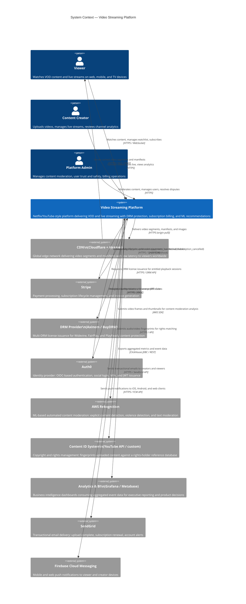
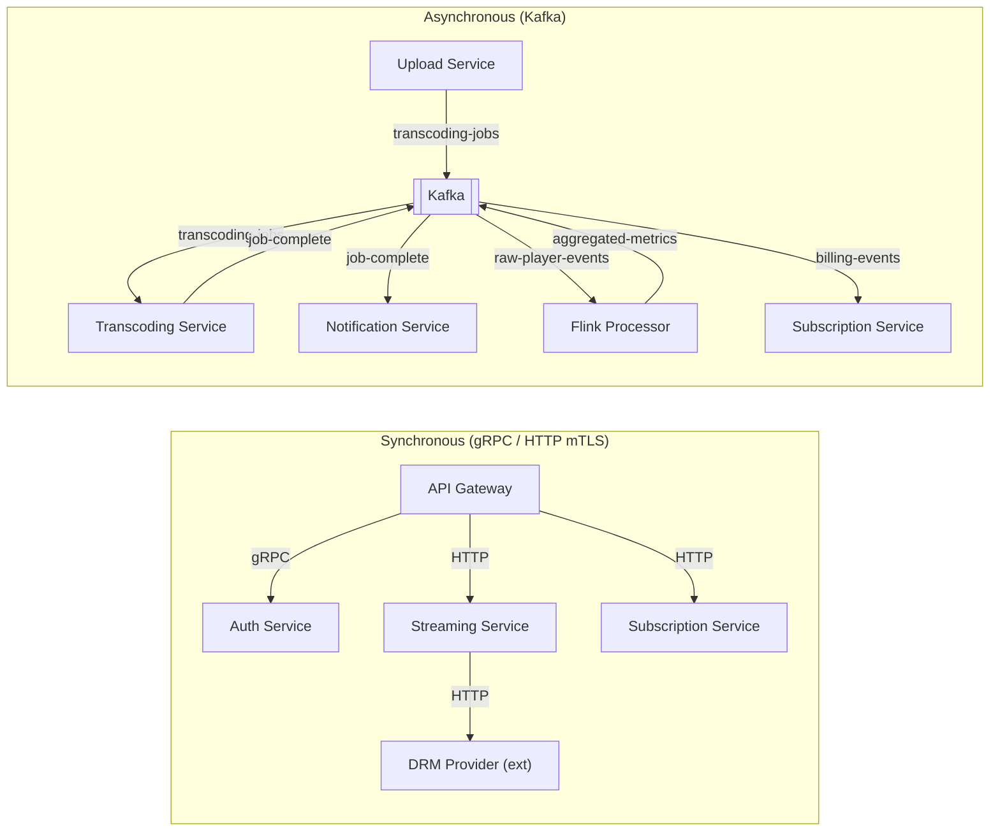

# C4 Architecture Diagrams

This document presents the Video Streaming Platform's architecture at two levels of the C4 model:
the System Context diagram (Level 1) and the Container diagram (Level 2). Together they provide a
layered, audience-appropriate view of the system — from a business stakeholder overview down to
the deployment units that engineers reason about daily.

---

## Level 1 — System Context

The System Context diagram answers the question: *who uses this system and what external systems
does it depend on?* It deliberately omits internal implementation details and focuses on the
boundary between the platform and the outside world.

### Context Diagram — Narrative

The Video Streaming Platform sits at the centre of a rich ecosystem of external actors and
third-party services. Three distinct human personas interact with the system: **Viewers** who
consume content through web browsers, native mobile apps, and TV clients; **Content Creators**
who manage their libraries and live streams through the Creator Studio; and **Platform Admins**
who operate trust-and-safety, content policy, and billing functions through an internal
administration interface.

On the external systems side, the CDN is the highest-throughput integration: it handles the bulk
of viewer traffic by caching and serving video segments at edge locations globally, with the
platform acting as the CDN origin. Stripe and Auth0 are the two most operationally critical
dependencies — Stripe for subscription billing and Auth0 for identity management. Both are
integrated with retry logic and fallback behaviour: authentication failures degrade to a cached
JWT validation, and Stripe webhook failures are replayed with exponential backoff over 24 hours.

AWS Rekognition and the Content ID System act as automated policy enforcers. Rekognition flags
potentially violating content before it reaches a human moderator, significantly reducing the
volume of items requiring manual review. The Content ID integration ensures that rights-holder
fingerprints are checked at upload time, preventing infringing content from being published. Both
integrations are implemented as async Kafka consumers to avoid adding latency to the upload path.

---

## Level 2 — System Containers

The Container diagram zooms into the Video Streaming Platform boundary, revealing the individual
deployable units (containers) that make up the system. Each container is a separately deployable
component with its own technology choice and scaling profile.

```mermaid
C4Container
    title Container Diagram — Video Streaming Platform

    Person(viewer, "Viewer", "End user watching content on any device")
    Person(creator, "Content Creator", "Uploads, manages, and monetises content")
    Person(admin, "Platform Admin", "Manages platform operations and moderation")

    System_Ext(cdn, "CDN\n(Cloudflare + Akamai)", "Global edge network")
    System_Ext(stripe, "Stripe", "Payment processing")
    System_Ext(drmProvider, "DRM Provider", "Widevine / FairPlay / PlayReady licensing")
    System_Ext(auth0, "Auth0", "Identity provider")
    System_Ext(rekognition, "AWS Rekognition", "Automated moderation")

    Container_Boundary(frontend, "Frontend Applications") {
        Container(webApp, "Web Application", "React 18 / Next.js 14", "Server-side rendered viewer and creator experience; uses HLS.js and Shaka Player for adaptive playback")
        Container(mobileApp, "Mobile Application", "React Native / Swift / Kotlin", "Native iOS and Android apps with offline download support and background audio playback")
        Container(tvApp, "TV Application", "React Native TV / Roku / Fire TV SDK", "10-foot UI for Smart TV, Apple TV, Roku, and Amazon Fire TV devices")
        Container(creatorStudio, "Creator Studio", "React 18 / Next.js", "Web application for video upload, live stream management, analytics, and channel customisation")
    }

    Container_Boundary(gateway, "API Gateway Layer") {
        Container(apiGateway, "API Gateway", "Kong on EKS / AWS API Gateway", "Inbound routing, JWT validation, rate limiting, TLS termination, request transformation, and API versioning")
    }

    Container_Boundary(services, "Platform Microservices — EKS") {
        Container(authSvc, "Auth Service", "Go + Auth0 SDK", "Session management, JWT validation, entitlement resolution, device allowlisting")
        Container(uploadSvc, "Upload Service", "Go + AWS S3 SDK", "Multipart upload orchestration, checksum validation, transcoding job dispatch")
        Container(transcodeSvc, "Transcoding Service", "Python + FFmpeg + AWS Batch", "Multi-profile video encoding, HLS/DASH packaging, thumbnail generation, audio normalisation")
        Container(streamingSvc, "Streaming Service", "Go", "VOD playback token issuance, manifest URL signing, concurrent stream enforcement, watch history")
        Container(liveSvc, "Live Service", "Go + nginx-RTMP + FFmpeg", "RTMP ingest, live HLS/DASH packaging, DVR archival, real-time viewer counting")
        Container(subscriptionSvc, "Subscription Service", "Node.js + Stripe SDK", "Plan management, Stripe webhook processing, entitlement grants, invoice reconciliation")
        Container(recommendSvc, "Recommendation Service", "Python + TensorFlow Serving", "Collaborative filtering, content-based ranking, A/B experiment routing, feature serving")
        Container(moderationSvc, "Moderation Service", "Python + Boto3", "Automated moderation via Rekognition, human review queue, moderation decision recording")
        Container(notificationSvc, "Notification Service", "Node.js + SendGrid + FCM", "Email, push, and in-app notification delivery based on Kafka event triggers")
        Container(searchSvc, "Search Service", "Java + Elasticsearch", "Full-text search, faceted filtering, autocomplete, trending content ranking")
    }

    Container_Boundary(data, "Data Stores") {
        ContainerDb(postgres, "PostgreSQL", "Amazon Aurora PostgreSQL 15", "Relational store for users, subscriptions, content metadata, comments, moderation decisions")
        ContainerDb(redis, "Redis", "Amazon ElastiCache Redis 7", "Session cache, playback counters, recommendation cache, rate-limit counters, pub/sub")
        ContainerDb(clickhouse, "ClickHouse", "Self-managed on EKS / ClickHouse Cloud", "Immutable analytics event store; powers real-time creator dashboards and A/B reporting")
        ContainerDb(s3Raw, "S3 Raw Ingestion", "Amazon S3", "Durable storage for original uploaded video files prior to transcoding")
        ContainerDb(s3CDN, "S3 CDN Origin", "Amazon S3", "Encoded video segments, HLS/DASH manifests, thumbnails served to CDN")
        ContainerDb(s3Lake, "S3 Data Lake", "Amazon S3 + Parquet", "Long-term event archive for ML training and ad-hoc analyst queries via Athena")
    }

    Container_Boundary(messaging, "Event Bus") {
        Container(kafka, "Apache Kafka", "Amazon MSK (Kafka 3.6)", "Event bus for all async cross-service communication: transcoding, moderation, billing, analytics, notifications")
    }

    Rel(viewer, webApp, "Watches content, manages watchlist", "HTTPS")
    Rel(viewer, mobileApp, "Streams and downloads content", "HTTPS")
    Rel(viewer, tvApp, "Streams on Smart TV", "HTTPS")
    Rel(creator, creatorStudio, "Uploads, goes live, views analytics", "HTTPS")
    Rel(admin, webApp, "Accesses admin panel", "HTTPS")

    Rel(webApp, cdn, "Loads video segments and manifests", "HTTPS")
    Rel(mobileApp, cdn, "Loads video segments and manifests", "HTTPS")
    Rel(tvApp, cdn, "Loads video segments and manifests", "HTTPS")

    Rel(webApp, apiGateway, "API calls (auth, playback, content)", "HTTPS / REST")
    Rel(mobileApp, apiGateway, "API calls", "HTTPS / REST")
    Rel(tvApp, apiGateway, "API calls", "HTTPS / REST")
    Rel(creatorStudio, apiGateway, "Upload, live, analytics calls", "HTTPS / REST")

    Rel(apiGateway, authSvc, "Validate JWT, resolve claims", "gRPC / mTLS")
    Rel(apiGateway, uploadSvc, "Upload initiation and completion", "HTTP / mTLS")
    Rel(apiGateway, streamingSvc, "Playback token requests, heartbeats", "HTTP / mTLS")
    Rel(apiGateway, liveSvc, "Live stream management, viewer events", "HTTP / mTLS")
    Rel(apiGateway, subscriptionSvc, "Subscription CRUD, plan changes", "HTTP / mTLS")
    Rel(apiGateway, recommendSvc, "Home feed, content recommendations", "HTTP / mTLS")
    Rel(apiGateway, searchSvc, "Search queries, autocomplete", "HTTP / mTLS")

    Rel(authSvc, postgres, "Read/write users, sessions, entitlements", "PostgreSQL wire")
    Rel(authSvc, redis, "Cache sessions and entitlements", "Redis protocol")
    Rel(authSvc, auth0, "Federate OIDC, exchange tokens", "HTTPS / OIDC")

    Rel(uploadSvc, s3Raw, "Orchestrate multipart upload, store raw video", "AWS S3 API")
    Rel(uploadSvc, postgres, "Store content metadata", "PostgreSQL wire")
    Rel(uploadSvc, kafka, "Publish transcoding-jobs events", "Kafka protocol")

    Rel(transcodeSvc, s3Raw, "Read source video for encoding", "AWS S3 API")
    Rel(transcodeSvc, s3CDN, "Write encoded segments and manifests", "AWS S3 API")
    Rel(transcodeSvc, kafka, "Publish job status and moderation trigger events", "Kafka protocol")

    Rel(streamingSvc, postgres, "Read content metadata, write watch history", "PostgreSQL wire")
    Rel(streamingSvc, redis, "Concurrent stream counters, position cache", "Redis protocol")
    Rel(streamingSvc, kafka, "Publish playback heartbeat events", "Kafka protocol")
    Rel(streamingSvc, drmProvider, "Request DRM license for entitled sessions", "HTTPS")

    Rel(liveSvc, s3CDN, "Write live segments, DVR archive, VOD manifests", "AWS S3 API")
    Rel(liveSvc, postgres, "Read/write live stream metadata", "PostgreSQL wire")
    Rel(liveSvc, kafka, "Publish live stream events, viewer counts", "Kafka protocol")
    Rel(liveSvc, drmProvider, "Request live DRM licenses", "HTTPS")

    Rel(subscriptionSvc, postgres, "Read/write subscription and billing records", "PostgreSQL wire")
    Rel(subscriptionSvc, kafka, "Publish billing lifecycle events", "Kafka protocol")
    Rel(subscriptionSvc, stripe, "Create/cancel subscriptions, handle webhooks", "HTTPS / Stripe SDK")

    Rel(recommendSvc, redis, "Read feature vectors, write recommendation cache", "Redis protocol")
    Rel(recommendSvc, postgres, "Read content catalogue for candidate generation", "PostgreSQL wire")

    Rel(moderationSvc, rekognition, "Submit frames/thumbnails for label detection", "AWS SDK")
    Rel(moderationSvc, postgres, "Write moderation decisions", "PostgreSQL wire")
    Rel(moderationSvc, kafka, "Consume moderation-tasks events", "Kafka protocol")

    Rel(notificationSvc, kafka, "Consume notification trigger events", "Kafka protocol")
    Rel(notificationSvc, postgres, "Read user notification preferences", "PostgreSQL wire")

    Rel(kafka, clickhouse, "Stream analytics events for OLAP ingestion", "Kafka Connect JDBC")
    Rel(kafka, s3Lake, "Archive raw events to data lake", "Kafka S3 Sink Connector")
```

### Container Diagram — Narrative

The frontend applications are the primary delivery surface for viewers and creators. The Web
Application and Creator Studio are Next.js applications that support server-side rendering for
fast initial load and SEO, then hydrate into fully interactive single-page applications. Video
playback in the browser uses HLS.js (for Safari-incompatible browsers) and Shaka Player (for
Widevine-protected content), both integrated with Encrypted Media Extensions (EME) for DRM. The
Mobile Application uses platform-native media frameworks (AVPlayer on iOS, ExoPlayer on Android)
wrapped by a React Native layer for shared business logic. The TV Application targets constrained
remote-control navigation environments and uses a simplified component set optimised for 10-foot
viewing distances.

The microservices tier reflects the domain decomposition described in the architecture overview.
Each service has a clearly bounded responsibility and its own schema namespace within Aurora
PostgreSQL — direct cross-service database queries are prohibited by convention, ensuring that
data coupling surfaces through the API layer where it can be versioned and monitored. The Kafka
event bus is the backbone of all asynchronous workflows: the Upload Service publishes, the
Transcoding Service consumes; the Transcoding Service publishes completions, the Notification
Service consumes. This topology makes it straightforward to add new consumers (e.g., a new
Search indexer) without modifying existing producers.

The data tier follows a clear separation of concerns: PostgreSQL is the system of record for all
mutable business entities; Redis absorbs all hot-path reads that can tolerate eventual consistency;
ClickHouse is append-only and optimised for analytical scans over hundreds of millions of rows;
S3 stores all binary assets. The Kafka-to-ClickHouse pipeline (via Kafka Connect JDBC sink) and
the Kafka-to-S3 pipeline (via the S3 Sink Connector) ensure that analytics data is never lost and
is available for both real-time OLAP queries and long-term ML training workloads without competing
for the same I/O resources.

---

## Container Technology Choices

The technology choices for each container reflect the specific performance and operational
characteristics of the workload it serves:

| Container | Language / Runtime | Key Libraries & Frameworks | Rationale |
|---|---|---|---|
| Web Application | TypeScript / Next.js 14 | HLS.js, Shaka Player, Tailwind CSS | SSR for SEO and fast first paint; EME integration for DRM |
| Mobile Application | React Native + Swift/Kotlin | ExoPlayer (Android), AVPlayer (iOS) | Native media APIs essential for DRM and background audio |
| TV Application | React Native TV | Leanback (Fire TV), BrightScript (Roku) | Platform-native navigation with shared JS business logic |
| Creator Studio | TypeScript / Next.js 14 | Recharts, React Query, tus-js-client | tus protocol for resumable uploads; Recharts for analytics |
| API Gateway | Kong 3.x on EKS | OIDC plugin, rate-limit plugin, prometheus plugin | Declarative plugin model; Kubernetes-native config via CRDs |
| Auth Service | Go 1.22 | go-jose, gorm, go-redis | Low-latency token validation; minimal GC pressure |
| Upload Service | Go 1.22 | aws-sdk-go-v2, confluent-kafka-go | Streaming S3 multipart; efficient binary handling |
| Transcoding Service | Python 3.12 | ffmpeg-python, boto3, celery | FFmpeg ecosystem maturity; Celery for distributed job queue |
| Streaming Service | Go 1.22 | go-redis, gorm, go-jose | High-concurrency playback token issuance |
| Live Service | Go 1.22 + nginx-rtmp | ffmpeg, aws-sdk-go-v2 | nginx-rtmp proven RTMP handling; Go for control plane |
| Subscription Service | Node.js 20 | stripe-node, knex, ioredis | Stripe's Node SDK most mature; event-driven fits webhooks |
| Recommendation Service | Python 3.12 | tensorflow-serving-api, redis-py, numpy | TF Serving for GPU-optimised model inference |
| Moderation Service | Python 3.12 | boto3, confluent-kafka-python | Boto3 for Rekognition; async Kafka consumer |
| Notification Service | Node.js 20 | @sendgrid/mail, firebase-admin | Official SDKs with built-in retry and webhook verification |
| Search Service | Java 21 | Elasticsearch client 8.x, Spring Boot 3 | Java Elasticsearch client; Spring Boot for rapid REST APIs |

---

## Container Communication Patterns

Understanding how containers communicate is essential for reasoning about failure modes, latency
budgets, and security boundaries.

**Synchronous calls** are used exclusively for operations where the caller needs an immediate
response to complete its own response to the client: JWT validation, playback token issuance,
DRM license requests, and subscription entitlement checks. All synchronous inter-service calls
use gRPC with Protocol Buffers for type safety and efficient serialisation over HTTP/2, except
for the DRM Provider which exposes a REST-over-HTTPS API.

**Asynchronous calls** are used for all cross-domain workflows where the triggering service does
not need an immediate answer: transcoding pipeline, notification dispatch, analytics ingestion,
and content moderation. The Kafka-backed async pattern provides natural backpressure, replay
capability (consumers can re-read events from any offset), and fan-out without producer coupling
(multiple consumers can subscribe to the same topic independently).

All synchronous calls between internal services are protected by mutual TLS (mTLS) using
Istio service mesh. Istio enforces peer authentication policies at the pod level, ensuring that
a compromised pod cannot make lateral API calls to another service by spoofing its identity.
Network policies in Kubernetes restrict which namespaces can reach which services, adding a
defence-in-depth layer below the mTLS enforcement.

---

## External System Dependencies and SLA Targets

The platform's overall availability is bounded by the weakest critical external dependency. The
following table lists SLA targets agreed with each external system and the platform's fallback
strategy when they are unavailable:

| External System | Provider SLA | Fallback Strategy | Impact on Viewers |
|---|---|---|---|
| CDN (Cloudflare) | 99.99% | Failover to Akamai via DNS weighted routing | Minimal — automatic within 60s |
| CDN (Akamai) | 99.99% | Failover to Cloudflare | Minimal — automatic within 60s |
| Auth0 | 99.99% | Cache last-known JWKS for 15 min; allow cached session JWTs | Existing sessions continue; new logins fail |
| Stripe | 99.9% | Queue failed webhooks; retry for 24 hours | Subscription changes delayed; playback unaffected |
| DRM Provider | 99.9% | Allow cached licenses to continue; block new license issuance | Existing viewers continue; new playback sessions fail |
| AWS Rekognition | 99.9% | Queue moderation jobs; delay publish; alert operations | Content publish delayed; no viewer impact |
| AWS KMS | 99.999% | In-process CEK cache (60s TTL) prevents burst KMS calls | Near-zero impact within cache window |
| SendGrid | 99.99% | Queue emails; retry for 72 hours | Email notifications delayed |
| Firebase FCM | 99.9% | Drop push; rely on in-app notification on next session | Push notifications silently dropped |
