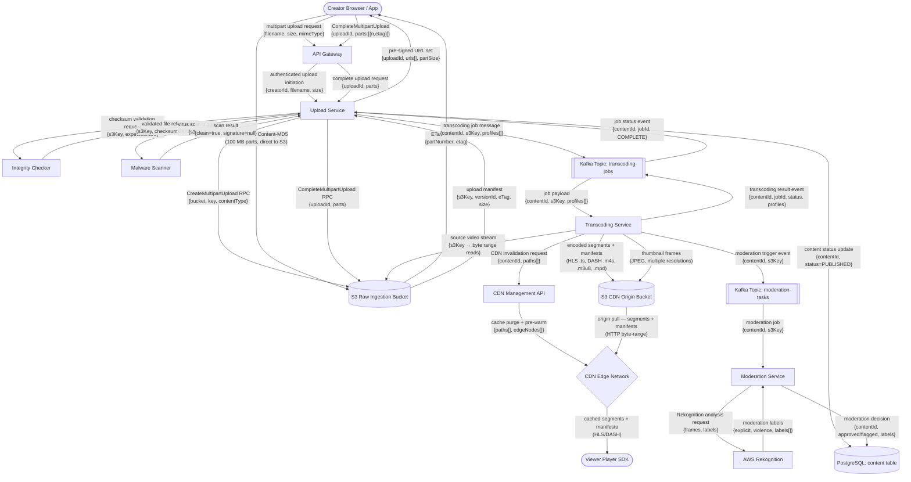
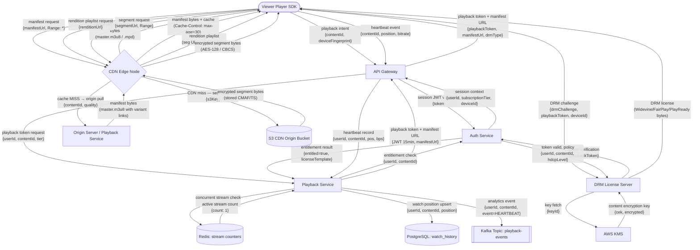
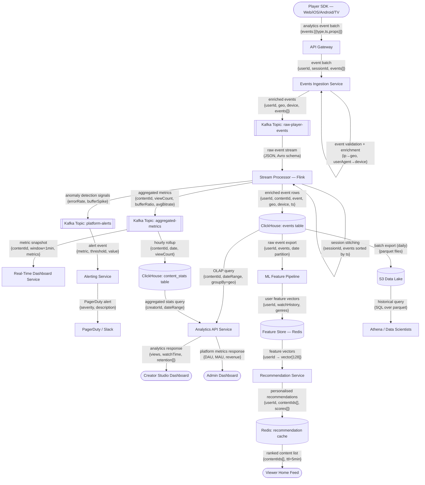

# Data Flow Diagrams

This document presents three data flow diagrams (DFDs) that trace the movement of data through
the Video Streaming Platform's major processing pipelines. Each diagram uses Mermaid flowchart
notation with labelled edges indicating the type of data in transit.

---

## Video Upload Pipeline

This DFD covers the path of a raw video file from the creator's browser or native app through
ingestion, validation, transcoding, packaging, and final CDN delivery as a streamable asset.

### Upload Pipeline — Node Reference

| Node | Description |
|---|---|
| Creator Browser / App | Web browser or native mobile app running the Creator Studio |
| API Gateway | Kong-based gateway handling auth validation and routing |
| Upload Service | Go microservice orchestrating S3 multipart lifecycle |
| S3 Raw Ingestion Bucket | Durable storage for original video files pre-transcoding |
| Integrity Checker | In-process component validating MD5/SHA-256 checksums |
| Malware Scanner | ClamAV sidecar performing virus/malware detection |
| Kafka: transcoding-jobs | Topic consumed by Transcoding Service workers |
| Transcoding Service | FFmpeg workers producing all renditions in parallel |
| S3 CDN Origin Bucket | Stores encoded segments, manifests, and thumbnails |
| CDN Management API | Cloudflare/Akamai API for cache invalidation and pre-warming |
| CDN Edge Network | Global edge nodes caching and delivering segments to viewers |
| PostgreSQL: content table | Authoritative store for content status and metadata |
| Kafka: moderation-tasks | Topic consumed by the Moderation Service |
| Moderation Service | Python service orchestrating Rekognition analysis |
| AWS Rekognition | Managed ML API for explicit content and violence detection |
| Viewer Player SDK | Client-side adaptive player consuming HLS/DASH streams |

### Upload Pipeline — Data Flow Commentary

The upload pipeline is designed to minimise API Gateway involvement in the transfer of raw bytes.
Pre-signed S3 URLs route each 100 MB chunk directly from the creator's client to the S3 Raw
Ingestion Bucket, keeping the API Gateway free for metadata and control-plane traffic only. The
Upload Service never receives the video bytes itself; it only orchestrates the multipart lifecycle
using the AWS SDK.

Once the multipart upload is complete, the Upload Service performs two gatekeeping checks before
allowing transcoding to proceed: MD5/SHA-256 checksum validation (comparing the value provided by
the creator client against the assembled object in S3) and a ClamAV-backed malware scan running
in a sidecar container. Both must pass before the transcoding job message is published to Kafka.
This prevents malicious payloads from entering the transcoding pipeline and wasting compute
resources.

The transcoding result flows back through Kafka rather than a direct HTTP callback to maintain
loose coupling between the Transcoding Service and the Upload Service. The PostgreSQL content
table is updated only after a `TRANSCODING_COMPLETE` event is consumed, ensuring that the content
status reflects the actual readiness of segments on CDN. The concurrent moderation trigger ensures
that inappropriate content is flagged before it accumulates viewership — Rekognition analysis
typically completes within 60–90 seconds of a video being published.

---

## CDN Delivery and Playback

This DFD traces the journey of a playback request from the viewer's player through CDN edge
resolution, DRM license acquisition, origin fallback, and encrypted segment delivery.

### CDN Delivery — Node Reference

| Node | Description |
|---|---|
| Viewer Player SDK | Browser or native player initiating playback |
| API Gateway | JWT validation and routing gateway |
| Auth Service | Session validation and entitlement resolution |
| Playback Service | Playback token issuance and heartbeat recording |
| Redis: stream counters | Concurrent stream count per subscription |
| CDN Edge Node | Cloudflare/Akamai edge serving cached assets |
| Origin Server / Playback Service | Origin pull handler for cache misses |
| DRM License Server | Widevine/FairPlay/PlayReady license issuance |
| AWS KMS | Content Encryption Key retrieval and management |
| S3 CDN Origin Bucket | Authoritative source for encoded segments |
| PostgreSQL: watch_history | Durable store for watch position per user |
| Kafka: playback-events | Analytics event stream from the playback path |

### CDN Delivery Flow — Data Flow Commentary

The CDN layer is the primary throughput amplifier of the platform. Segment requests are served
entirely from Cloudflare or Akamai edge nodes in the steady state, with the S3 CDN Origin Bucket
only serving as the authoritative source on cache misses. CDN cache hit rates for popular content
exceed 95% during peak hours due to pre-warming at publish time and the long cache TTL of immutable
segment files (set to `Cache-Control: public, max-age=31536000, immutable`). Only manifests and
live playlists have short TTLs due to their dynamic nature.

The DRM license request is deliberately not routed through the CDN. Licenses contain per-user,
per-device cryptographic material and must never be cached at a shared edge node. The DRM License
Server makes a synchronous call to AWS KMS to retrieve the Content Encryption Key (CEK) for each
license, ensuring key management policies (key rotation, revocation) are enforced at issuance time.
KMS responses are cached in-process for the duration of a single license request batch to reduce
round-trip latency, but the cache is never persisted to disk or shared between instances.

Watch position is persisted to PostgreSQL after every heartbeat to enable cross-device resume.
The database write is non-blocking from the viewer's perspective: the Playback Service acknowledges
the heartbeat immediately and persists the position asynchronously via a short-lived in-process
queue. This means up to 30 seconds of watch progress may be lost on an abnormal disconnect — an
acceptable trade-off given the latency benefit. Full analytics events (bitrate changes, buffering
events, errors) are published to Kafka for downstream processing in the Analytics Pipeline.

---

## Analytics Event Pipeline

This DFD traces player-generated events from the client SDK through the streaming event bus to
stream processors, a time-series analytical database, and real-time dashboards.

### Analytics Pipeline — Node Reference

| Node | Description |
|---|---|
| Player SDK | Web/iOS/Android/TV client batching and transmitting events |
| API Gateway | Routes events to ingestion service after auth |
| Events Ingestion Service | Validates, enriches, and publishes events to Kafka |
| Kafka: raw-player-events | High-throughput topic for all raw player telemetry |
| Stream Processor (Flink) | Windowed aggregation, session stitching, anomaly detection |
| Kafka: aggregated-metrics | Per-minute rollup metrics topic |
| Kafka: platform-alerts | Real-time anomaly and threshold alert topic |
| ClickHouse: events table | Append-only raw event store for OLAP queries |
| ClickHouse: content_stats | Pre-aggregated content statistics table |
| Real-Time Dashboard Service | Serves live metrics to Creator Studio and Admin dashboards |
| Alerting Service | Routes alert events to PagerDuty / Slack |
| Analytics API Service | REST API serving dashboard queries against ClickHouse |
| Creator Studio Dashboard | Creator-facing analytics: views, watch time, revenue |
| Admin Dashboard | Platform-level KPIs: DAU, MAU, revenue, error rates |
| ML Feature Pipeline | Daily batch job computing user feature vectors |
| Feature Store (Redis) | Low-latency feature vector store for recommendation serving |
| Recommendation Service | Two-tower neural network ranking service |
| Redis: recommendation cache | Per-user recommendation result cache (5-min TTL) |
| Viewer Home Feed | Client UI rendering personalised recommendations |
| S3 Data Lake | Long-term Parquet archive for analyst and ML workloads |
| Athena / Data Scientists | Ad-hoc SQL queries and exploratory analysis on archived data |

### Analytics Pipeline — Data Flow Commentary

The analytics pipeline is intentionally decoupled from the playback path using an event-driven
architecture. The Player SDK batches events locally (up to 20 events or 10 seconds, whichever
comes first) and delivers them in a single compressed POST to the Events Ingestion Service. This
batching strategy reduces the per-viewer API call rate from ~100 events/minute to ~6 API calls/minute
without sacrificing data granularity. The Events Ingestion Service validates each event against an
Avro schema (preventing malformed data from polluting the pipeline), enriches it with server-side
context (GeoIP lookup, user-agent parsing), and publishes to Kafka.

Apache Flink consumes the raw event stream and performs windowed aggregations: per-minute view
counts, buffering ratios, average bitrate distributions, and error rates are computed over 1-minute
tumbling windows and published to the `aggregated-metrics` Kafka topic. Flink also performs session
stitching — correlating events with the same `sessionId` across Kafka partitions to reconstruct
complete viewing sessions — and emits anomaly signals when error rates exceed adaptive thresholds.
ClickHouse receives both the raw enriched events (for ad-hoc OLAP queries) and the hourly rollup
summaries (for fast creator dashboard queries), with data replicated across three shards for
query parallelism.

The ML Feature Pipeline runs as a daily batch job that exports raw events from ClickHouse to the
S3 Data Lake in Parquet format, computes user feature vectors (watch history embeddings, genre
affinity scores, time-of-day patterns), and writes them to the Feature Store (Redis). The
Recommendation Service reads these feature vectors at query time to rank candidate content items
using a two-tower neural network model served via TensorFlow Serving. Recommendation results are
cached in Redis with a 5-minute TTL to absorb the burst of concurrent home-feed requests at
session start without overwhelming the model server.

### Analytics Pipeline — Failure Handling and Guarantees

The analytics pipeline is designed for at-least-once delivery with idempotent consumers. Kafka
partitions are configured with a replication factor of 3 and `min.insync.replicas=2`, ensuring
no event is lost if a single broker fails. Flink checkpoints state to S3 every 60 seconds;
in the event of a Flink job failure, it recovers from the last checkpoint and re-processes events
from the corresponding Kafka offsets. ClickHouse ingestion uses a `ReplacingMergeTree` engine
for the `events` table, which deduplicates rows with the same event ID during background merges,
converting at-least-once delivery to effectively-once semantics in the analytical database.

The S3 Data Lake acts as the ultimate fallback: because all raw events are archived as Parquet
files partitioned by `year/month/day/hour`, any portion of the ClickHouse event table can be
reconstructed from the lake using a one-time Spark or Athena-to-ClickHouse backfill job. This
means a ClickHouse hardware failure, an accidental table drop, or a schema migration error can
be recovered without data loss, only with a delay proportional to the backfill scan duration.

### Data Type Glossary

| Label | Format | Description |
|---|---|---|
| multipart upload request | JSON (REST) | filename, size, mimeType, metadata fields |
| chunk bytes + Content-MD5 | Binary + HTTP header | Raw video bytes for a single 100 MB upload part |
| ETag per part | JSON | S3-assigned entity tag for checksum verification |
| transcoding job message | Avro | contentId, s3Key, requested profile list |
| encoded segments + manifests | Binary + XML/M3U8 | HLS .ts/.m4s, DASH .m4s, .m3u8/.mpd manifest files |
| analytics event batch | JSON (compressed) | Up to 20 player events per POST, gzip-compressed |
| enriched events | Avro | Original event + server-side geo, device, timestamp |
| aggregated metrics | Avro | Per-minute rollup: viewCount, bufferRatio, avgBitrate |
| feature vectors | Binary (Float32 array) | 128-dimensional user preference embedding |

---

## Security Considerations for Data in Transit

All data flows between services — whether synchronous REST/gRPC calls or Kafka messages — are
encrypted in transit using TLS 1.2 or higher. Kafka topics containing personally identifiable
information (PII) such as `raw-player-events` use field-level encryption: the `userId` and
`sessionId` fields are encrypted with an AWS KMS data key before the message is published. Only
authorised consumers (verified via AWS IAM policies on the MSK cluster) can request the decryption
key. This ensures that even if Kafka broker storage is accessed by an unauthorised party, PII
cannot be reconstructed without the KMS key.

Video segments stored in S3 are encrypted at rest using AWS SSE-S3 (AES-256 bucket-level
encryption) for the CDN Origin Bucket. The Raw Ingestion Bucket uses SSE-KMS with a customer-managed
key, providing an audit trail of every decrypt operation via CloudTrail. Encoded segments are
additionally protected at the application layer by DRM encryption (CENC for MPEG-DASH, FairPlay
Sample Encryption for HLS), meaning double encryption is in effect during transit from S3 to the
CDN — the CDN caches and serves the already-DRM-encrypted bytes without ever seeing plaintext
content.
