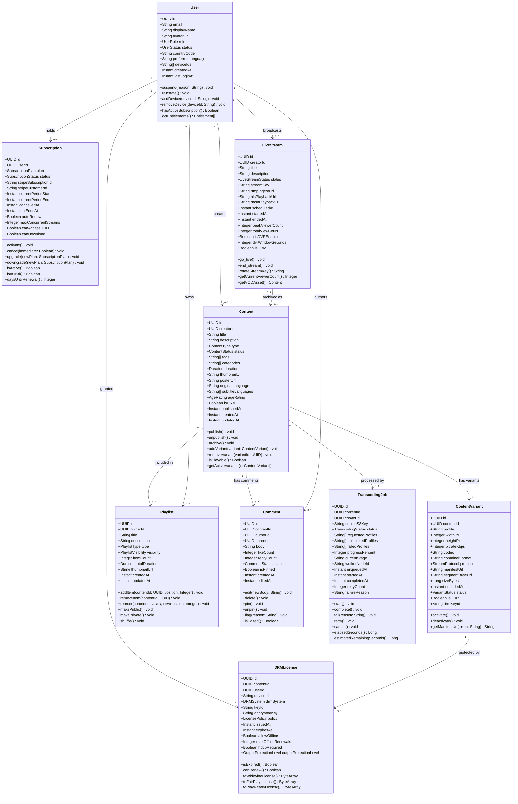

# Domain Model

This document defines the core domain model for the Video Streaming Platform. It captures the
essential entities, their attributes, behaviours, inter-entity relationships, and the invariants
that must hold at all times to maintain system integrity.

---

## Class Diagram

---

## Entity Narratives

### Content

Content is the central aggregate of the platform. It represents any piece of media — a movie,
a TV episode, a short clip, a music video, or a podcast — that can be played by a viewer. A
Content record is created when a creator initiates an upload and persists through the full
lifecycle: `DRAFT → PROCESSING → PUBLISHED → ARCHIVED`. The `status` field governs playback
eligibility: only `PUBLISHED` content can be streamed.

**Invariants:** Content must always have at least one active `ContentVariant` before transitioning
to `PUBLISHED`. The `duration` field is set by the Transcoding Service upon job completion and
is immutable thereafter. `ageRating` must be set before publication; it defaults to `UNRATED`
which restricts access to authenticated adults only. The `isDRM` flag, once set to `true` on a
published item, cannot be reversed without archiving and re-publishing to prevent policy bypass.

### ContentVariant

A ContentVariant represents a single encoded rendition of a Content item — e.g., the 1080p H.264
HLS variant or the 4K HEVC DASH variant. Each variant has its own manifest URL, segment base URL,
and optional DRM key ID. The `profile` field uses canonical names (`360p`, `480p`, `720p`, `1080p`,
`2160p`, `audio_only`) that the Player SDK uses for ABR ladder construction.

Variants transition from `ENCODING → READY → ACTIVE` — only `ACTIVE` variants appear in the
master manifest. A variant can be `DEACTIVATED` (e.g., if a specific codec is deprecated) without
affecting other renditions. The `drmKeyId` links to the key management system (AWS KMS) and is
never stored in plaintext in the database.

### User

User captures both viewers and creators. The `role` field (`VIEWER`, `CREATOR`, `MODERATOR`,
`ADMIN`) determines which API endpoints are accessible. A user account transitions through
`ACTIVE → SUSPENDED → DELETED` states. Deletion is soft: the record is anonymised (email hashed,
display name replaced with "Deleted User") but retained for compliance and audit purposes for
90 days, after which a background job removes PII fields. The `deviceIds` list is capped at 10
per user to limit credential sharing; exceeding this limit triggers a security alert.

### Subscription

Subscription owns the billing relationship with Stripe. It is a bounded context that crosses into
the payment domain. The `plan` field maps to a Stripe Price ID (`FREE`, `STANDARD`, `PREMIUM`,
`FAMILY`). When a subscription is cancelled with `immediate=false`, the status transitions to
`CANCELLING` and content access continues until `currentPeriodEnd`. The `maxConcurrentStreams`
attribute is enforced by the Playback Service at token issuance time using a Redis counter keyed
on `{subscriptionId}:active_streams`. Downgrading a plan is effective at the next renewal cycle;
upgrading is effective immediately with prorated billing.

### LiveStream

LiveStream models real-time broadcast sessions. Unlike Content, a LiveStream has a point-in-time
lifecycle (`SCHEDULED → LIVE → ENDED`) and cannot be re-entered once ended. The `streamKey` is
a cryptographically random 256-bit value, HMAC-signed with a per-creator secret, allowing the
RTMP Ingest Service to verify it without a round-trip to the database on every packet.

When `isDVREnabled` is true, all segments are archived to S3 throughout the broadcast. On stream
end, the system automatically synthesises a `Content` record (type `LIVE_REPLAY`) linked back to
this LiveStream, making the recording immediately available for on-demand playback. `peakViewerCount`
is updated every 30 seconds by the Real-Time Analytics Service from a Redis HyperLogLog counter.

### Playlist

Playlist is an ordered, user-curated collection of Content items. The `type` field distinguishes
`WATCH_LATER`, `LIKED_VIDEOS`, `CUSTOM`, and `CHANNEL` playlists. `WATCH_LATER` and `LIKED_VIDEOS`
are system-managed singletons created automatically for every user. `CHANNEL` playlists are owned
by creators and appear on their public profile pages. Item ordering is stored as a fractional index
(a gap-encoded float) to enable O(1) reordering without updating all sibling positions.

### Comment

Comment supports threaded discussion with one level of nesting (top-level comments and replies).
`parentId` is null for top-level comments and set to the parent comment's ID for replies. Nested
replies are not permitted — replies to replies are re-attached to the top-level parent. The `body`
field is stored as-is after passing through the Moderation Service (AWS Rekognition text moderation
plus a custom profanity filter). Comments in `PENDING_REVIEW` status are visible to their author
but hidden from other users. `isPinned` is exclusive: pinning a new comment automatically unpins
the previously pinned comment on the same Content.

### DRMLicense

DRMLicense represents an issued DRM license for a specific (content, user, device) tuple. The
platform supports Widevine (L1/L3), FairPlay, and PlayReady — the `drmSystem` field selects the
serialization format used by `toWidevineLicense()` et al. `LicensePolicy` is a value object
encoding playback rules: HDCP level, resolution cap, offline playback rights, and output protection
level. Licenses are never stored in cleartext; only the `keyId` (a reference to AWS KMS) and
metadata are persisted. `allowOffline` is only granted on `PREMIUM` subscriptions, and
`maxOfflineRenewals` prevents indefinite offline access after cancellation.

### TranscodingJob

TranscodingJob tracks the asynchronous encoding work associated with a Content item. The
`requestedProfiles` list is set at job creation; `completedProfiles` and `failedProfiles` are
updated as individual rendition workers finish. A job is considered complete only when all
requested profiles are either completed or have exhausted `retryCount` (max 3). The `currentStage`
field provides human-readable progress to the Creator Studio UI:
`"Uploading → Analysing → Encoding 1080p → Packaging → Publishing"`. Failed jobs emit a
`TRANSCODING_FAILED` event to Kafka, which triggers creator notification and an operations alert.

---

## Relationships Table

| Source | Relationship | Target | Multiplicity | Description |
|---|---|---|---|---|
| Content | has variants | ContentVariant | 1 to 1..* | A content item has one or more encoded renditions |
| Content | has comments | Comment | 1 to 0..* | Viewers can comment on any published content |
| Content | included in | Playlist | 0..* to 0..* | Many-to-many: content can appear in many playlists |
| Content | processed by | TranscodingJob | 1 to 0..1 | One transcoding job per content item (re-encode = new job) |
| User | holds | Subscription | 1 to 0..1 | Each user holds at most one active subscription |
| User | creates | Content | 1 to 0..* | Creator users own their uploaded content |
| User | broadcasts | LiveStream | 1 to 0..* | Creator users can run multiple live streams (sequentially) |
| User | owns | Playlist | 1 to 0..* | Users own their playlists |
| User | authors | Comment | 1 to 0..* | Each comment is authored by exactly one user |
| User | granted | DRMLicense | 1 to 0..* | A user may hold licenses for multiple content items |
| ContentVariant | protected by | DRMLicense | 1 to 0..* | Each DRM-enabled variant can yield multiple device licenses |
| LiveStream | archived as | Content | 0..1 to 0..1 | A completed live stream optionally generates a VOD record |
| Playlist | contains | Content | 0..* to 0..* | Playlist items reference content records |
| Comment | replies to | Comment | 0..* to 0..1 | Replies reference a parent comment |

---

## Domain Invariants

**Invariant 1 — Playable Content Requires Active Variants**
A Content record with `status = PUBLISHED` must have at least one `ContentVariant` with
`status = ACTIVE`. The transition to `PUBLISHED` is rejected by the domain service if this
condition is not met. This prevents manifest requests that would return empty variant lists
and cause playback failures.

**Invariant 2 — Subscription Uniqueness**
A User must not hold more than one `Subscription` with `status IN (ACTIVE, TRIALLING, CANCELLING)`
at any given time. Before activating a new subscription, any existing active subscription must
be fully cancelled. This is enforced at the domain service level with an optimistic lock on
the user's subscription record.

**Invariant 3 — DRM Key Immutability**
Once a `ContentVariant` has been activated with a `drmKeyId`, that key ID cannot be changed.
Changing the encryption key would invalidate all previously issued `DRMLicense` records, causing
playback failures for users with cached licenses. To rotate keys, the variant must be deactivated
and a new variant created with the new key.

**Invariant 4 — Live Stream Single Concurrency**
A Creator may have at most one `LiveStream` with `status = LIVE` at any point in time. Attempting
to go live while another stream is active raises a domain exception. Multiple `SCHEDULED` streams
are permitted, but the RTMP Ingest Service will reject a second simultaneous connection for the
same creator.

**Invariant 5 — Comment Nesting Depth**
Comments are limited to a nesting depth of one (top-level comment + replies). A `Comment` with a
non-null `parentId` must reference a comment whose own `parentId` is null. The domain model
enforces this on `addReply()`: if the target comment is itself a reply, the new comment is
silently re-parented to the top-level comment. This simplifies the client rendering model and
prevents unbounded tree depth.

**Invariant 6 — Transcoding Job Terminal States**
A `TranscodingJob` in status `COMPLETED` or `CANCELLED` is immutable. No state transitions are
permitted from these terminal states. A re-encode request creates a new `TranscodingJob` record;
the previous job record is retained for audit. This preserves a complete encoding history for
each content item.

**Invariant 7 — Subscription Period Consistency**
The `currentPeriodEnd` of a `Subscription` must always be greater than `currentPeriodStart`.
On upgrade, the new period starts immediately; on downgrade, the existing period end is preserved.
This invariant is validated by the domain service before persisting any billing event to prevent
Stripe webhook processing bugs from creating logically inconsistent subscription windows.
