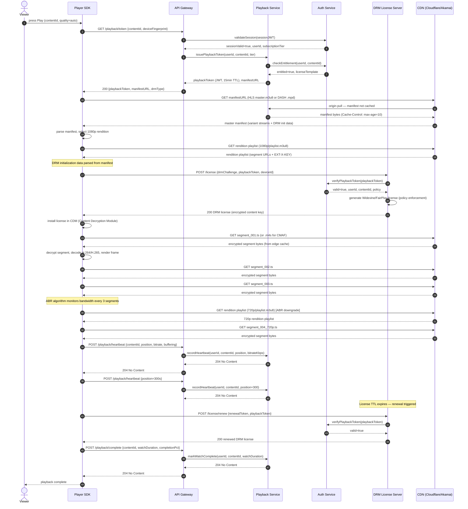
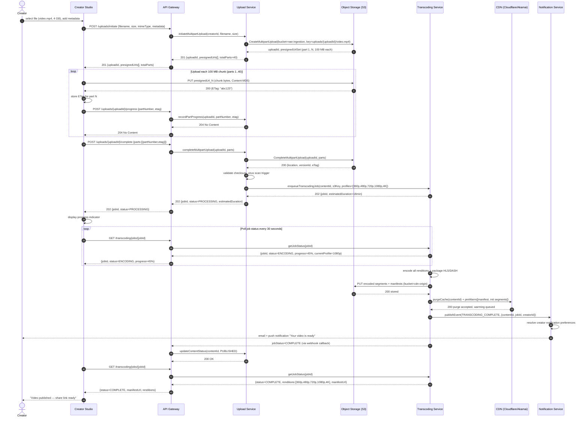
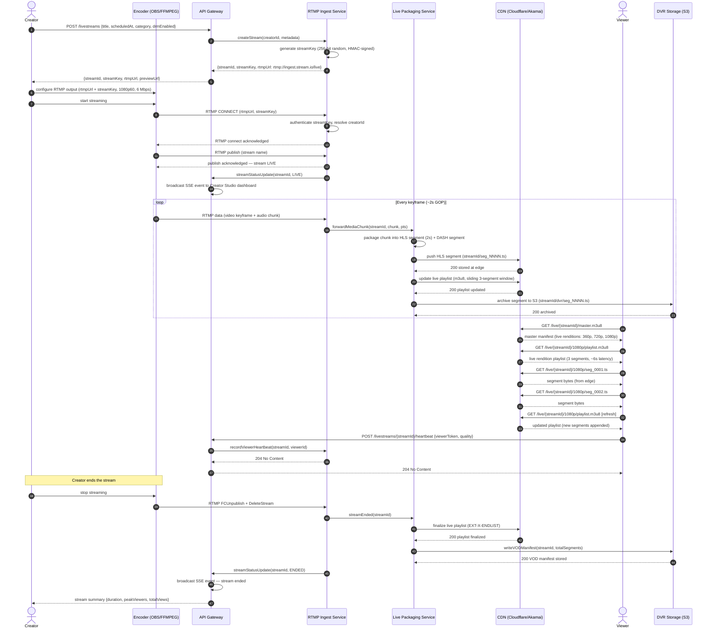

# System Sequence Diagrams

This document captures the most critical runtime interactions in the Video Streaming Platform using
UML-style sequence diagrams rendered in Mermaid. Three scenarios are covered: authenticated video
playback protected by DRM, the creator upload-and-transcoding pipeline, and live stream setup with
real-time broadcast delivery.

---

## Video Playback with DRM

The following diagram traces every interaction from the moment a viewer presses **Play** through
license acquisition, manifest resolution, and adaptive bitrate segment delivery via CDN.

### Playback Flow — Design Rationale

The playback token architecture decouples authentication from DRM licensing. The API Gateway
validates the user's long-lived session JWT and then delegates to the Playback Service to mint a
short-lived (15-minute) playback token scoped to a specific content item and device. This limits
the blast radius of a stolen session: even if a playback token is intercepted, it cannot be used
to access other content or generate new tokens.

DRM license acquisition occurs after the manifest is fetched so that the Player SDK has the precise
DRM system identifier (Widevine, FairPlay, or PlayReady) and initialization data embedded in the
manifest. The DRM License Server re-validates the playback token on every license request — it
does not cache the entitlement check — ensuring that a subscriber who cancels mid-stream loses
license renewal on the next TTL expiry, typically within 10–15 minutes, without requiring active
session revocation.

Heartbeat events serve dual purposes: they feed the resume-position feature (so viewers can pick
up where they left off on any device) and provide real-time engagement telemetry to the Analytics
pipeline. The 30-second heartbeat interval is a deliberate balance between data granularity and
API Gateway load; the interval is configurable per subscription tier, with premium subscribers
receiving 10-second granularity for richer analytics.

### Playback — Failure Modes and Fallbacks

Several failure paths are handled gracefully in this flow:

- **DRM License Server unavailable:** The Player SDK retries license acquisition three times
  with 1-second exponential backoff before surfacing an error to the viewer. The Playback
  Service returns a distinct `503 DRM_UNAVAILABLE` error code that the player renders as a
  specific user message rather than a generic error, preserving user trust.
- **CDN segment unavailability:** When a segment request to the CDN returns a 404 or 5xx, the
  Player SDK falls back to the origin URL embedded in the manifest as an `EXT-X-MAP` alternative.
  This origin fallback URL routes through the API Gateway to the Streaming Service, which proxies
  the segment directly from S3. This path is significantly slower but prevents complete playback
  failure during CDN incidents.
- **Heartbeat loss:** Heartbeat failures are silently swallowed by the Player SDK — the viewer
  is never informed of a failed heartbeat. The last successfully acknowledged position is used
  for resume. If all heartbeats in a session fail (e.g., complete backend outage), the player
  stores the position in localStorage and syncs it on next app launch.
- **Concurrent stream limit exceeded:** When the Playback Service detects that the subscriber's
  concurrent stream limit is reached (checked via the Redis counter), it returns `403
  CONCURRENT_LIMIT_EXCEEDED`. The Player SDK displays a stream management prompt allowing the
  viewer to terminate another active session before retrying. This UX avoids frustrating the
  viewer with an opaque error and preserves the subscription service's session count accuracy.

---

## Video Upload and Transcoding Pipeline

This diagram covers the creator's journey from selecting a file in Creator Studio to a fully
transcoded, CDN-distributed video asset with viewer notification.

### Upload and Transcoding Flow — Design Rationale

Multipart upload to S3 pre-signed URLs bypasses the API Gateway for the raw video bytes,
eliminating a bottleneck that would otherwise require the gateway to proxy gigabytes of binary
data. Each 100 MB chunk is uploaded directly from the browser or mobile SDK to S3, keeping API
Gateway payloads small and avoiding timeout pressure on large files. The Upload Service tracks
part ETags, which are then used to complete the S3 multipart upload atomically; if any part fails,
only that chunk is re-uploaded.

The Transcoding Service operates an asynchronous job queue backed by AWS Batch or a Kubernetes Job
controller. Rendition profiles (360p through 4K) are encoded in parallel across separate worker
pods to minimize time-to-publish. Each rendition is packaged into both HLS (TS segments or CMAF)
and MPEG-DASH manifests, enabling broad device compatibility. Thumbnail extraction, HDR tone-mapping,
and audio normalization (EBU R128) are performed as subordinate steps within the same job graph.

CDN cache pre-warming is triggered immediately after transcoding completes. The Transcoding Service
pushes the master manifest, initial segment of each rendition, and DRM initialization segments to
CDN edge nodes in the top-5 viewer geographies. This dramatically reduces the cache-miss rate for
popular content in the first minutes after publication, which is typically when traffic is highest.
The Notification Service delivers creator alerts through email (SendGrid) and push notifications
(Firebase Cloud Messaging) using a templated message that includes the video thumbnail and
direct share URL.

---

## Live Stream Setup and Broadcast

This diagram covers the full lifecycle of a live stream: key generation, RTMP ingest, adaptive
packaging, viewer delivery, DVR storage, and graceful termination.

### Live Stream Flow — Design Rationale

Stream key authentication at the RTMP layer is the first security gate. The RTMP Ingest Service
validates the HMAC-signed stream key before accepting any media data, preventing unauthorized
broadcasts on a creator's channel. Stream keys are single-use per session by default; a creator
who disconnects must generate a new key or explicitly reuse the existing one within a 30-minute
window. This guards against key replay attacks.

The Live Packaging Service operates with a 2-second segment duration to achieve approximately 6–8
seconds of end-to-end latency in standard HLS delivery. For use cases requiring lower latency
(e.g., live auctions, interactive events), Low-Latency HLS (LL-HLS) with partial segments and
blocking playlist reload is available as an opt-in configuration, reducing latency to under 3
seconds. MPEG-DASH CMAF chunked transfer is simultaneously produced for Android and Smart TV
clients that prefer it.

DVR storage is a byproduct of the live packaging loop: every segment written to the CDN edge is
also archived to S3 with a sequential index. When the stream ends, the Live Packaging Service
emits a VOD manifest (a static HLS playlist pointing to all archived segments) that is immediately
available for on-demand playback, creating a seamless "watch from the beginning" experience for
viewers who join late. The DVR window is configurable per subscription tier — free creators receive
a 2-hour DVR window while premium creators retain a full 30-day archive.
