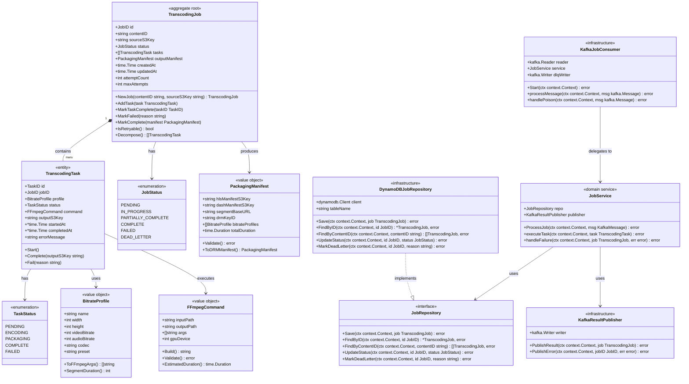
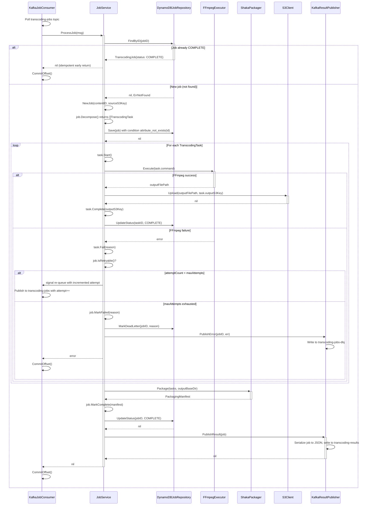
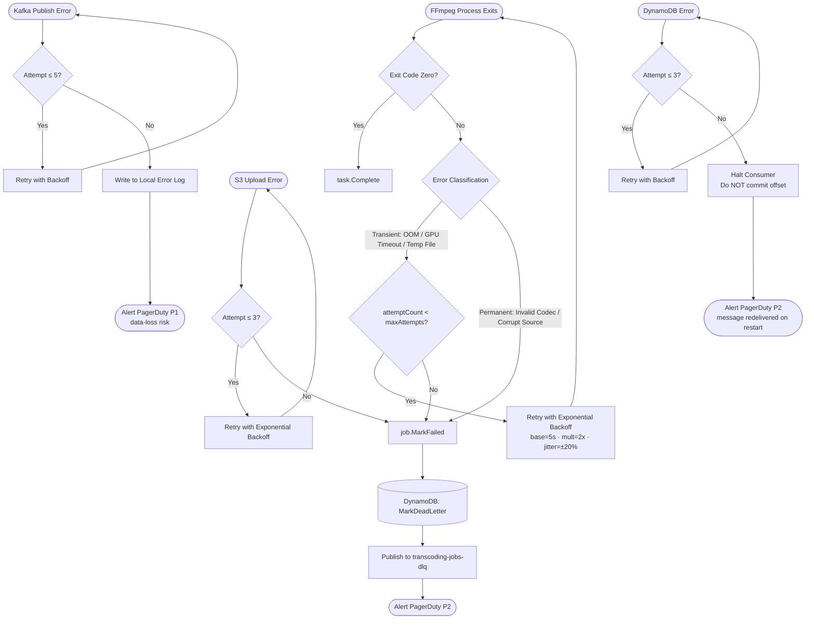

# TranscodingService — C4 Code Diagram

## TranscodingService Context

The TranscodingService is the compute-intensive backbone of the video streaming platform, positioned between the Content Ingestion API (upstream producer) and the Content Delivery API (downstream consumer). It consumes raw upload notifications from the Apache Kafka topic `transcoding-jobs`, fetches source video files from S3, and transforms them into adaptive-bitrate streaming packages (HLS and DASH). Completion events are published to the `transcoding-results` topic so the Content API can mark videos as ready for playback. This is the most complex service in the platform: it orchestrates stateful, long-running GPU workloads using FFmpeg 6.x with NVIDIA NVENC hardware acceleration, encodes multiple resolutions in parallel across CUDA devices, packages output segments with Shaka Packager 3.x for CMAF compatibility and optional Widevine DRM wrapping, and persists granular job state to DynamoDB to survive process restarts mid-encoding. The entire service is implemented in Go 1.22, exploiting goroutine-based concurrency to run per-resolution encoding tasks in parallel while keeping memory overhead low.

## C4 Code Diagram — TranscodingJob Aggregate

## Interaction Flow

## Narrative: Kafka Message to Result

The `KafkaJobConsumer` is configured with `enable.auto.commit=false`, meaning Kafka offsets are committed only after `JobService.ProcessJob` returns without error. This provides an at-least-once delivery guarantee: if the service crashes mid-encoding, the same message is redelivered on restart, and any partially completed job is recovered from DynamoDB state. The offset commit is always the final operation — it happens only after the result has been durably written to both DynamoDB (`COMPLETE`) and the `transcoding-results` Kafka topic. This ordering is intentional; it is always safer to process a job twice than to lose it entirely, given that idempotency guards at the application layer prevent wasted re-processing.

Idempotency is enforced through a combination of a DynamoDB conditional write and a pre-flight status check. Each Kafka message on `transcoding-jobs` carries a `job_id` field — a UUID v4 generated at upload time by the Content Ingestion API — that becomes the DynamoDB partition key. When `ProcessJob` begins, it calls `JobRepository.FindByID`. If the record exists with status `COMPLETE`, the function returns `nil` immediately and the consumer commits the offset harmlessly. If the record exists as `IN_PROGRESS` — a crash-recovery scenario — the service resets all non-`COMPLETE` tasks to `PENDING` and resumes encoding only the failed segments. The initial `Save` uses a DynamoDB `ConditionExpression: "attribute_not_exists(id)"` to prevent two consumers (possible during a consumer-group rebalance) from racing to create the same job record.

`TranscodingJob.Decompose()` constructs one `TranscodingTask` per configured `BitrateProfile`. In production the standard set is 360p (800 kbps H.264), 480p (1500 kbps H.264), 720p (3000 kbps H.264), 1080p (6000 kbps H.264), and 4K (16000 kbps HEVC). Tasks are executed concurrently: `JobService` spawns one goroutine per task, bound by a semaphore sized to the number of available CUDA devices (typically four per node), to avoid over-subscribing GPU memory. The job's status advances to `IN_PROGRESS` immediately after `Save` and to `PARTIALLY_COMPLETE` once the first task finishes. It remains there until all tasks reach `COMPLETE`, enabling the Content API to surface partial availability — for example, 360p playback while 4K is still encoding.

`FFmpegExecutor` constructs the full FFmpeg invocation by calling `BitrateProfile.ToFFmpegArgs()`, which emits hardware-acceleration flags (`-hwaccel cuda -hwaccel_device <N> -c:v h264_nvenc`), scale filters, bitrate targets, keyframe intervals, and HLS segment output patterns. The resulting `FFmpegCommand.Build()` string is executed as an `exec.Cmd` with `stdout` and `stderr` captured and shipped to CloudWatch Logs. GPU device assignment uses a round-robin index based on the task's ordinal position in the slice returned by `Decompose()`, spreading load evenly across all NVIDIA cards on the host. Once FFmpeg exits with code zero, the output segment directory is multipart-uploaded to S3 and `task.Complete(outputS3Key)` seals the task record with a `completedAt` timestamp.

Once all tasks are `COMPLETE`, `ShakaPackager` is invoked to stitch the encoded segments into CMAF-aligned HLS and DASH manifests. Shaka Packager 3.x reads per-resolution segment files from the local working directory and writes a master HLS playlist and MPEG-DASH MPD. If DRM is enabled, the Widevine content-encryption key fetched from the key server is injected into both manifests. The resulting `PackagingManifest` captures `hlsManifestS3Key`, `dashManifestS3Key`, `drmKeyID`, and `totalDuration`. `job.MarkComplete(manifest)` stores it on the aggregate, `KafkaResultPublisher.PublishResult` serializes the completed job to JSON (content ID, manifest S3 keys, DRM key ID, duration), and writes to `transcoding-results`. The downstream Content API consumes that event and transitions the video record to status `ready`, making it available for playback.

## Key Design Decisions

### Immutable Job Identity

`TranscodingJob` is an aggregate root with an ID assigned exactly once inside `NewJob()` and never reassigned. The `JobID` type is declared as `type JobID string` — a Go typed alias that prevents accidental substitution of a `TaskID`, `ContentID`, or bare string at any repository or service call site; the compiler enforces this boundary. All state transitions are expressed as explicit methods on the aggregate (`MarkTaskComplete`, `MarkFailed`, `MarkComplete`, `IsRetryable`) rather than direct field mutation from outside the `domain` package. This encapsulation keeps all invariant enforcement local: for example, `MarkComplete` panics if called while any task is still in a non-`COMPLETE` state, making illegal state transitions impossible at runtime. The design is forward-compatible with domain events: the aggregate could accumulate events internally and expose them via an `Events() []DomainEvent` method without changing any existing caller interface.

### Task Decomposition for Independent Retry

Decomposing a job into per-resolution tasks means a failure in one encoding lane does not invalidate work already completed in others. If the 4K task fails due to a GPU out-of-memory condition while 360p, 480p, 720p, and 1080p have already succeeded, only the 4K `TranscodingTask` is retried on the next attempt — the other tasks remain in `COMPLETE` status and their segment files remain in S3. The retry skips their `FFmpegExecutor` calls entirely, avoiding the cost and time of re-encoding resolutions that were never broken. This matters operationally: 4K encoding consumes roughly 40 % of total GPU time for a feature-length film, and per-task retry avoids spending that budget on lower-resolution work that succeeded on the first attempt. Task-level status also enables partial playback availability to reach end users faster, rather than withholding all renditions until the complete job finishes.

### Idempotency via Job ID

The `job_id` UUID is generated by the Content Ingestion API at upload time and embedded in every Kafka message, meaning the identifier travels with the work item from its origin rather than being minted inside `TranscodingService`. This ensures deduplication works even if the ingestion service retries its Kafka publish — Kafka's idempotent producer prevents broker-level duplicates, but application-level duplicates can still surface during producer restarts. The DynamoDB `Save` call uses `ConditionExpression: "attribute_not_exists(id)"` so that two concurrent consumers handling the same message during a rebalance cannot both create the job record. The net result is exactly-once processing assembled from two simpler primitives: at-least-once Kafka delivery (via `enable.auto.commit=false`) combined with idempotent server-side deduplication (conditional write plus pre-flight `FindByID` check).

## Error Handling Patterns

### Dead Letter Queue

Jobs that exhaust all three attempts (`maxAttempts = 3`) without producing a valid `PackagingManifest` are moved to the `transcoding-jobs-dlq` Kafka topic via `KafkaJobConsumer.handlePoison` or the final branch of `JobService.handleFailure`. DLQ messages are serialized as JSON and carry the original raw Kafka message bytes, a human-readable failure reason string, the final attempt count, the last recorded error, and a UTC timestamp. A separate `DLQConsumer` process tails the topic, groups failures by error classification, and raises a PagerDuty P2 incident with structured context for on-call engineers. The DLQ topic is configured with a 30-day retention period so no evidence of failure is discarded before review. Once the root cause is resolved — for example, a corrupted source file is replaced by the content team — the operations team uses the `dlq-replay` CLI utility to re-inject the original messages into `transcoding-jobs` with a reset `attempt_count`, allowing normal processing to resume.

### Exponential Backoff

The retry backoff strategy uses a base delay of 5 seconds, a multiplier of 2×, and ±20 % random jitter to prevent thundering-herd effects when many jobs fail simultaneously — for instance, during a GPU driver crash that self-heals within a minute. Effective delays per attempt are approximately 5 s, 10 s, and 20 s. Backoff is implemented with `time.Sleep` in the retry loop inside `JobService.executeTask`, deliberately blocking the goroutine handling that specific task rather than using a timer channel or releasing the task back to a queue. This design deliberately holds the CUDA device index for the duration of the sleep: returning the device to the pool while the GPU driver is in a degraded state would allow a new task to acquire the same broken device and fail immediately. Backoff is scoped per task, not per job; other concurrently executing tasks for the same job continue encoding on their own goroutines and are unaffected by a sibling task's retry pause.

### Poison Pill Detection

A Kafka message is classified as a poison pill when it fails JSON deserialization or causes a panic inside `processMessage`. `KafkaJobConsumer.processMessage` is wrapped in a `defer/recover()` block that catches any panic, logs the full goroutine stack trace to CloudWatch Logs with the `panic=true` structured field, and surfaces the recovered value as a typed error. That error triggers `handlePoison`, which writes the raw Kafka message bytes directly to `transcoding-jobs-dlq` with a `x-poison=true` Kafka header, then commits the offset so the consumer does not stall permanently on the same message. Retrying a poison pill is never attempted: a message that caused a panic during deserialization will cause the same panic on every subsequent retry, producing an infinite loop of crashes. A CloudWatch custom metric `transcoding.poison_pill_count` is incremented on each occurrence; a metric alarm fires a PagerDuty P2 alert if the poison pill rate exceeds 0.1 % of total consumed messages over any 5-minute window, which indicates a systematic schema incompatibility between the producer and consumer that requires an immediate code-level fix.
