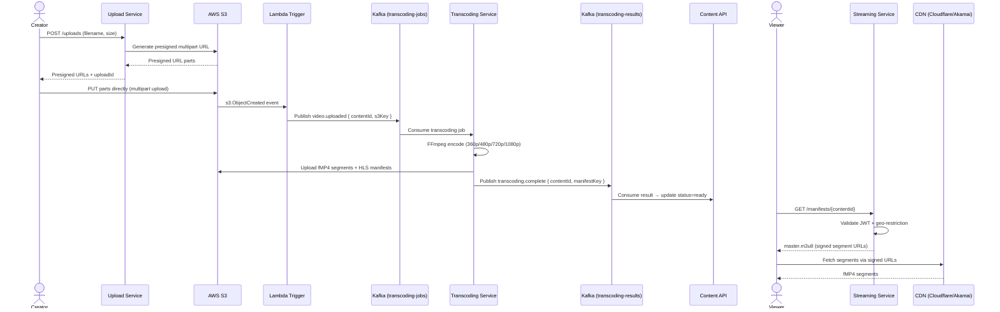
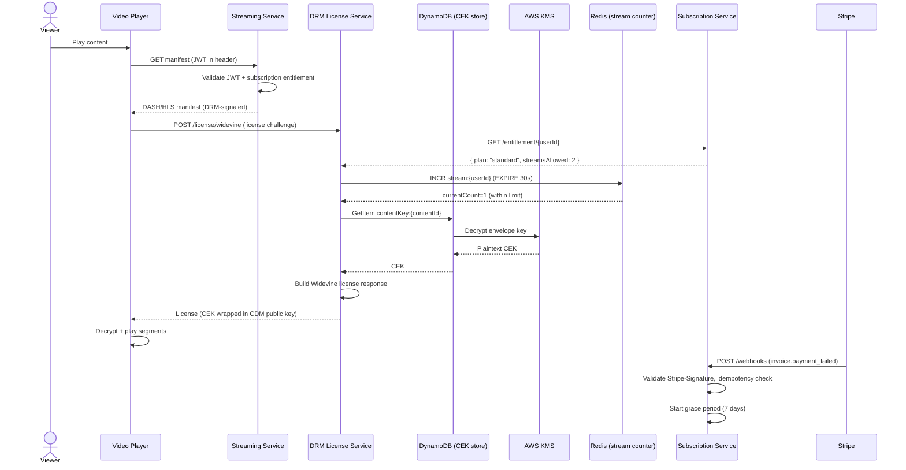
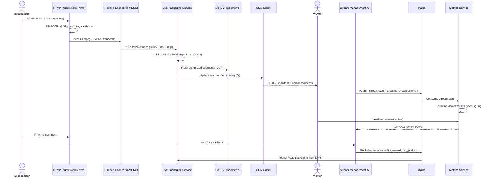
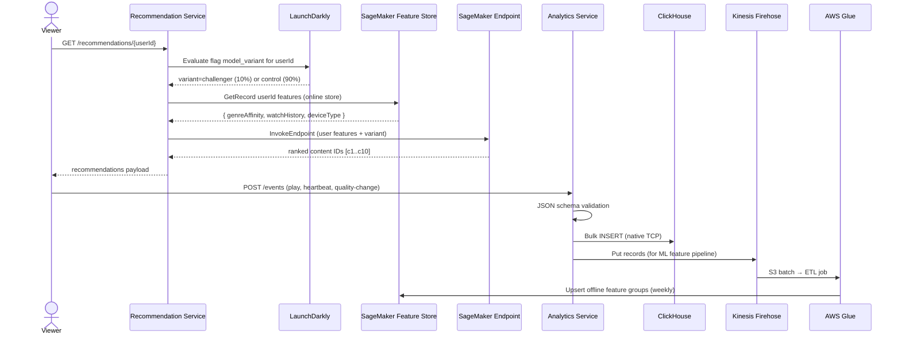
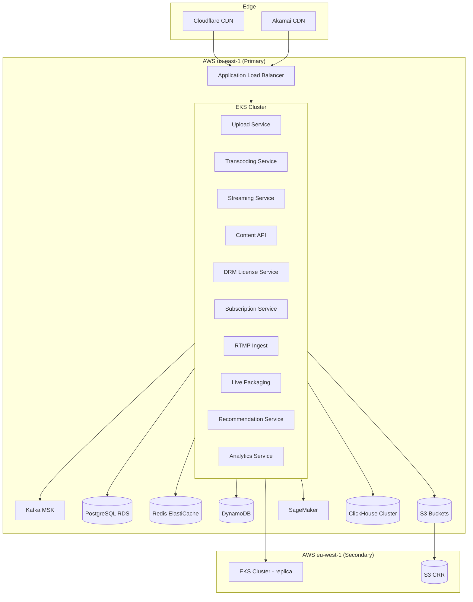

# Video Streaming Platform — Implementation Guidelines

A Netflix/YouTube-style platform delivering VOD and live streaming with DRM protection, multi-bitrate adaptive streaming, subscription billing, CDN delivery, ML recommendations, and content moderation. Deployed on AWS EKS across four incremental phases.

---

## Phase One — VOD Upload and Playback (Weeks 1–8)

### Services to Build

**Upload Service (Go 1.22)**
Generates presigned S3 URLs for direct client upload. Tracks multipart chunk state in DynamoDB so uploads are resumable across sessions. Triggers ClamAV virus scan via a Lambda invocation after the final chunk arrives. Publishes a `video.uploaded` event to the `transcoding-jobs` Kafka topic on successful scan completion.

**Transcoding Service (Go 1.22)**
Kafka consumer for the `transcoding-jobs` topic. Invokes FFmpeg to produce H.264/AAC-encoded renditions at four bitrates. Packages output into HLS using fMP4 segments with a 6-second segment duration for CMAF compatibility. Uploads segments and master/variant manifests to S3 under a content-keyed prefix. Publishes a `transcoding.complete` event to the `transcoding-results` topic.

**Streaming Service (Go 1.22)**
Serves HLS manifests with CDN-signed URL injection so segment URLs are only valid for the requesting session. Proxies segment requests through an auth-validation middleware that checks JWT claims and geo-restriction rules. Returns HTTP 451 for geo-blocked requests.

**Content API (Node.js 20 / TypeScript 5)**
CRUD for content metadata stored in PostgreSQL. Manages thumbnail assets, category/tag associations, and search powered by PostgreSQL full-text search (migrated to Elasticsearch in Phase Four). Consumes `transcoding-results` to flip content status to `ready`.

### Tech Choices and Rationale

| Component | Technology | Version | Rationale |
|---|---|---|---|
| Upload multipart | AWS SDK v2 presigned S3 + DynamoDB chunk tracking | Go SDK v2 | Atomic, resumable, no server-side streaming memory pressure |
| Transcoding worker | FFmpeg + libx264 + libfdk_aac | 6.x | Industry standard, extensive codec support, NVENC-compatible |
| HLS packaging | FFmpeg hls muxer with fMP4 segments | built-in | CMAF-compatible, HTTP/2 push ready |
| Message queue | Apache Kafka (MSK) | 3.5 | Durable, ordered, replayable, exactly-once with idempotent producer |
| Metadata DB | PostgreSQL | 15 | JSONB for flexible metadata, mature ecosystem, full-text search |
| API framework | Fiber (Go) + Express (Node.js) | Fiber 2.x / Express 4.x | High throughput for Go; rich ecosystem for Node |
| Auth | JWT RS256 + API key for service-to-service | — | Stateless, KMS-signed keys, no shared secret |

### VOD Upload and Playback Flow

### Acceptance Criteria for Phase One

| Criterion | Metric | Measurement Method |
|---|---|---|
| Upload throughput | 10 GB file uploaded in < 5 minutes | Load test with k6 |
| Transcoding speed | 1-hour 1080p content transcoded in < 30 minutes | Benchmark with sample content on g4dn.xlarge |
| HLS playback | First segment loads in < 2s | Synthetic monitoring (Checkly) |
| API latency | p99 < 200ms for metadata endpoints | k6 load test at 500 VUs |
| Availability | 99.9% uptime for Streaming Service | UptimeRobot |
| Test coverage | > 80% unit + integration coverage | `go test -cover` + Istanbul |

### Phase One Risks and Mitigations

| Risk | Probability | Impact | Mitigation |
|---|---|---|---|
| FFmpeg version incompatibility on GPU nodes | Medium | High | Pin FFmpeg version in Docker image; validate on g4dn.xlarge before rollout |
| S3 multipart upload abandonment accumulating storage cost | High | Medium | S3 lifecycle rule: abort incomplete multipart uploads after 24 hours |
| Kafka consumer lag during traffic spikes | Medium | High | Pre-provision 24 partitions from day 1; HPA on consumer-lag metric via KEDA |
| Large file upload timeout at CDN edge | Low | High | Upload Service issues presigned S3 URLs directly; uploads bypass CDN entirely |

---

## Phase Two — DRM and Subscriptions (Weeks 9–16)

### Services to Build

**DRM License Service (Go 1.22)**
Proxies Widevine license requests to Google's license server using CPIX key exchange via Shaka Packager. Handles FairPlay license requests using Apple FPS server SDK. Proxies PlayReady license requests for Windows/Smart TV clients. Stores content encryption keys (CEKs) in DynamoDB with KMS envelope encryption. Validates incoming license requests against JWT claims and subscription entitlement. Enforces concurrent stream limits using a Redis INCR/DECR counter with a 30-second heartbeat TTL.

**Subscription Service (Node.js 20 / TypeScript 5)**
Manages Stripe Customer and Subscription objects. Handles incoming Stripe webhooks via `stripe-node` with signature validation and idempotency keys stored in DynamoDB. Supports three plans (Basic: 1 stream / 1080p, Standard: 2 streams / 1080p, Premium: 4 streams / 4K). Implements 7-day grace period on payment failure before content access revocation.

**Re-packaged DRM Content**
Existing transcoded renditions are re-packaged through Shaka Packager to produce DASH with CENC encryption for Widevine/PlayReady and HLS with AES-CBC encryption for FairPlay. Manifests are updated with `<ContentProtection>` DASH elements and `#EXT-X-KEY` HLS tags pointing to the DRM License Service.

### Tech Choices and Rationale

| Component | Technology | Version | Rationale |
|---|---|---|---|
| DRM — Widevine | Google Widevine CDM License Server SDK | v18.x | Industry standard for Android/Chrome, L1/L3 hardware security |
| DRM — FairPlay | Apple FairPlay Streaming (FPS) | current | Required for all iOS/Safari/tvOS clients |
| DRM — PlayReady | Microsoft PlayReady | 4.x | Required for Windows/Xbox/Smart TV clients |
| Packaging | Shaka Packager | 3.x | Multi-DRM CMAF packaging, open source, CPIX key exchange |
| Billing | Stripe Subscriptions + Billing Portal | 2024-06-20 API | PCI DSS compliance offloaded, webhook reliability, hosted portal |
| Concurrent streams | Redis INCR/DECR with TTL | 7.x | Atomic counter, auto-expires on client disconnect |
| Key storage | DynamoDB + KMS envelope encryption | managed | Sub-10ms key retrieval, HSM-backed master key |

### DRM License and Subscription Flow

### Acceptance Criteria for Phase Two

- Widevine license issued in < 500ms p99
- FairPlay license issued in < 500ms p99
- Stripe webhook processed idempotently — validated with duplicate webhook replay tests
- Subscription state consistent within 5 seconds of Stripe event delivery
- Concurrent stream limit enforced within 2 stream-start events
- Zero plaintext content keys present in application logs or S3 objects

### Phase Two Risks and Mitigations

| Risk | Probability | Impact | Mitigation |
|---|---|---|---|
| Widevine server certificate expiry | Low | Critical | CloudWatch alarm on cert expiry; automated renewal workflow in Lambda |
| Stripe webhook replay attack | Low | High | Validate `Stripe-Signature` header; idempotency key persisted in DynamoDB |
| Content key exposure via misconfigured DynamoDB access | Low | Critical | DynamoDB accessible only via VPC endpoint; IAM resource policy; KMS envelope encryption |
| Concurrent stream bypass via client-side clock skew | Medium | Medium | Redis EXPIRE uses server-side clock; heartbeat at 30s interval enforced server-side |

---

## Phase Three — Live Streaming (Weeks 17–24)

### Services to Build

**RTMP Ingest Service (C++ nginx-rtmp / Go sidecar)**
nginx-rtmp-module handles RTMP push ingest. Stream keys are validated via HMAC-SHA256 against a per-broadcaster secret stored in DynamoDB. A Go sidecar handles key rotation and stream lifecycle events. FFmpeg is invoked inline by nginx-rtmp's `exec` directive for real-time transcoding using NVENC on GPU nodes.

**Live Packaging Service (Go 1.22)**
Consumes FFmpeg output and packages it according to Apple Low-Latency HLS (LL-HLS) spec: partial segments of 200ms, preload hints in the manifest, and chunked transfer encoding for push delivery. Parallel DASH-LL packaging for Android clients. Maintains an in-memory ring buffer for the most recent 60 seconds (< 6s latency path) and asynchronously flushes older segments to S3 for the 96-hour DVR window. Updates live manifests every 2 seconds.

**Stream Management API**
REST API for creating, starting, and stopping live streams. Exposes stream health metrics (input bitrate, dropped frames, viewer count via Redis HyperLogLog). Subscribes to RTMP disconnect events; triggers the live-to-VOD pipeline by publishing a `stream.ended` event to Kafka, which the Transcoding Service picks up to create a VOD asset from the DVR recording.

### Tech Choices and Rationale

| Component | Technology | Version | Rationale |
|---|---|---|---|
| RTMP server | nginx-rtmp-module | 1.2.x | Proven at scale, low-latency push ingest, exec hook for FFmpeg |
| Live transcoding | FFmpeg with NVENC | 6.x + CUDA 12.2 | GPU-accelerated real-time encoding at 1:1 speed ratio |
| LL-HLS packaging | Custom Go packager (segment manager) | — | Apple LL-HLS spec compliance: partial segments, preload hints |
| DVR storage | S3 + manifest rewriting | — | Infinite window; S3 lifecycle policy controls cost |
| Latency targets | 6–8s standard HLS / < 2s LL-HLS | — | LL-HLS requires chunked transfer encoding at CDN edge |
| Viewer count | Redis HyperLogLog | 7.x | Probabilistic unique-viewer counting at constant memory |

### Live Stream Ingest Flow

### Acceptance Criteria for Phase Three

- Standard HLS end-to-end playback latency: < 8 seconds
- LL-HLS end-to-end playback latency: < 2.5 seconds
- RTMP ingest: 5,000 concurrent live streams per region
- DVR window: 96-hour rewind available for all streams
- Automatic failover to backup ingest node in < 10 seconds on primary failure
- Live-to-VOD recording available < 5 minutes after stream ends

### Phase Three Risks and Mitigations

| Risk | Probability | Impact | Mitigation |
|---|---|---|---|
| GPU node exhaustion during peak live events | Medium | High | Pre-warm GPU fleet 1 hour before scheduled events; overflow to AWS MediaLive |
| Segment upload latency causing manifest staleness | Medium | High | S3 Transfer Acceleration for segment uploads; in-memory ring buffer for last 60s |
| nginx-rtmp process crash during active stream | Low | High | Health check every 5s with automatic restart; broadcaster client auto-reconnects within 15s |
| LL-HLS chunked delivery unsupported at CDN edge | High | Medium | Test on Cloudflare, Akamai, CloudFront; automatic fallback to 6s standard HLS |

---

## Phase Four — Recommendations and Analytics (Weeks 25–32)

### Services to Build

**Recommendation Service (Python 3.12)**
Calls a SageMaker real-time inference endpoint that serves a hybrid collaborative filtering (ALS matrix factorisation) + content-based embedding model. Retrieves real-time user features from SageMaker Feature Store online store (< 5ms). Routes 10% of traffic to challenger models via LaunchDarkly server-side feature flags for continuous A/B testing. Returns a ranked list of 10 content items per request.

**Analytics Service (Go 1.22)**
Receives player events (play, pause, seek, quality-change, error, heartbeat) over HTTP, validates against a JSON schema, and bulk-inserts into ClickHouse via the native TCP protocol for maximum throughput. Serves pre-aggregated dashboard queries (top content, watch-time histograms, funnel analysis, retention cohorts) with < 5s refresh for the last 24-hour window.

**ML Training Pipeline (Python 3.12)**
SageMaker Pipelines DAG: Kinesis Firehose → S3 raw events → AWS Glue ETL → SageMaker Feature Store offline store → ALS training job (ml.p3.2xlarge) → model evaluation (NDCG@10, Precision@5) → conditional promotion step (only promote if NDCG@10 improves by ≥ 1%). Runs on a weekly schedule via EventBridge. Sends training metrics to CloudWatch; PagerDuty alert if CTR drops > 10% post-promotion.

### Tech Choices and Rationale

| Component | Technology | Version | Rationale |
|---|---|---|---|
| Recommendation model | ALS collaborative filtering + content embedding | SageMaker managed | Handles cold start with content-based fallback |
| Real-time analytics | ClickHouse | 24.x | Column-store; handles 10B+ events/day at sub-second query latency |
| Feature store | SageMaker Feature Store | managed | Online (low-latency) + offline (training) in a single managed service |
| A/B testing | LaunchDarkly | current | Server-side flag evaluation, percentage rollout, metric tracking |
| Training orchestration | SageMaker Pipelines | managed | Reproducible, versioned, auditable ML workflows |
| Event ingestion | Kinesis Firehose → S3 → Glue | managed | Serverless, durable, cost-effective at high volume |

### Recommendation and Analytics Flow

### Acceptance Criteria for Phase Four

- Recommendation latency: p99 < 100ms for homepage (10 items)
- ClickHouse ingestion: sustain 50,000 events/second peak throughput
- Model quality: CTR improvement ≥ 5% over random baseline, measured via A/B test
- A/B framework: support 10 simultaneous experiments with no user bucketing collision
- Analytics dashboard: < 5-second refresh latency for last-24-hour aggregations

### Phase Four Risks and Mitigations

| Risk | Probability | Impact | Mitigation |
|---|---|---|---|
| Cold start for new users with no watch history | High | Medium | Content-based fallback using genre/tag preferences captured during onboarding |
| SageMaker endpoint cold start latency | Medium | Medium | Minimum 1 instance always warm; no scale-to-zero on inference endpoint |
| ClickHouse single-node becoming a bottleneck | Medium | High | Deploy cluster topology: 3 shards × 2 replicas from day 1 |
| ML model degradation between retraining cycles | Medium | Medium | Weekly automated retraining with metric-gated promotion; PagerDuty alert on CTR drop > 10% |

---

## Technology Stack Reference

| Layer | Technology | Version | Rationale |
|---|---|---|---|
| API Services (Go) | Go | 1.22 | Performance, low memory footprint, excellent concurrency primitives |
| API Services (Node.js) | Node.js + TypeScript | 20 LTS + 5.x | Rich ecosystem for Stripe/auth integrations; TypeScript for type safety |
| Transcoding | FFmpeg | 6.x | Industry standard; NVENC GPU acceleration support |
| DRM Packaging | Shaka Packager | 3.x | Multi-DRM CMAF packaging; open source; CPIX key exchange |
| Message Bus | Apache Kafka (MSK) | 3.5 | Durability, exactly-once delivery, replayable consumer groups |
| Primary DB | PostgreSQL | 15 | Mature ecosystem; JSONB; full-text search; row-level security |
| Cache | Redis | 7.x | Cluster mode; Lua scripting for atomic operations |
| NoSQL | DynamoDB | managed | Single-digit ms latency; serverless auto-scaling |
| ML Platform | SageMaker | managed | Managed training + inference; Feature Store; Pipelines |
| Analytics DB | ClickHouse | 24.x | Column-store; sub-second query on billions of rows |
| Container Runtime | Docker + containerd | 24.x + 1.7 | OCI-compliant; Kubernetes standard runtime |
| Orchestration | Kubernetes (EKS) | 1.29 | Managed control plane; managed node groups; Karpenter for node provisioning |
| Service Mesh | Istio | 1.21 | mTLS between services; traffic management; distributed tracing |
| CI/CD | GitHub Actions + Argo CD | current | GitOps pull-based deployment; declarative rollout strategy |
| IaC | Terraform | 1.8 | AWS provider 5.x; modular; remote state in S3 + DynamoDB locking |

### Infrastructure Topology

---

## Coding Standards

**Go services** use `golangci-lint` v1.57 with `errcheck`, `staticcheck`, `gosec`, and `revive` linters enabled. Format with `gofumpt`. Write table-driven tests and use `testify/suite` for integration test suites. Minimum 80% statement coverage enforced in CI.

**Node.js/TypeScript services** use ESLint with the `@typescript-eslint` ruleset and Prettier for formatting. Unit tests with Jest; integration tests with Supertest against a real Express app instance. Minimum 80% line coverage enforced in CI.

**Error handling**: All errors are wrapped with context using `fmt.Errorf("operation: %w", err)` in Go or a custom `AppError` class carrying `code`, `message`, and `cause` in TypeScript. Silent error swallowing is forbidden — `golangci-lint` `errcheck` enforces this in Go.

**Logging**: Structured JSON only. Go services use `slog` (stdlib); TypeScript services use `pino`. Every log entry carries `service`, `trace_id`, `request_id`, and `user_id` (when the request is authenticated). PII fields (email, name, phone) and content encryption keys must never appear in log output.

**Secrets management**: Secrets are never stored in source code or Kubernetes manifest environment variables. All secrets are injected at runtime by the External Secrets Operator, which pulls from AWS Secrets Manager and creates native Kubernetes Secrets scoped to the relevant namespace.

**API versioning**: All routes carry a `/v1/` prefix. Breaking changes (removed fields, changed types, altered semantics) require a new `/v2/` version. Additive changes (new optional fields, new endpoints) are allowed within the current version.

---

## CI/CD Pipeline

### Pipeline Stages

```mermaid
flowchart LR
    PR[PR Opened] --> Lint[Lint\ngolangci-lint / ESLint]
    Lint --> Unit[Unit Tests]
    Unit --> Build[Docker Build\nno push]
    Build --> SAST[SAST\nCodeQL]
    SAST --> Review{Approved?}

    Review -->|Yes - merge to main| IntTest[Integration Tests\nDocker Compose]
    IntTest --> MultiArch[Multi-arch Build\namd64 + arm64]
    MultiArch --> Sign[Sign Image\nSigstore cosign]
    Sign --> Push[Push to ECR]
    Push --> HelmVal[Helm Template\nValidation]
    HelmVal --> Staging[Deploy Staging]
    Staging --> Smoke[Smoke Tests\nCheckly]

    Smoke -->|Manual approval| Canary[Canary Deploy\nus-east-1 5%]
    Canary --> Analysis[Argo Rollouts\nAnalysis: error rate, p99]
    Analysis -->|Pass| Progressive[25% → 50% → 100%]
    Progressive --> Regional[Promote\neu-west-1 → ap-southeast-1]
```

**PR pipeline** target: < 5 minutes. Runs lint, unit tests, Docker build (no push), and CodeQL SAST scan.

**Main pipeline** target: < 15 minutes. Runs lint, unit tests, integration tests in a Docker Compose environment, builds multi-architecture images (linux/amd64 and linux/arm64), signs with Sigstore cosign, pushes to ECR, validates Helm templates, deploys to staging, and runs Checkly synthetic smoke tests.

**Release pipeline** requires manual approval and targets < 30 minutes end-to-end. Canary deployment at 5% in us-east-1, automated Argo Rollouts analysis on error rate and p99 latency, progressive traffic shift (25% → 50% → 100%), followed by regional promotion to eu-west-1 and ap-southeast-1.

### Delivery Targets

| Metric | Target |
|---|---|
| Deployment frequency | Multiple times per day per service |
| MTTR | < 15 minutes (Argo Rollouts rollback in < 2 minutes) |
| Change failure rate | < 5% |
| Lead time for change | < 2 hours from merge to production |

---

## Observability

Every service emits **traces** (OpenTelemetry SDK → AWS X-Ray), **metrics** (Prometheus exposition format → Amazon Managed Prometheus → Grafana), and **logs** (structured JSON → CloudWatch Logs → OpenSearch for search). The `trace_id` field links all three signals for a single request.

**Alerting thresholds** (PagerDuty):
- Streaming Service error rate > 1% over 5-minute window → P2
- DRM License Service p99 > 800ms → P2
- Kafka consumer lag on `transcoding-jobs` > 500 messages for > 2 minutes → P2
- Any service pod CrashLoopBackOff → P1
- CDN origin error rate > 0.5% → P1

**SLO definitions** are tracked as Prometheus recording rules and surfaced on a dedicated SLO dashboard. Error budget burn rate alerts fire at 2× and 5× burn rates to give advance warning before exhausting the monthly error budget.
