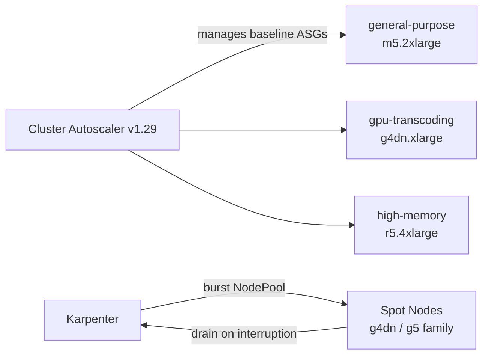
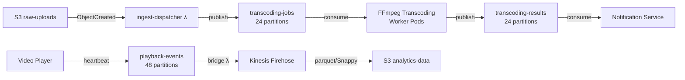
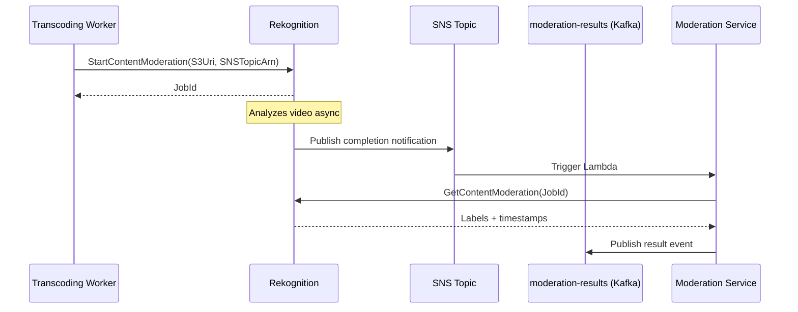
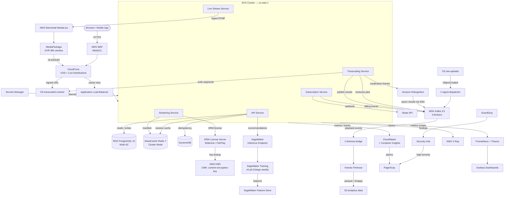

# Cloud Architecture — Video Streaming Platform

Production-grade cloud architecture for a Netflix/YouTube-style video streaming service supporting VOD, live streaming, DRM-protected delivery, ML-driven recommendations, and subscription billing at scale.

---

## Compute

### EKS Cluster

Managed control plane running Kubernetes **v1.29**, deployed across three Availability Zones in `us-east-1`. The data plane is split into three managed node groups, each with its own autoscaling policy and instance profile.

| Node Group | Instance Type | Min/Max Nodes | Purpose |
|---|---|---|---|
| general-purpose | m5.2xlarge | 3 / 30 | API services, Kafka consumers, subscription workers |
| gpu-transcoding | g4dn.xlarge | 0 / 20 | Per-stream FFmpeg transcoding, real-time encoding |
| high-memory | r5.4xlarge | 2 / 10 | Recommendation inference cache, large manifest assembly |

**Cluster Autoscaler v1.29** manages scale-in/scale-out for predictable workloads using Kubernetes node annotations. **Karpenter** acts as a secondary provisioner for burst capacity — it provisions nodes in under 60 seconds by bypassing the ASG warm-up cycle, using `NodePool` resources that target Spot capacity across `g4dn.xlarge`, `g4dn.2xlarge`, and `g5.xlarge` as substitutable instance families.

### EC2 GPU Instances

The `g4dn` family provides NVIDIA T4 GPUs with hardware H.264/HEVC encoding via NVENC. Deployment model:

- **g4dn.xlarge** (4 vCPU, 16 GB, 1× T4): per-stream real-time transcoding. Each instance handles one concurrent live stream or up to four parallel VOD segments.
- **g4dn.12xlarge** (48 vCPU, 192 GB, 4× T4): batch 4K HDR re-encode jobs. Used for catalog upgrades and initial 4K processing.

Baseline capacity (6× g4dn.xlarge) is covered by **1-year partial-upfront Reserved Instances**, providing a predictable cost floor. Burst demand is served by **EC2 Spot** via Karpenter, achieving 60–70% cost saving versus On-Demand. The transcoding worker implements a SIGTERM handler that checkpoints the current segment before the 2-minute Spot interruption window expires, then re-queues the incomplete job back to the `transcoding-jobs` Kafka topic.

### Lambda Functions

| Function | Trigger | Runtime | Memory | Timeout | Purpose |
|---|---|---|---|---|---|
| `ingest-dispatcher` | S3 `s3:ObjectCreated` on `raw-uploads` | Python 3.12 (arm64) | 256 MB | 60 s | Publishes transcoding job to Kafka `transcoding-jobs` topic |
| `thumbnail-generator` | S3 `s3:ObjectCreated` on `raw-uploads` | Python 3.12 (arm64) + ffmpeg layer | 512 MB | 30 s | Extracts keyframe thumbnails at 0s, 10s, 30s |
| `cache-invalidator` | DynamoDB Streams on `content_metadata` | Node.js 20.x (arm64) | 128 MB | 15 s | Purges CloudFront and Redis manifest cache on metadata update |
| `stripe-webhook` | API Gateway POST `/webhooks/stripe` | Python 3.12 (arm64) | 256 MB | 29 s | Validates Stripe signature, publishes to `subscription-events` |
| `firehose-bridge` | Kafka `playback-events` (MSK trigger) | Python 3.12 (arm64) | 512 MB | 60 s | Batches 500 records, forwards to Kinesis Firehose |

### Fargate for Batch Jobs

Content moderation batch scans — where Rekognition analyzes all frames of newly uploaded content — run as EKS Fargate pods. Fargate eliminates the need to provision and manage GPU or CPU nodes for infrequent workloads: a moderation scan job spins up in ~15 seconds, runs to completion, and releases all resources. This avoids the warm node provisioning overhead (3–5 minutes for a new EC2 node join) and prevents idle GPU nodes sitting unused between uploads.

### Compute Summary

| Service | Use Case | Instance / Config | Scaling | Cost Tier |
|---|---|---|---|---|
| EKS (m5.2xlarge) | API + background workers | 3–30 nodes | Cluster Autoscaler | Reserved (1yr) |
| EKS (g4dn.xlarge) | Real-time transcoding | 0–20 nodes | Karpenter Spot | Spot |
| EKS (r5.4xlarge) | High-memory services | 2–10 nodes | Cluster Autoscaler | Reserved (1yr) |
| g4dn.12xlarge | Batch 4K transcoding | On-demand fleet | Spot Fleet | Spot |
| Lambda | Event-driven functions | arm64 | Concurrency auto-scales | Per-invocation |
| Fargate | Content moderation scans | 1–20 tasks | Job queue depth | Per-vCPU/GB-hr |

---

## Storage

### S3 Buckets

| Bucket Name | Purpose | Storage Class | Lifecycle Policy | Versioning | Encryption |
|---|---|---|---|---|---|
| `raw-uploads` | Incoming creator content | Standard | Transition to Glacier after 90 days | Enabled | SSE-S3 |
| `transcoded-content` | HLS/DASH segments and playlists | Standard → Standard-IA at 30 days | Standard-IA for objects >30 days old | Disabled | SSE-S3 |
| `drm-keys` | Encrypted content key packages | Standard | None | Enabled | SSE-KMS (dedicated CMK) |
| `thumbnails` | Video preview images | Standard | None | Disabled | SSE-S3 |
| `manifests` | HLS `.m3u8` and DASH `.mpd` files | Standard | None | Disabled | SSE-S3 |
| `analytics-data` | Raw playback event logs | Intelligent-Tiering | Transition to Glacier after 365 days | Disabled | SSE-S3 |
| `ml-training` | SageMaker feature datasets | Standard-IA | None | Enabled | SSE-S3 |

### S3 Intelligent-Tiering

The `analytics-data` bucket uses **S3 Intelligent-Tiering**, which automatically moves objects between four access tiers without retrieval fees:

- **Frequent Access** (default): actively queried data from the last 30 days.
- **Infrequent Access** (after 30 days of no access): ~40% storage cost saving.
- **Archive Instant Access** (after 90 days): ~68% saving with millisecond retrieval.
- **Deep Archive Access** (after 180 days, opt-in): ~95% saving, 12-hour retrieval.

A monitoring fee of $0.0025 per 1,000 objects applies. For large parquet partitions (>128 KB average), the saving far outweighs this fee.

### Glacier Archival Strategy

Titles not accessed for **180 days** are transitioned to **Glacier Instant Retrieval** — this covers licensed back-catalog content that must remain accessible on-demand for licensing compliance but sees minimal viewership. Active retrieval latency is milliseconds. **Glacier Deep Archive** stores compliance copies of all content for 7 years, satisfying DMCA and SOC 2 retention obligations. Retrieval time for Deep Archive is 12 hours and is only triggered by legal or audit processes.

---

## Database

### RDS PostgreSQL 15

Primary instance: **db.r6g.2xlarge** (8 vCPU, 64 GB RAM) in `us-east-1` with Multi-AZ standby. Automated backups retain **35 days** of snapshots with daily full snapshots and continuous WAL archiving. **Performance Insights** is enabled with 7-day free retention (extended to 2 years via paid tier). **Enhanced Monitoring** runs at 60-second granularity, shipping OS-level metrics to CloudWatch.

Cross-region read replicas:
- `eu-west-1`: db.r6g.xlarge — serves European user reads and DRM license lookups
- `ap-southeast-1`: db.r6g.xlarge — serves Asia-Pacific reads

Schema overview:

| Table | Description |
|---|---|
| `users` | Account profiles, preferences, subscription tier |
| `subscriptions` | Stripe subscription ID, plan, billing cycle, status |
| `content_metadata` | Title, duration, tags, DRM policy ID, availability windows |
| `drm_licenses` | License server references, key rotation history |
| `upload_jobs` | Creator upload tracking, transcoding job linkage |
| `moderation_results` | Rekognition scores, human review outcomes, content flags |

Connection pooling uses **PgBouncer** in `pool_mode=transaction` with `max_client_conn=2000` and `default_pool_size=50` per database. This prevents connection exhaustion during traffic spikes — Kubernetes pods connect to PgBouncer's Service IP, not directly to RDS.

### ElastiCache Redis 7

Cluster mode enabled with **6 shards × 2 replicas = 12 nodes** across three AZs in `us-east-1`. Each node runs **cache.r6g.large** (2 vCPU, 13.07 GB). TLS in-transit enforced, at-rest encryption enabled via AWS-managed keys, automatic failover triggers in under 60 seconds.

| Keyspace Pattern | TTL | Content |
|---|---|---|
| `session:<token>` | 24 hours | Authenticated user session data |
| `drm:license:<content_id>:<user_id>` | 1 hour | Cached DRM license response |
| `manifest:<content_id>:<resolution>` | 30 seconds | Assembled HLS/DASH manifest |
| `ratelimit:<ip>:<endpoint>` | 60 seconds | Sliding window request counters |
| `rec:<user_id>` | 5 minutes | SageMaker recommendation payload |

### DynamoDB

Three tables with on-demand capacity mode:

| Table | Partition Key | Sort Key | TTL Attribute | Purpose |
|---|---|---|---|---|
| `transcoding-idempotency` | `job_id` (S) | — | `expires_at` (24h) | Prevents duplicate transcoding on Kafka redelivery |
| `api-sessions` | `session_id` (S) | — | `expires_at` (1h) | Fast session store for stateless API pods |
| `upload-chunks` | `upload_id` (S) | `chunk_number` (N) | `expires_at` (48h) | Tracks multipart upload progress for resumable uploads |

---

## Streaming Infrastructure

### MSK (Amazon Managed Kafka 3.5)

Three-broker cluster with **kafka.m5.large** per broker, one per AZ. Each broker has a **2 TB gp3 EBS volume** (provisioned at 250 MB/s throughput). MSK Connect is used for the S3 Sink Connector on the `analytics-data` path. TLS encryption in-transit between brokers and clients; SASL/SCRAM authentication for service accounts.

| Topic | Partitions | Replication Factor | Retention | Purpose |
|---|---|---|---|---|
| `transcoding-jobs` | 24 | 3 | 24 hours | Job dispatch to FFmpeg workers |
| `transcoding-results` | 24 | 3 | 24 hours | Completion and error events from workers |
| `live-stream-events` | 12 | 3 | 6 hours | Viewer join/leave, stream health heartbeats |
| `playback-events` | 48 | 3 | 7 days | Per-second analytics heartbeats from players |
| `subscription-events` | 6 | 3 | 30 days | Stripe billing lifecycle (created, renewed, cancelled) |
| `moderation-results` | 6 | 3 | 7 days | Rekognition and human review outcomes |

### Kinesis Data Firehose Analytics Pipeline

A Lambda bridge function (`firehose-bridge`) consumes from `playback-events`, batches 500 records, and puts them onto a **Kinesis Data Firehose** delivery stream. Firehose buffers records for **5 minutes** or **128 MB** (whichever comes first), converts to **Parquet** format with **Snappy compression** using an inline schema via Glue Data Catalog, and writes partitioned objects to `s3://analytics-data/playback/year=YYYY/month=MM/day=DD/`. A **Glue Crawler** runs every 30 minutes to update the Athena table catalog, enabling ad-hoc SQL queries on fresh playback data with less than 10-minute end-to-end latency.

---

## CDN and Media Services

### CloudFront

Two distributions with separate origins and cache behaviors:

**VOD Distribution** — Origin: `transcoded-content` S3 bucket with **Origin Access Control (OAC)**. No public bucket policy; all access flows through CloudFront's service principal.

**Live Distribution** — Origin: internal Application Load Balancer fronting the live streaming service pods. HTTP/2 and HTTP/3 (QUIC) enabled.

Cache behaviors:

| Path Pattern | TTL | Notes |
|---|---|---|
| `*.m3u8` | 2 seconds | Short TTL keeps live manifests fresh |
| `*.ts`, `*.m4s` | 86,400 seconds | Immutable segments cached at edge for 24h |
| `*.mpd` | 2 seconds | DASH manifest same as HLS |
| `/api/*` | 0 seconds | API requests never cached |

**Signed URLs** protect individual VOD asset requests for authenticated users (48-hour expiry). **Signed Cookies** are used for multi-segment playlist access where signing every segment URL would be impractical. **Lambda@Edge** functions run on `viewer-request` for two purposes: manifest URL rewriting (injecting user-specific DRM tokens into manifest responses) and geo-restriction enforcement beyond what CloudFront's native geo-blocking supports.

**Akamai** is configured as a secondary CDN via a DNS-based failover policy in Route 53: if CloudFront health checks fail for 60 seconds, Route 53 weighted routing shifts 100% of traffic to Akamai within one DNS TTL.

### AWS Elemental MediaConvert

Overflow transcoding path when EKS GPU nodes are unavailable or queue depth on `transcoding-jobs` exceeds 500 messages. Jobs are submitted via the MediaConvert API by the transcoding orchestrator service.

| Queue | Priority | Use Case |
|---|---|---|
| `live-clip-capture` | High (50) | Near-real-time live clip extraction |
| `vod-standard` | Normal (25) | Standard VOD transcoding |
| `reencode-batch` | Low (5) | Quality upgrade re-encodes for catalog |

Output presets mirror the FFmpeg ABR ladder: 360p/500kbps, 480p/1000kbps, 720p/2500kbps, 1080p/5000kbps, 1440p/8000kbps, 2160p/16000kbps (H.264 for compatibility, HEVC for 4K).

### AWS Elemental MediaLive

Live encoding fallback path activated when the primary `nginx-rtmp` + FFmpeg pipeline reports unhealthy (three consecutive health check failures). MediaLive channels use **STANDARD input class** (two parallel pipelines for redundancy). **MediaPackage** provides DVR with a **96-hour sliding window**, enabling viewers to seek back into live broadcasts. HLS and DASH packaging outputs are delivered to the Live CloudFront distribution. Channel input failover automatically switches between pipelines within 3 seconds on pipeline failure.

---

## AI and ML Services

### Amazon Rekognition

**Content Moderation**: `detectModerationLabels` runs on all uploaded thumbnails immediately after upload and on video frames sampled at **1 FPS** during transcoding. Frames are extracted by the FFmpeg worker, uploaded to a processing prefix in S3, and analyzed asynchronously. Results arrive via **SNS notification** to the `moderation-results` Kafka topic. Videos with a moderation confidence score above 80 are held for human review; above 95 are auto-rejected.

**Face Detection and Celebrity Recognition**: Run post-moderation on approved content. Celebrity recognition enriches `content_metadata` with cast data for search and recommendations. Face detection enables chapter thumbnails showing recognizable cast members.

Asynchronous video analysis flow:

### Amazon SageMaker

**Recommendation Model**: A weekly scheduled **SageMaker Pipeline** retrains on user-content interaction features from the **SageMaker Feature Store**. Training runs on `ml.p3.2xlarge` instances using an **XGBoost + collaborative filtering** ensemble. The trained model artifact is stored in `s3://ml-training/models/recommendations/` and deployed to a **real-time inference endpoint** (`ml.m5.xlarge`, auto-scaling 1–10 instances, target 70% CPU utilization). The endpoint is called synchronously by the API service; results are cached in Redis under `rec:<user_id>` for 5 minutes.

**Feature Store**: Online store serves real-time feature lookups (last-watched genre, average session duration, device type). Offline store syncs to S3 for batch training jobs.

### Amazon Comprehend

**Comment Moderation**: All user-submitted comments pass through `detectSentiment` and `detectToxicContent`. Comments scoring above the toxicity threshold are held in a review queue; severe violations are auto-rejected with a user notification. **Language Detection** (`detectDominantLanguage`) runs on comments and user profile data to auto-select subtitle tracks. A **custom entity recognizer** model trained on brand safety guidelines flags mentions of competitor brands and restricted trademarks for editorial review.

---

## Security Services

### KMS Customer Managed Keys

| CMK Alias | Purpose | Rotation | Regions |
|---|---|---|---|
| `content-encryption-key` | DRM master key wrapping | Annual | us-east-1, eu-west-1, ap-southeast-1 |
| `db-encryption-key` | RDS and DynamoDB encryption | Annual | us-east-1, eu-west-1, ap-southeast-1 |
| `secrets-key` | Secrets Manager encryption | Annual | us-east-1, eu-west-1, ap-southeast-1 |
| `logs-key` | CloudWatch Logs and S3 audit log encryption | Annual | us-east-1, eu-west-1, ap-southeast-1 |

All CMKs are **multi-region replicas** in `eu-west-1` and `ap-southeast-1`, enabling disaster recovery without re-wrapping encrypted data.

### Secrets Manager

Stored secrets: RDS master password, RDS app-user password, Stripe publishable and secret API keys, Widevine license server credentials, FairPlay certificate and private key, PlayReady license server key, JWT RS256 signing key pair.

**Auto-rotation** is enabled for both RDS passwords on a **30-day cycle** using the RDS rotation Lambda managed by Secrets Manager. The rotation Lambda updates the PgBouncer config and signals a rolling restart of API pods via a Kubernetes annotation update. All Kubernetes pods access secrets via **ExternalSecretsOperator**, which syncs Secrets Manager ARNs into Kubernetes `Secret` objects and refreshes them every 5 minutes.

### WAF

WebACL applied to both the CloudFront distributions and the ALB. Rule evaluation order:

1. **AWS Managed Rules — CommonRuleSet**: blocks OWASP Top 10 patterns (SQLi, XSS, path traversal).
2. **AWS Managed Rules — KnownBadInputsRuleSet**: blocks log4j, SSRF probes, and malformed request patterns.
3. **Rate-based rule**: blocks IPs exceeding **2,000 requests per 5 minutes**; applies to all paths.
4. **Geo-match rule**: blocks traffic from OFAC-sanctioned countries (BLOCK action with 403 response).
5. **Custom rule — streaming abuse**: blocks IPs making more than 50 `/manifest/*` requests per minute without a valid signed cookie, targeting playlist enumeration attacks.

### GuardDuty and Security Hub

**GuardDuty** is enabled across all three regions (`us-east-1`, `eu-west-1`, `ap-southeast-1`) with three additional protection plans: **S3 Protection** (detects anomalous bucket access patterns), **EKS Audit Log Monitoring** (detects privilege escalation and anomalous API calls in Kubernetes), and **Malware Scanning** (scans EBS volumes on new EC2 instance launches).

All GuardDuty findings are aggregated into **Security Hub** in the primary region via cross-region aggregation. Security Hub runs continuous checks against the **CIS AWS Foundations Benchmark v1.4** compliance standard. **High-severity findings** (CRITICAL and HIGH) trigger a CloudWatch Events rule that invokes a Lambda function publishing to the PagerDuty Events API as a P1 incident.

---

## Observability

### CloudWatch

Custom metrics published under the namespace `VideoStreamingPlatform/*` covering: transcoding queue depth, encoding speed (FPS), DRM license request latency, CDN cache hit rate, active live stream count, and Stripe webhook processing time.

**Composite alarms** combine multiple signals to reduce alert noise:
- `TranscodingDegraded`: `KafkaConsumerLag > 100` AND `TranscodingErrorRate > 5%` sustained for 5 minutes.
- `LiveStreamUnhealthy`: `ActiveStreams < ExpectedStreams` AND `MediaLiveInputLossSeconds > 10`.

Log groups are retained for **30 days** (operational logs) and **90 days** (audit, DRM, and billing logs). **Container Insights** is enabled on the EKS cluster for pod-level CPU, memory, network, and filesystem metrics.

### X-Ray

Distributed tracing is instrumented via the **AWS X-Ray SDK** in all service pods (Python SDK for transcoding and moderation services, Node.js SDK for the streaming and subscription services). X-Ray daemon runs as a DaemonSet on all EKS nodes.

Sampling rules by route:

| Route | Sample Rate | Rationale |
|---|---|---|
| `GET /stream/*` (VOD playback) | 5% | High volume; full sampling cost-prohibitive |
| `POST /drm/license` | 100% | Low volume; every request must be auditable |
| `POST /subscriptions/*` | 100% | Billing changes require full trace audit |
| `POST /upload/*` | 10% | Moderate volume, sufficient for debugging |

The **Service Map** in X-Ray console shows p50/p95/p99 latency between all service nodes, enabling rapid identification of latency regressions.

### Grafana and Prometheus

**kube-prometheus-stack** (Prometheus Operator + Alertmanager + Grafana) is deployed in the EKS cluster. Prometheus scrapes custom metrics from:
- FFmpeg worker pods: encoding speed, GPU utilization, frames dropped
- Kafka consumer pods: consumer group lag per topic and partition
- PgBouncer: active connections, wait queue depth, query duration
- Redis exporters: cache hit rate, evictions, memory usage

**Thanos** sidecar containers on Prometheus pods ship metric blocks to `s3://analytics-data/thanos/` every 2 hours, providing **90 days** of queryable metric history without scaling local Prometheus storage.

Grafana dashboards are provisioned via ConfigMaps: one dashboard per major service, a top-level SLO dashboard tracking error rate and latency against defined objectives, and a cost dashboard pulling AWS Cost Explorer data via the Grafana AWS CloudWatch plugin.

### PagerDuty Escalation Policy

| Priority | Trigger Condition | Acknowledge SLA | Response |
|---|---|---|---|
| P1 | Service completely down (playback error rate > 20% for 2 min) | 5 minutes | On-call engineer paged immediately |
| P2 | Service degraded (error rate 5–20%, p99 latency > 5s) | 30 minutes | On-call engineer paged |
| P3 | Warning threshold breached (elevated queue depth, high CPU) | 4 hours | Ticket created, no page |

Integration path: **CloudWatch Alarm** → **SNS Topic** → **Lambda (`pagerduty-notifier`)** → **PagerDuty Events API v2**. The Lambda maps CloudWatch alarm state to PagerDuty severity, deduplicates using the alarm ARN as `dedup_key`, and attaches full alarm metadata as custom details.

---

## AWS Service Topology Diagram

---

## Cost Optimization

### Optimization Strategies

| Strategy | Service | Estimated Saving | Implementation Detail |
|---|---|---|---|
| Spot instances for transcoding | EC2 g4dn | 60–70% vs On-Demand | Spot Fleet with capacity-optimized allocation; SIGTERM handler checkpoints segment and re-queues job to Kafka before 2-min interruption window |
| Reserved instances for EKS nodes | EC2 m5.2xlarge | 40% vs On-Demand | 1-year partial-upfront RIs for baseline general-purpose node group (3 nodes always running) |
| S3 Intelligent-Tiering | S3 | 30–40% on storage | Enabled on `transcoded-content` and `analytics-data` buckets; monitoring fee $0.0025/1k objects; break-even at >128 KB average object size |
| CloudFront Origin Shield | CloudFront | ~20% on origin fetch | Single regional Origin Shield per CDN region collapses cache misses from all edge PoPs into one origin request; reduces S3 GET and ALB costs |
| MSK Graviton2 brokers | MSK | ~20% vs x86 | Migrate to `kafka.m6g.large` (Graviton2) at next MSK version upgrade; same EBS and throughput specs |
| RDS Graviton3 replicas | RDS | ~20% vs x86 | Cross-region read replicas on `db.r7g.xlarge` (Graviton3) immediately; migrate primary at next maintenance window |
| Lambda ARM64 | Lambda | ~20% vs x86 | All five Lambda functions deployed on `arm64` architecture with no code changes required for Python 3.12 / Node.js 20.x runtimes |
| MSK tiered storage | MSK | 80% on broker EBS | Enable MSK tiered storage for `playback-events` (7-day retention); reduces broker EBS from 2 TB to 200 GB per broker; older data moves to S3-backed tier at $0.023/GB vs $0.10/GB EBS |

### Monthly Cost Estimate

| Service Category | Estimated Monthly Cost (USD) |
|---|---|
| Compute (EKS nodes + EC2 Spot) | $18,000–$24,000 |
| Storage (S3 + EBS volumes) | $4,000–$6,000 |
| Database (RDS Multi-AZ + ElastiCache) | $8,000–$12,000 |
| CDN (CloudFront + data transfer) | $10,000–$15,000 |
| Kafka (MSK 3-broker cluster) | $2,000–$3,000 |
| ML (SageMaker endpoints + Rekognition) | $3,000–$5,000 |
| Observability (CloudWatch + X-Ray + Grafana) | $2,000–$3,000 |
| Security (Shield Advanced + WAF + GuardDuty) | $4,000–$5,000 |
| **Total Estimate** | **$51,000–$73,000 / month** |

Cost ranges reflect the difference between peak and off-peak Spot availability and CDN data transfer volume variation. Shield Advanced ($3,000/month flat fee) dominates the security line item. The single largest optimization lever is keeping GPU transcoding on Spot: a full On-Demand g4dn fleet would add approximately $12,000–$18,000/month to the compute line.
