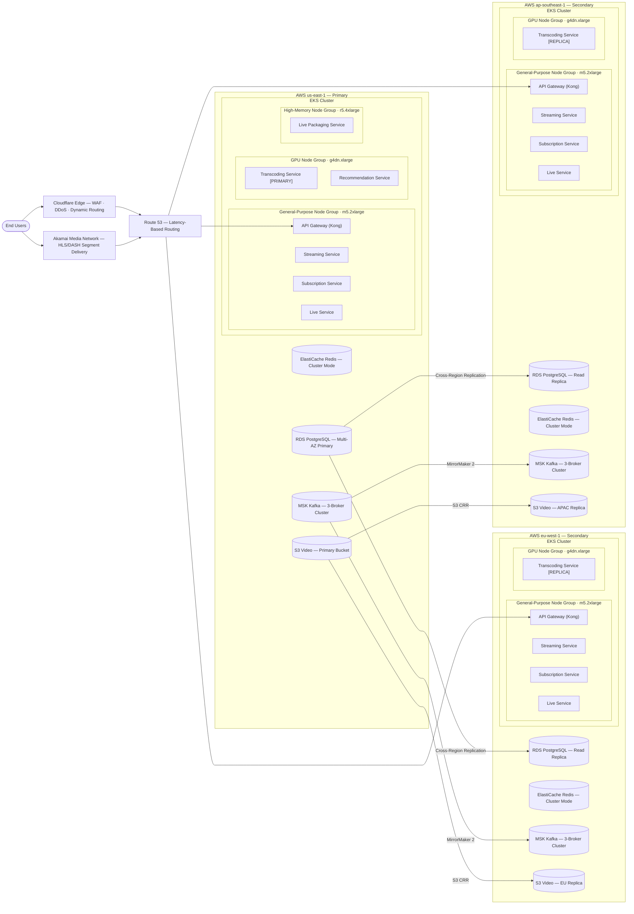
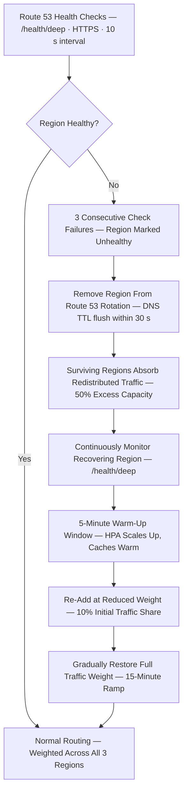

# Video Streaming Platform — Kubernetes Deployment Architecture

This document describes the production Kubernetes topology, resource allocation strategy, namespace
organisation, GPU acceleration configuration, regional failover procedures, and end-to-end
deployment pipeline for the Video Streaming Platform. The platform delivers both video-on-demand
(VOD) and live streaming with DRM protection (Widevine, FairPlay, PlayReady), multi-bitrate
adaptive streaming (HLS/DASH), ML-powered recommendations, and Stripe subscription billing.

---

## Full Deployment Topology

The platform runs in an active-active configuration across three AWS regions, providing low-latency
access for audiences in North America (us-east-1), Europe (eu-west-1), and Asia-Pacific
(ap-southeast-1). Route 53 latency-based routing directs every client request to the nearest healthy
regional endpoint. Cloudflare serves as the primary edge layer handling WAF rule evaluation, DDoS
mitigation, and origin routing, while Akamai's dedicated media backbone provides high-throughput
HLS and DASH segment delivery over its Tier-1 peered network. Both CDN providers cache ABR
segments at hundreds of edge PoPs, reducing origin bandwidth by over 90 % and keeping ABR rebuffering
rates below 0.3 % globally for P95 sessions.

The us-east-1 region is the designated Primary and operates the full service complement: API Gateway
(Kong), streaming, subscription, live delivery, GPU-accelerated transcoding (PRIMARY fleet), ML
recommendation inference co-located with the Feast feature store, and the high-memory live packaging
tier. Secondary regions run the complete general-purpose service stack and a scaled-down GPU
transcoding fleet so that content uploaded within those regions is processed locally, eliminating
cross-region egress costs. The Recommendation Service is centralised in us-east-1; model scores
are propagated globally via ElastiCache Redis cross-region replication and a Kafka topic consumed
by each regional API Gateway tier.

Each region is provisioned at 150 % of its expected steady-state P95 peak, providing 50 % headroom
to absorb a full regional failover with no manual scaling intervention. General-purpose m5.2xlarge
nodes (8 vCPUs, 32 GiB RAM) run 8–10 service pods per node while retaining meaningful CPU
headroom for bursty ingest spikes. High-memory r5.4xlarge nodes (16 vCPUs, 128 GiB RAM) are
reserved exclusively for the Live Packaging Service, which must hold large in-memory segment write
buffers for concurrent live channels. GPU g4dn.xlarge nodes, each carrying one NVIDIA T4 (16 GiB
VRAM), handle all transcoding work via NVENC hardware-accelerated FFmpeg pipelines.

---

## Kubernetes Resource Specifications

| Service | Replicas (Baseline) | CPU Request | CPU Limit | Memory Request | Memory Limit | HPA Min | HPA Max | Node Affinity | QoS Class |
|---|---|---|---|---|---|---|---|---|---|
| API Gateway (Kong) | 4 | 500m | 2000m | 512Mi | 2Gi | 4 | 20 | general-purpose | Burstable |
| Streaming Service | 6 | 500m | 1500m | 1Gi | 4Gi | 6 | 40 | general-purpose | Burstable |
| Subscription Service | 3 | 250m | 1000m | 512Mi | 2Gi | 3 | 12 | general-purpose | Burstable |
| Live Packaging Service | 4 | 2000m | 4000m | 8Gi | 24Gi | 4 | 16 | high-memory (r5.4xlarge) | Burstable |
| Transcoding Service | 2 | 3500m | 4000m | 12Gi | 16Gi | 2 | 24 | gpu (g4dn.xlarge) | Burstable |
| Recommendation Service | 2 | 2000m | 4000m | 8Gi | 14Gi | 2 | 8 | gpu (g4dn.xlarge) | Burstable |
| Content Moderation Service | 2 | 500m | 2000m | 1Gi | 4Gi | 2 | 10 | general-purpose | Burstable |
| Metadata Service | 4 | 250m | 1000m | 512Mi | 2Gi | 4 | 20 | general-purpose | Burstable |
| DRM License Service | 3 | 500m | 1500m | 512Mi | 2Gi | 3 | 12 | general-purpose | Burstable |
| Upload Service | 3 | 500m | 2000m | 1Gi | 4Gi | 3 | 16 | general-purpose | Burstable |
| Live Ingest Service | 2 | 1000m | 3000m | 2Gi | 8Gi | 2 | 10 | general-purpose | Burstable |

### HPA Custom Metrics — Transcoding Service

The Transcoding Service HPA uses `kafka_consumer_lag_sum`, surfaced through the Prometheus Adapter
as the external metric `kafka_transcoding_jobs_lag`, scraped from the MSK JMX exporter. Scale-up
fires when the 60-second rolling average consumer lag per partition exceeds **50 messages**,
indicating the GPU fleet cannot drain the encode queue fast enough to keep pace with ingest. Each
additional replica issues a resource request of `nvidia.com/gpu: 1`, causing the NVIDIA Device
Plugin to schedule the pod exclusively onto a node with an available T4. Scale-down fires only after
lag has remained below **10 messages per partition for five consecutive minutes**, preventing
premature pod termination during naturally bursty ingest windows that produce short-lived lag spikes
before self-correcting. `scaleUpStabilizationWindowSeconds` is **30 s**; `scaleDownStabilizationWindowSeconds`
is **300 s**.

### Pod Disruption Budgets

| Service | PDB Type | minAvailable | Rationale |
|---|---|---|---|
| API Gateway (Kong) | Percentage | 75 % | Must sustain request ingress capacity throughout rolling node drains |
| Streaming Service | Absolute | 4 | Active playback sessions must not be interrupted mid-stream |
| DRM License Service | Absolute | 2 | License re-acquisition adds 2–4 s of playback stall for the viewer |
| Live Packaging Service | Absolute | 3 | Live broadcast continuity requires at least 3 active packaging workers |
| Subscription Service | Absolute | 2 | Billing writes are idempotent but SLA demands minimum two alive |
| Transcoding Service | Absolute | 1 | GPU scarcity; one running encode job protected during node drain |
| Metadata Service | Percentage | 50 % | High replica count; 50 % minimum sustains full read throughput |

---

## Namespace Organization

| Namespace | Purpose | Services Deployed | Network Policy Stance |
|---|---|---|---|
| `streaming-prod` | Production video delivery workloads | API Gateway, Streaming Service, Metadata Service, DRM License Service, Subscription Service, Upload Service, Content Moderation Service | Ingress: ALB controller and CDN origin-pull CIDRs only. Egress: `transcoding`, `live`, `platform-ops`, AWS service VPC endpoints |
| `streaming-stage` | Staging mirror for pre-production validation | Same as streaming-prod at reduced replica counts | Ingress: internal VPC CIDR only. Egress: mirrors prod policy; targets stage-tier S3 buckets |
| `transcoding` | GPU-intensive media processing pipeline | Transcoding Service, GPU Job Scheduler, FFmpeg worker pods | Ingress: from `streaming-prod` and `live` namespaces only. Egress: S3 VPC endpoint, MSK VPC endpoint |
| `live` | Real-time live broadcast ingest and packaging | Live Ingest Service, Live Packaging Service, Live Service | Ingress: CDN origin-pull IPs and `streaming-prod` namespace. Egress: `transcoding`, S3, MSK |
| `platform-ops` | Cluster operations and GitOps tooling | Argo CD, External Secrets Operator, AWS Node Termination Handler, Cluster Autoscaler, cert-manager, Reloader | Ingress: VPN CIDR and internal tooling only. Egress: AWS APIs, GitHub for Argo CD sync, Secrets Manager |
| `monitoring` | Full-stack observability | Prometheus, Grafana, Alertmanager, Loki, Tempo, OpenTelemetry Collector | Ingress: scrape access from all namespaces via ServiceMonitor CRDs. Egress: PagerDuty and Slack webhooks |

All namespaces begin with a `deny-all` base NetworkPolicy for both ingress and egress; access grants
are strictly additive. Cross-namespace traffic requires matching allow rules on both the emitting
and the receiving namespace. AWS VPC CNI with Calico enforces policies at the Linux kernel netfilter
layer, providing sub-microsecond enforcement without iptables rule-set bloat. Prometheus scrapes
all namespaces through read-only RBAC roles scoped to `/metrics` path only, ensuring the monitoring
namespace cannot trigger writes or exec into production pods.

---

## GPU Node Pool Specification

| Parameter | Value |
|---|---|
| Instance Type | g4dn.xlarge |
| GPU Model | NVIDIA Tesla T4 |
| GPU VRAM | 16 GiB GDDR6 |
| vCPUs per Node | 4 (Intel Cascade Lake, 3.1 GHz base) |
| Host RAM per Node | 16 GiB DDR4 |
| NVMe SSD (local scratch) | 125 GB |
| CUDA Version | 12.2 |
| NVIDIA Driver | 535.x (LTS channel, GRID-certified) |
| Container Runtime | containerd 1.7 + nvidia-container-toolkit 1.14 |
| Device Plugin | nvidia-device-plugin v0.14 (DaemonSet in kube-system) |
| Node Label | `node.kubernetes.io/accelerator: nvidia-t4` |
| Node Taint | `nvidia.com/gpu=present:NoSchedule` |
| GPU Resource Request per Transcoding Pod | `nvidia.com/gpu: 1` |
| Min Nodes — us-east-1 | 4 |
| Max Nodes — us-east-1 | 24 |
| Min Nodes — eu-west-1 / ap-southeast-1 | 2 |
| Max Nodes — eu-west-1 / ap-southeast-1 | 12 |
| Spot Percentage | 60 % Spot / 40 % On-Demand |
| Spot Instance Diversification | g4dn.xlarge + g4dn.2xlarge (capacity-optimised strategy) |
| Cluster Autoscaler Utilisation Target | 0.55 (GPU occupancy metric) |

### Spot Interruption Handling

AWS Node Termination Handler (NTH) runs as a DaemonSet on every GPU node and polls the EC2 Instance
Metadata Service (IMDS) for Spot interruption notices. When a two-minute interruption notice
arrives, NTH immediately cordons the node and issues a graceful drain with `--ignore-daemonsets
--delete-emissary-data`. Active transcoding pods intercept SIGTERM and checkpoint the current encode
state—segment index, byte offset in the source, and all FFmpeg filter parameters—to Redis with a
30-minute TTL. The Kubernetes Job controller reschedules the pod on a healthy GPU node within
30–60 seconds, where the FFmpeg process reads the Redis checkpoint and resumes from the last
fully-written 6-second HLS segment. No segment data is discarded; maximum re-encode overhead
per interrupted pod is bounded to one 6-second segment.

### Priority Class

Transcoding pods run under the `transcoding-critical` PriorityClass with value **1000**, allowing
preemption of any `BestEffort` or `Burstable` pods that co-schedule onto GPU nodes when capacity
is constrained. The Recommendation Service uses `recommendation-inference` at value **800**,
ensuring transcoding always wins contention. Both classes set `preemptionPolicy: PreemptLowerPriority`
and cannot preempt system-critical pods (value ≥ 2000). PriorityClass objects are cluster-scoped,
stored in the `platform-ops` GitOps tree, and applied before any application Helm chart.

### NVENC Hardware Acceleration

Transcoding pods invoke FFmpeg with the `h264_nvenc` and `hevc_nvenc` encoders, delegating the
encode workload to the T4's dedicated fixed-function NVENC silicon rather than CUDA cores, leaving
the CUDA cores free for concurrent subtitle burn-in and scene-detection ML tasks. End-to-end
benchmarks show **8× real-time throughput** for 1080p H.264 at 5 Mbps compared to 0.9× real-time
on an equivalent m5.2xlarge CPU-only node. This 8× advantage means one T4 pod replaces nine CPU
pods for the same encode throughput, reducing per-minute transcode infrastructure cost by
approximately 65 % at full cluster utilisation and justifying the premium instance pricing.

---

## Regional Failover Strategy

### Route 53 Health Check Configuration

Each regional Application Load Balancer exposes `/health/deep` over HTTPS on port 443. Kong
executes a synchronous upstream health chain before responding: it verifies Redis connectivity via
PING with a 100 ms timeout, polls the Metadata Service and DRM License Service readiness endpoints,
and confirms MSK consumer group lag is below a warning threshold. The Route 53 health check is
configured with a **10-second polling interval**, a **5-second timeout**, and **3 consecutive
failures** before the endpoint is marked unhealthy. Recovery requires **2 consecutive successes**,
adding a 20-second confirmation window before traffic re-enters the region. CloudWatch alarms on
health-check state changes trigger a PagerDuty P1 incident within 60 seconds, automatically paging
the on-call engineer and posting to the #incidents Slack channel with the affected region and
current error rate.

### Excess Capacity Provisioning

Each region is provisioned at 150 % of its expected P95 steady-state peak load, providing a 50 %
absorption buffer. Cluster Autoscaler is configured with a target node utilisation of **0.65** for
general-purpose nodes and **0.55** for GPU nodes. HPA `scaleUpStabilizationWindowSeconds` is set
to **30 seconds** across all services so that a sudden traffic surge after failover triggers rapid
pod scale-out within the first minute. Scale-down stabilisation windows remain at **300 seconds**
to suppress oscillation as traffic gradually redistributes back to a recovered region.

### RDS Failover

RDS PostgreSQL in us-east-1 uses Multi-AZ with a synchronous standby in a separate Availability
Zone. Automatic within-region failover completes in under 60 seconds with zero RPO. Cross-region
read replicas in eu-west-1 and ap-southeast-1 use asynchronous replication with typical lag under
200 ms. A full us-east-1 loss requires manual promotion of the receiving-region read replica to a
writable primary via the documented runbook: snapshot validation, `promote-read-replica` API call,
parameter group reattachment, and application Route 53 CNAME alias rotation. This process targets
**RTO of 15 minutes for write traffic**. RPO for writes is bounded by async replication lag—
typically under 500 ms, worst-case a few seconds under a network partition. All Stripe webhook
processing is idempotent via event deduplication keys, making billing writes safe to replay
after promotion without double-charging subscribers.

### Kafka Cross-Region Replication

Kafka MirrorMaker 2 (MM2) runs as a 3-replica Kubernetes Deployment in each secondary region,
consuming from the us-east-1 MSK cluster over a TLS-encrypted AWS PrivateLink connection.
All production topics are replicated with a consumer offset synchronisation interval of **5
seconds**, allowing secondary consumers to resume from the last replicated offset within a single
sync cycle post-failover. Active-active bidirectional replication is intentionally disabled to
prevent message duplication; secondary MSK clusters serve exclusively as disaster-recovery read
replicas. MM2 prefixes remote topics with the source cluster alias (e.g., `use1.video.transcoded`)
for unambiguous topic routing during promotion runbooks.

### Failure Scenario Matrix

| Failure Scenario | Detection Time | Failover Action | RTO | RPO |
|---|---|---|---|---|
| Single AZ failure (within region) | < 30 s — ALB health probe | EKS reschedules pods to healthy AZs; RDS Multi-AZ automatic promotion | < 2 min | 0 — synchronous standby |
| Single region failure | 30–60 s — Route 53 health check | DNS record removed; traffic absorbed by remaining two regions | < 2 min reads; ~15 min writes | < 500 ms typical |
| RDS primary failure within us-east-1 | 20–30 s — RDS internal watchdog | Automatic Multi-AZ standby promotion; app reconnects via DNS CNAME | < 60 s | 0 |
| CDN provider failure (Cloudflare or Akamai) | < 60 s — synthetic canary monitoring | Route 53 weighted record shifts 100 % traffic to healthy CDN provider | < 2 min | N/A — stateless CDN layer |

---

## Deployment Pipeline

```mermaid
flowchart LR
    DEV["Developer Push — Feature Branch"]
    PR["Pull Request Opened"]
    CI["GitHub Actions CI — Unit Tests · Integration Tests · SAST CodeQL · Multi-arch Build amd64+arm64"]
    MERGE["Merge to main"]
    BUILD["Build Stage — Docker Image · Tag SHA+semver · cosign Signature · SBOM Attached"]
    ECR["Push to ECR — Auto-Replicated to All 3 Regions"]
    STAGE["Helm upgrade streaming-stage"]
    SMOKE["Smoke Tests + Argo Rollouts Canary — 5% Traffic · 10 min"]
    CANARY{"Canary Healthy?"}
    ROLLBACK["Argo Rollouts Abort + Rollback — PagerDuty Alert + Slack Notification"]
    PROD1["Helm upgrade streaming-prod us-east-1"]
    STAB1["10-min Stabilisation Window"]
    PROD2["Helm upgrade streaming-prod eu-west-1"]
    STAB2["5-min Stabilisation Window"]
    PROD3["Helm upgrade streaming-prod ap-southeast-1"]
    DONE["PagerDuty Resolved + Slack Deployment Notification"]

    DEV --> PR
    PR --> CI
    CI --> MERGE
    MERGE --> BUILD
    BUILD --> ECR
    ECR --> STAGE
    STAGE --> SMOKE
    SMOKE --> CANARY
    CANARY -->|"No — Error Rate or Latency Threshold Breached"| ROLLBACK
    CANARY -->|"Yes — All SLOs Green"| PROD1
    PROD1 --> STAB1
    STAB1 --> PROD2
    PROD2 --> STAB2
    STAB2 --> PROD3
    PROD3 --> DONE
```

### GitOps with Argo CD

Argo CD is deployed in `platform-ops` and manages all application Helm `Application` CRDs stored
in the `infra-gitops` repository under a strict directory layout per environment and region. It
polls the repository every **3 minutes** and performs a deep diff against live cluster state. Any
configuration drift—whether from a manual `kubectl apply`, a Helm CLI operation, or an AWS-managed
update—triggers a `SyncFailed` alert in Slack and marks the application out-of-sync in the Argo CD
UI dashboard. Organisational policy mandates that all production mutations flow through reviewed
Git pull requests; direct cluster mutations are surfaced as policy violations in AWS CloudTrail and
trigger an automated remediation job that reverts the change and opens a Jira incident ticket for
root-cause analysis.

### Helm Chart Versioning and Secrets

Helm charts follow strict semver: patch-level (`x.y.z`) releases are promoted to production
automatically by the pipeline after canary success; minor and major version bumps require an
explicit human approval gate in the GitHub Actions release workflow. Secrets are never committed to
Git. The External Secrets Operator (ESO) reconciles `ExternalSecret` CRDs against AWS Secrets
Manager every **60 seconds**, materialising Kubernetes `Secret` objects in the target namespace.
Rotating a secret in Secrets Manager propagates to all pods within 90 seconds via ESO
reconciliation followed by a Reloader-triggered rolling restart scoped to only the affected
Deployment. No manual pod restarts or Helm upgrades are required for secret rotation events, making
zero-downtime credential rotation fully automated.

### Image Digest Pinning

Production Helm values files (`values-prod.yaml`) reference all container images exclusively by
immutable SHA-256 digest — for example,
`123456789012.dkr.ecr.us-east-1.amazonaws.com/streaming-service@sha256:a3f2c8...`. Tag-based
references (`latest`, branch names, short hashes) are permitted only in `values-stage.yaml`. A
mandatory CI gate in the release workflow inspects every `values-prod.yaml` and fails the pipeline
immediately if any image reference uses a mutable tag. This prevents tag-mutation attacks, ensures
Argo CD drift detection can verify the exact binary in production at byte-for-byte precision, and
satisfies the SOC 2 Type II immutable-artifact control requirement for the streaming platform.

### Blue-Green Deployments for Major Upgrades

Major version upgrades involving breaking API or schema changes use a blue-green traffic split
rather than a rolling Deployment update. Dual Kubernetes Deployments (`streaming-blue` and
`streaming-green`) coexist behind a shared Kubernetes Service. Kong upstream weight configuration
gradually shifts traffic from the blue tier to the green tier in **10 % increments every
5 minutes**, with automated SLO evaluation—error rate below 0.1 % and P99 latency within 20 % of
baseline—at each step. Breaching either threshold instantly reverts the increment back to the
previous weight without requiring manual intervention. The blue Deployment remains live at zero
traffic weight for **30 minutes** after the final 100 % switch, enabling instant rollback by
toggling the Kong upstream weight through a single API call with no pod restart penalty and no
service downtime for active streaming sessions.
