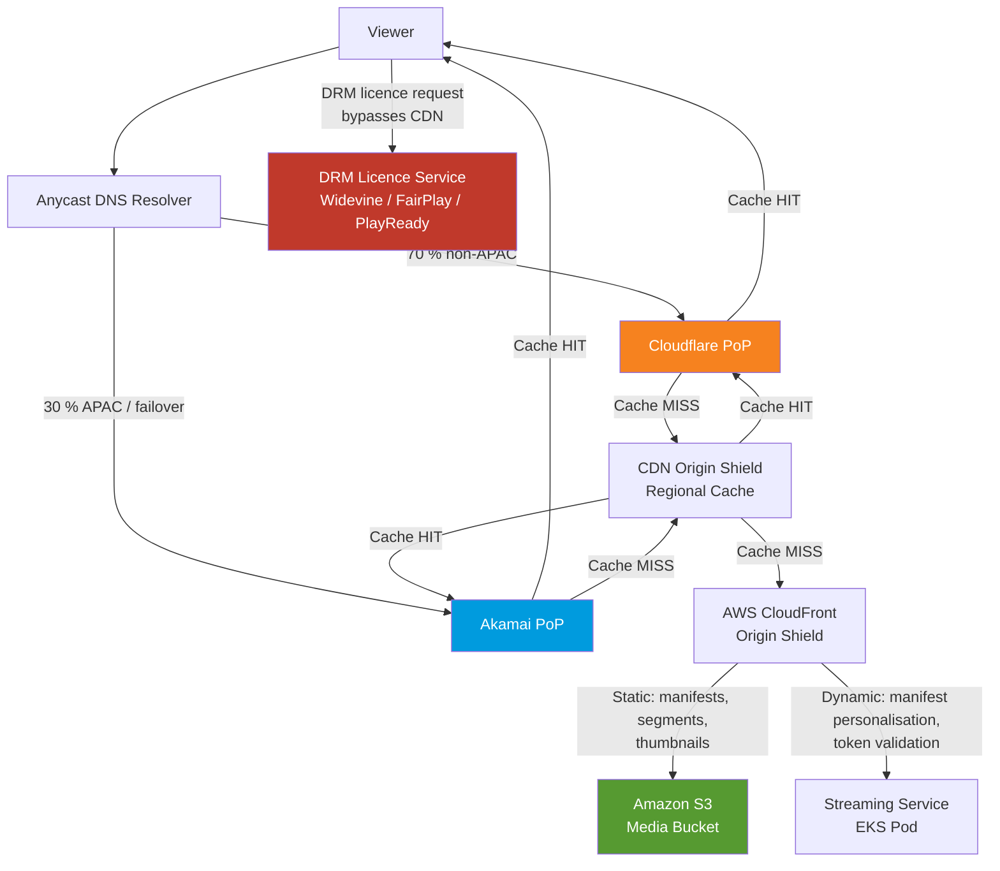
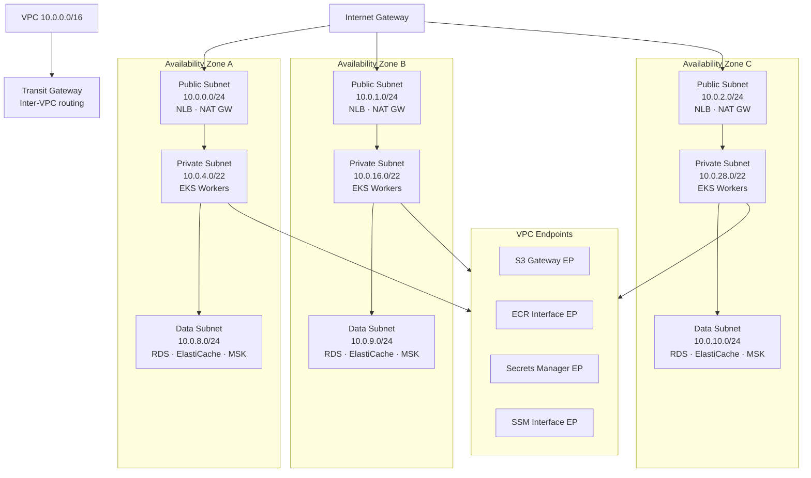

# Network Infrastructure

Video Streaming Platform — production network architecture covering CDN delivery, ingest, VPC topology, security, and bandwidth planning for a Netflix/YouTube-scale VOD and live streaming service.

---

## Multi-CDN Strategy

The platform runs a dual-CDN topology: **Cloudflare handles 70 % of global traffic** and **Akamai handles the remaining 30 %**. Cloudflare is preferred globally because of its superior PoP density (300+ cities), built-in DDoS scrubbing, and competitive egress pricing. Akamai is retained because of demonstrably lower latency across Asia-Pacific markets and because several enterprise customers hold contractual SLA commitments that reference Akamai delivery specifically.

Traffic is divided at the DNS layer using GeoDNS. Resolvers in APAC regions (ap-southeast-1, ap-northeast-1, ap-south-1, ap-east-1) receive Akamai CNAME answers by default. All other regions receive Cloudflare answers. GeoDNS TTLs are set to 60 seconds to allow rapid failover without prolonged caching at recursive resolvers.

**Failover policy:** A synthetic monitoring agent runs latency probes from 15 vantage points every 10 seconds. If any Cloudflare PoP exceeds **150 ms P95 latency** or its **error rate rises above 1 %** over a 30-second window, the GeoDNS controller updates affected region records to point at Akamai within 60 seconds. Once Cloudflare recovers (latency < 100 ms and error rate < 0.5 % for 5 consecutive minutes), traffic shifts back automatically.

**Cost optimisation:** AWS CloudFront is deployed as an origin shield layer between both CDNs and the true origin. All S3 segment and manifest fetches from Cloudflare or Akamai PoPs collapse into CloudFront's regional edge caches before touching S3, dramatically reducing origin-pull request volume. Akamai SURESale pricing is applied for sustained traffic tiers above 50 Gbps, locking in discounted rates for predictable base-load traffic.

---

## Anycast Routing and GeoDNS Configuration

### BGP Anycast Principles

Cloudflare and Akamai both announce the same IPv4 prefix from hundreds of PoPs simultaneously using BGP anycast. When a viewer's DNS query resolves to a CDN IP, the underlying routing fabric steers TCP flows to the nearest BGP next-hop — typically the PoP with the fewest AS hops. This delivers sub-10 ms DNS resolution latency for the majority of end users without any application-layer involvement.

The platform's authoritative DNS (AWS Route 53) performs GeoDNS by inspecting the EDNS Client Subnet (ECS) extension in resolver queries. When ECS is absent, Route 53 falls back to the resolver's own IP for geolocation inference.

### GeoDNS Region Configuration

| Region | Primary CDN | Fallback CDN | TTL (s) | Health Check URL |
|---|---|---|---|---|
| North America | Cloudflare | Akamai | 60 | `https://cf-health.videoplatform.com/ping` |
| Europe | Cloudflare | Akamai | 60 | `https://cf-health.videoplatform.com/ping` |
| Asia-Pacific | Akamai | Cloudflare | 60 | `https://ak-health.videoplatform.com/ping` |
| Middle East | Cloudflare | Akamai | 60 | `https://cf-health.videoplatform.com/ping` |
| Latin America | Cloudflare | Akamai | 60 | `https://cf-health.videoplatform.com/ping` |
| Africa | Cloudflare | Akamai | 60 | `https://cf-health.videoplatform.com/ping` |

### Split-Horizon DNS

Internal EKS pods and AWS services resolve service names through a private Route 53 hosted zone (`internal.videoplatform.local`). This zone is associated only with the production VPCs and returns private IPs or VPC endpoint DNS names, ensuring inter-service traffic never leaves the AWS network. External resolvers receive only public CNAME records pointing at CDN endpoints — internal topology is never exposed.

### Cloudflare Spectrum for Non-HTTP Traffic

RTMP ingest (TCP port 1935) is fronted by **Cloudflare Spectrum**, which extends Cloudflare's anycast network to arbitrary TCP and UDP protocols. Broadcasters worldwide connect to a single Spectrum anycast address; Cloudflare proxies the TCP stream to the nearest RTMP ingest NLB. This provides L3/L4 DDoS scrubbing for ingest traffic without requiring broadcasters to configure region-specific endpoints.

---

## RTMP Ingest Network

Live content is ingested via RTMP. Broadcasters (OBS, Wirecast, hardware encoders) push a single RTMP stream to the nearest ingest point; the ingest tier handles authentication, redundancy, and routing to the packaging layer over the private AWS backbone.

### Global Ingest Points

| Region | Ingest FQDN | AWS Region | EC2 Instance Type | Redundancy |
|---|---|---|---|---|
| US East | `ingest-use1.live.videoplatform.com` | us-east-1 | c6i.2xlarge | 3-node NLB |
| US West | `ingest-usw2.live.videoplatform.com` | us-west-2 | c6i.2xlarge | 3-node NLB |
| EU West | `ingest-euw1.live.videoplatform.com` | eu-west-1 | c6i.2xlarge | 3-node NLB |
| EU Central | `ingest-euc1.live.videoplatform.com` | eu-central-1 | c6i.2xlarge | 3-node NLB |
| AP Southeast | `ingest-apse1.live.videoplatform.com` | ap-southeast-1 | c6i.2xlarge | 3-node NLB |
| AP Northeast | `ingest-apne1.live.videoplatform.com` | ap-northeast-1 | c6i.2xlarge | 3-node NLB |

### Ingest Data Flow

```mermaid
flowchart LR
    B["Broadcaster\nOBS / Hardware Encoder"]
    NLB["RTMP NLB\nNetwork Load Balancer\nport 1935"]
    IR["nginx-rtmp\nIngest Server\nHMAC auth + push relay"]
    BB["AWS Global Accelerator\nPrivate Backbone Routing"]
    LP["Live Packaging Service\nHLS + DASH segmenter"]
    OR["HLS / DASH Origin\nS3 + CloudFront"]
    CDN["CDN\nCloudflare / Akamai"]

    B -->|RTMP TCP 1935| NLB
    NLB --> IR
    IR -->|Authenticated stream| BB
    BB -->|AWS backbone — no public internet| LP
    LP -->|2-second segments| OR
    OR --> CDN
```

### nginx-rtmp Configuration Details

Each ingest server runs **nginx with the nginx-rtmp module**. Authentication is enforced at stream publish time: the broadcaster appends an HMAC-SHA256 token (keyed on stream name + timestamp) to the RTMP URL query string. The nginx `on_publish` callback validates the token against the Auth Service before allowing the stream to proceed.

Each ingest server is configured with `max_streams 200`. Beyond this threshold the NLB target is marked unhealthy and the load balancer stops routing new connections to it, preventing CPU saturation during traffic spikes.

Every accepted stream is automatically relayed (`push`) to a secondary ingest server in the same region using nginx-rtmp's built-in push directive. The secondary holds a warm connection ready to continue packaging within one segment duration (< 2 seconds) if the primary fails.

### Ingest-to-Origin Routing

**AWS Global Accelerator** provides a single anycast IP entry point for ingest-to-origin traffic. After the primary ingest server accepts and authenticates the RTMP stream, the transcoded segments travel over the **AWS private global backbone** — not the public internet — to the origin packaging region (us-east-1). This eliminates jitter and packet loss caused by public BGP path variance, which is especially important for real-time live content where segment delivery latency directly affects viewer experience.

---

## VPC Architecture

Each AWS region runs an isolated VPC with a /16 CIDR, subdivided into three tiers across three Availability Zones. The architecture follows a strict public → private → data isolation model; no data-tier resource has a route to the internet gateway.

### Subnet Reference Table

| Name | CIDR | AZ | Route Table | Purpose |
|---|---|---|---|---|
| public-az-a | 10.0.0.0/24 | us-east-1a | rt-public | NLB, NAT Gateway, Bastion |
| public-az-b | 10.0.1.0/24 | us-east-1b | rt-public | NLB, NAT Gateway |
| public-az-c | 10.0.2.0/24 | us-east-1c | rt-public | NLB, NAT Gateway |
| private-az-a | 10.0.4.0/22 | us-east-1a | rt-private-a | EKS worker nodes, pods |
| private-az-b | 10.0.16.0/22 | us-east-1b | rt-private-b | EKS worker nodes, pods |
| private-az-c | 10.0.28.0/22 | us-east-1c | rt-private-c | EKS worker nodes, pods |
| data-az-a | 10.0.8.0/24 | us-east-1a | rt-data | RDS primary, ElastiCache, MSK |
| data-az-b | 10.0.9.0/24 | us-east-1b | rt-data | RDS replica, ElastiCache, MSK |
| data-az-c | 10.0.10.0/24 | us-east-1c | rt-data | RDS replica, ElastiCache, MSK |
| management | 10.0.3.0/24 | us-east-1a | rt-mgmt | Bastion, monitoring agents, CI runners |

Private subnets route outbound internet traffic through the NAT Gateway in their respective AZ's public subnet. Data subnets have **no default route** — they can only communicate with the private subnets and via VPC endpoints.

---

## Security Groups and NACLs

### Security Group Rules

| Security Group | Inbound Rules | Outbound Rules | Applied To |
|---|---|---|---|
| `sg-alb` | TCP 443 from `0.0.0.0/0`; TCP 80 from `0.0.0.0/0` (redirect only) | All TCP to `sg-api-gw` | Application Load Balancer |
| `sg-api-gw` | TCP 8080 from `sg-alb` | TCP 5432 to `sg-rds`; TCP 6379 to `sg-redis`; TCP 9092 to `sg-kafka`; TCP 443 to `0.0.0.0/0` | API Gateway pods |
| `sg-rds` | TCP 5432 from `sg-api-gw`; TCP 5432 from `sg-transcoding` | No outbound beyond VPC CIDR | Aurora PostgreSQL cluster |
| `sg-redis` | TCP 6379 from `sg-api-gw`; TCP 6379 from `sg-streaming` | No outbound | ElastiCache Redis cluster |
| `sg-kafka` | TCP 9092 from `sg-api-gw`; TCP 9094 (TLS) from `sg-api-gw` | No outbound | MSK Kafka brokers |
| `sg-transcoding` | No inbound (pull-only workers) | TCP 443 to S3 VPC endpoint; TCP 9092 to `sg-kafka` | Transcoding EKS nodes |
| `sg-rtmp-ingest` | TCP 1935 from `0.0.0.0/0` | TCP 1935 to `sg-live-packaging` | RTMP ingest EC2 fleet |
| `sg-live-packaging` | TCP 1935 from `sg-rtmp-ingest` | TCP 443 to S3 VPC endpoint; TCP 9092 to `sg-kafka` | Live packaging pods |
| `sg-drm-licence` | TCP 443 from `sg-alb`; TCP 443 from `sg-streaming` | TCP 5432 to `sg-rds`; TCP 6379 to `sg-redis` | DRM Licence Service pods |

### NACL Design

NACLs operate at the subnet boundary and are **stateless** — both inbound and outbound rules must be explicitly configured. They provide subnet-level defence-in-depth that complements the security group layer. The private and data subnets block all traffic originating from the public internet at the NACL level, even if a misconfigured security group rule were to permit it. Ephemeral port ranges (1024–65535) are explicitly opened for return traffic.

The public subnet NACLs whitelist only TCP 443, TCP 80, and TCP 1935 inbound from `0.0.0.0/0`. The data subnet NACLs permit traffic only from the private subnet CIDR ranges (10.0.4.0/22, 10.0.16.0/22, 10.0.28.0/22), blocking all other sources regardless of security group state.

### VPC Flow Logs

VPC Flow Logs are enabled on all VPCs and all network interfaces, writing to a dedicated S3 bucket (`s3://videoplatform-vpc-flow-logs-{account-id}`). Logs are retained for **30 days** using an S3 lifecycle rule that transitions to Glacier after 7 days and expires at 30 days. An Athena table is maintained over the flow log bucket to support ad-hoc queries for security investigations, compliance audits, and cost attribution by source/destination CIDR.

---

## TLS Termination Strategy

### Public Endpoints

TLS is terminated at the **Application Load Balancer** using certificates provisioned and auto-renewed by **AWS Certificate Manager (ACM)**. ACM certificates renew automatically 60 days before expiry; no manual rotation step is required. The ALB listener policy enforces:

- **Minimum TLS version:** 1.2 (TLS 1.0 and 1.1 are disabled)
- **Preferred TLS version:** 1.3
- **Preferred cipher suite:** `TLS_AES_256_GCM_SHA384`
- **HSTS header:** `Strict-Transport-Security: max-age=31536000; includeSubDomains; preload`

The domain is submitted to the HSTS preload list so that browsers never attempt a plain HTTP connection, eliminating downgrade attacks before they reach the ALB.

### Internal mTLS

East-west traffic between microservices inside the EKS cluster is encrypted using **mutual TLS (mTLS)** enforced by an Istio service mesh sidecar (Envoy proxy). Each pod receives a short-lived X.509 certificate (24-hour TTL, auto-rotated) issued by **AWS Private CA** via the cert-manager Kubernetes controller. The Istio mesh policy is set to `STRICT` mode — plaintext connections between pods in the mesh are rejected. This ensures that a compromised pod cannot sniff inter-service credentials even if it gains network-level access within the VPC.

### Certificate Inventory

| Domain | Certificate Authority | Renewal | Min TLS Version | HSTS |
|---|---|---|---|---|
| `api.videoplatform.com` | AWS ACM (public) | Auto — 60 days before expiry | TLS 1.2 | max-age=31536000; preload |
| `stream.videoplatform.com` | AWS ACM (public) | Auto — 60 days before expiry | TLS 1.2 | max-age=31536000; preload |
| `live.videoplatform.com` | AWS ACM (public) | Auto — 60 days before expiry | TLS 1.2 | max-age=31536000; preload |
| `*.videoplatform.com` | AWS ACM wildcard (public) | Auto — 60 days before expiry | TLS 1.2 | max-age=31536000; preload |
| Internal services (mesh) | AWS Private CA (internal) | cert-manager — 24 h TTL | TLS 1.3 enforced | N/A (internal only) |

---

## DDoS Protection

### Layer 3 and 4 Protection

**AWS Shield Advanced** is activated on all public-facing endpoints: ALBs, NLBs, CloudFront distributions, Route 53 hosted zones, and Elastic IPs used for RTMP ingest. Shield Advanced costs **$3,000/month** (flat rate, covers the entire AWS account) and includes 24/7 access to the AWS DDoS Response Team (DRT), cost protection credits for scaling costs incurred during an attack, and near-real-time attack visibility in the AWS Shield console.

### Layer 7 Protection

A two-layer WAF approach is applied:

- **Cloudflare WAF** at the CDN edge using **OWASP Core Rule Set 3.3**. Rules are applied in `block` mode for CRS scores ≥ 50 and `simulate` mode for CRS scores 25–49, with anomaly scoring logged to Cloudflare Logpush for analysis.
- **AWS WAF** on CloudFront distributions and ALBs as the second line of defence. AWS Managed Rules packs (Core Rule Set, Known Bad Inputs, SQL Database, Amazon IP Reputation) are all active.

### Rate Limiting Rules

| Endpoint | Limit | Window | Enforcement Layer |
|---|---|---|---|
| `POST /api/auth/*` | 20 req/min per IP | 60 s sliding | Cloudflare WAF + AWS WAF |
| `GET /api/stream/*` | 100 req/min per authenticated user | 60 s sliding | AWS WAF + API Gateway throttle |
| `POST /api/upload` | 10 req/min per authenticated user | 60 s sliding | AWS WAF |
| `GET /health` | 60 req/min per IP | 60 s sliding | Cloudflare WAF |
| `POST /api/drm/licence` | 50 req/min per device ID | 60 s sliding | DRM Service internal rate limiter |

### Cloudflare Under Attack Mode

Cloudflare's **Under Attack Mode** (presenting a JavaScript challenge page to all visitors) is auto-enabled by a Lambda function subscribed to a CloudWatch alarm. The alarm triggers when the measured request rate across the Cloudflare zone exceeds **10× the 7-day rolling baseline** for any 2-minute window. Under Attack Mode is automatically disabled after the rate returns below 2× baseline for 10 consecutive minutes.

### IP Reputation and Bot Management

**Cloudflare Threat Intelligence** maintains a continuously updated list of malicious IPs sourced from across the Cloudflare network. Traffic from these IPs is challenged or blocked before it reaches origin. **AWS WAF Managed Rules — Amazon IP Reputation List** provides a secondary blocklist covering known botnets and scanners.

For streaming endpoints specifically, **Cloudflare Bot Management** is applied. This service uses machine learning fingerprinting to distinguish legitimate players (browser, iOS, Android, Smart TV SDKs) from bots attempting hotlinking or stream ripping. Detected bots receive a 403 response without a DRM licence, making the stream content inaccessible even if the HLS URL is extracted.

---

## Network Bandwidth Estimates

### Peak Traffic Sizing

| Metric | Value | Notes |
|---|---|---|
| Peak concurrent viewers | 500,000 | Major live event or primetime VOD |
| Average bitrate per viewer | 5 Mbps | 1080p ABR; accounts for ABR ladder averaging |
| Peak CDN egress | 2.5 Tbps | 500 k × 5 Mbps |
| CDN egress cost — Cloudflare | ~$0.01/GB | Enterprise tier committed rate |
| CDN egress cost — Akamai | ~$0.008/GB | Volume tier with SURESale commitment |
| Blended CDN egress cost | ~$0.009/GB | Weighted 70/30 split |
| Monthly CDN egress (peak month) | ~3.2 PB | Assumes 8 h/day at 50 % peak rate |
| Monthly CDN cost estimate | ~$28,000–$35,000 | Blended rate across both CDNs |
| S3 → CloudFront transfer cost | $0.00/GB | Free within AWS |
| Cross-region replication bandwidth | ~50 TB/day | Content sync us-east-1 → us-west-2, eu-west-1 |
| RTMP ingest aggregate bandwidth | ~500 Gbps peak | Concurrent live channels |
| Transcoding output bandwidth | ~800 Gbps peak | Multitrack ABR output to S3 |

### Adaptive Bitrate Ladder

The transcoding pipeline produces the following ABR renditions for all VOD and live content:

| Resolution | Video Bitrate | Audio Bitrate | Total Bitrate | Codec |
|---|---|---|---|---|
| 360p (640×360) | 550 kbps | 64 kbps | ~620 kbps | H.264 / AAC |
| 480p (854×480) | 1,400 kbps | 96 kbps | ~1.5 Mbps | H.264 / AAC |
| 720p (1280×720) | 2,900 kbps | 128 kbps | ~3 Mbps | H.264 / AAC |
| 1080p (1920×1080) | 5,800 kbps | 192 kbps | ~6 Mbps | H.264 / AAC |
| 4K (3840×2160) | 19,500 kbps | 192 kbps | ~20 Mbps | H.265 / AAC |

The HLS and DASH manifests list all renditions. Player SDKs use throughput estimation and buffer health to select the highest sustainable rendition, switching down within a single segment period (2 seconds for live, 6 seconds for VOD) when bandwidth drops. 4K is served only to devices that present a Widevine L1 or FairPlay hardware attestation to the DRM Licence Service.

---

## Peering and Transit Strategy

### AWS Direct Connect

A **10 Gbps AWS Direct Connect** dedicated connection links the primary on-premises content operations centre to `us-east-1`. This connection is used for high-volume content ingestion — raw camera footage, master MXF/MOV files, and DCP packages — that would be cost-prohibitive to transfer over the public internet. The Direct Connect circuit is backed by a second 10 Gbps connection from a separate colocation cage (diverse physical path) to provide resilience.

A Direct Connect Gateway is associated with the `us-east-1` Transit Gateway, making the on-premises network reachable from all production VPCs without establishing separate connections per region.

### CDN Peering Arrangements

Cloudflare maintains private network interconnects (PNIs) with AWS at the following internet exchanges, bypassing transit providers entirely:

| Internet Exchange | Location | Bandwidth |
|---|---|---|
| AMS-IX | Amsterdam | 100 Gbps |
| LINX | London | 100 Gbps |
| DE-CIX | Frankfurt | 100 Gbps |
| Equinix NY | New York | 100 Gbps |
| Equinix SJ | San Jose | 100 Gbps |

Traffic between Cloudflare PoPs and CloudFront origin shield traverses these PNIs at zero transit cost, contributing meaningfully to the economics of the CDN origin-pull model.

### AWS PrivateLink — Stripe Webhooks

Stripe webhook deliveries (subscription lifecycle events, payment confirmations, dispute notifications) enter the platform via **AWS PrivateLink**. A VPC endpoint service exposes the Billing Service's internal NLB over PrivateLink; Stripe's AWS-side webhook endpoint sends events directly to this endpoint without traversing the public internet. This eliminates the risk of webhook spoofing from the public network and simplifies IP allowlisting (no public Stripe CIDR range maintenance required).

### S3 Transfer Acceleration

The Upload Service (used by content creators and the operations ingestion tool) enables **S3 Transfer Acceleration** on the upload bucket. Uploads are routed to the nearest Cloudfront edge PoP, which relays content to S3 over the AWS backbone. For users in Asia-Pacific uploading large raw video files to the primary `us-east-1` bucket, Transfer Acceleration reduces effective upload time by 30–60 % compared to direct S3 multi-part upload.

### Transit Gateway Inter-VPC Routing

A **Transit Gateway** in each region connects:

- Production VPC (streaming workloads)
- Data VPC (RDS, S3 replication targets)
- Shared Services VPC (Prometheus/Grafana, ArgoCD, Artifactory, GitHub Actions runners)
- Security VPC (Centralised VPC Flow Log aggregation, GuardDuty integration, SIEM forwarding)

Route tables on the Transit Gateway are segmented to prevent direct routing between the Production VPC and the Shared Services VPC except over explicitly permitted paths (monitoring scrape endpoints, container image pulls from ECR via the Shared Services VPC). The Security VPC is attached in **inspection mode** and uses Gateway Load Balancer to route all inter-VPC traffic through a stateful firewall (AWS Network Firewall) for east-west threat detection.
