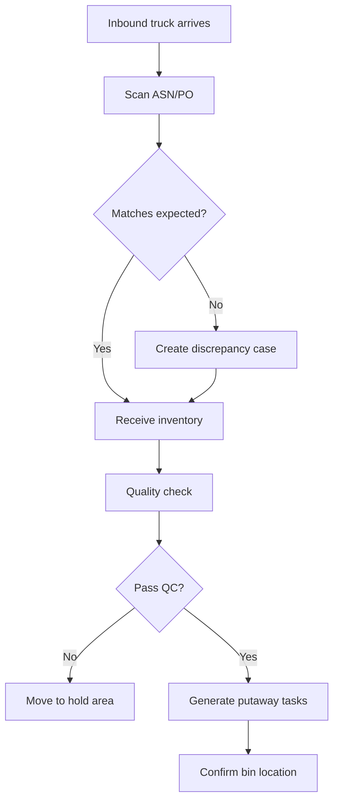
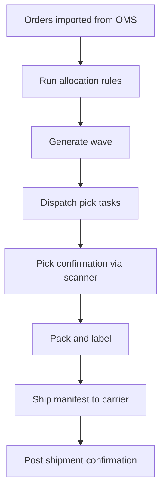
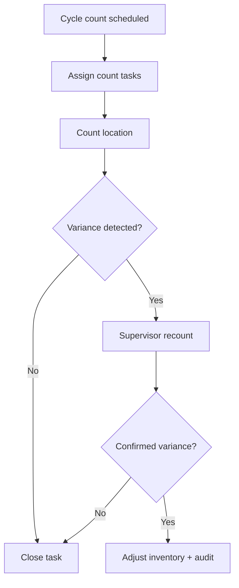

# Activity Diagrams

## Inbound Receiving and Putaway

```mermaid
flowchart TD
    A[Inbound truck arrives] --> B[Scan ASN/PO]
    B --> C{Matches expected?}
    C -- No --> D[Create discrepancy case]
    C -- Yes --> E[Receive inventory]
    D --> E
    E --> F[Quality check]
    F --> G{Pass QC?}
    G -- No --> H[Move to hold area]
    G -- Yes --> I[Generate putaway tasks]
    I --> J[Confirm bin location]
```

## Order Fulfillment

```mermaid
flowchart TD
    A[Orders imported from OMS] --> B[Run allocation rules]
    B --> C[Generate wave]
    C --> D[Dispatch pick tasks]
    D --> E[Pick confirmation via scanner]
    E --> F[Pack and label]
    F --> G[Ship manifest to carrier]
    G --> H[Post shipment confirmation]
```

## Cycle Count Adjustment

```mermaid
flowchart TD
    A[Cycle count scheduled] --> B[Assign count tasks]
    B --> C[Count location]
    C --> D{Variance detected?}
    D -- No --> E[Close task]
    D -- Yes --> F[Supervisor recount]
    F --> G{Confirmed variance?}
    G -- No --> E
    G -- Yes --> H[Adjust inventory + audit]
```
