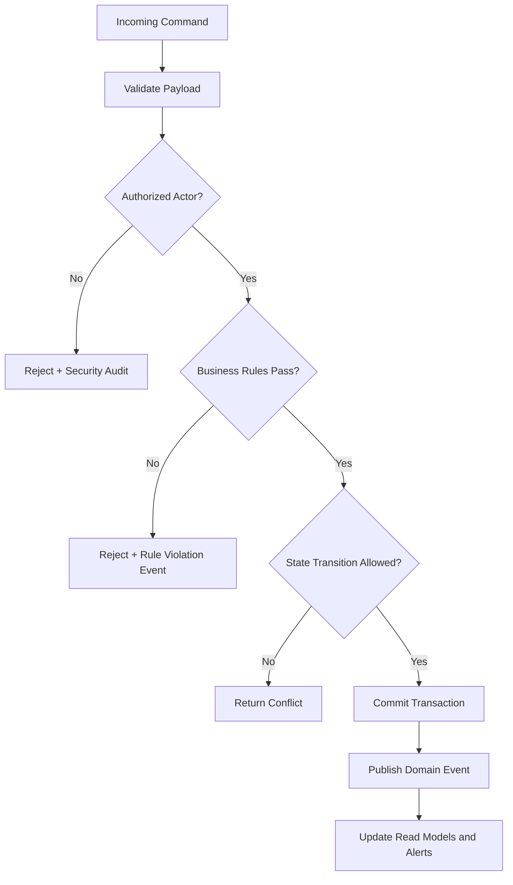

# Business Rules

This document defines enforceable policy rules for **Warehouse Management System** so command processing, asynchronous jobs, and operational actions behave consistently under normal and exceptional conditions.

## Context
- Domain focus: warehouse management workflows.
- Rule categories: lifecycle transitions, authorization, compliance, consistency, and resilience.
- Enforcement points: APIs, workflow/state engines, background processors, and administrative consoles.

## Major Business Rules

| Rule ID | Rule |
|---|---|
| BR-1 | Every state-changing command must pass authentication, authorization, and schema validation before processing. |
| BR-2 | Lifecycle transitions must follow the configured state graph; invalid transitions are rejected with explicit reason codes. |
| BR-3 | High-impact operations (financial, security, or regulated data actions) require additional approval evidence. |
| BR-4 | Manual overrides must include approver identity, rationale, and expiration timestamp. |
| BR-5 | Retries and compensations must be idempotent and must not create duplicate business effects. |
| BR-6 | Receiving must validate ASN/PO, quantity tolerance, and lot/serial constraints before stock becomes allocatable. |
| BR-7 | Picking must consume reservation allocations and prevent negative ATP for reservable stock. |
| BR-8 | Packing must reconcile picked lines, package contents, and shipping labels before shipment release. |
| BR-9 | Shipping confirmation is the system-of-record handoff event for decrement finalization, tracking, and customer visibility. |
| BR-10 | Exception paths (damage, short pick, offline replay, carrier outage) must preserve auditability and deterministic recovery actions. |

## Rule Evaluation Pipeline

## Exception and Override Handling
- Overrides are restricted to approved exception classes and require dual logging (business + security audit).
- Override windows automatically expire and trigger follow-up verification tasks.
- Repeated override patterns are reviewed for policy redesign and automation improvements.

## Major Business Rule Traceability Matrix

| Rule ID | Design Artifacts | Implementation Artifacts |
|---|---|---|
| BR-1 | [detailed-design/api-design.md](../detailed-design/api-design.md), [high-level-design/architecture-diagram.md](../high-level-design/architecture-diagram.md), [analysis/use-case-descriptions.md](./use-case-descriptions.md) | [implementation/implementation-guidelines.md](../implementation/implementation-guidelines.md), [implementation/backend-status-matrix.md](../implementation/backend-status-matrix.md) |
| BR-2 | [detailed-design/state-machine-diagrams.md](../detailed-design/state-machine-diagrams.md), [analysis/activity-diagrams.md](./activity-diagrams.md), [analysis/swimlane-diagrams.md](./swimlane-diagrams.md) | [implementation/c4-code-diagram.md](../implementation/c4-code-diagram.md), [implementation/implementation-guidelines.md](../implementation/implementation-guidelines.md) |
| BR-3 | [analysis/use-case-descriptions.md](./use-case-descriptions.md), [infrastructure/network-infrastructure.md](../infrastructure/network-infrastructure.md), [high-level-design/c4-diagrams.md](../high-level-design/c4-diagrams.md) | [implementation/backend-status-matrix.md](../implementation/backend-status-matrix.md), [implementation/implementation-guidelines.md](../implementation/implementation-guidelines.md) |
| BR-4 | [analysis/event-catalog.md](./event-catalog.md), [detailed-design/api-design.md](../detailed-design/api-design.md), [edge-cases/operations.md](../edge-cases/operations.md) | [implementation/implementation-guidelines.md](../implementation/implementation-guidelines.md), [implementation/backend-status-matrix.md](../implementation/backend-status-matrix.md) |
| BR-5 | [high-level-design/system-sequence-diagrams.md](../high-level-design/system-sequence-diagrams.md), [detailed-design/sequence-diagrams.md](../detailed-design/sequence-diagrams.md), [detailed-design/component-diagrams.md](../detailed-design/component-diagrams.md) | [implementation/implementation-guidelines.md](../implementation/implementation-guidelines.md), [implementation/c4-code-diagram.md](../implementation/c4-code-diagram.md) |
| BR-6 | [analysis/activity-diagrams.md](./activity-diagrams.md), [detailed-design/inventory-allocation-and-wave-planning.md](../detailed-design/inventory-allocation-and-wave-planning.md), [analysis/data-dictionary.md](./data-dictionary.md) | [implementation/backend-status-matrix.md](../implementation/backend-status-matrix.md), [edge-cases/cycle-count-adjustments.md](../edge-cases/cycle-count-adjustments.md) |
| BR-7 | [detailed-design/inventory-allocation-and-wave-planning.md](../detailed-design/inventory-allocation-and-wave-planning.md), [detailed-design/sequence-diagrams.md](../detailed-design/sequence-diagrams.md), [analysis/business-rules.md](./business-rules.md) | [implementation/backend-status-matrix.md](../implementation/backend-status-matrix.md), [implementation/implementation-guidelines.md](../implementation/implementation-guidelines.md) |
| BR-8 | [analysis/swimlane-diagrams.md](./swimlane-diagrams.md), [detailed-design/api-design.md](../detailed-design/api-design.md), [high-level-design/data-flow-diagrams.md](../high-level-design/data-flow-diagrams.md) | [implementation/backend-status-matrix.md](../implementation/backend-status-matrix.md), [edge-cases/partial-picks-backorders.md](../edge-cases/partial-picks-backorders.md) |
| BR-9 | [detailed-design/erd-database-schema.md](../detailed-design/erd-database-schema.md), [infrastructure/cloud-architecture.md](../infrastructure/cloud-architecture.md), [high-level-design/system-sequence-diagrams.md](../high-level-design/system-sequence-diagrams.md) | [implementation/backend-status-matrix.md](../implementation/backend-status-matrix.md), [implementation/c4-code-diagram.md](../implementation/c4-code-diagram.md) |
| BR-10 | [edge-cases/README.md](../edge-cases/README.md), [edge-cases/offline-scanner-sync.md](../edge-cases/offline-scanner-sync.md), [infrastructure/deployment-diagram.md](../infrastructure/deployment-diagram.md) | [implementation/implementation-guidelines.md](../implementation/implementation-guidelines.md), [implementation/backend-status-matrix.md](../implementation/backend-status-matrix.md) |

## Cross-References
- Canonical operational flow and consistency model: [cross-cutting-operational-guidance.md](../cross-cutting-operational-guidance.md)
- Edge-case catalog for exception scenarios: [edge-cases/README.md](../edge-cases/README.md)
