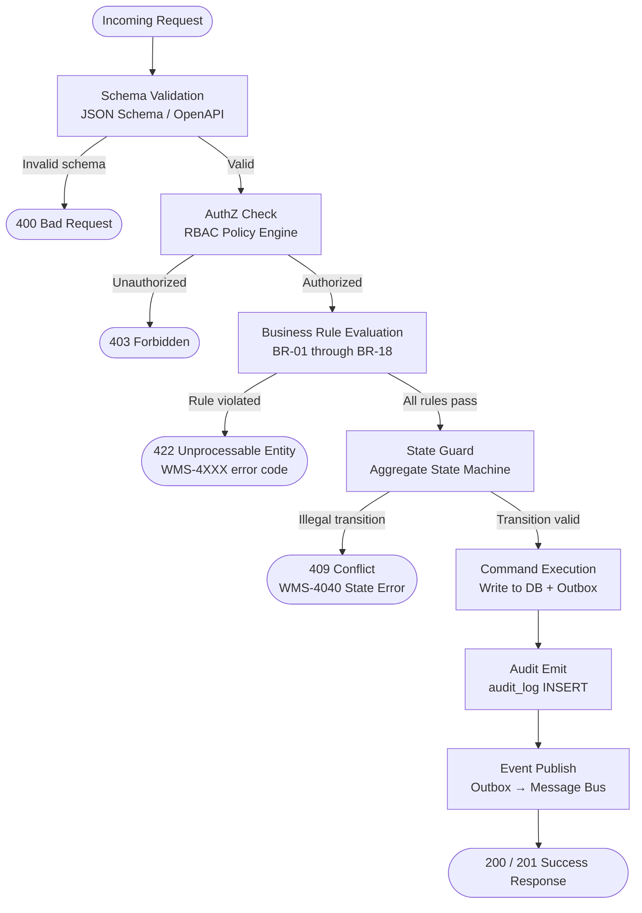

# Business Rules — Warehouse Management System

## Overview

This document captures all enforceable business rules for the WMS. Each rule has a unique identifier (`BR-XX`), an explicit trigger, an enforcement mechanism, and a defined exception process. Rules are evaluated in the **Rule Evaluation Pipeline** before any state-mutating command is persisted.

Rules are classified by impact:
- **P1 – Safety & Compliance**: Rules that, if violated, create legal, safety, or financial liability.
- **P2 – Operational Integrity**: Rules that maintain data consistency and operational accuracy.
- **P3 – Efficiency & SLA**: Rules that optimize throughput and meet service-level agreements.

---

## Enforceable Rules

### BR-01: Bin Capacity Enforcement
**Priority:** P1  
**Description:** No inventory transaction may cause a bin to exceed its defined maximum weight (kg), volume (cm³), or unit count. All three dimensions are checked independently; failing any one dimension rejects the transaction.  
**Trigger:** Any `PUTAWAY`, `TRANSFER_IN`, or `RECEIVE_TO_BIN` command that adds inventory to a bin.  
**Enforcement Mechanism:** Application-level pre-condition check before writing to `inventory_unit`. The check reads `bin.current_weight_kg + proposed_weight > bin.max_weight_kg` (and equivalents for volume and unit count). If any check fails, the command is rejected before persistence.  
**Exception Handling:** A warehouse manager may issue a one-time capacity override with documented justification. The override is time-limited (max 24 hours) and recorded in `override_log`.  
**Related Rules:** BR-09 (minimum stock triggers replenishment into bins that must have headroom), BR-13 (pick task state transitions assume bin is not over-capacity).

---

### BR-02: FIFO / FEFO / LIFO Rotation Policy
**Priority:** P1  
**Description:** Pick selection must honour the rotation policy defined on `product_master.rotation_policy`. FIFO selects the `inventory_unit` with the earliest `received_date`. FEFO selects the earliest `expiry_date`. LIFO selects the latest `received_date`. Rotation policy cannot be overridden on a per-shipment basis.  
**Trigger:** Wave allocation engine selecting `inventory_unit` records to assign to `pick_list_line`.  
**Enforcement Mechanism:** Allocation SQL `ORDER BY` clause enforces rotation order; unit-test suite validates correct ordering for all three policies. Any manual pick instruction that deviates from the computed order is flagged in `audit_log`.  
**Exception Handling:** Quality-hold scenarios may require FEFO override if a lot recall affects specific expiry windows. Requires supervisor approval and creates a `BR-02-OVERRIDE` audit entry.  
**Related Rules:** BR-07 (lot traceability), BR-11 (ATP invariant relies on correct allocation order).

---

### BR-03: Quarantine Flag Blocks Outbound
**Priority:** P1  
**Description:** Any `inventory_unit` with `status = QUARANTINED` must not be included in a pick list, wave allocation, or shipment. Quarantine is set manually by a supervisor or automatically by the system when an inbound discrepancy, a failed QA inspection, a lot recall, or a cold-chain breach is detected.  
**Trigger:** Wave allocation engine; manual pick attempt; API `POST /shipments`.  
**Enforcement Mechanism:** Allocation query includes `WHERE status NOT IN ('QUARANTINED', 'DAMAGED', 'EXPIRED')`. The `pick_list_line` insert trigger re-validates status immediately before insertion.  
**Exception Handling:** Only a user with the `QA_MANAGER` or `WAREHOUSE_MANAGER` role can release quarantine via `PUT /inventory-units/{id}/release-quarantine` with a mandatory `release_reason`.  
**Related Rules:** BR-04 (hazmat shares quarantine mechanisms), BR-07 (lot-level quarantine).

---

### BR-04: Hazmat Zone Restriction
**Priority:** P1  
**Description:** A SKU flagged `is_hazmat = TRUE` may only be stored in zones where `allows_hazmat = TRUE`. Putaway to a non-hazmat zone must be rejected. Mixed-SKU pick lists must not combine hazmat and non-hazmat items in the same tote.  
**Trigger:** `PUTAWAY` command; pick list generation for batch/cluster strategies.  
**Enforcement Mechanism:** Putaway engine checks `zone.allows_hazmat` before bin assignment. Wave planning engine applies tote segregation logic when `sku.is_hazmat = TRUE`.  
**Exception Handling:** No override permitted. Regulatory compliance requirement. If no hazmat bin is available, the system must hold the inbound unit in the hazmat staging area and alert the Warehouse Manager.  
**Related Rules:** BR-01 (bin capacity still applies within hazmat zones), BR-03 (quarantined hazmat units remain in hazmat zone).

---

### BR-05: Receiving Discrepancy Tolerance (±2%)
**Priority:** P2  
**Description:** When a receiving order is closed, the actual received quantity is compared to the expected quantity. If the absolute discrepancy percentage is within ±2%, the system auto-closes the order. Discrepancies outside ±2% require supervisor approval before the order can be closed and inventory updated.  
**Trigger:** `CLOSE_RECEIVING_ORDER` command after all lines scanned.  
**Enforcement Mechanism:** `discrepancy_pct = ABS(total_received - total_expected) / total_expected * 100`. If `discrepancy_pct > 2.0`, the ASN status is set to `PENDING_APPROVAL` and a notification is sent to the Supervisor queue.  
**Exception Handling:** Supervisor documents variance reason (shortage, overage, damaged in transit) and approves or rejects. Rejected ASNs trigger a supplier claim via ERP integration.  
**Related Rules:** BR-07 (lot discrepancies require traceability), BR-16 (similar variance threshold pattern for cycle counts).

---

### BR-06: Serial Number Uniqueness
**Priority:** P1  
**Description:** Each serialized unit must have a globally unique `serial_number.value` across all warehouses and all time. A serial number once assigned to a disposed or shipped unit may never be reused.  
**Trigger:** `RECEIVE_SERIALIZED_UNIT` command; `MANUFACTURE_UNIT` command.  
**Enforcement Mechanism:** `UNIQUE` index on `serial_number.value`. Application-level pre-check raises `WMS-4010` before attempting the INSERT.  
**Exception Handling:** If a supplier ships a duplicate serial, the unit is placed in QUARANTINE status and a supplier discrepancy ticket is created automatically.  
**Related Rules:** BR-03 (duplicates are quarantined), BR-07 (lot may reference multiple serials).

---

### BR-07: Lot Traceability Requirement
**Priority:** P1  
**Description:** All SKUs with `is_lot_tracked = TRUE` must have `lot_number_id` populated on every `inventory_unit` record. Lot numbers must trace from receiving order line through all picks, packs, shipments, and any returns. Full chain-of-custody must be reconstructable from the `audit_log`.  
**Trigger:** `RECEIVE_UNIT`, `PICK_UNIT`, `PACK_UNIT`, `SHIP_UNIT`, `RETURN_UNIT` commands on lot-tracked SKUs.  
**Enforcement Mechanism:** `NOT NULL` constraint on `inventory_unit.lot_number_id` when `product_master.is_lot_tracked = TRUE` (enforced via partial index). API layer validates and rejects requests missing lot data.  
**Exception Handling:** In emergency receiving scenarios (system outage), paper-based lot capture is permitted with mandatory back-entry within 4 hours. Over-48-hour back-entry requires QA Manager approval.  
**Related Rules:** BR-02 (FEFO depends on lot expiry), BR-03 (lot recalls trigger quarantine), BR-05 (discrepancy per lot line).

---

### BR-08: Cold Chain Zone Temperature Enforcement
**Priority:** P1  
**Description:** SKUs with `requires_cold_chain = TRUE` must be stored exclusively in zones with `temperature_min_c` and `temperature_max_c` within the product's required range. If an IoT temperature sensor reports an out-of-range reading for more than 15 consecutive minutes, all inventory in that zone is automatically quarantined.  
**Trigger:** Putaway command; IoT sensor event exceeding temperature bounds.  
**Enforcement Mechanism:** Putaway engine rejects non-cold-chain bin assignments for cold-chain SKUs. Temperature monitoring service subscribes to `wms.zone.temperature.exceeded` events and invokes the bulk-quarantine command.  
**Exception Handling:** Supervisor can release quarantine after documented corrective action and a confirmed re-check at the correct temperature for ≥30 minutes.  
**Related Rules:** BR-03 (quarantine mechanism), BR-04 (cold-chain + hazmat combinations require both checks), BR-07 (lot-level quarantine).

---

### BR-09: Minimum Stock Level Trigger (Replenishment)
**Priority:** P2  
**Description:** When the on-hand quantity of a SKU in a forward-pick bin falls at or below `product_master.min_stock_level`, the system automatically creates a `replenishment_task` to move stock from the bulk/reserve zone to the pick face.  
**Trigger:** Post-pick inventory balance update; post-shipment confirmation; scheduled nightly inventory review job.  
**Enforcement Mechanism:** After every inventory deduction event, a background process evaluates `SUM(quantity WHERE bin.zone_type = 'PICK' AND status = 'ON_HAND') <= min_stock_level`. If true and no active replenishment task exists for that SKU+bin, a new task is created.  
**Exception Handling:** If no reserve stock is available, a stock-out alert is raised to the Warehouse Manager and OMS is notified to hold new orders for the affected SKU.  
**Related Rules:** BR-01 (replenishment target bin must have capacity), BR-11 (ATP reduced until replenishment completes).

---

### BR-10: Wave Cut-Off Time Enforcement
**Priority:** P2  
**Description:** Once a wave's `cut_off_time` is reached, no new shipment orders may be added to that wave. Orders arriving after cut-off are held for the next wave. A wave may be released before cut-off time by an authorised supervisor.  
**Trigger:** `ADD_ORDER_TO_WAVE` command; `RELEASE_WAVE` command.  
**Enforcement Mechanism:** Command handler checks `NOW() > wave_job.cut_off_time` and rejects with `WMS-4020` if true.  
**Exception Handling:** A supervisor with `WAVE_OVERRIDE` permission may extend the cut-off time by up to 30 minutes once per wave. The extension is logged with actor and justification.  
**Related Rules:** BR-13 (pick task transitions depend on wave being in RELEASED state), BR-14 (pack reconciliation triggered after wave completes).

---

### BR-11: Non-Negative ATP (Available-to-Promise) Invariant
**Priority:** P1  
**Description:** The Available-to-Promise quantity (ATP = ON_HAND − RESERVED) must never be negative at the SKU+warehouse level. No allocation command may reduce ATP below zero.  
**Trigger:** Wave allocation engine; manual reservation; API `POST /reservations`.  
**Enforcement Mechanism:** Optimistic locking on the `inventory_balance` aggregate. Allocation uses a `SELECT ... FOR UPDATE` on the balance row; if `ATP - requested_qty < 0`, the command raises `WMS-4030`.  
**Exception Handling:** Supervisors may create a negative-ATP "backorder" reservation only if the SKU has a confirmed inbound ASN with expected arrival within 48 hours. Requires explicit `allow_backorder: true` flag on the reservation request.  
**Related Rules:** BR-09 (replenishment increases ATP), BR-01 (physical capacity and ATP are separate constraints).

---

### BR-12: Idempotent Command Processing
**Priority:** P2  
**Description:** Every mutating command must include a client-supplied `idempotency_key`. If the same key is received more than once, the system returns the original response without re-processing. This prevents duplicate inventory transactions from network retries or scanner double-scans.  
**Trigger:** Any `POST` or `PUT` command to the WMS API.  
**Enforcement Mechanism:** `idempotency_key` is stored in `command_log` with the response payload. Before processing, the handler queries `command_log` for the key; if found, the cached response is returned immediately.  
**Exception Handling:** Keys expire after 24 hours. After expiry, a re-submitted key is treated as a new command.  
**Related Rules:** BR-06 (duplicate serial receive attempts caught by idempotency), BR-05 (prevents double-counting of received units).

---

### BR-13: Pick Task State Transition Guards
**Priority:** P2  
**Description:** Pick list lines must follow the valid state machine: `PENDING → IN_PROGRESS → PICKED | SHORT_PICKED | SKIPPED`. Reverse transitions are not permitted. A pick list cannot be marked `COMPLETED` if any line is still in `PENDING` or `IN_PROGRESS` state.  
**Trigger:** Scanner `CONFIRM_PICK` command; `REPORT_SHORT_PICK` command; `COMPLETE_PICK_LIST` command.  
**Enforcement Mechanism:** State machine implemented in the `PickListLine` domain aggregate. Illegal transitions raise `WMS-4040`.  
**Exception Handling:** A supervisor can force-close a pick list line with a documented reason, which is recorded in the `audit_log` and triggers a discrepancy review.  
**Related Rules:** BR-10 (wave must be RELEASED before picking starts), BR-14 (pack cannot start until all picks are terminal).

---

### BR-14: Pack Reconciliation Before Ship
**Priority:** P1  
**Description:** A shipment order may not be dispatched unless every `pack_list` item has been scanned and confirmed, every container has a valid `tracking_label`, and the packed weight matches the shipment order's declared weight within ±5%.  
**Trigger:** `CONFIRM_DISPATCH` command.  
**Enforcement Mechanism:** Dispatch command pre-condition checks: (1) `pack_list` completeness, (2) all containers have tracking labels, (3) weight reconciliation. Failure on any check raises `WMS-4050`.  
**Exception Handling:** Weight variance > 5% may be approved by Shipping Coordinator with a documented reason. The carrier label is voided and regenerated with the corrected weight.  
**Related Rules:** BR-15 (carrier service level determines label format), BR-13 (all picks must be complete before packing begins).

---

### BR-15: Carrier Service Level Mapping
**Priority:** P3  
**Description:** Each shipment order must have a valid carrier and service level that matches the OMS-requested delivery promise. The WMS validates the carrier+service-level combination against the `carrier_service_level` lookup table. Invalid combinations are rejected.  
**Trigger:** Shipment order creation; label generation.  
**Enforcement Mechanism:** Validation against `carrier_service_level` reference table on shipment order creation. Label generation API additionally validates against the carrier's live rate API.  
**Exception Handling:** If the requested service level is unavailable (e.g., carrier embargo), the system falls back to the next best service level and notifies OMS.  
**Related Rules:** BR-14 (label must exist before dispatch), BR-18 (returns use a separate carrier service).

---

### BR-16: Cycle Count Variance Approval Threshold
**Priority:** P2  
**Description:** After a cycle count is completed, each bin's counted quantity is compared to the system balance. Variances exceeding the configured threshold (`cycle_count.variance_threshold_pct`, default 2%) must be approved by a supervisor before inventory adjustments are posted. Variances within threshold are auto-approved.  
**Trigger:** `COMPLETE_CYCLE_COUNT` command.  
**Enforcement Mechanism:** Post-count comparison query; variance bins flagged in `cycle_count_line.variance_status`. Count enters `PENDING_APPROVAL` state if any variance bin exists.  
**Exception Handling:** If variance is due to a known system issue (e.g., unprocessed pending transfers), the supervisor documents the root cause and can approve with an adjustment note.  
**Related Rules:** BR-05 (receiving variance uses the same ±2% threshold pattern), BR-11 (posted cycle count adjustments affect ATP).

---

### BR-17: Cross-Dock Window Enforcement
**Priority:** P2  
**Description:** A cross-dock operation (inbound to outbound without bin putaway) is only valid if the outbound shipment's `requested_ship_date` falls within the configured cross-dock window (default: same day ± 4 hours from inbound arrival). Cross-docking outside this window requires supervisor approval.  
**Trigger:** `INITIATE_CROSSDOCK` command.  
**Enforcement Mechanism:** Command handler evaluates `|inbound_arrival_time − outbound_requested_ship_date| <= crossdock_window_hours`.  
**Exception Handling:** Supervisor may extend the window up to 8 hours with documented justification.  
**Related Rules:** BR-01 (staging bin capacity during crossdock), BR-14 (pack reconciliation still required for cross-docked shipments).

---

### BR-18: Return Merchandise Authorization (RMA) Required
**Priority:** P1  
**Description:** No inbound return may be processed without a valid, open `return_order` record with an RMA number issued by the OMS. Walk-in returns without a pre-authorised RMA are placed in a quarantine staging bin and an exception alert is raised.  
**Trigger:** `RECEIVE_RETURN` command.  
**Enforcement Mechanism:** Command handler validates `return_order.status = 'OPEN'` and `return_order.rma_number IS NOT NULL` before allowing receipt.  
**Exception Handling:** In cases of customer error (wrong RMA number), the Returns Supervisor may manually link the physical item to the correct RMA after identity verification.  
**Related Rules:** BR-03 (returned items may be quarantined pending inspection), BR-07 (lot traceability for returned items), BR-05 (return quantity discrepancy tolerance).

---

## Rule Evaluation Pipeline

Every mutating API request passes through the following sequential pipeline. A failure at any stage short-circuits the pipeline and returns an error response without persisting any state change.

### Pipeline Stage Descriptions

| Stage | Responsibility | Short-Circuit Condition |
|---|---|---|
| **Schema Validation** | Validates JSON payload against OpenAPI 3.1 schema. Checks required fields, types, and format constraints. | Any schema violation. Returns `400`. |
| **AuthZ Check** | Evaluates RBAC policy: actor role vs. required permission for the command. | Actor lacks required permission. Returns `403`. |
| **Business Rule Evaluation** | Evaluates all applicable BR-XX rules in priority order (P1 before P2 before P3). | First failing rule. Returns `422` with rule ID. |
| **State Guard** | Validates the command against the aggregate's current state machine. | Illegal state transition. Returns `409`. |
| **Command Execution** | Writes domain state changes to the database inside a transaction. Writes event to transactional outbox. | DB constraint violation (last-resort guard). Returns `500`. |
| **Audit Emit** | Inserts `audit_log` record with before/after snapshots. Runs inside the same transaction. | Never short-circuits (audit failure rolls back the whole transaction). |
| **Event Publish** | Outbox relay process asynchronously publishes domain events to the message broker. | Runs asynchronously; does not block the response. |

### Rule Precedence
P1 rules are evaluated first. Within each priority tier, rules are evaluated in numerical order (BR-01, BR-02, …). If a P1 rule fails, P2 and P3 rules are not evaluated.

---

## Exception and Override Handling

### Override Approval Workflow
1. System detects a rule violation and returns error code `WMS-4XXX`.
2. Operator submits an override request via `POST /overrides` with `rule_id`, `entity_id`, `justification`, and supporting evidence.
3. System routes the request to the appropriate approver (see Escalation Matrix).
4. Approver reviews and approves or rejects via the WMS Supervisor UI.
5. If approved, a time-limited override token is issued with an `expires_at` timestamp.
6. Operator re-submits the original command with the override token in the `X-WMS-Override-Token` header.
7. System validates the token and bypasses the specific rule for this single execution.
8. Override usage is recorded in `override_log` with actor, timestamp, and justification.

### Required Evidence for Overrides
| Rule | Required Evidence |
|---|---|
| BR-01 (Capacity) | Photo of bin, weight scale reading, signed supervisor form. |
| BR-03 (Quarantine) | QA inspection report, lab results if applicable. |
| BR-04 (Hazmat) | Regulatory permit number, MSDS confirmation. |
| BR-05 (Receiving Discrepancy) | Carrier exception report or delivery note. |
| BR-08 (Cold Chain) | Temperature log from qualified thermometer, corrective action report. |
| BR-11 (Negative ATP) | Confirmed ASN with ETA within 48 hours. |
| BR-16 (Cycle Count Variance) | Root cause analysis document. |

### Escalation Matrix
| Variance / Violation Severity | First Approver | Second Approver | Escalation Timeout |
|---|---|---|---|
| Low (< 2% variance, non-safety) | Shift Supervisor | — | 2 hours |
| Medium (2–10%, operational) | Warehouse Manager | — | 4 hours |
| High (> 10%, P1 safety rule) | Warehouse Manager | Operations Director | 1 hour |
| Regulatory (Hazmat, Cold Chain) | Compliance Officer | VP Operations | 30 minutes |

### Audit Requirements for Overrides
- Every override creates an immutable `override_log` record.
- Override logs are included in monthly compliance reports sent to Finance and Operations Director.
- All P1 override logs are reviewed by the Compliance Officer within 5 business days.

### Time-Limited Override Policy
- Standard overrides expire after **24 hours**.
- Safety / P1 overrides expire after **4 hours**.
- No override token may be reused. A new override request must be submitted for each instance.

---

## Rule Violation Error Codes

| Rule ID | Rule Name | HTTP Status | WMS Error Code | Message Template |
|---|---|---|---|---|
| BR-01 | Bin Capacity Enforcement | 422 | WMS-4001 | `Bin {bin_code} capacity exceeded: {dimension} limit is {max}, current is {current}, proposed addition is {delta}.` |
| BR-02 | Rotation Policy | 422 | WMS-4002 | `Rotation policy {policy} requires picking {older_unit_id} before {proposed_unit_id}.` |
| BR-03 | Quarantine Blocks Outbound | 422 | WMS-4003 | `Inventory unit {unit_id} is QUARANTINED and cannot be allocated.` |
| BR-04 | Hazmat Zone Restriction | 422 | WMS-4004 | `SKU {sku_code} is hazmat and cannot be stored in zone {zone_code}.` |
| BR-05 | Receiving Discrepancy | 422 | WMS-4005 | `Receiving order {asn_number} discrepancy {pct}% exceeds ±2% tolerance. Supervisor approval required.` |
| BR-06 | Serial Number Uniqueness | 422 | WMS-4006 | `Serial number {serial} already exists in the system.` |
| BR-07 | Lot Traceability | 422 | WMS-4007 | `Lot number is required for SKU {sku_code} but was not provided.` |
| BR-08 | Cold Chain Enforcement | 422 | WMS-4008 | `SKU {sku_code} requires cold chain storage; zone {zone_code} is not temperature-controlled.` |
| BR-09 | Minimum Stock Level | 202 | WMS-2009 | `Replenishment task created for SKU {sku_code} in bin {bin_code}.` |
| BR-10 | Wave Cut-Off | 422 | WMS-4010 | `Wave {wave_number} cut-off time {cut_off} has passed. Order routed to next wave.` |
| BR-11 | Negative ATP | 422 | WMS-4011 | `ATP for SKU {sku_code} in warehouse {warehouse_code} would become negative ({atp}).` |
| BR-12 | Idempotent Command | 200 | WMS-2012 | `Duplicate request detected. Returning cached response for idempotency key {key}.` |
| BR-13 | State Transition Guard | 409 | WMS-4013 | `Invalid state transition for pick list line {line_id}: {from_state} → {to_state}.` |
| BR-14 | Pack Reconciliation | 422 | WMS-4014 | `Shipment {shipment_id} cannot be dispatched: pack reconciliation incomplete.` |
| BR-15 | Carrier Service Level | 422 | WMS-4015 | `Carrier {carrier_code} does not offer service level {service_level}.` |
| BR-16 | Cycle Count Variance | 422 | WMS-4016 | `Cycle count {count_number} has {n} bins with variance above {threshold}%. Supervisor approval required.` |
| BR-17 | Cross-Dock Window | 422 | WMS-4017 | `Cross-dock window of {window}h exceeded for inbound {asn_number} to outbound {shipment_id}.` |
| BR-18 | RMA Required | 422 | WMS-4018 | `No open return order found for RMA {rma_number}. Return placed in quarantine staging.` |
