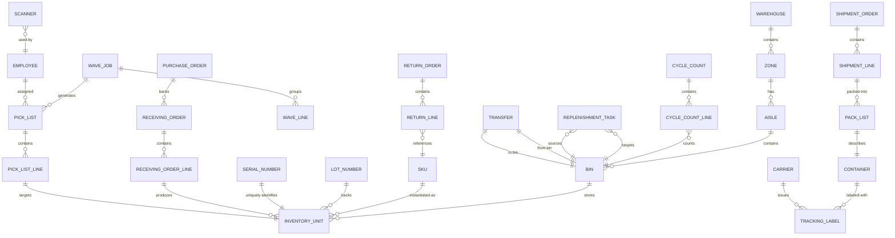

# Data Dictionary — Warehouse Management System

## Overview

This data dictionary is the authoritative reference for every entity, attribute, enumerated type, and constraint used inside the Warehouse Management System (WMS). It is intended for database architects, API designers, QA engineers, and integration teams. All field names use `snake_case`; all date-time values are ISO 8601 UTC; all monetary values are stored as integers in the lowest denomination (cents) unless otherwise noted.

Versioning: This document tracks schema version **2.0.0**. Breaking changes are communicated via the WMS Architecture Review Board before merging.

---

## Core Entities

| Entity | Table / Collection | Description |
|---|---|---|
| Warehouse | `warehouse` | Top-level physical facility. Owns all zones, employees, and devices. |
| Zone | `zone` | Logical or physical subdivision of a warehouse (e.g., BULK, PICK, COLD, HAZMAT, QUARANTINE). |
| Aisle | `aisle` | Named corridor within a zone used for navigation routing. |
| Bin | `bin` | Smallest addressable storage location (slot, shelf, floor position). Enforces capacity constraints. |
| SKU / ProductMaster | `product_master` | Catalogue record for a stockkeeping unit including dimensions, weight, and handling attributes. |
| InventoryUnit | `inventory_unit` | A single traceable unit of a SKU at a specific bin, with lot and serial metadata. |
| LotNumber | `lot_number` | Lot/batch tracking record enabling traceability from supplier through to customer. |
| SerialNumber | `serial_number` | Globally unique serial attached to a single InventoryUnit. |
| ReceivingOrder (ASN) | `receiving_order` | Advanced Shipment Notice from a supplier. Parent for all receiving lines. |
| ReceivingOrderLine | `receiving_order_line` | One SKU line inside an ASN with expected and actual quantities. |
| PurchaseOrder | `purchase_order` | Procurement order from ERP that may back one or more ASNs. |
| PickList | `pick_list` | Set of pick tasks assigned to a picker or a robot for a single wave or order. |
| PickListLine | `pick_list_line` | Single pick instruction (SKU, bin, quantity, UOM). |
| WaveJob | `wave_job` | Planning construct that groups outbound orders into a single execution batch. |
| WaveLine | `wave_line` | One outbound order line allocated to a wave job. |
| ShipmentOrder | `shipment_order` | Outbound shipment header confirmed to be sent to a destination. |
| ShipmentLine | `shipment_line` | One line of a shipment order linking to a product and quantity. |
| PackList | `pack_list` | Packing manifest for a shipment, listing all containers/cartons. |
| Container | `container` | Physical carton, pallet, or tote used to pack shipment items. |
| Carrier | `carrier` | Shipping carrier (FedEx, UPS, DHL, etc.) with service-level definitions. |
| TrackingLabel | `tracking_label` | Carrier-issued label barcode linked to a container. |
| Transfer | `transfer` | Internal stock movement order between two bins or between warehouses. |
| CycleCount | `cycle_count` | Scheduled or ad-hoc physical inventory count for a zone or bin range. |
| CycleCountLine | `cycle_count_line` | Per-bin counted result compared against system balance. |
| ReplenishmentTask | `replenishment_task` | Task to move stock from reserve/bulk storage to a forward-pick bin. |
| ReturnOrder | `return_order` | Reverse logistics order for customer or supplier returns. |
| ReturnLine | `return_line` | One SKU line within a return order with disposition decision. |
| Crossdock | `crossdock` | Direct transfer of inbound goods to outbound dock without bin putaway. |
| Employee | `employee` | Warehouse staff member with role, badge ID, and certifications. |
| Scanner | `scanner` | RF/Bluetooth barcode scanner device assigned to an employee session. |
| ForkliftDevice | `forklift_device` | Motorised MHE (Material Handling Equipment) tracked for zone access. |

---

## Canonical Relationship Diagram

---

## Entity Attribute Tables

### Warehouse

| Field | Type | Nullable | Constraints | Description |
|---|---|---|---|---|
| `warehouse_id` | UUID | No | PRIMARY KEY | Globally unique warehouse identifier. |
| `code` | VARCHAR(20) | No | UNIQUE, NOT NULL | Short human-readable code (e.g., `WH-EAST-01`). |
| `name` | VARCHAR(120) | No | NOT NULL | Display name. |
| `address_line1` | VARCHAR(200) | No | NOT NULL | Street address line 1. |
| `address_line2` | VARCHAR(200) | Yes | — | Street address line 2 / suite. |
| `city` | VARCHAR(100) | No | NOT NULL | City. |
| `state_province` | VARCHAR(100) | No | NOT NULL | State or province. |
| `postal_code` | VARCHAR(20) | No | NOT NULL | ZIP / postal code. |
| `country_code` | CHAR(2) | No | ISO 3166-1 alpha-2 | Two-letter country code. |
| `latitude` | DECIMAL(9,6) | Yes | CHECK(-90..90) | GPS latitude. |
| `longitude` | DECIMAL(9,6) | Yes | CHECK(-180..180) | GPS longitude. |
| `timezone` | VARCHAR(60) | No | NOT NULL | IANA timezone string (e.g., `America/New_York`). |
| `total_sqft` | DECIMAL(12,2) | Yes | CHECK(>0) | Total floor area in square feet. |
| `is_active` | BOOLEAN | No | DEFAULT TRUE | Soft-enable/disable flag. |
| `created_at` | TIMESTAMPTZ | No | DEFAULT NOW() | Record creation timestamp. |
| `updated_at` | TIMESTAMPTZ | No | DEFAULT NOW() | Last modification timestamp. |

---

### Zone

| Field | Type | Nullable | Constraints | Description |
|---|---|---|---|---|
| `zone_id` | UUID | No | PRIMARY KEY | Unique zone identifier. |
| `warehouse_id` | UUID | No | FK → warehouse | Parent warehouse. |
| `code` | VARCHAR(20) | No | UNIQUE within warehouse | Short zone code (e.g., `COLD-A`). |
| `name` | VARCHAR(120) | No | NOT NULL | Zone display name. |
| `zone_type` | ENUM | No | See ZoneType enum | Storage classification. |
| `temperature_min_c` | DECIMAL(5,2) | Yes | CHECK(min <= max) | Minimum temperature (°C) for cold-chain. |
| `temperature_max_c` | DECIMAL(5,2) | Yes | CHECK(min <= max) | Maximum temperature (°C) for cold-chain. |
| `allows_hazmat` | BOOLEAN | No | DEFAULT FALSE | Whether hazardous materials are permitted. |
| `max_weight_kg` | DECIMAL(10,2) | Yes | CHECK(>0) | Maximum total weight capacity for the zone. |
| `pick_sequence` | INTEGER | Yes | CHECK(>0) | Ordering hint for wave pick-path optimization. |
| `replenishment_zone_id` | UUID | Yes | FK → zone | Source zone for replenishment into this zone. |
| `is_quarantine` | BOOLEAN | No | DEFAULT FALSE | All inventory in this zone is automatically quarantined. |
| `is_active` | BOOLEAN | No | DEFAULT TRUE | Soft-delete flag. |
| `created_at` | TIMESTAMPTZ | No | DEFAULT NOW() | — |
| `updated_at` | TIMESTAMPTZ | No | DEFAULT NOW() | — |

---

### Bin

| Field | Type | Nullable | Constraints | Description |
|---|---|---|---|---|
| `bin_id` | UUID | No | PRIMARY KEY | Unique bin identifier. |
| `aisle_id` | UUID | No | FK → aisle | Parent aisle. |
| `zone_id` | UUID | No | FK → zone | Denormalized zone for fast lookup. |
| `bin_code` | VARCHAR(30) | No | UNIQUE within warehouse | Human-readable address (e.g., `A-01-03-B`). |
| `bin_type` | ENUM | No | See BinType enum | Floor, shelf, rack level, pallet, etc. |
| `max_weight_kg` | DECIMAL(8,3) | No | CHECK(>0) | Maximum load weight. |
| `max_volume_cm3` | DECIMAL(12,2) | No | CHECK(>0) | Maximum cubic volume. |
| `max_unit_count` | INTEGER | Yes | CHECK(>0) | Maximum number of pick units. |
| `current_weight_kg` | DECIMAL(8,3) | No | DEFAULT 0 | Computed live weight (updated on each transaction). |
| `current_volume_cm3` | DECIMAL(12,2) | No | DEFAULT 0 | Computed live volume. |
| `current_unit_count` | INTEGER | No | DEFAULT 0 | Computed live unit count. |
| `is_locked` | BOOLEAN | No | DEFAULT FALSE | Locked bins cannot receive or release stock. |
| `lock_reason` | VARCHAR(255) | Yes | — | Reason for locking (e.g., `CYCLE_COUNT_IN_PROGRESS`). |
| `is_active` | BOOLEAN | No | DEFAULT TRUE | Soft-delete flag. |
| `created_at` | TIMESTAMPTZ | No | DEFAULT NOW() | — |
| `updated_at` | TIMESTAMPTZ | No | DEFAULT NOW() | — |

---

### SKU / ProductMaster

| Field | Type | Nullable | Constraints | Description |
|---|---|---|---|---|
| `sku_id` | UUID | No | PRIMARY KEY | Unique product master identifier. |
| `sku_code` | VARCHAR(50) | No | UNIQUE, NOT NULL | Internal SKU code. |
| `upc` | VARCHAR(14) | Yes | UNIQUE | Universal Product Code (GTIN-14). |
| `name` | VARCHAR(200) | No | NOT NULL | Product display name. |
| `description` | TEXT | Yes | — | Long-form product description. |
| `unit_of_measure` | VARCHAR(20) | No | NOT NULL | Base UOM (EA, CS, LB, KG, L). |
| `weight_kg` | DECIMAL(8,4) | No | CHECK(>0) | Unit weight in kilograms. |
| `length_cm` | DECIMAL(8,2) | No | CHECK(>0) | Unit length. |
| `width_cm` | DECIMAL(8,2) | No | CHECK(>0) | Unit width. |
| `height_cm` | DECIMAL(8,2) | No | CHECK(>0) | Unit height. |
| `is_serialized` | BOOLEAN | No | DEFAULT FALSE | Requires per-unit serial number tracking. |
| `is_lot_tracked` | BOOLEAN | No | DEFAULT FALSE | Requires lot/batch tracking. |
| `is_hazmat` | BOOLEAN | No | DEFAULT FALSE | Subject to hazmat zone restriction (BR-04). |
| `hazmat_class` | VARCHAR(20) | Yes | — | UN hazmat class (e.g., `3`, `8`). |
| `requires_cold_chain` | BOOLEAN | No | DEFAULT FALSE | Must be stored in a temperature-controlled zone. |
| `rotation_policy` | ENUM | No | DEFAULT 'FEFO' | FIFO, FEFO, or LIFO rotation policy. |
| `min_stock_level` | INTEGER | No | DEFAULT 0 | Reorder point that triggers replenishment. |
| `reorder_quantity` | INTEGER | No | DEFAULT 1 | Quantity to replenish when min stock is breached. |
| `supplier_id` | UUID | Yes | FK → supplier | Primary supplier reference. |
| `is_active` | BOOLEAN | No | DEFAULT TRUE | Deactivated SKUs cannot be received or picked. |
| `created_at` | TIMESTAMPTZ | No | DEFAULT NOW() | — |
| `updated_at` | TIMESTAMPTZ | No | DEFAULT NOW() | — |

---

### InventoryUnit

| Field | Type | Nullable | Constraints | Description |
|---|---|---|---|---|
| `inventory_unit_id` | UUID | No | PRIMARY KEY | Unique per-unit record. |
| `sku_id` | UUID | No | FK → product_master | Product reference. |
| `bin_id` | UUID | No | FK → bin | Current bin location. |
| `lot_number_id` | UUID | Yes | FK → lot_number | Lot/batch reference (required if SKU is lot-tracked). |
| `serial_number_id` | UUID | Yes | FK → serial_number | Serial reference (required if SKU is serialized). |
| `quantity` | INTEGER | No | CHECK(>=0) | Current quantity at this unit record. |
| `unit_of_measure` | VARCHAR(20) | No | NOT NULL | UOM matches product_master base UOM. |
| `status` | ENUM | No | See InventoryStatus | ON_HAND, QUARANTINED, RESERVED, PICK_IN_PROGRESS, etc. |
| `received_date` | DATE | No | NOT NULL | Date goods were physically received (for FIFO/FEFO). |
| `expiry_date` | DATE | Yes | — | Expiry date for FEFO rotation (required for perishables). |
| `cost_price` | INTEGER | Yes | CHECK(>=0) | Unit cost in cents (lowest denomination). |
| `receiving_order_line_id` | UUID | Yes | FK → receiving_order_line | Source receiving line. |
| `is_allocated` | BOOLEAN | No | DEFAULT FALSE | True when reserved for a wave/pick. |
| `allocated_to_wave_id` | UUID | Yes | FK → wave_job | Wave that has allocated this unit. |
| `created_at` | TIMESTAMPTZ | No | DEFAULT NOW() | — |
| `updated_at` | TIMESTAMPTZ | No | DEFAULT NOW() | — |

---

### ReceivingOrder (ASN)

| Field | Type | Nullable | Constraints | Description |
|---|---|---|---|---|
| `receiving_order_id` | UUID | No | PRIMARY KEY | Unique ASN identifier. |
| `asn_number` | VARCHAR(50) | No | UNIQUE, NOT NULL | Supplier-assigned ASN reference. |
| `purchase_order_id` | UUID | Yes | FK → purchase_order | Backing PO from ERP. |
| `supplier_id` | UUID | No | FK → supplier | Supplier who dispatched the shipment. |
| `warehouse_id` | UUID | No | FK → warehouse | Destination warehouse. |
| `status` | ENUM | No | See ReceivingStatus | SCHEDULED, IN_TRANSIT, ARRIVED, RECEIVING, RECEIVED, CLOSED. |
| `expected_arrival_date` | DATE | No | NOT NULL | Planned delivery date. |
| `actual_arrival_date` | DATE | Yes | — | Actual date truck arrived. |
| `receiving_started_at` | TIMESTAMPTZ | Yes | — | Timestamp when first scan began. |
| `receiving_completed_at` | TIMESTAMPTZ | Yes | — | Timestamp when receipt was confirmed. |
| `total_expected_units` | INTEGER | No | CHECK(>=0) | Sum of all line expected quantities. |
| `total_received_units` | INTEGER | No | DEFAULT 0 | Running sum of scanned units. |
| `discrepancy_pct` | DECIMAL(5,2) | Yes | — | Computed: (received-expected)/expected * 100. |
| `dock_door` | VARCHAR(20) | Yes | — | Assigned dock door identifier. |
| `carrier_id` | UUID | Yes | FK → carrier | Carrier that delivered the ASN. |
| `pro_number` | VARCHAR(50) | Yes | — | Carrier PRO/waybill number. |
| `notes` | TEXT | Yes | — | Free-text notes from receivers. |
| `created_at` | TIMESTAMPTZ | No | DEFAULT NOW() | — |
| `updated_at` | TIMESTAMPTZ | No | DEFAULT NOW() | — |

---

### WaveJob

| Field | Type | Nullable | Constraints | Description |
|---|---|---|---|---|
| `wave_job_id` | UUID | No | PRIMARY KEY | Unique wave identifier. |
| `warehouse_id` | UUID | No | FK → warehouse | Owning warehouse. |
| `wave_number` | VARCHAR(30) | No | UNIQUE within warehouse | Human-readable wave number (e.g., `WAVE-2024-0451`). |
| `status` | ENUM | No | See WaveStatus | PLANNING, RELEASED, IN_PROGRESS, COMPLETED, CANCELLED. |
| `cut_off_time` | TIMESTAMPTZ | No | NOT NULL | Hard cut-off; no new orders added after this time (BR-10). |
| `planned_pick_start` | TIMESTAMPTZ | Yes | — | Scheduled start time for pick execution. |
| `actual_pick_start` | TIMESTAMPTZ | Yes | — | Actual time first pick task was accepted. |
| `completed_at` | TIMESTAMPTZ | Yes | — | Timestamp when all pick tasks reached terminal state. |
| `pick_strategy` | ENUM | No | See PickStrategy | SINGLE, BATCH, ZONE, CLUSTER. |
| `zone_ids` | UUID[] | Yes | — | Zones included in this wave. |
| `total_lines` | INTEGER | No | DEFAULT 0 | Count of wave lines. |
| `total_units` | INTEGER | No | DEFAULT 0 | Sum of all units to pick. |
| `assigned_pickers` | INTEGER | No | DEFAULT 0 | Number of pickers assigned. |
| `created_by` | UUID | No | FK → employee | Wave planner who created the wave. |
| `released_by` | UUID | Yes | FK → employee | Supervisor who released the wave. |
| `created_at` | TIMESTAMPTZ | No | DEFAULT NOW() | — |
| `updated_at` | TIMESTAMPTZ | No | DEFAULT NOW() | — |

---

### PickList

| Field | Type | Nullable | Constraints | Description |
|---|---|---|---|---|
| `pick_list_id` | UUID | No | PRIMARY KEY | Unique pick list identifier. |
| `wave_job_id` | UUID | No | FK → wave_job | Parent wave. |
| `employee_id` | UUID | Yes | FK → employee | Assigned picker (null until assigned). |
| `scanner_id` | UUID | Yes | FK → scanner | Scanner device in use. |
| `status` | ENUM | No | See PickListStatus | UNASSIGNED, ASSIGNED, IN_PROGRESS, COMPLETED, EXCEPTION. |
| `pick_strategy` | ENUM | No | Inherited from wave_job | Pick method for this list. |
| `total_lines` | INTEGER | No | DEFAULT 0 | Number of pick lines. |
| `picked_lines` | INTEGER | No | DEFAULT 0 | Lines confirmed as picked. |
| `short_picked_lines` | INTEGER | No | DEFAULT 0 | Lines with insufficient stock (short pick). |
| `assigned_at` | TIMESTAMPTZ | Yes | — | Time pick list was assigned to a picker. |
| `started_at` | TIMESTAMPTZ | Yes | — | Time first line was confirmed. |
| `completed_at` | TIMESTAMPTZ | Yes | — | Time all lines reached terminal state. |
| `estimated_minutes` | INTEGER | Yes | CHECK(>0) | Estimated time to complete. |
| `created_at` | TIMESTAMPTZ | No | DEFAULT NOW() | — |
| `updated_at` | TIMESTAMPTZ | No | DEFAULT NOW() | — |

---

### CycleCount

| Field | Type | Nullable | Constraints | Description |
|---|---|---|---|---|
| `cycle_count_id` | UUID | No | PRIMARY KEY | Unique cycle count identifier. |
| `warehouse_id` | UUID | No | FK → warehouse | Owning warehouse. |
| `count_number` | VARCHAR(30) | No | UNIQUE within warehouse | Human-readable count reference. |
| `count_type` | ENUM | No | SCHEDULED, AD_HOC, FULL | Type of count. |
| `status` | ENUM | No | See CycleCountStatus | PLANNED, IN_PROGRESS, PENDING_APPROVAL, APPROVED, POSTED. |
| `zone_id` | UUID | Yes | FK → zone | Zone scope (null means full warehouse count). |
| `bin_range_start` | VARCHAR(30) | Yes | — | Start of bin address range. |
| `bin_range_end` | VARCHAR(30) | Yes | — | End of bin address range. |
| `scheduled_date` | DATE | No | NOT NULL | Planned execution date. |
| `started_at` | TIMESTAMPTZ | Yes | — | Actual start time. |
| `completed_at` | TIMESTAMPTZ | Yes | — | Time last bin was counted. |
| `approved_at` | TIMESTAMPTZ | Yes | — | Supervisor approval timestamp. |
| `approved_by` | UUID | Yes | FK → employee | Approving supervisor. |
| `variance_threshold_pct` | DECIMAL(5,2) | No | DEFAULT 2.0 | Variance % requiring supervisor approval (BR-16). |
| `total_bins` | INTEGER | No | DEFAULT 0 | Bins in scope. |
| `counted_bins` | INTEGER | No | DEFAULT 0 | Bins counted so far. |
| `variance_bins` | INTEGER | No | DEFAULT 0 | Bins with variance above threshold. |
| `created_at` | TIMESTAMPTZ | No | DEFAULT NOW() | — |
| `updated_at` | TIMESTAMPTZ | No | DEFAULT NOW() | — |

---

### ShipmentOrder

| Field | Type | Nullable | Constraints | Description |
|---|---|---|---|---|
| `shipment_order_id` | UUID | No | PRIMARY KEY | Unique shipment order identifier. |
| `oms_order_id` | VARCHAR(100) | No | NOT NULL | Source order reference from OMS. |
| `warehouse_id` | UUID | No | FK → warehouse | Fulfilling warehouse. |
| `status` | ENUM | No | See ShipmentStatus | PENDING, ALLOCATED, PACKED, LABEL_GENERATED, DISPATCHED, CANCELLED. |
| `ship_to_name` | VARCHAR(200) | No | NOT NULL | Recipient name. |
| `ship_to_address_line1` | VARCHAR(200) | No | NOT NULL | Delivery address. |
| `ship_to_city` | VARCHAR(100) | No | NOT NULL | Delivery city. |
| `ship_to_state` | VARCHAR(100) | No | NOT NULL | Delivery state. |
| `ship_to_postal_code` | VARCHAR(20) | No | NOT NULL | Delivery postal code. |
| `ship_to_country_code` | CHAR(2) | No | ISO 3166-1 | Delivery country. |
| `carrier_id` | UUID | No | FK → carrier | Assigned carrier. |
| `service_level` | ENUM | No | See CarrierServiceLevel | GROUND, EXPRESS, OVERNIGHT, FREIGHT. |
| `requested_ship_date` | DATE | No | NOT NULL | Customer-requested ship date. |
| `actual_ship_date` | DATE | Yes | — | Actual date dispatched. |
| `total_weight_kg` | DECIMAL(8,3) | Yes | — | Computed total shipment weight. |
| `is_residential` | BOOLEAN | No | DEFAULT FALSE | Residential delivery surcharge flag. |
| `created_at` | TIMESTAMPTZ | No | DEFAULT NOW() | — |
| `updated_at` | TIMESTAMPTZ | No | DEFAULT NOW() | — |

---

## Enumerated Types

### InventoryStatus
| Value | Description |
|---|---|
| `ON_HAND` | Available stock, not reserved. |
| `RESERVED` | Allocated to an outbound order but not yet picked. |
| `PICK_IN_PROGRESS` | Currently being physically picked. |
| `PICKED` | Picked and moved to pack staging. |
| `QUARANTINED` | Blocked for outbound; requires QA release (BR-03). |
| `DAMAGED` | Confirmed damaged; pending write-off or return. |
| `EXPIRED` | Past expiry date; cannot be shipped. |
| `IN_TRANSIT` | Being moved between bins or warehouses. |
| `DISPOSED` | Written off; record kept for traceability. |

### ZoneType
| Value | Description |
|---|---|
| `BULK` | Large-format pallet storage. |
| `PICK` | Forward pick face for high-velocity items. |
| `COLD` | Temperature-controlled zone (cold chain). |
| `HAZMAT` | Restricted zone for hazardous materials. |
| `QUARANTINE` | Isolation zone for suspect or hold stock. |
| `RETURNS` | Reverse logistics receiving area. |
| `STAGING` | Temporary holding before putaway or shipment. |
| `CROSSDOCK` | Pass-through zone for cross-docking operations. |
| `OVERFLOW` | Flex capacity zone activated during peak. |

### PickStrategy
| Value | Description |
|---|---|
| `SINGLE` | One picker per order. |
| `BATCH` | One picker handles multiple orders simultaneously. |
| `ZONE` | Picker works only within a designated zone. |
| `CLUSTER` | Picker carries multiple totes for concurrent orders. |

### RotationPolicy
| Value | Description |
|---|---|
| `FIFO` | First In, First Out — oldest received_date picked first. |
| `FEFO` | First Expired, First Out — earliest expiry_date picked first. |
| `LIFO` | Last In, First Out — used for raw materials when freshness is not a concern. |

### WaveStatus
| Value | Description |
|---|---|
| `PLANNING` | Wave is being built; orders still being added. |
| `RELEASED` | Wave locked; pick lists generated. |
| `IN_PROGRESS` | At least one pick list has been started. |
| `COMPLETED` | All pick lists in terminal state. |
| `CANCELLED` | Wave aborted; allocations released. |

### PickListStatus
| Value | Description |
|---|---|
| `UNASSIGNED` | No picker assigned yet. |
| `ASSIGNED` | Picker assigned but not started. |
| `IN_PROGRESS` | Picker actively picking. |
| `COMPLETED` | All lines in terminal state. |
| `EXCEPTION` | One or more lines blocked; requires supervisor resolution. |

### ReceivingStatus
| Value | Description |
|---|---|
| `SCHEDULED` | Expected but not yet arrived. |
| `IN_TRANSIT` | Carrier has picked up; en route. |
| `ARRIVED` | Truck arrived at dock. |
| `RECEIVING` | Physical counting and scanning in progress. |
| `RECEIVED` | All lines processed; pending closure. |
| `CLOSED` | Fully processed and inventory updated. |

### ShipmentStatus
| Value | Description |
|---|---|
| `PENDING` | Order received; not yet allocated. |
| `ALLOCATED` | Stock reserved for this shipment. |
| `PACKED` | All items packed into containers. |
| `LABEL_GENERATED` | Carrier label(s) printed. |
| `DISPATCHED` | Handed to carrier; tracking active. |
| `CANCELLED` | Order cancelled; stock released. |

### CarrierServiceLevel
| Value | Description |
|---|---|
| `GROUND` | Standard ground delivery (3–7 days). |
| `EXPRESS` | 2-day express delivery. |
| `OVERNIGHT` | Next-business-day delivery. |
| `FREIGHT` | LTL or FTL freight for large shipments. |
| `SAME_DAY` | Same-day local delivery. |

### CycleCountStatus
| Value | Description |
|---|---|
| `PLANNED` | Count scheduled but not started. |
| `IN_PROGRESS` | Counting actively underway. |
| `PENDING_APPROVAL` | Count complete; variance awaiting supervisor sign-off. |
| `APPROVED` | Supervisor approved adjustments. |
| `POSTED` | Inventory balances updated in system. |

### BinType
| Value | Description |
|---|---|
| `FLOOR` | Floor-level pallet position. |
| `SHELF` | Shelving unit slot. |
| `RACK_LEVEL` | Elevated rack beam level. |
| `PALLET` | Named pallet position. |
| `STAGING` | Inbound or outbound staging position. |
| `OVERFLOW` | Temporary overflow position. |

---

## Data Quality Controls

### Uniqueness Constraints
- `warehouse.code` — globally unique across all warehouses.
- `bin.bin_code` — unique within a warehouse (enforced via composite index on `(warehouse_id, bin_code)`).
- `serial_number.value` — globally unique across all warehouses and all time (including disposed units).
- `receiving_order.asn_number` — unique per supplier.
- `wave_job.wave_number` — unique per warehouse per day.
- `product_master.sku_code` — globally unique.
- `product_master.upc` — globally unique when not null.

### Non-Null Enforcement
All foreign keys on mandatory relationships are enforced at the database level with `NOT NULL`. Optional relationships use nullable FK with explicit `NULL` permitted. No `NOT NULL` constraint may be relaxed without an ARB review.

### Value Range Checks
- All weight and volume fields: `CHECK(value >= 0)`.
- `bin.current_weight_kg <= bin.max_weight_kg` — enforced by application trigger before every inventory transaction; violation raises `WMS-4001`.
- `inventory_unit.quantity >= 0` — no negative stock allowed in individual unit records.
- `receiving_order.discrepancy_pct` must satisfy `ABS(discrepancy_pct) <= 2.0` for auto-close; otherwise supervisor approval required (BR-05).
- `cycle_count.variance_threshold_pct` defaults to `2.0` and must be between `0.0` and `100.0`.

### Referential Integrity Rules
- Cascade deletes are **prohibited** on all operational tables. Soft-delete (`is_active = FALSE`) is the only permitted removal mechanism.
- `inventory_unit.bin_id` must reference an active, non-locked bin for any insert or update unless the operation is a system-initiated lock (e.g., cycle count).
- `pick_list_line.inventory_unit_id` must reference a unit with status `RESERVED` or `ON_HAND`.

### Audit Trail Requirements
Every table that mutates inventory balances or status must have corresponding entries in `audit_log` with:
- `event_type` (e.g., `INVENTORY_ADJUSTED`)
- `entity_type` and `entity_id`
- `actor_id` (employee or service account)
- `before_state` (JSONB snapshot)
- `after_state` (JSONB snapshot)
- `created_at` (TIMESTAMPTZ)

Audit records are **immutable**. No `UPDATE` or `DELETE` is permitted on `audit_log`.

### Soft-Delete Pattern
All master data and transactional headers use `is_active BOOLEAN DEFAULT TRUE`. Queries must include `WHERE is_active = TRUE` unless explicitly auditing historical data. Cascading soft-delete propagates to child records (e.g., deactivating a Zone deactivates all its Aisles and Bins).

### Data Retention
- Operational transaction data: retained for 7 years (regulatory minimum).
- Audit logs: retained for 10 years.
- Soft-deleted master data: retained indefinitely for traceability.
- Event payloads on the message bus: retained for 30 days on the broker; archived to cold storage for 7 years.
