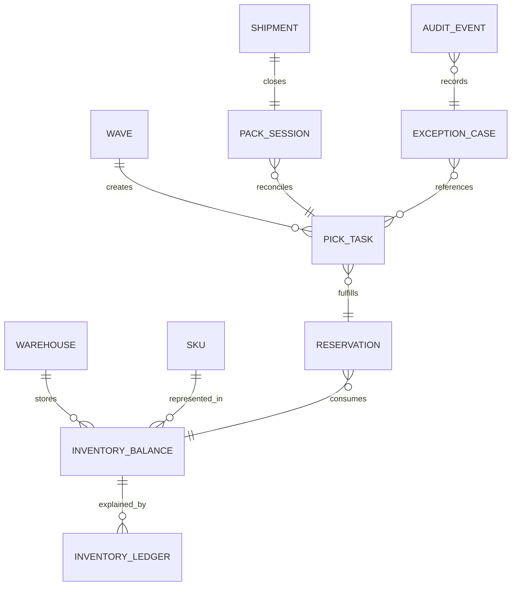

# Data Dictionary

This document defines implementation-ready data semantics for WMS write paths, read models, and analytics pipelines.

## Canonical Entities

| Entity | Purpose | Required Attributes | Business Constraints |
|---|---|---|---|
| `warehouse` | Physical operating boundary | `warehouse_id`, `code`, `timezone`, `region` | Unique `code` per region |
| `sku` | Product identity and handling metadata | `sku_id`, `uom`, `lot_controlled`, `serial_controlled` | Lot/serial flags immutable after activation |
| `inventory_balance` | Current stock snapshot by bin | `warehouse_id`, `sku_id`, `bin_id`, `on_hand`, `reserved` | `on_hand >= reserved >= 0` |
| `inventory_ledger` | Immutable movement history | `ledger_id`, `mutation_type`, `qty_delta`, `correlation_id`, `actor_id` | Append-only; no hard updates |
| `reservation` | Allocation commitment for order line | `reservation_id`, `order_line_id`, `sku_id`, `qty`, `state` | One active reservation per order-line split |
| `pick_task` | Executable work unit | `task_id`, `wave_id`, `reservation_id`, `state`, `zone` | State transitions must follow guard graph |
| `pack_session` | Carton reconciliation context | `pack_session_id`, `shipment_id`, `state`, `line_totals` | Cannot close if unreconciled deltas exist |
| `shipment` | Outbound execution + carrier linkage | `shipment_id`, `status`, `carrier`, `tracking_no` | Confirm-once semantic |
| `exception_case` | Operational issue and remediation | `case_id`, `type`, `state`, `owner_id`, `severity` | Closed cases immutable except comment append |
| `audit_event` | Compliance trail | `audit_id`, `entity_type`, `entity_id`, `action`, `reason_code`, `occurred_at` | Immutable retention policy |

## Relationship Diagram

## Data Quality and Validation Rules
- Required field validation must run before authorization side effects.
- Natural-key duplicate detection required for scanner-originated transactions.
- `reason_code` mandatory for all manual or exception-driven updates.
- `correlation_id` required on all mutating command payloads.

## Retention and Access Patterns
- Hot OLTP: balances, reservations, open tasks/cases.
- Warm analytic store: inventory ledger, shipment history, performance KPIs.
- Audit retention: immutable archive with legal-hold support.

## Indexing Guidance
- `inventory_balance(warehouse_id, sku_id, bin_id)`
- `reservation(order_line_id, state)`
- `pick_task(wave_id, state, zone)`
- `exception_case(state, severity, owner_id)`
