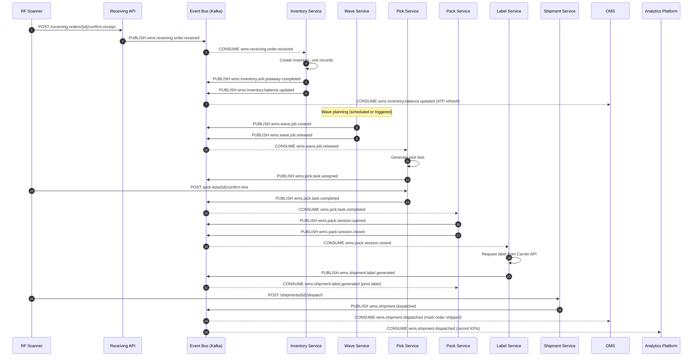

# Event Catalog — Warehouse Management System

## Overview

This document is the authoritative catalog of all domain events published and consumed by the Warehouse Management System. It covers event naming conventions, payload schemas, producer/consumer mappings, sequencing diagrams, and operational SLOs. All consuming services must subscribe to events via the central message broker (Apache Kafka / NATS JetStream) and must not poll the WMS database directly.

Events follow the **CloudEvents 1.0** specification and are serialized as JSON. All events are published to a durable, ordered topic per domain.

---

## Contract Conventions

### Event Envelope Structure

Every event emitted by the WMS adheres to the following JSON envelope:

```json
{
  "specversion": "1.0",
  "id": "01HXQ3B7NKPM2S4V8WYEG6T1R0",
  "source": "wms.service.receiving",
  "type": "wms.receiving.order.received",
  "datacontenttype": "application/json",
  "dataschema": "https://schemas.wms.internal/receiving/order-received/v2.json",
  "time": "2024-07-15T14:32:00.000Z",
  "subject": "receiving_order/01HXQ3B7NKPM2S4V8WYEG6T000",
  "data": {
    "receiving_order_id": "01HXQ3B7NKPM2S4V8WYEG6T000",
    "asn_number": "ASN-2024-00451",
    "warehouse_id": "wh-east-01",
    "total_received_units": 480,
    "total_expected_units": 490,
    "discrepancy_pct": -2.04,
    "received_at": "2024-07-15T14:31:55.000Z"
  },
  "wms_correlation_id": "corr-abc123",
  "wms_causation_id": "cmd-xyz789"
}
```

### Field Descriptions

| Field | Type | Description |
|---|---|---|
| `specversion` | string | CloudEvents spec version, always `"1.0"`. |
| `id` | ULID | Globally unique event ID (ULID format for lexicographic ordering). |
| `source` | URI | Producing service URN in format `wms.service.{service-name}`. |
| `type` | string | Event type following `wms.{domain}.{entity}.{verb}` convention. |
| `datacontenttype` | string | Always `application/json`. |
| `dataschema` | URI | Canonical JSON Schema URI for the `data` object. |
| `time` | ISO 8601 | UTC timestamp of when the event occurred. |
| `subject` | string | `{entity-type}/{entity-id}` — the primary entity the event is about. |
| `data` | object | Domain-specific event payload (varies per event type). |
| `wms_correlation_id` | string | Distributed trace correlation ID for log/trace correlation. |
| `wms_causation_id` | string | ID of the command that caused this event. |

### Topic / Subject Naming Convention
Topics follow the pattern `wms.{domain}.{entity}.{verb}`:
- `domain`: lowercase domain name (e.g., `receiving`, `inventory`, `wave`, `pick`, `pack`, `shipment`, `cycle-count`, `replenishment`, `transfer`, `return`).
- `entity`: lowercase entity name (e.g., `order`, `unit`, `job`, `task`, `session`, `label`).
- `verb`: past-tense action (e.g., `created`, `received`, `completed`, `dispatched`).

Examples: `wms.receiving.order.created`, `wms.pick.task.completed`, `wms.shipment.dispatched`.

### Versioning Strategy
- The `dataschema` URI includes the major version (`/v2.json`).
- Breaking changes (removed fields, changed types) increment the major version and require a new topic.
- Additive changes (new optional fields) are backward-compatible and do not increment the major version.
- Deprecated fields are marked in the schema with `"deprecated": true` and removed after a 90-day sunset period.

### Idempotency
Consumers must treat events as at-least-once delivered. The `id` (ULID) field serves as the idempotency key. Consumers should maintain a deduplication window of at least 24 hours.

### Ordering Guarantees
- Events within the same `subject` (entity instance) are delivered in the order they were published.
- Cross-entity ordering is not guaranteed. Consumers must use `time` and logical sequence numbers for cross-entity ordering.

---

## Domain Events

### Summary Table

| # | Event Type | Domain | Producer | Key Consumers |
|---|---|---|---|---|
| 1 | `wms.receiving.order.created` | Receiving | Receiving API | Inventory, Notification |
| 2 | `wms.receiving.order.received` | Receiving | Receiving API | Inventory, ERP, Analytics |
| 3 | `wms.receiving.discrepancy.detected` | Receiving | Receiving API | Supervisor UI, ERP, Compliance |
| 4 | `wms.inventory.unit.putaway-completed` | Inventory | Inventory Service | Replenishment, Bin Mgmt |
| 5 | `wms.inventory.balance.updated` | Inventory | Inventory Service | ATP Engine, OMS, Analytics |
| 6 | `wms.inventory.unit.quarantined` | Inventory | Inventory Service | QA, Notification, OMS |
| 7 | `wms.wave.job.created` | Wave | Wave Service | Pick Service, Notification |
| 8 | `wms.wave.job.released` | Wave | Wave Service | Pick Service, Supervisor UI |
| 9 | `wms.pick.task.assigned` | Pick | Pick Service | Scanner App, Employee App |
| 10 | `wms.pick.task.completed` | Pick | Pick Service | Pack Service, Wave Service |
| 11 | `wms.pick.task.short-picked` | Pick | Pick Service | Replenishment, OMS, Supervisor |
| 12 | `wms.pack.session.opened` | Pack | Pack Service | Pick Service, Label Service |
| 13 | `wms.pack.session.closed` | Pack | Pack Service | Label Service, Shipment Service |
| 14 | `wms.shipment.order.confirmed` | Shipment | Shipment Service | Pack Service, Carrier API |
| 15 | `wms.shipment.label.generated` | Shipment | Label Service | Packer UI, Printer Service |
| 16 | `wms.shipment.dispatched` | Shipment | Shipment Service | OMS, Carrier, Analytics, Customer Portal |
| 17 | `wms.cycle-count.started` | Cycle Count | Count Service | Bin Mgmt (lock bins) |
| 18 | `wms.cycle-count.variance-detected` | Cycle Count | Count Service | Supervisor UI, Finance |
| 19 | `wms.replenishment.task.triggered` | Replenishment | Inventory Service | Replenishment Service, Supervisor |
| 20 | `wms.replenishment.task.completed` | Replenishment | Replenishment Service | Inventory Service, ATP Engine |
| 21 | `wms.transfer.initiated` | Transfer | Transfer Service | Inventory Service, Bin Mgmt |
| 22 | `wms.return.order.received` | Returns | Returns Service | Inventory Service, OMS, QA |

---

### Event Details

#### 1. wms.receiving.order.created
| Attribute | Value |
|---|---|
| **Domain** | Receiving |
| **Trigger** | A new ASN is registered in the system, either via API or EDI import from supplier. |
| **Producer** | `wms.service.receiving` |
| **Consumers** | Inventory Service (pre-allocate putaway slots), Notification Service (alert dock team), Analytics Platform |
| **Payload Fields** | `receiving_order_id`, `asn_number`, `supplier_id`, `warehouse_id`, `expected_arrival_date`, `total_expected_units`, `line_count` |
| **SLO** | Published within 500ms of DB commit. Consumers must process within 5s. |

#### 2. wms.receiving.order.received
| Attribute | Value |
|---|---|
| **Domain** | Receiving |
| **Trigger** | All lines of an ASN have been physically scanned and the order is closed. |
| **Producer** | `wms.service.receiving` |
| **Consumers** | Inventory Service (create inventory_unit records), ERP Integration (update PO), Analytics Platform |
| **Payload Fields** | `receiving_order_id`, `asn_number`, `warehouse_id`, `total_received_units`, `total_expected_units`, `discrepancy_pct`, `received_at`, `line_details[]` |
| **SLO** | Published within 500ms of DB commit. Inventory Service must process within 10s. |

#### 3. wms.receiving.discrepancy.detected
| Attribute | Value |
|---|---|
| **Domain** | Receiving |
| **Trigger** | Receiving discrepancy exceeds ±2% tolerance (BR-05). |
| **Producer** | `wms.service.receiving` |
| **Consumers** | Supervisor Notification Service, ERP Integration (supplier claim), Compliance Audit Service |
| **Payload Fields** | `receiving_order_id`, `asn_number`, `expected_units`, `received_units`, `discrepancy_pct`, `affected_lines[]`, `variance_type` (SHORTAGE/OVERAGE/DAMAGE) |
| **SLO** | Published within 1s. Supervisor must be notified within 30s (P2 SLO). |

#### 4. wms.inventory.unit.putaway-completed
| Attribute | Value |
|---|---|
| **Domain** | Inventory |
| **Trigger** | A picker/robot confirms physical placement of an inventory unit into a bin. |
| **Producer** | `wms.service.inventory` |
| **Consumers** | Replenishment Service (check if forward-pick needs topping), Bin Management Service (update bin utilization), Analytics |
| **Payload Fields** | `inventory_unit_id`, `sku_id`, `bin_id`, `bin_code`, `zone_id`, `quantity`, `lot_number`, `putaway_at`, `putaway_by_employee_id` |
| **SLO** | Published within 500ms. |

#### 5. wms.inventory.balance.updated
| Attribute | Value |
|---|---|
| **Domain** | Inventory |
| **Trigger** | Any transaction that changes the on-hand, reserved, or in-transit balance for a SKU at a warehouse. |
| **Producer** | `wms.service.inventory` |
| **Consumers** | ATP Engine, OMS (available stock feed), Analytics Platform, Replenishment Service |
| **Payload Fields** | `sku_id`, `warehouse_id`, `before_on_hand`, `after_on_hand`, `before_reserved`, `after_reserved`, `change_reason`, `transaction_id`, `updated_at` |
| **SLO** | Published within 200ms (high-frequency event; must be low-latency for OMS ATP feeds). |

#### 6. wms.inventory.unit.quarantined
| Attribute | Value |
|---|---|
| **Domain** | Inventory |
| **Trigger** | An inventory unit's status is changed to QUARANTINED (manual, system cold-chain breach, lot recall). |
| **Producer** | `wms.service.inventory` |
| **Consumers** | QA Service, Notification Service (alert QA manager), OMS (reduce available ATP), Analytics |
| **Payload Fields** | `inventory_unit_id`, `sku_id`, `lot_number`, `bin_id`, `quarantine_reason`, `quarantined_by`, `quarantined_at`, `quantity_affected` |
| **SLO** | Published within 500ms. OMS must receive within 5s to prevent further allocation. |

#### 7. wms.wave.job.created
| Attribute | Value |
|---|---|
| **Domain** | Wave |
| **Trigger** | A new wave job is created in PLANNING state by the wave planning engine or a supervisor. |
| **Producer** | `wms.service.wave` |
| **Consumers** | Pick Service (prepare resource pool), Notification Service (alert supervisors), Analytics |
| **Payload Fields** | `wave_job_id`, `wave_number`, `warehouse_id`, `cut_off_time`, `pick_strategy`, `total_lines`, `total_units`, `zone_ids[]`, `created_by` |
| **SLO** | Published within 500ms. |

#### 8. wms.wave.job.released
| Attribute | Value |
|---|---|
| **Domain** | Wave |
| **Trigger** | A supervisor releases a wave (status: PLANNING → RELEASED), triggering pick list generation. |
| **Producer** | `wms.service.wave` |
| **Consumers** | Pick Service (generate and assign pick lists), Notification Service (alert pickers), Supervisor UI |
| **Payload Fields** | `wave_job_id`, `wave_number`, `warehouse_id`, `released_at`, `released_by`, `pick_list_count`, `assigned_pickers`, `estimated_completion_time` |
| **SLO** | Published within 500ms. Pick lists must be generated within 30s of event consumption (P2 SLO). |

#### 9. wms.pick.task.assigned
| Attribute | Value |
|---|---|
| **Domain** | Pick |
| **Trigger** | A pick list is assigned to a specific picker (employee). |
| **Producer** | `wms.service.pick` |
| **Consumers** | Scanner Application (push to device), Employee Mobile App, Supervisor UI |
| **Payload Fields** | `pick_list_id`, `employee_id`, `scanner_id`, `wave_job_id`, `total_lines`, `total_units`, `estimated_minutes`, `assigned_at`, `first_bin_code` |
| **SLO** | Published within 200ms. Scanner device must receive within 2s. |

#### 10. wms.pick.task.completed
| Attribute | Value |
|---|---|
| **Domain** | Pick |
| **Trigger** | All lines in a pick list reach a terminal state (PICKED or SHORT_PICKED). |
| **Producer** | `wms.service.pick` |
| **Consumers** | Pack Service (open pack session), Wave Service (update wave progress), Analytics |
| **Payload Fields** | `pick_list_id`, `wave_job_id`, `employee_id`, `total_lines`, `picked_lines`, `short_picked_lines`, `completed_at`, `duration_seconds`, `staging_bin_code` |
| **SLO** | Published within 500ms. Pack Service must open session within 60s. |

#### 11. wms.pick.task.short-picked
| Attribute | Value |
|---|---|
| **Domain** | Pick |
| **Trigger** | A picker reports that a pick line cannot be fully fulfilled due to insufficient stock. |
| **Producer** | `wms.service.pick` |
| **Consumers** | Replenishment Service (trigger emergency replenishment), OMS (partial fulfillment notification), Supervisor UI |
| **Payload Fields** | `pick_list_line_id`, `pick_list_id`, `sku_id`, `bin_id`, `requested_qty`, `actual_qty`, `short_qty`, `short_pick_reason`, `detected_at` |
| **SLO** | Published within 500ms. OMS must be notified within 10s. |

#### 12. wms.pack.session.opened
| Attribute | Value |
|---|---|
| **Domain** | Pack |
| **Trigger** | A packer opens a packing session for a pick list (begins scanning items into cartons). |
| **Producer** | `wms.service.pack` |
| **Consumers** | Label Service (pre-fetch carrier rates), Pick Service (update status), Supervisor UI |
| **Payload Fields** | `pack_session_id`, `pick_list_id`, `shipment_order_id`, `packer_employee_id`, `scanner_id`, `opened_at`, `pack_station_id` |
| **SLO** | Published within 500ms. |

#### 13. wms.pack.session.closed
| Attribute | Value |
|---|---|
| **Domain** | Pack |
| **Trigger** | Packer confirms all items are packed and closes the session. |
| **Producer** | `wms.service.pack` |
| **Consumers** | Label Service (generate tracking label), Shipment Service (update status to PACKED), Analytics |
| **Payload Fields** | `pack_session_id`, `shipment_order_id`, `container_ids[]`, `total_containers`, `total_weight_kg`, `closed_at`, `packer_employee_id` |
| **SLO** | Published within 500ms. Label must be generated within 15s. |

#### 14. wms.shipment.order.confirmed
| Attribute | Value |
|---|---|
| **Domain** | Shipment |
| **Trigger** | OMS confirms the shipment order, locking the order for fulfillment. |
| **Producer** | `wms.service.shipment` |
| **Consumers** | Pack Service, Carrier API Integration, Analytics |
| **Payload Fields** | `shipment_order_id`, `oms_order_id`, `warehouse_id`, `carrier_id`, `service_level`, `requested_ship_date`, `ship_to_address`, `line_items[]` |
| **SLO** | Published within 500ms. |

#### 15. wms.shipment.label.generated
| Attribute | Value |
|---|---|
| **Domain** | Shipment |
| **Trigger** | Carrier label is successfully generated for a container. |
| **Producer** | `wms.service.label` |
| **Consumers** | Printer Service (print label), Packer UI (display label preview), Shipment Service (attach tracking number) |
| **Payload Fields** | `tracking_label_id`, `container_id`, `shipment_order_id`, `carrier_id`, `tracking_number`, `service_level`, `label_url`, `generated_at`, `estimated_delivery_date` |
| **SLO** | Published within 500ms. Label must be available for printing within 5s. |

#### 16. wms.shipment.dispatched
| Attribute | Value |
|---|---|
| **Domain** | Shipment |
| **Trigger** | Shipping coordinator confirms handoff to carrier (physical scan at dock-out). |
| **Producer** | `wms.service.shipment` |
| **Consumers** | OMS (update order status to SHIPPED), Carrier TMS (manifest), Customer Portal (tracking), Analytics Platform, Finance (invoice trigger) |
| **Payload Fields** | `shipment_order_id`, `warehouse_id`, `carrier_id`, `tracking_numbers[]`, `total_containers`, `total_weight_kg`, `dispatched_at`, `driver_id`, `dock_door` |
| **SLO** | Published within 500ms. OMS must receive within 5s (critical for customer notification). |

#### 17. wms.cycle-count.started
| Attribute | Value |
|---|---|
| **Domain** | Cycle Count |
| **Trigger** | A cycle count is initiated and moved to IN_PROGRESS state. |
| **Producer** | `wms.service.cycle-count` |
| **Consumers** | Bin Management Service (lock bins in scope), Notification Service (alert counters), Supervisor UI |
| **Payload Fields** | `cycle_count_id`, `count_number`, `warehouse_id`, `zone_id`, `bin_range_start`, `bin_range_end`, `total_bins`, `started_at`, `started_by` |
| **SLO** | Published within 500ms. Bins must be locked within 10s. |

#### 18. wms.cycle-count.variance-detected
| Attribute | Value |
|---|---|
| **Domain** | Cycle Count |
| **Trigger** | A counted bin has a variance exceeding the configured threshold (BR-16). |
| **Producer** | `wms.service.cycle-count` |
| **Consumers** | Supervisor Notification Service, Finance System, Compliance Audit Service |
| **Payload Fields** | `cycle_count_id`, `cycle_count_line_id`, `bin_id`, `bin_code`, `sku_id`, `system_qty`, `counted_qty`, `variance_qty`, `variance_pct`, `detected_at` |
| **SLO** | Published within 500ms. Supervisor must be notified within 60s. |

#### 19. wms.replenishment.task.triggered
| Attribute | Value |
|---|---|
| **Domain** | Replenishment |
| **Trigger** | Minimum stock level breach detected for a SKU in a forward-pick bin (BR-09). |
| **Producer** | `wms.service.inventory` |
| **Consumers** | Replenishment Service (create task), Notification Service (alert replenishment team), Supervisor UI |
| **Payload Fields** | `replenishment_task_id`, `sku_id`, `pick_bin_id`, `pick_bin_code`, `source_bin_id`, `current_qty`, `min_stock_level`, `reorder_qty`, `triggered_at` |
| **SLO** | Published within 500ms. Replenishment task must be created within 30s. |

#### 20. wms.replenishment.task.completed
| Attribute | Value |
|---|---|
| **Domain** | Replenishment |
| **Trigger** | A replenishment worker confirms delivery of stock to the target pick bin. |
| **Producer** | `wms.service.replenishment` |
| **Consumers** | Inventory Service (update bin balance), ATP Engine (update available ATP), Analytics |
| **Payload Fields** | `replenishment_task_id`, `sku_id`, `from_bin_id`, `to_bin_id`, `quantity_moved`, `completed_at`, `completed_by_employee_id` |
| **SLO** | Published within 500ms. Inventory balance must be updated within 5s. |

#### 21. wms.transfer.initiated
| Attribute | Value |
|---|---|
| **Domain** | Transfer |
| **Trigger** | An inter-bin or inter-warehouse transfer order is created and approved. |
| **Producer** | `wms.service.transfer` |
| **Consumers** | Inventory Service (reserve source stock), Bin Management Service, Analytics |
| **Payload Fields** | `transfer_id`, `sku_id`, `from_warehouse_id`, `to_warehouse_id`, `from_bin_id`, `to_bin_id`, `quantity`, `lot_number`, `initiated_at`, `initiated_by` |
| **SLO** | Published within 500ms. |

#### 22. wms.return.order.received
| Attribute | Value |
|---|---|
| **Domain** | Returns |
| **Trigger** | A return order is physically received and processed at the returns desk. |
| **Producer** | `wms.service.returns` |
| **Consumers** | Inventory Service (update balance per disposition), OMS (trigger credit/refund), QA Service (inspection queue), Analytics |
| **Payload Fields** | `return_order_id`, `rma_number`, `original_shipment_id`, `warehouse_id`, `lines[]` (sku_id, qty, condition, disposition), `received_at`, `received_by` |
| **SLO** | Published within 500ms. OMS must receive within 10s for refund processing. |

---

## Publish and Consumption Sequence

The following diagram illustrates the end-to-end event flow for a typical order fulfillment cycle, from receiving to shipment dispatch.



---

## Operational SLOs

| Metric | Target | Measurement Method |
|---|---|---|
| **Max Event Publication Latency** | ≤ 500ms after DB commit (P95) | Outbox relay lag measured from `committed_at` to broker `produced_at`. |
| **Max Consumer Processing Lag** | ≤ 10s for P1 events; ≤ 60s for P2 events (P95) | Consumer group lag reported via broker metrics; alert at 2× SLO. |
| **Dead Letter Queue (DLQ) TTL** | 7 days | Events on DLQ retained for 7 days for manual replay or investigation. |
| **DLQ Retry Policy** | Exponential backoff: 30s, 2m, 10m, 1h. Max 5 retries before DLQ. | Retry counts tracked per event ID. |
| **Event Retention Period** | 30 days on hot broker; 7 years on cold archive. | Broker topic retention config; archive job runs nightly. |
| **Replay Capability** | Full replay from time T ≥ 30 days; archived replay available for 7 years. | Replay endpoint: `POST /event-replay?from=ISO8601&topic=wms.*`. |
| **Throughput Capacity** | ≥ 10,000 events/second sustained; ≥ 50,000 events/second burst (30s). | Load tested quarterly in staging environment. |
| **Event Ordering Guarantee** | Strict ordering per `subject` partition key. | Kafka partition key = `subject` field. |
| **Schema Registry** | All schemas registered before first event of new type. Backward-compatible schemas auto-approved. | CI/CD gate validates schema registry before deployment. |
| **Monitoring & Alerting** | P1 consumer lag alert within 30s of SLO breach. | Prometheus + Alertmanager; PagerDuty integration for P1 events. |
