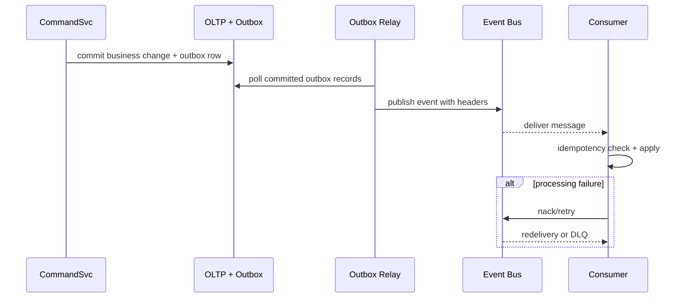

# Event Catalog

This catalog defines production event contracts for the **Warehouse Management System**. It is implementation-oriented and intended for service developers, integration teams, and analytics consumers.

## Contract Conventions
- Event name format: `<domain>.<aggregate>.<action>.v1`.
- Mandatory headers: `event_id`, `event_time`, `correlation_id`, `causation_id`, `tenant_id`, `schema_version`.
- Delivery semantics: at-least-once; consumers must implement idempotency.
- Ordering guarantee: ordered per partition key (`warehouse_id + aggregate_id`).
- Breaking change policy: major version bump; old topic maintained during migration window.

## Core Operational Events

| Event | Producer | Partition Key | Key Fields | Triggers | Rule IDs |
|---|---|---|---|---|---|
| `receiving.receipt.confirmed.v1` | receiving-service | `warehouse_id+receipt_id` | `receipt_id`, `asn_line_id`, `lot`, `qty` | Valid receipt committed | BR-6 |
| `receiving.discrepancy.created.v1` | receiving-service | `warehouse_id+case_id` | `case_id`, `reason_code`, `expected_qty`, `actual_qty` | ASN/qty mismatch | BR-10 |
| `allocation.reservation.created.v1` | allocation-service | `warehouse_id+reservation_id` | `reservation_id`, `order_line_id`, `sku`, `reserved_qty` | Reservation commit | BR-7 |
| `allocation.reservation.conflict.v1` | allocation-service | `warehouse_id+sku` | `sku`, `conflict_count`, `attempt_no` | OCC conflict | BR-5, BR-7 |
| `fulfillment.pick.confirmed.v1` | fulfillment-service | `warehouse_id+task_id` | `task_id`, `reservation_id`, `picked_qty` | Pick confirm success | BR-7 |
| `fulfillment.short_pick.reported.v1` | fulfillment-service | `warehouse_id+task_id` | `task_id`, `missing_qty`, `resolution_path` | Short pick detected | BR-10 |
| `packing.reconciliation.failed.v1` | fulfillment-service | `warehouse_id+pack_session_id` | `pack_session_id`, `reason_code`, `line_deltas` | Pack close blocked | BR-8, BR-10 |
| `shipping.confirmed.v1` | shipping-service | `warehouse_id+shipment_id` | `shipment_id`, `carrier`, `tracking_no`, `handoff_time` | Carrier handoff success | BR-9 |
| `exception.case.resolved.v1` | operations-service | `warehouse_id+case_id` | `case_id`, `action`, `resolved_by`, `evidence_ref` | Case resolved | BR-3, BR-4, BR-10 |

## Publish and Consumption Pattern

## Consumer Implementation Checklist
1. Persist processed `event_id` for dedupe.
2. Reject unknown mandatory fields and alert schema owner.
3. Handle out-of-order events by aggregate version checks.
4. Emit consumer lag and processing-failure metrics.

## SLOs and Governance
- P95 commit-to-publish latency <= 5 seconds.
- DLQ acknowledgement <= 15 minutes for tier-1 domains.
- Monthly schema compatibility review with integration teams.
