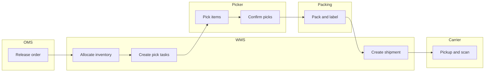
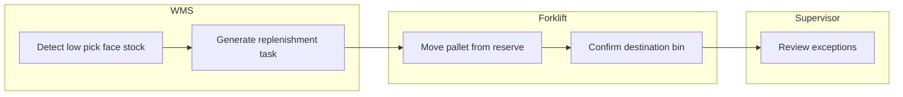

# Swimlane Diagrams

## Pick-Pack-Ship Swimlane

```mermaid
flowchart LR
    subgraph OMS
      A[Release order]
    end

    subgraph WMS
      B[Allocate inventory]
      C[Create pick tasks]
      D[Create shipment]
    end

    subgraph Picker
      E[Pick items]
      F[Confirm picks]
    end

    subgraph Packing
      G[Pack and label]
    end

    subgraph Carrier
      H[Pickup and scan]
    end

    A --> B --> C --> E --> F --> G --> D --> H
```

## Replenishment Swimlane

```mermaid
flowchart LR
    subgraph WMS
      A[Detect low pick face stock]
      B[Generate replenishment task]
    end

    subgraph Forklift
      C[Move pallet from reserve]
      D[Confirm destination bin]
    end

    subgraph Supervisor
      E[Review exceptions]
    end

    A --> B --> C --> D
    D --> E
```
