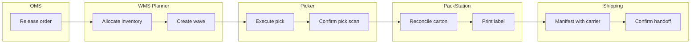
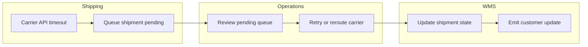

# Swimlane Diagrams

## End-to-End Fulfillment Swimlane

## Exception Swimlane (Carrier Failure)

## Implementation Notes
- Swimlanes represent ownership boundaries used in on-call routing.
- Each lane handoff must have observable event + correlation id.
