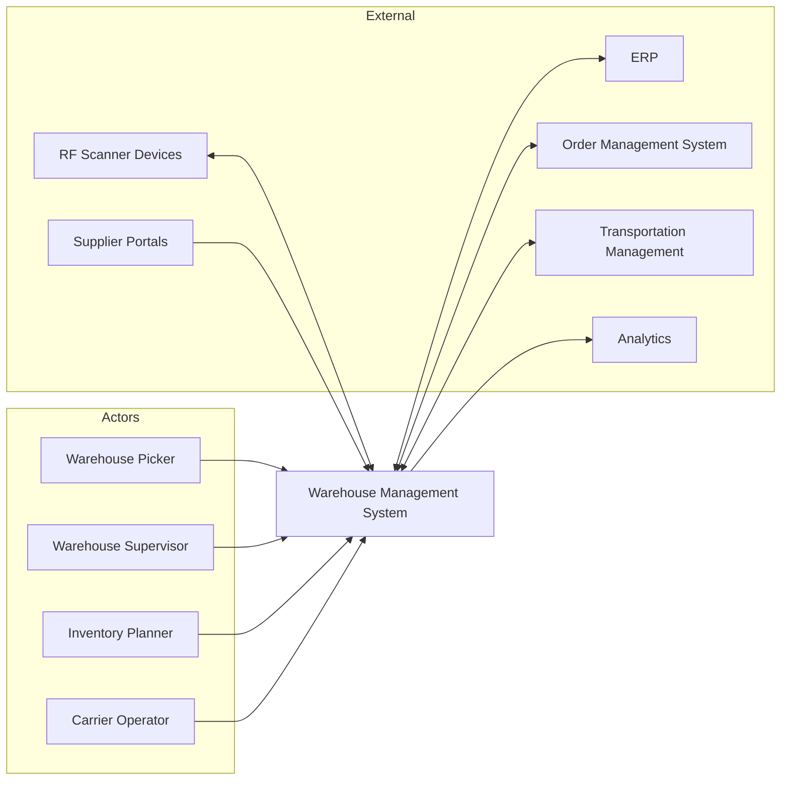

# System Context Diagram

```mermaid
flowchart LR
    subgraph Actors
      Picker[Warehouse Picker]
      Supervisor[Warehouse Supervisor]
      Planner[Inventory Planner]
      Carrier[Carrier Operator]
    end

    WMS[Warehouse Management System]

    subgraph External
      ERP[ERP]
      OMS[Order Management System]
      TMS[Transportation Management]
      Scanner[RF Scanner Devices]
      BI[Analytics]
      Vendor[Supplier Portals]
    end

    Picker --> WMS
    Supervisor --> WMS
    Planner --> WMS
    Carrier --> WMS

    WMS <--> ERP
    WMS <--> OMS
    WMS <--> TMS
    Scanner <--> WMS
    WMS --> BI
    Vendor --> WMS
```
