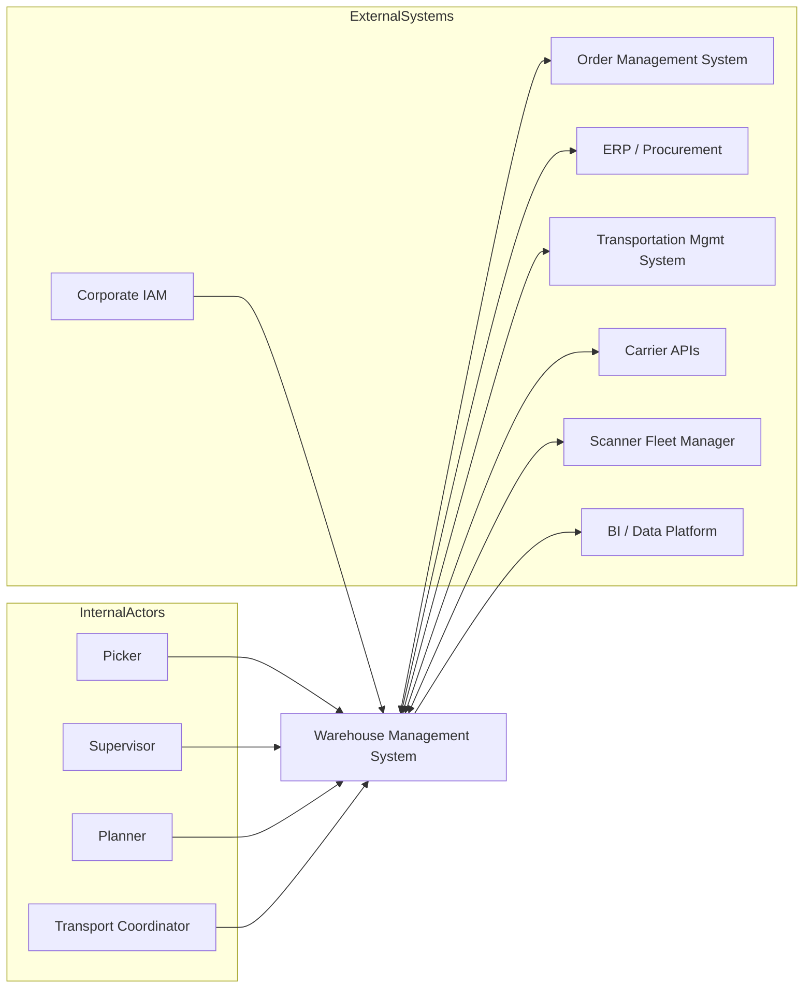

# System Context Diagram

## Interface Contracts
- OMS: order release, cancellation, backorder updates.
- ERP: ASN/PO master data, inventory financial reconciliation.
- Carrier APIs: manifest, label, tracking events.
- Scanner manager: device identity, offline replay uploads.
