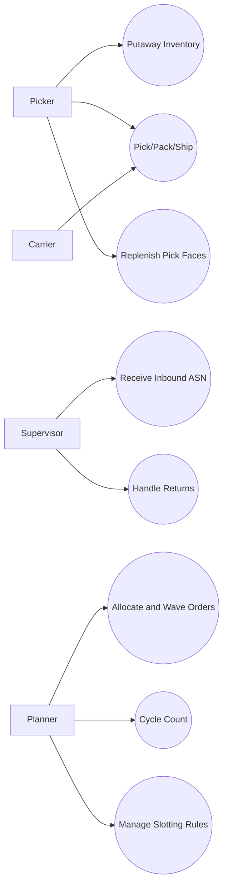

# Use Case Diagram

```mermaid
flowchart LR
    Picker
    Supervisor
    Planner
    Carrier

    UC1((Receive Inbound ASN))
    UC2((Putaway Inventory))
    UC3((Allocate and Wave Orders))
    UC4((Pick/Pack/Ship))
    UC5((Cycle Count))
    UC6((Replenish Pick Faces))
    UC7((Handle Returns))
    UC8((Manage Slotting Rules))

    Supervisor --> UC1
    Picker --> UC2
    Planner --> UC3
    Picker --> UC4
    Planner --> UC5
    Picker --> UC6
    Supervisor --> UC7
    Planner --> UC8
    Carrier --> UC4
```
