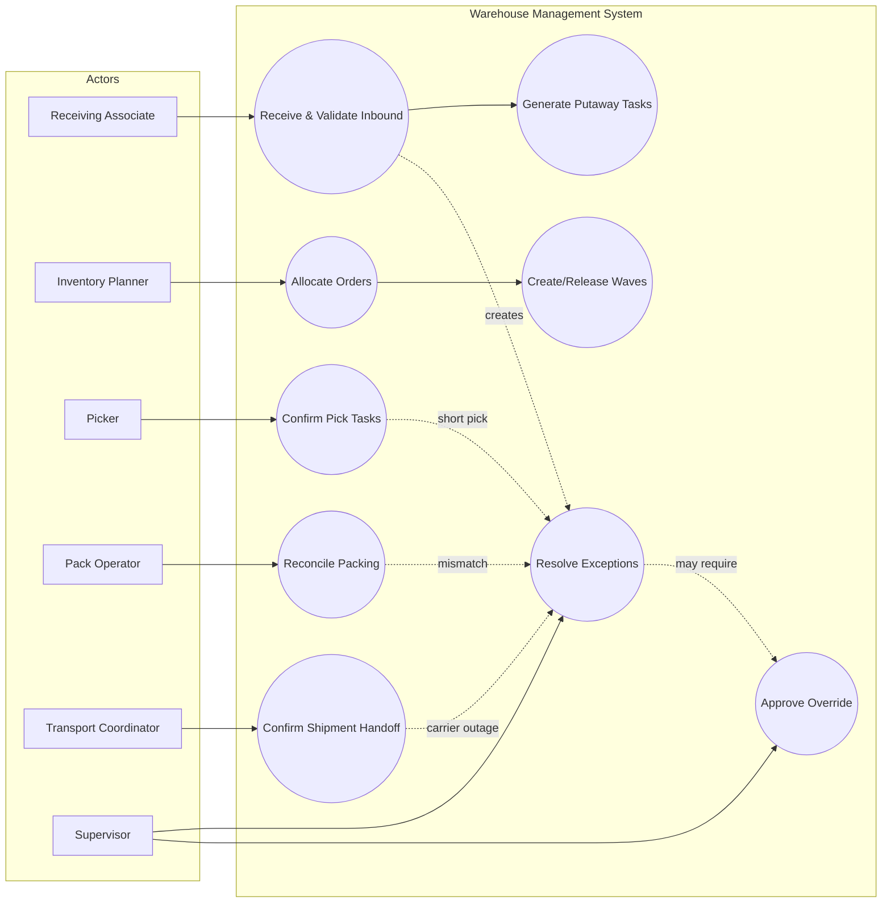

# Use Case Diagram

## Coverage Notes
- UC1/UC2 enforce receiving validation and idempotent putaway generation.
- UC5/UC6/UC7 define the controlled pick-pack-ship progression.
- UC8/UC9 ensure exception and override controls are explicit.
