# Use Case Diagram — Warehouse Management System

## Overview

This document defines all actors and use cases within the WMS system boundary. It provides the primary use case diagram (rendered as a flowchart since standard Mermaid does not support UML use case notation), an actor register, and a full use case inventory table. Each use case listed here has a corresponding detailed description in `use-case-descriptions.md`.

---

## Actors

### Internal Human Actors

| Actor | Role Description |
|---|---|
| **Warehouse Manager** | Overall facility owner. Approves exceptions, configures system parameters, reviews KPI dashboards, manages staff. |
| **Supervisor** | Shift-level operational lead. Approves variances, releases waves, resolves exceptions, manages picker assignments. |
| **Receiver** | Dock worker responsible for unloading and scanning inbound shipments against ASNs. |
| **Picker** | Warehouse operative who executes pick tasks using an RF scanner or mobile device. |
| **Packer** | Operative at the pack station who places picked items into cartons and closes pack sessions. |
| **Shipping Coordinator** | Responsible for carrier selection, label generation, and confirming outbound dispatch. |
| **Cycle Counter** | Operative assigned to physically count inventory in bins and record counts via scanner. |
| **Replenishment Worker** | Moves stock from bulk/reserve storage to forward-pick bins when triggered by a replenishment task. |
| **Returns Clerk** | Processes inbound returns, inspects condition, and determines disposition (restock, quarantine, dispose). |
| **System Administrator** | Manages user accounts, roles, device enrollment, and system configuration parameters. |

### External System Actors

| Actor | Type | Description |
|---|---|---|
| **OMS** | External System | Order Management System. Creates shipment orders and receives dispatch confirmations. |
| **ERP** | External System | Enterprise Resource Planning (SAP/Oracle/NetSuite). Source of POs and financial data receiver. |
| **Carrier / TMS** | External System | FedEx, UPS, DHL APIs. Rate shopping, label generation, and tracking updates. |
| **Analytics Platform** | External System | Consumes event stream for BI dashboards, KPI reporting, and ML model training. |
| **Customer Portal** | External System | Customer-facing portal receiving shipment dispatch and tracking events. |
| **Supplier Portal** | External System | Supplier-facing portal where ASNs are submitted and discrepancy notifications received. |
| **Identity Provider (IdP)** | External System | OAuth 2.0 / SAML-based SSO provider for employee authentication. |
| **Device Management (MDM)** | External System | Mobile Device Management for scanner and handheld device provisioning. |
| **3PL Partner** | External System | Third-party logistics provider with API integration for outsourced warehouse operations. |

---

## System Boundary

The WMS system boundary encompasses all operations from **inbound dock receipt** through **outbound dispatch**, including inventory management, cycle counting, replenishment, returns, and administration. The following are explicitly outside the WMS boundary:
- Order creation and order management (owned by OMS).
- Procurement and PO creation (owned by ERP).
- Financial accounting and invoicing (owned by ERP/Finance).
- Customer-facing order tracking (owned by Customer Portal).
- Carrier physical transport (owned by Carrier/TMS).

---

## Use Case Diagram

```mermaid
flowchart LR
    subgraph Actors["External Actors"]
        WM["🧑‍💼 Warehouse Manager"]
        SUP["👷 Supervisor"]
        RCV["📦 Receiver"]
        PCK["🔍 Picker"]
        PKR["📦 Packer"]
        SHP["🚚 Shipping Coordinator"]
        CCT["📋 Cycle Counter"]
        RPL["🔄 Replenishment Worker"]
        RET["↩️ Returns Clerk"]
        ADM["⚙️ System Administrator"]
        OMS["🖥️ OMS"]
        ERP["🏢 ERP"]
        CAR["🚛 Carrier/TMS"]
        ANA["📊 Analytics Platform"]
    end

    subgraph WMS["WMS System Boundary"]
        subgraph Inbound["Inbound Operations"]
            UC01["UC-01: Receive Inbound Shipment"]
            UC02["UC-02: Direct Putaway to Bin"]
            UC03["UC-03: Record Receiving Discrepancy"]
            UC04["UC-04: Cross-Dock Inbound Shipment"]
        end

        subgraph InvMgmt["Inventory Management"]
            UC05["UC-05: View Inventory Balance"]
            UC06["UC-06: Quarantine Inventory Unit"]
            UC07["UC-07: Release Quarantine"]
            UC08["UC-08: Transfer Inventory Between Bins"]
            UC09["UC-09: Transfer Inventory Between Warehouses"]
            UC10["UC-10: Adjust Inventory (Write-Off/Write-Up)"]
        end

        subgraph Outbound["Outbound Operations"]
            UC11["UC-11: Create and Release Wave"]
            UC12["UC-12: Execute Pick Task"]
            UC13["UC-13: Report Short Pick"]
            UC14["UC-14: Pack Carton and Generate Label"]
            UC15["UC-15: Confirm Shipment Dispatch"]
            UC16["UC-16: Cancel Shipment Order"]
        end

        subgraph Counting["Cycle Counting"]
            UC17["UC-17: Schedule Cycle Count"]
            UC18["UC-18: Perform Cycle Count"]
            UC19["UC-19: Approve Cycle Count Variance"]
            UC20["UC-20: Post Inventory Adjustment"]
        end

        subgraph Replen["Replenishment"]
            UC21["UC-21: Trigger Replenishment Task"]
            UC22["UC-22: Execute Replenishment Task"]
            UC23["UC-23: Configure Replenishment Parameters"]
        end

        subgraph Returns["Returns Processing"]
            UC24["UC-24: Process Return Order (RMA)"]
            UC25["UC-25: Inspect Returned Goods"]
            UC26["UC-26: Restock or Dispose Returned Item"]
        end

        subgraph Admin["Administration"]
            UC27["UC-27: Manage Warehouse Configuration"]
            UC28["UC-28: Manage Users and Roles"]
            UC29["UC-29: Enroll Scanner Device"]
            UC30["UC-30: Configure Carrier and Service Levels"]
            UC31["UC-31: Manage SKU / Product Master"]
            UC32["UC-32: View Audit Log"]
            UC33["UC-33: Generate KPI Report"]
            UC34["UC-34: Configure Alert Thresholds"]
            UC35["UC-35: Override Business Rule (Supervised)"]
        end
    end

    RCV --> UC01
    RCV --> UC02
    RCV --> UC03
    SUP --> UC03
    RCV --> UC04
    SUP --> UC04

    WM --> UC05
    SUP --> UC05
    SUP --> UC06
    SUP --> UC07
    PCK --> UC08
    SUP --> UC09
    WM --> UC10
    SUP --> UC10

    SUP --> UC11
    WM --> UC11
    PCK --> UC12
    PCK --> UC13
    PKR --> UC14
    SHP --> UC15
    SUP --> UC16

    SUP --> UC17
    WM --> UC17
    CCT --> UC18
    SUP --> UC19
    WM --> UC20

    UC21 -.->|system trigger| UC22
    RPL --> UC22
    WM --> UC23

    RET --> UC24
    RET --> UC25
    SUP --> UC26

    ADM --> UC27
    ADM --> UC28
    ADM --> UC29
    ADM --> UC30
    WM --> UC31
    ADM --> UC32
    WM --> UC33
    WM --> UC34
    WM --> UC35
    SUP --> UC35

    OMS --> UC11
    OMS -.->|order feed| UC15
    ERP -.->|PO feed| UC01
    CAR -.->|rate/label API| UC14
    ANA -.->|consumes events| UC33
```

---

## Use Case Inventory

| UC ID | Use Case Name | Primary Actor | Priority | Complexity |
|---|---|---|---|---|
| UC-01 | Receive Inbound Shipment (ASN-based) | Receiver | Critical | High |
| UC-02 | Direct Putaway to Bin | Receiver / Picker | Critical | Medium |
| UC-03 | Record Receiving Discrepancy | Receiver, Supervisor | High | Medium |
| UC-04 | Cross-Dock Inbound Shipment | Receiver, Supervisor | Medium | High |
| UC-05 | View Inventory Balance | Warehouse Manager, Supervisor | Critical | Low |
| UC-06 | Quarantine Inventory Unit | Supervisor | High | Low |
| UC-07 | Release Quarantine | Supervisor, QA Manager | High | Medium |
| UC-08 | Transfer Inventory Between Bins | Picker | High | Medium |
| UC-09 | Transfer Inventory Between Warehouses | Supervisor | Medium | High |
| UC-10 | Adjust Inventory (Write-Off / Write-Up) | Warehouse Manager | High | Medium |
| UC-11 | Create and Release Wave | Supervisor, OMS | Critical | High |
| UC-12 | Execute Pick Task | Picker | Critical | High |
| UC-13 | Report Short Pick | Picker | High | Low |
| UC-14 | Pack Carton and Generate Label | Packer | Critical | High |
| UC-15 | Confirm Shipment Dispatch | Shipping Coordinator | Critical | Medium |
| UC-16 | Cancel Shipment Order | Supervisor | Medium | Medium |
| UC-17 | Schedule Cycle Count | Supervisor, Warehouse Manager | High | Medium |
| UC-18 | Perform Cycle Count | Cycle Counter | High | High |
| UC-19 | Approve Cycle Count Variance | Supervisor | High | Medium |
| UC-20 | Post Inventory Adjustment | Warehouse Manager | High | Low |
| UC-21 | Trigger Replenishment Task | System (automatic) | Critical | Low |
| UC-22 | Execute Replenishment Task | Replenishment Worker | Critical | Medium |
| UC-23 | Configure Replenishment Parameters | Warehouse Manager | Medium | Low |
| UC-24 | Process Return Order (RMA) | Returns Clerk | High | High |
| UC-25 | Inspect Returned Goods | Returns Clerk | High | Medium |
| UC-26 | Restock or Dispose Returned Item | Supervisor | High | Medium |
| UC-27 | Manage Warehouse Configuration | System Administrator | High | Medium |
| UC-28 | Manage Users and Roles | System Administrator | Critical | Medium |
| UC-29 | Enroll Scanner Device | System Administrator | High | Low |
| UC-30 | Configure Carrier and Service Levels | System Administrator | High | Medium |
| UC-31 | Manage SKU / Product Master | Warehouse Manager | Critical | Medium |
| UC-32 | View Audit Log | System Administrator, Warehouse Manager | High | Low |
| UC-33 | Generate KPI Report | Warehouse Manager | High | Medium |
| UC-34 | Configure Alert Thresholds | Warehouse Manager | Medium | Low |
| UC-35 | Override Business Rule (Supervised) | Warehouse Manager, Supervisor | High | High |
