# Cross-Cutting Operational Guidance

This companion document standardizes how every artifact in this repository should reason about warehouse execution flow, inventory correctness, exception processing, and scalability.

## 1) Canonical Receiving -> Picking -> Packing -> Shipping Flow

```mermaid
flowchart LR
    R1[Receive ASN or Unplanned Inbound] --> R2[Dock Check-In + Scan]
    R2 --> R3[Quantity / Lot / Serial Validation]
    R3 --> R4[Putaway Task Creation]
    R4 --> I1[Inventory Available-for-Allocation]
    I1 --> P1[Wave Planning + Task Prioritization]
    P1 --> P2[Pick Execution + Scan Confirmation]
    P2 --> K1[Pack Verification + Dunnage + Label]
    K1 --> S1[Manifest + Carrier Handoff]
    S1 --> S2[Shipment Confirmation + Inventory Decrement Finalized]
```

### Flow invariants
- Inventory is not allocatable until receiving validation and putaway acceptance are complete.
- Picks must reference reservation records; ad-hoc picks require supervisor-authorized override.
- Packing is a reconciliation step (picked quantity vs order lines vs container content).
- Shipment confirmation is the final legal/financial handoff event and closes fulfillment.

## 2) Stock Consistency Guarantees

| Guarantee ID | Guarantee | Enforced by |
|---|---|---|
| SC-1 | Every stock mutation is atomic and auditable (who/when/why/source). | Transaction boundary + append-only inventory ledger + audit events |
| SC-2 | Available-to-promise (ATP) cannot drop below zero for reservable stock. | Reservation checks + optimistic concurrency + conflict retry |
| SC-3 | Duplicate scanner submissions cannot create duplicate moves. | Idempotency keys + dedupe store + exactly-once business semantics |
| SC-4 | Lot/serial controlled stock remains traceable through outbound shipment. | Lot/serial constraints + FEFO/FIFO validation + pack/ship validation |
| SC-5 | Read models may be eventually consistent, but command-side truth remains serializable per SKU/bin. | CQRS split + partitioned command processing + reconciliation jobs |

## 3) Exception Handling Model

| Exception Class | Detection | Immediate Action | Recovery Pattern |
|---|---|---|---|
| Quantity mismatch on receive | Scan vs ASN tolerance breach | Quarantine line + stop putaway | Supervisor variance approval or supplier claim |
| Short pick / damaged stock | Pick confirm < allocated | Reallocate from alternate bin or split line | Backorder creation + customer communication |
| Packing discrepancy | Pack station reconciliation fail | Hold parcel + recount | Re-pack with dual verification |
| Carrier/API outage | Manifest/label call failure | Queue shipment intent; prevent dock release | Retry with exponential backoff + failover carrier |
| Offline scanner replay conflict | Event version mismatch/idempotency collision | Mark event as conflict | Operator-assisted merge or compensating task |

### Exception governance
- All manual overrides require actor identity, reason code, and expiration window.
- Repeated exceptions are promoted into productized workflow rules.
- Every exception path emits observable metrics and alert hooks.

## 4) Infrastructure-Scale Considerations

- **Throughput partitioning:** Partition command processing by `warehouse_id + sku_hash` to minimize lock contention during peaks.
- **Elastic workers:** Auto-scale receiving, wave planning, and shipping integration workers from queue depth and event lag.
- **Backpressure controls:** Apply bounded queues and admission control on wave releases during carrier or WES/WCS degradation.
- **Data tiering:** Keep hot operational state in OLTP, push history/audit to cheaper analytical storage.
- **Resilience patterns:** Circuit breakers for external carrier APIs, outbox pattern for event publication, and dead-letter queues for poison messages.
- **Disaster readiness:** Multi-AZ databases, periodic restore drills, and documented RPO/RTO per warehouse region.

## 5) Business Rule to Artifact Traceability

Major business rules are formally defined and mapped in [analysis/business-rules.md](./analysis/business-rules.md#major-business-rule-traceability-matrix).

Use this matrix during design reviews and implementation planning to confirm each rule has:
1. Design-time representation (architecture, sequence, state, API, data, or infra artifacts), and
2. Implementation-time ownership (services, modules, jobs, guards, tests, and observability).
