```mermaid
flowchart LR
    R1[Receive ASN or Unplanned Inbound] --> R2[Dock Check-In + Scan]
    R2 --> R3[Quantity / Lot / Serial Validation]
    R3 --> R4[Putaway Task Creation]
    R4 --> I1[Inventory Available-for-Allocation]
    I1 --> P1[Wave Planning + Task Prioritization]
    P1 --> P2[Pick Execution + Scan Confirmation]
    P2 --> K1[Pack Verification + Dunnage + Label]
    K1 --> S1[Manifest + Carrier Handoff]
    S1 --> S2[Shipment Confirmation + Inventory Decrement Finalized]
```

# Cross-Cutting Operational Guidance

This companion document standardizes how every artifact in this repository reasons about warehouse execution flow, inventory correctness, exception processing, authentication, observability, security, and scalability. All services and design artifacts must conform to the policies defined here.

---

## Overview

The WMS spans multiple bounded contexts—Receiving, Putaway, Inventory, Allocation, Wave Planning, Picking, Packing, Shipping, Returns, Cycle Count, and Replenishment—each with its own service boundary. This document captures the cross-cutting concerns that apply uniformly across all contexts. When a new service is introduced or an existing one is extended, this document is the first reference to consult before making architectural decisions.

---

## 1) Canonical Receiving → Picking → Packing → Shipping Flow



### Flow Invariants
- Inventory is not allocatable until receiving validation and putaway acceptance are fully complete.
- Picks must reference active reservation records; ad-hoc picks require supervisor-authorized override with reason code.
- Packing is a reconciliation step: picked quantity must equal the order line quantity and the physical carton content before close.
- Shipment confirmation is the final legal and financial handoff event and permanently closes fulfillment for that shipment.

---

## 2) Authentication and Authorization

### Roles

| Role | Description |
|---|---|
| `WarehouseManager` | Full configuration access; approves all overrides; manages zones, bins, and rules |
| `Supervisor` | Approves variances, overrides, dual-approval actions, and escalated exceptions |
| `Receiver` | Executes dock check-in, ASN scanning, GRN confirmation, and discrepancy reporting |
| `PutawayWorker` | Executes putaway tasks and bin confirmation scans |
| `Picker` | Executes pick tasks and short-pick reporting |
| `PackStationOperator` | Closes cartons, generates labels, manages repack flow |
| `TransportCoordinator` | Confirms manifests, manages dock assignments, handles carrier handoffs |
| `InventoryController` | Executes cycle counts, approves adjustments, resolves scanner conflicts |
| `Auditor` | Read-only access to all records and audit trails; no mutation capability |
| `SystemAdmin` | Manages tenant configuration, integrations, API key lifecycle, user roles |

### Authentication Mechanism
- All API endpoints require a valid **JWT (JSON Web Token)** issued by the identity provider, or a scoped **API key** for service-to-service integration.
- JWTs include `sub` (user ID), `tenant_id`, `roles[]`, `iat`, and `exp` claims.
- API keys are per-tenant, scoped to a named service or integration, and rotated on a 90-day schedule.
- Anonymous access to any endpoint returns HTTP 401 with `WWW-Authenticate: Bearer`.

### Role-Permission Matrix

| Permission | WarehouseManager | Supervisor | Receiver | PutawayWorker | Picker | PackOperator | TransportCoord | InvController | Auditor | SystemAdmin |
|---|---|---|---|---|---|---|---|---|---|---|
| Receive ASN / GRN | ✓ | ✓ | ✓ | | | | | | | |
| Approve variance override | ✓ | ✓ | | | | | | | | |
| Execute putaway | ✓ | ✓ | | ✓ | | | | | | |
| Override putaway bin | ✓ | ✓ | | | | | | | | |
| Execute pick task | ✓ | ✓ | | | ✓ | | | | | |
| Close carton / generate label | ✓ | ✓ | | | | ✓ | | | | |
| Confirm manifest / dispatch | ✓ | ✓ | | | | | ✓ | | | |
| Execute cycle count | ✓ | ✓ | | | | | | ✓ | | |
| Approve adjustment | ✓ | ✓ | | | | | | | | |
| View all records (read-only) | ✓ | ✓ | ✓ | ✓ | ✓ | ✓ | ✓ | ✓ | ✓ | ✓ |
| Manage zones / bins / rules | ✓ | | | | | | | | | ✓ |
| Manage users / API keys | | | | | | | | | | ✓ |

---

## 3) Observability and Monitoring

### Key Operational Metrics

| Metric | Service | Alert Threshold |
|---|---|---|
| `wms.receiving.throughput` (scans/min) | Receiving | < 200 scans/min for > 5 min |
| `wms.wave.plan_duration_ms` (p95) | Wave Planner | > 15,000 ms |
| `wms.pick.rate` (tasks/picker/hour) | Picking | < 50 tasks/picker/hour for > 30 min |
| `wms.pack.throughput` (cartons/hour) | Packing | < 80 cartons/hour for > 15 min |
| `wms.ship.carrier_sla_miss_rate` (%) | Shipping | > 2% within any 1-hour window |
| `wms.inventory.balance_invariant_violations` | Inventory | Any violation → P1 alert |
| `wms.replenishment.trigger_lag_ms` (p95) | Replenishment | > 90,000 ms (90 s) |
| `wms.allocation.conflict_rate` (%) | Allocation | > 5% of attempts in 10 min |
| `wms.dlq.depth` (per queue) | All services | > 10 messages for > 2 min |
| `wms.carrier_api.error_rate` (%) | Shipping | > 3% in 5-min window |

### Logging Standards
- All log entries are **structured JSON** with the following mandatory fields: `timestamp` (ISO 8601), `severity`, `service`, `trace_id`, `span_id`, `correlation_id`, `tenant_id`, `actor_id` (where applicable), and `message`.
- No PII (names, addresses, email) is emitted to application logs; use tokenized or masked references only.
- Log levels: `DEBUG` (dev only), `INFO` (normal operations), `WARN` (recoverable anomalies), `ERROR` (failures requiring attention), `FATAL` (service cannot continue).

### Distributed Tracing
- Every inbound API call generates a `trace_id` propagated via W3C `traceparent` header through all downstream services and event consumers.
- Trace coverage target: **100%** of inbound API calls carry trace context to all downstream spans.
- Spans must include: service name, operation name, `warehouse_id`, `tenant_id`, and `correlation_id`.

### Dashboards
- **Operations Dashboard**: Live scan throughput, wave queue depth, pick rate per zone, pack throughput, carrier SLA.
- **Inventory Accuracy Dashboard**: Balance invariant health, recent adjustments, cycle count plan status, variance trend.
- **Integration Health Dashboard**: ERP event lag, carrier API error rate, DLQ depths, outbox relay lag.

---

## 4) Error Handling Standards

### Error Envelope Format

All API error responses use the following JSON envelope:

```json
{
  "error": {
    "code": "SHORT_PICK_NO_ALTERNATE",
    "message": "No alternate bin available for SKU WH-SKU-00123, lot L-2024-09",
    "detail": {
      "sku_id": "WH-SKU-00123",
      "lot_id": "L-2024-09",
      "requested_qty": 10,
      "available_qty": 3
    },
    "trace_id": "4bf92f3577b34da6a3ce929d0e0e4736",
    "correlation_id": "ord-wave-00456-pick-00789",
    "timestamp": "2024-11-15T14:32:10.123Z"
  }
}
```

### Error Code Reference

| Code | HTTP Status | Description |
|---|---|---|
| `ASN_NOT_FOUND` | 404 | ASN reference does not exist or belongs to another tenant |
| `QUANTITY_TOLERANCE_EXCEEDED` | 422 | Received quantity exceeds configured ASN tolerance |
| `SERIAL_DUPLICATE` | 409 | Serial number already registered under a different GRN |
| `LOT_EXPIRY_REQUIRED` | 422 | FEFO policy active but no expiry date supplied for lot |
| `BIN_CAPACITY_EXCEEDED` | 422 | Putaway would exceed bin unit, weight, or volume capacity |
| `BIN_ZONE_MISMATCH` | 422 | SKU zone eligibility rule violated for target bin |
| `RESERVATION_CONFLICT` | 409 | Concurrent allocation conflict; includes retry token |
| `RESERVATION_NOT_FOUND` | 404 | Pick task references an expired or released reservation |
| `LOT_SEQUENCE_VIOLATION` | 422 | Scanned lot is out of FEFO/FIFO sequence; correct lot provided |
| `SCAN_MISMATCH` | 422 | Scanned barcode does not match expected task identifier |
| `WAVE_BACKPRESSURE_HOLD` | 503 | Wave release blocked due to downstream dependency degradation |
| `WAVE_ALREADY_RELEASED` | 409 | Wave has already been released; duplicate release rejected |
| `PACK_RECONCILIATION_FAILED` | 422 | Packed quantity does not match pick confirmation for shipment line |
| `LABEL_GENERATION_FAILED` | 502 | Carrier API returned an error during label generation |
| `SHIPMENT_ALREADY_DISPATCHED` | 409 | Dispatch is idempotent; original event reference returned |
| `CROSS_TENANT_ACCESS_DENIED` | 403 | Resource belongs to a different tenant |
| `OVERRIDE_EXPIRED` | 410 | Supervisor override has passed its expiry timestamp |
| `ADJUSTMENT_APPROVAL_REQUIRED` | 403 | Adjustment exceeds threshold and requires dual approval |
| `TRANSFER_ABANDONED` | 408 | Inter-zone transfer exceeded the abandonment timeout |
| `IDEMPOTENCY_KEY_CONFLICT` | 409 | Idempotency key reused with a different request payload |

---

## 5) Idempotency and Retry Policy

### Idempotency Key Format
- All mutating API calls must include an `Idempotency-Key` header.
- Format: `{tenant_id}-{service}-{operation}-{client_generated_uuid_v4}` (e.g., `tenant-abc-receiving-grn-confirm-550e8400-e29b-41d4-a716-446655440000`).
- Keys are stored with a **minimum TTL of 24 hours**; re-submission within the TTL with the same key returns the original response without re-processing.
- Re-submission with the same key but a different request body returns HTTP 409 `IDEMPOTENCY_KEY_CONFLICT`.

### Retry Backoff Policy

| Attempt | Delay | Jitter |
|---|---|---|
| 1 (initial) | 0 ms | — |
| 2 | 500 ms | ± 100 ms |
| 3 | 1,500 ms | ± 300 ms |
| 4 | 4,000 ms | ± 800 ms |
| 5 | 10,000 ms | ± 2,000 ms |
| 6+ | DLQ routing | — |

### Dead-Letter Queue (DLQ) Policy
- Messages that fail after the maximum retry attempts are routed to a per-service DLQ.
- DLQ messages include: original payload, failure reason, attempt count, last error code, and replay context.
- DLQ depth alert fires when depth exceeds **10 messages for more than 2 minutes**.
- On-call engineer must triage DLQ messages within **30 minutes** of alert.

---

## 6) Stock Consistency Guarantees

| Guarantee ID | Guarantee | Enforced by |
|---|---|---|
| SC-1 | Every stock mutation is atomic and auditable (who/when/why/source). | Transaction boundary + append-only inventory ledger + audit events |
| SC-2 | Available-to-promise (ATP) cannot drop below zero for reservable stock. | Reservation checks + optimistic concurrency + conflict retry |
| SC-3 | Duplicate scanner submissions cannot create duplicate moves. | Idempotency keys + dedupe store + exactly-once business semantics |
| SC-4 | Lot/serial controlled stock remains traceable through outbound shipment. | Lot/serial constraints + FEFO/FIFO validation + pack/ship validation |
| SC-5 | Read models may be eventually consistent, but command-side truth remains serializable per SKU/bin. | CQRS split + partitioned command processing + reconciliation jobs |

---

## 7) Data Retention and Archiving

| Data Type | Hot Retention | Cold Archive | Deletion Policy |
|---|---|---|---|
| Operational event log | 2 years | 7 years | Delete after 7 years per data lifecycle policy |
| Audit trail | 7 years (hot) | Indefinite | No deletion; regulatory hold |
| Inventory snapshots | 90 days | 2 years | Delete cold after 2 years |
| Report artifacts | 90 days | Not archived | TTL enforced by report service |
| Scanner raw scan log | 30 days | 1 year | Delete cold after 1 year |
| Carrier label copies | 1 year | 3 years | Delete cold after 3 years |
| GRN and ASN documents | 3 years | 7 years | Delete after 7 years |
| Cycle count plans | 1 year | 5 years | Delete cold after 5 years |
| Exception / DLQ messages | 30 days (resolved) | 1 year | Delete after 1 year |

---

## 8) Multi-Tenancy Architecture

### Tenant Isolation Strategy
- All database tables include a `tenant_id` column as part of the composite primary key and all query predicates.
- API gateway validates that the `tenant_id` in the JWT claim matches the resource's `tenant_id` before forwarding any request.
- Background workers and event consumers filter on `tenant_id` extracted from the event envelope.

### Data Partitioning
- PostgreSQL tables are partitioned by `tenant_id` (range or hash partitioning) to prevent cross-tenant storage contention and support per-tenant data export/deletion.
- Kafka topics are namespaced by `tenant_id` in the topic key; consumers use dedicated consumer groups per tenant for isolation.
- Redis keyspace is prefixed with `{tenant_id}:` on all keys; ACLs restrict each service to its own prefix.

### Cross-Tenant Safeguards
- Any query that returns data from more than one tenant is considered a critical defect (severity P0).
- Integration tests assert that every API endpoint returns HTTP 403 when the token's `tenant_id` does not match the requested resource's `tenant_id`.
- Automated canary tests run nightly to verify tenant isolation across all read and write endpoints.

---

## 9) Security Controls

### Encryption
- **At rest**: All databases and object stores use AES-256 encryption with envelope key management via the cloud provider KMS (AWS KMS / GCP CKMS / Azure Key Vault).
- **In transit**: All service-to-service and client-to-service communication uses TLS 1.3 minimum; TLS 1.0 and 1.1 are explicitly disabled at the load balancer.

### Secret Management
- No secrets (database credentials, API keys, tokens) are stored in source code, environment variable files committed to Git, or container images.
- Secrets are injected at runtime via the cloud secrets manager (AWS Secrets Manager or Vault) and rotated on a 90-day schedule for service credentials, 30-day schedule for carrier API keys.

### Audit Trail
- Every state-changing operation records: `actor_id`, `actor_role`, `tenant_id`, `operation`, `entity_type`, `entity_id`, `before_state` (hash), `after_state` (hash), `correlation_id`, `reason_code`, and `timestamp`.
- Audit records are append-only and stored in a dedicated audit log store that is separate from the operational database.

### PII Handling
- Customer personal data (name, address, phone) is stored only in the OMS and TMS; the WMS stores only anonymized or tokenized references (e.g., `customer_ref_id`).
- Application logs must never emit PII fields; log pipelines include a PII scrubber before forwarding to the log aggregator.

---

## 10) Performance SLOs

| Operation | P50 Target | P95 Target | P99 Target |
|---|---|---|---|
| Scan/confirm command (receive, pick, pack) | ≤ 200 ms | ≤ 800 ms | ≤ 1,500 ms |
| Allocation reservation | ≤ 100 ms | ≤ 500 ms | ≤ 1,000 ms |
| Pick task retrieval | ≤ 80 ms | ≤ 300 ms | ≤ 600 ms |
| Wave release (≤ 500 orders → pick tasks) | ≤ 4 s | ≤ 10 s | ≤ 20 s |
| Wave release (500–2,000 orders) | ≤ 15 s | ≤ 40 s | ≤ 60 s |
| Label generation (single parcel) | ≤ 500 ms | ≤ 1,500 ms | ≤ 3,000 ms |
| Manifest transmission to carrier | ≤ 2 s | ≤ 5 s | ≤ 10 s |
| Replenishment trigger-to-task | ≤ 20 s | ≤ 60 s | ≤ 90 s |
| Dashboard data refresh lag | ≤ 15 s | ≤ 60 s | ≤ 120 s |
| Inventory snapshot report (≤ 1M records) | ≤ 30 s | ≤ 120 s | ≤ 180 s |

---

## 11) Exception Handling Model

| Exception Class | Detection | Immediate Action | Recovery Pattern |
|---|---|---|---|
| Quantity mismatch on receive | Scan vs ASN tolerance breach | Quarantine line + stop putaway | Supervisor variance approval or supplier claim |
| Short pick / damaged stock | Pick confirm < allocated | Reallocate from alternate bin or split line | Backorder creation + customer communication |
| Packing discrepancy | Pack station reconciliation fail | Hold parcel + recount | Re-pack with dual verification |
| Carrier/API outage | Manifest/label call failure | Queue shipment intent; prevent dock release | Retry with exponential backoff + failover carrier |
| Offline scanner replay conflict | Event version mismatch/idempotency collision | Mark event as conflict | Operator-assisted merge or compensating task |
| Bin capacity exceeded | Putaway task assignment check | Reject task; suggest alternate bin | Supervisor override or rebalance zone |
| Wave backpressure hold | Circuit breaker open on dependency | Emit `WaveHeld` alert | Auto-release on dependency recovery + operator confirm |
| Abandoned inter-zone transfer | Transfer-in not confirmed within timeout | Alert supervisor | Manual resolution or compensating adjustment |

### Exception Governance
- All manual overrides require actor identity, reason code, and expiration window.
- Repeated exceptions of the same class are promoted into productized workflow rules within the next sprint.
- Every exception path emits observable metrics, audit events, and alert hooks.

---

## 12) Disaster Recovery

### RPO and RTO Targets

| Tier | RPO | RTO |
|---|---|---|
| Tier 1 (scan/confirm, allocation, shipment dispatch) | ≤ 5 minutes | ≤ 30 minutes |
| Tier 2 (wave planning, replenishment, reporting) | ≤ 15 minutes | ≤ 60 minutes |
| Tier 3 (analytics, long-running exports) | ≤ 1 hour | ≤ 4 hours |

### Backup Strategy
- Database: continuous WAL archiving to cross-region object storage; point-in-time recovery window of 7 days.
- Event stream: Kafka topic retention of 7 days with cross-region replication enabled.
- Snapshots: daily full snapshots retained for 30 days; weekly snapshots retained for 12 months.

### Failover Steps
1. Declare incident via on-call paging system; assign Incident Commander.
2. Promote read replica to primary in the failover region (automated for Tier 1 services; manual confirmation required for Tier 2+).
3. Update DNS/load balancer records to route traffic to the failover region.
4. Verify health endpoints and run smoke tests against failover environment.
5. Replay any events from the DLQ that were unprocessed during the outage window.
6. Notify stakeholders and begin post-incident review scheduling.

---

## 13) Infrastructure-Scale Considerations

- **Throughput partitioning**: Partition command processing by `warehouse_id + sku_hash` to minimize lock contention during peaks.
- **Elastic workers**: Auto-scale receiving, wave planning, and shipping integration workers from queue depth and event consumer lag.
- **Backpressure controls**: Apply bounded queues and admission control on wave releases during carrier or WES/WCS degradation.
- **Data tiering**: Keep hot operational state in OLTP; push history and audit records to cheaper analytical storage.
- **Resilience patterns**: Circuit breakers for external carrier APIs; outbox pattern for event publication; DLQs for poison messages; idempotent consumers throughout.
- **Database connection pools**: Sized per service tier with read replicas serving all read-model queries to isolate analytical load from command processing.
- **Health endpoints**: All services expose `/health/live` and `/health/ready` consumable by the orchestration layer for zero-downtime rolling deployments.

---

## 14) Business Rule to Artifact Traceability

Major business rules are formally defined and mapped in [analysis/business-rules.md](./analysis/business-rules.md#major-business-rule-traceability-matrix).

Use this matrix during design reviews and implementation planning to confirm each rule has:
1. Design-time representation (architecture, sequence, state, API, data, or infra artifact), and
2. Implementation-time ownership (services, modules, jobs, guards, tests, and observability).

---

## 15) Runbook Index

| Runbook | Description |
|---|---|
| `runbook-receiving-discrepancy.md` | Steps to investigate and resolve receiving quantity mismatches and quarantine actions |
| `runbook-wave-hold-resolution.md` | How to diagnose a `WaveHeld` event, inspect circuit breaker state, and manually release a wave |
| `runbook-short-pick-recovery.md` | Alternate bin search procedure, backorder creation path, and customer notification triggers |
| `runbook-carrier-api-outage.md` | Failover carrier selection, manual label printing steps, and manifest retry procedure |
| `runbook-dlq-triage.md` | How to inspect DLQ messages, determine replay safety, and execute message replay |
| `runbook-scanner-replay-conflict.md` | Offline batch replay steps, conflict detection, and compensating adjustment procedure |
| `runbook-inventory-balance-alert.md` | How to investigate a balance invariant violation, identify the root cause, and trigger reconciliation |
| `runbook-cycle-count-variance.md` | Recount assignment procedure, variance approval workflow, and ledger adjustment steps |
| `runbook-db-failover.md` | Database failover procedure including replica promotion, DNS update, and smoke test checklist |
| `runbook-tenant-isolation-incident.md` | Cross-tenant data access incident response, containment, and notification procedure |
