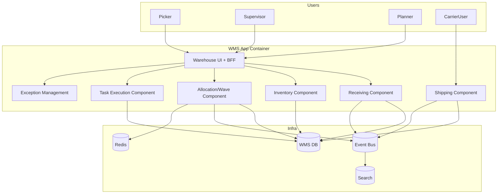

# C4 Component Diagram

```mermaid
flowchart TB
    subgraph Users
      Picker
      Supervisor
      Planner
      CarrierUser
    end

    subgraph WMS[WMS App Container]
      UIBFF[Warehouse UI + BFF]
      ReceivingCmp[Receiving Component]
      InventoryCmp[Inventory Component]
      AllocationCmp[Allocation/Wave Component]
      TaskCmp[Task Execution Component]
      ShippingCmp[Shipping Component]
      ExceptionCmp[Exception Management]
    end

    subgraph Infra
      OLTP[(WMS DB)]
      Bus[(Event Bus)]
      Cache[(Redis)]
      Search[(Search)]
    end

    Picker --> UIBFF
    Supervisor --> UIBFF
    Planner --> UIBFF
    CarrierUser --> ShippingCmp

    UIBFF --> ReceivingCmp
    UIBFF --> InventoryCmp
    UIBFF --> AllocationCmp
    UIBFF --> TaskCmp
    UIBFF --> ExceptionCmp

    ReceivingCmp --> OLTP
    InventoryCmp --> OLTP
    AllocationCmp --> OLTP
    TaskCmp --> OLTP
    ShippingCmp --> OLTP

    ReceivingCmp --> Bus
    AllocationCmp --> Bus
    ShippingCmp --> Bus
    Bus --> Search
    AllocationCmp --> Cache
```
