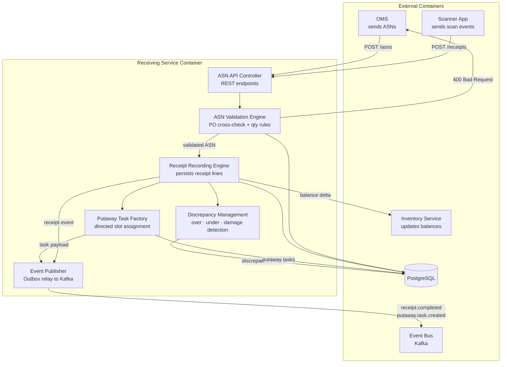
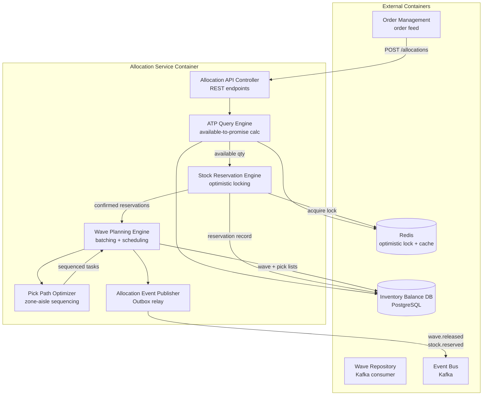
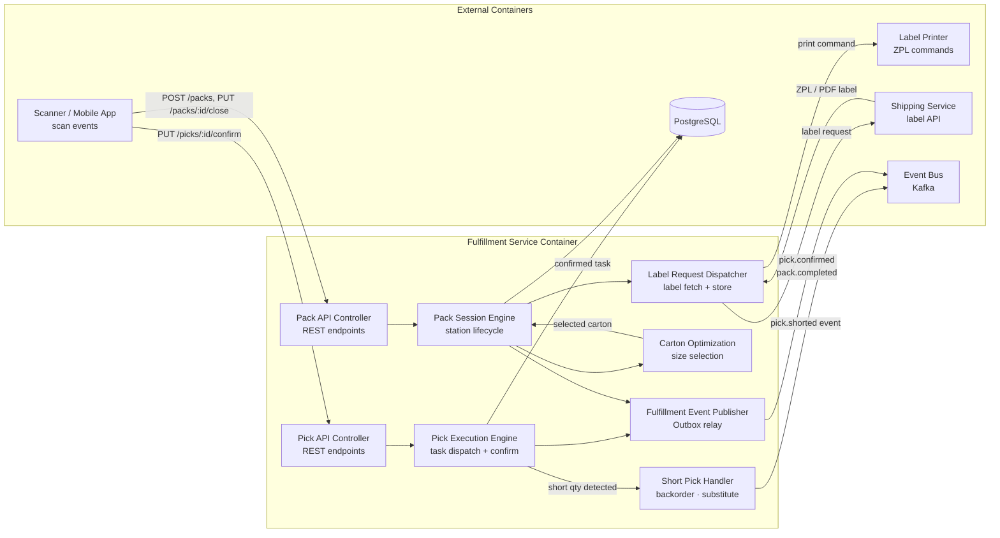
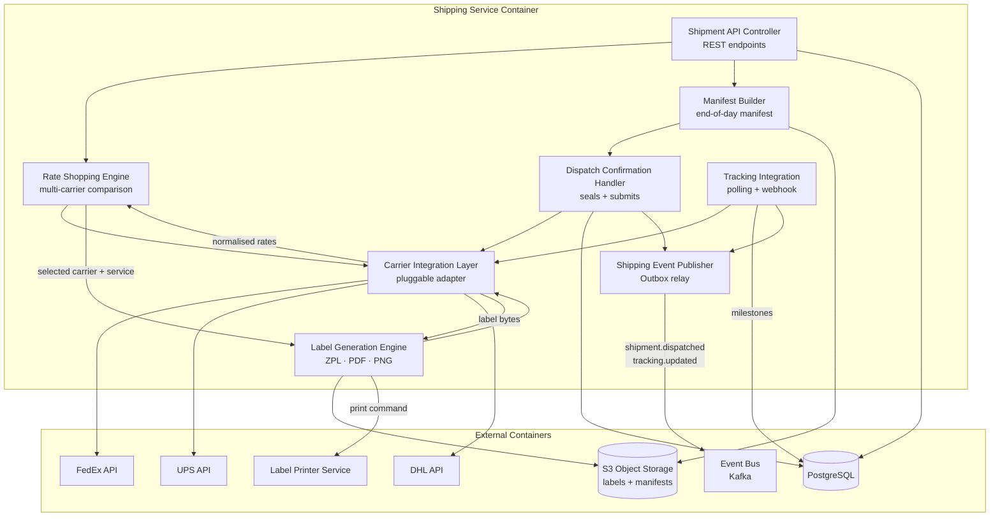
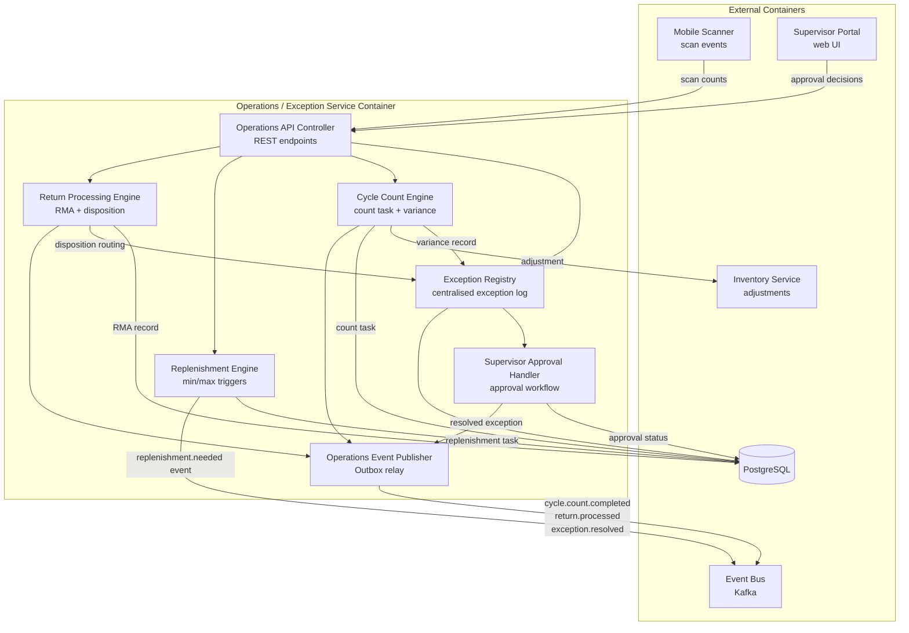

# C4 Component Diagram

## Overview

This document applies the **C4 model** at the **Component level** (Level 3) for the Warehouse Management System. The C4 hierarchy used in this project is:

| Level | Scope | Audience |
|---|---|---|
| **L1 – System Context** | WMS and its external actors | Executives, architects |
| **L2 – Container** | Deployable units (services, databases, UIs) | Engineering leads |
| **L3 – Component** | Internal building blocks within each container | Developers (this document) |

Each section below zooms into one WMS service container and shows its internal components, their responsibilities, and how they interact with each other and with external containers.

---

## C4 Component Level – Receiving Service

The **Receiving Service** container is responsible for ingesting Advance Shipment Notices (ASNs), recording physical receipts against those ASNs, detecting discrepancies, and generating putaway tasks for the warehouse floor.

### Component Table – Receiving Service

| Component | Technology | Responsibility | Dependencies |
|---|---|---|---|
| ASN API Controller | Spring MVC / Express.js | Exposes `POST /asns` and `POST /receipts`; validates HTTP contract; delegates to domain layer | ASN Validation Engine |
| ASN Validation Engine | Domain service | Cross-checks ASN lines against open POs; enforces expected quantities, SKU codes, and supplier constraints | PostgreSQL (PO data) |
| Receipt Recording Engine | Domain service + repository | Records confirmed receipt quantities per line; drives ASN state machine transitions | PostgreSQL, Inventory Service |
| Discrepancy Management | Domain service | Compares expected vs. received quantities; creates discrepancy records for over, under, and damage scenarios | PostgreSQL |
| Putaway Task Factory | Domain service | Generates directed putaway tasks based on putaway rules, slot availability, and SKU velocity class | PostgreSQL, Event Publisher |
| Event Publisher | Infrastructure (Outbox) | Writes domain events to the transactional outbox table; a relay process forwards them to Kafka | PostgreSQL (outbox), Kafka |

---

## C4 Component Level – Allocation Service

The **Allocation Service** container calculates available inventory, creates stock reservations, and produces wave plans with optimised pick lists.

### Component Table – Allocation Service

| Component | Technology | Responsibility | Dependencies |
|---|---|---|---|
| Allocation API Controller | REST/JSON controller | Accepts allocation requests from OMS; validates order line structure and priority flags | ATP Query Engine |
| ATP Query Engine | Domain service | Reads on-hand inventory and subtracts existing reservations to compute available-to-promise quantities | PostgreSQL, Redis cache |
| Stock Reservation Engine | Domain service with optimistic locking | Creates soft reservations using Redis distributed locks; commits to PostgreSQL on success; retries on lock conflict | Redis, PostgreSQL |
| Wave Planning Engine | Domain service | Groups confirmed reservations into waves by zone, carrier cut-off time, and order priority | PostgreSQL |
| Pick Path Optimizer | Algorithm module | Sequences pick locations per wave to minimise picker travel using zone-then-aisle ordering | PostgreSQL (slot map) |
| Allocation Event Publisher | Infrastructure (Outbox) | Emits `stock.reserved` and `wave.released` events via outbox pattern | PostgreSQL (outbox), Kafka |

---

## C4 Component Level – Fulfillment Service

The **Fulfillment Service** container orchestrates the physical pick and pack operations executed by warehouse operatives via mobile scanners.

### Component Table – Fulfillment Service

| Component | Technology | Responsibility | Dependencies |
|---|---|---|---|
| Pick API Controller | REST controller | Exposes pick task assignment, confirmation, and query endpoints; routes scanner payloads to domain layer | Pick Execution Engine |
| Pack API Controller | REST controller | Manages pack station sessions; accepts open-session, scan-item, and close-carton commands | Pack Session Engine |
| Pick Execution Engine | Domain service | Validates scanned barcode against pick task; records confirmed quantity; updates task state | PostgreSQL |
| Short Pick Handler | Domain service | Records shortage quantity; decides between backorder or substitution based on order rules; emits event | Kafka (event), PostgreSQL |
| Pack Session Engine | Domain service | Maintains station session lifecycle from open to closed; coordinates carton building and labelling | Carton Optimization, Label Request Dispatcher, PostgreSQL |
| Carton Optimization | Algorithm module | Selects optimal carton size based on item dimensions and weight constraints | PostgreSQL (carton master) |
| Label Request Dispatcher | Infrastructure adapter | Calls Shipping Service label API; stores label reference; sends ZPL to printer | Shipping Service, Label Printer |
| Fulfillment Event Publisher | Infrastructure (Outbox) | Emits `pick.confirmed` and `pack.completed` events via outbox pattern | PostgreSQL (outbox), Kafka |

---

## C4 Component Level – Shipping Service

The **Shipping Service** container handles carrier rate shopping, label generation, manifest building, and tracking status synchronisation.

### Component Table – Shipping Service

| Component | Technology | Responsibility | Dependencies |
|---|---|---|---|
| Shipment API Controller | REST controller | Accepts shipment creation from Pack Service; exposes status and manifest endpoints | Rate Shopping Engine, PostgreSQL |
| Carrier Integration Layer | Adapter pattern | Pluggable abstraction over FedEx, UPS, DHL SDKs; normalises request/response shapes | FedEx API, UPS API, DHL API |
| Rate Shopping Engine | Domain service | Queries multiple carriers in parallel; selects lowest cost or fastest eligible service level | Carrier Integration Layer |
| Label Generation Engine | Domain service | Requests carrier label; converts to required format; stores to S3; returns label reference | Carrier Integration Layer, S3 |
| Manifest Builder | Domain service | Aggregates daily shipments per carrier account into a manifest document | PostgreSQL, S3 |
| Dispatch Confirmation Handler | Domain service | Seals shipment as dispatched; submits manifest to carrier; updates shipment state | Carrier Integration Layer, PostgreSQL, Event Publisher |
| Tracking Integration | Scheduled job + webhook handler | Polls carrier tracking APIs; processes inbound tracking webhooks; persists milestone events | Carrier Integration Layer, PostgreSQL |
| Shipping Event Publisher | Infrastructure (Outbox) | Emits `shipment.dispatched` and `tracking.updated` events | PostgreSQL (outbox), Kafka |

---

## C4 Component Level – Operations / Exception Service

The **Operations Service** container manages all exception workflows including cycle counts, replenishment, returns, and supervisor approvals.

### Component Table – Operations / Exception Service

| Component | Technology | Responsibility | Dependencies |
|---|---|---|---|
| Operations API Controller | REST controller | Routes scan events from mobile app and approval commands from supervisor portal to domain components | All domain components |
| Exception Registry | Domain service | Centralised log of all active and historical exceptions; provides lifecycle management (open → pending → resolved) | PostgreSQL |
| Cycle Count Engine | Domain service + scheduler | Creates count tasks by zone or SKU; processes scan results; calculates variances; posts adjustments | PostgreSQL, Inventory Service |
| Replenishment Engine | Domain service | Monitors inventory levels against min/max thresholds; creates replenishment tasks; tracks execution | PostgreSQL, Kafka (consume) |
| Return Processing Engine | Domain service | Ingests RMA data; routes returned items to disposition paths (restock, quarantine, disposal) | PostgreSQL, Exception Registry |
| Supervisor Approval Handler | Domain service | Manages multi-step approval workflows for variances and exceptions; enforces role-based approval rules | PostgreSQL |
| Operations Event Publisher | Infrastructure (Outbox) | Emits domain events for cycle counts, returns, and exception resolutions | PostgreSQL (outbox), Kafka |

---

## Component Interaction Patterns

### Synchronous REST Calls
Used for request-reply interactions where an immediate response is required — for example, ATP queries during order allocation or shipment creation from the pack station. REST is preferred when the caller needs an in-band result to proceed (e.g., label reference returned before printing).

### Asynchronous Event-Driven Patterns
All cross-service notifications are published to Kafka topics. Consumers process events at their own pace without coupling to the producer's availability. This pattern decouples services and enables fan-out (e.g., `pack.completed` consumed by both Shipping Service and Notification Service).

### Outbox Pattern for Reliability
Every service writes domain events to a transactional outbox table in its own PostgreSQL database within the same transaction as the business state change. A relay process (Debezium CDC or a polling relay) reads the outbox and forwards events to Kafka. This guarantees at-least-once delivery and eliminates dual-write inconsistency.

### Saga Pattern for Distributed Transactions
Multi-step business processes that span services (e.g., order fulfilment: allocate → wave → pick → pack → ship) are coordinated using choreography-based sagas. Each service publishes a completion event; the next service subscribes and proceeds. Compensating transactions are triggered by failure events (e.g., `pick.shorted` triggers re-allocation).

### Event Sourcing for Audit Trail
Critical state machines (ASN, Wave, Shipment) append immutable event records to an event log table alongside the current state projection. This enables full audit history, temporal queries, and state replay for debugging and compliance.

---

## Cross-Component Communication

| Source Component | Target Component | Protocol | Message / Event Name | Trigger | Failure Handling |
|---|---|---|---|---|---|
| ASN API Controller | ASN Validation Engine | In-process call | `ValidateAsnCommand` | ASN received from OMS | Returns 400; ASN not persisted |
| Receipt Recording Engine | Inventory Service | REST (sync) | `POST /balances/delta` | Receipt confirmed | Retry 3× with backoff; rollback on failure |
| Putaway Task Factory | Event Bus | Kafka publish (async) | `putaway.task.created` | Putaway tasks generated | Outbox guarantees delivery |
| Receiving Event Publisher | Event Bus | Kafka publish (async) | `receipt.completed` | Receipt persisted | Outbox guarantees delivery |
| Stock Reservation Engine | Redis | Distributed lock | `LOCK sku:{id}:wh:{id}` | Allocation attempt | Retry with exponential backoff; `422` after max retries |
| Wave Planning Engine | Event Bus | Kafka publish (async) | `wave.released` | Wave plan committed | Outbox guarantees delivery |
| Pick Execution Engine | Event Bus | Kafka publish (async) | `pick.confirmed` | Pick scan validated | Outbox guarantees delivery |
| Short Pick Handler | Event Bus | Kafka publish (async) | `pick.shorted` | Quantity shortfall detected | Outbox guarantees delivery; triggers re-allocation saga |
| Pack Session Engine | Shipping Service | REST (sync) | `POST /labels` | Carton closed | Retry 3×; fail station session with error |
| Label Request Dispatcher | Label Printer | TCP/ZPL (async) | ZPL print stream | Label fetched | Dead-letter queue; manual reprint trigger |
| Fulfillment Event Publisher | Event Bus | Kafka publish (async) | `pack.completed` | Pack session closed | Outbox guarantees delivery |
| Rate Shopping Engine | Carrier Integration Layer | In-process call | `RateRequest` | Shipment created | Returns empty list; fallback to default carrier |
| Carrier Integration Layer | FedEx / UPS / DHL | HTTPS REST (sync) | Carrier-specific request | Rate or label needed | Circuit breaker; timeout 5 s; retry 2× |
| Label Generation Engine | S3 | AWS SDK (async) | PUT object | Label bytes received | Retry 3×; alert ops on failure |
| Dispatch Confirmation Handler | Event Bus | Kafka publish (async) | `shipment.dispatched` | Manifest submitted | Outbox guarantees delivery |
| Tracking Integration | Event Bus | Kafka publish (async) | `tracking.updated` | Tracking milestone received | Outbox guarantees delivery; duplicate idempotency key |
| Cycle Count Engine | Inventory Service | REST (sync) | `POST /adjustments` | Variance approved | Retry 3×; hold variance in pending if unavailable |
| Replenishment Engine | Event Bus | Kafka publish (async) | `replenishment.needed` | Min threshold breached | Outbox guarantees delivery |
| Return Processing Engine | Event Bus | Kafka publish (async) | `return.processed` | Disposition decision made | Outbox guarantees delivery |
| Supervisor Approval Handler | Event Bus | Kafka publish (async) | `exception.resolved` | Approval decision recorded | Outbox guarantees delivery |
| Notification Service | (fan-out consumers) | Kafka consume (async) | All domain events | Any domain event consumed | Dead-letter topic; retry policy per event type |
| Reporting Service | (event consumer) | Kafka consume (async) | All domain events | Any domain event consumed | Idempotent consumer; safe to replay |

