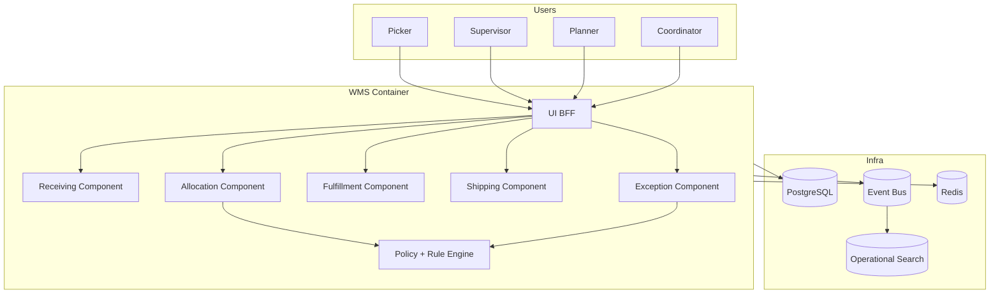

# C4 Component Diagram

## Component Responsibilities
- Receiving: inbound validation + putaway creation.
- Allocation: reservations + wave planning.
- Fulfillment: pick/pack operations.
- Shipping: carrier handoff and tracking confirmation.
- Operations: exception lifecycle and approvals.
