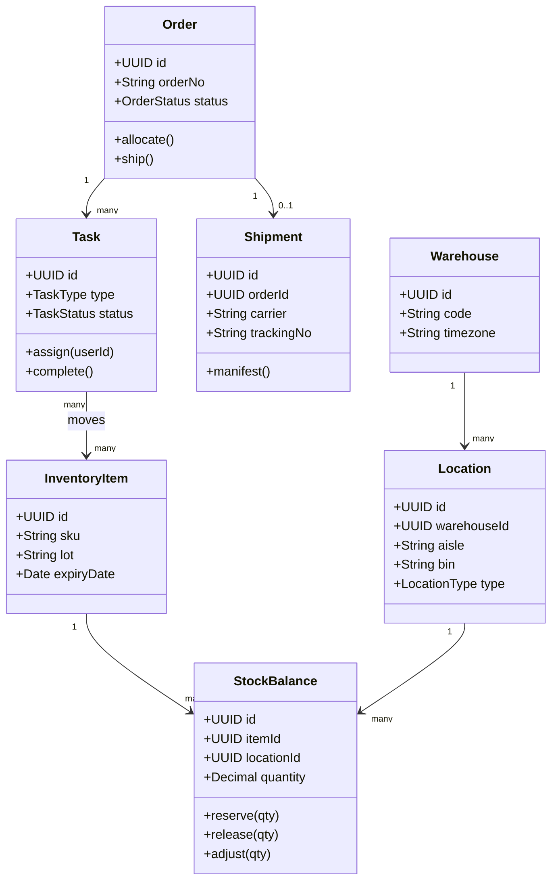

# Class Diagrams

```mermaid
classDiagram
    class Warehouse {
      +UUID id
      +String code
      +String timezone
    }

    class Location {
      +UUID id
      +UUID warehouseId
      +String aisle
      +String bin
      +LocationType type
    }

    class InventoryItem {
      +UUID id
      +String sku
      +String lot
      +Date expiryDate
    }

    class StockBalance {
      +UUID id
      +UUID itemId
      +UUID locationId
      +Decimal quantity
      +reserve(qty)
      +release(qty)
      +adjust(qty)
    }

    class Order {
      +UUID id
      +String orderNo
      +OrderStatus status
      +allocate()
      +ship()
    }

    class Shipment {
      +UUID id
      +UUID orderId
      +String carrier
      +String trackingNo
      +manifest()
    }

    class Task {
      +UUID id
      +TaskType type
      +TaskStatus status
      +assign(userId)
      +complete()
    }

    Warehouse "1" --> "many" Location
    InventoryItem "1" --> "many" StockBalance
    Location "1" --> "many" StockBalance
    Order "1" --> "many" Task
    Order "1" --> "0..1" Shipment
    Task "many" --> "many" InventoryItem : moves
```
