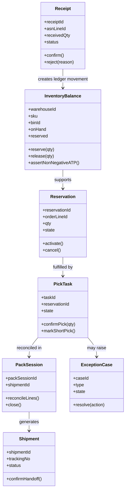

# Class Diagrams

## Domain Rules in Classes
- `InventoryBalance.assertNonNegativeATP()` maps BR-7.
- `PackSession.close()` must fail on reconciliation mismatch (BR-8).
- `ExceptionCase.resolve()` requires evidence for override path (BR-4).
