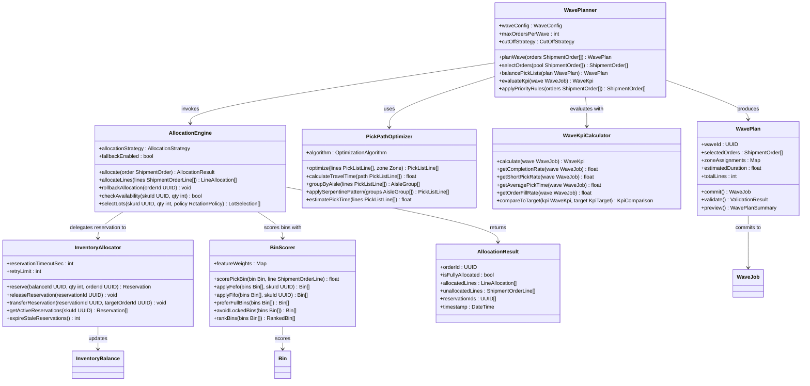
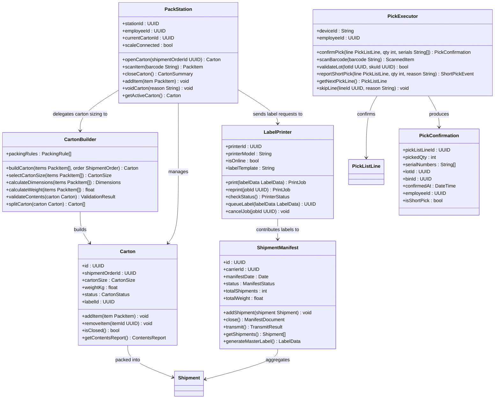

# Class Diagrams — Warehouse Management System

## Overview

The WMS class model is organized around five domain sub-systems: **Warehouse & Space**, **Inventory**, **Receiving**, **Fulfillment** (wave → pick → pack → ship), and **Cycle Counting / Replenishment**. Each sub-system owns its core aggregates and exposes well-defined interfaces to the others. Shared value objects (lot numbers, serial numbers, carrier service levels) are referenced by identity rather than embedded, which keeps aggregate boundaries clean and supports independent scaling of each sub-system.

Diagrams in this document are split by sub-system to keep them readable. Every class shown corresponds to either an ORM entity or a rich domain object in the implementation. Enum types (`ZoneType`, `BinType`, `UnitStatus`, `WaveStatus`, etc.) are defined fully in the ERD document and referenced here by name.

Design principles applied:
- **Aggregate roots** own child entities and are the only entry points for mutation.
- **Optimistic concurrency** (`version` fields) prevents lost-update races on hot balance rows.
- **Domain rule enforcement** lives in the aggregate, not in service layers.
- **Value objects** (e.g., `BinCapacity`, `WarehouseStats`, `LabelData`) are immutable and returned from query methods.

---

## Core Domain Classes

```mermaid
classDiagram
    class Warehouse {
        +id : UUID
        +code : String
        +name : String
        +timezone : String
        +isActive : bool
        +maxCapacitySqft : float
        +addressId : UUID
        +activate() void
        +deactivate() void
        +getZones() Zone[]
        +getStats() WarehouseStats
    }

    class Zone {
        +id : UUID
        +warehouseId : UUID
        +code : String
        +name : String
        +zoneType : ZoneType
        +temperatureMin : float
        +temperatureMax : float
        +isActive : bool
        +getBins() Bin[]
        +isAvailable() bool
        +lock() void
        +unlock() void
        +getCapacityUtilization() float
    }

    class Bin {
        +id : UUID
        +zoneId : UUID
        +code : String
        +binType : BinType
        +aisle : String
        +bay : int
        +level : int
        +maxWeightKg : float
        +maxVolumeCm3 : long
        +currentWeightKg : float
        +isLocked : bool
        +canAccommodate(skuId UUID, qty int) bool
        +lock(reason String) void
        +unlock() void
        +getAvailableCapacity() BinCapacity
        +getInventoryUnits() InventoryUnit[]
    }

    class SKU {
        +id : UUID
        +skuCode : String
        +barcode : String
        +description : String
        +unitOfMeasure : String
        +weightKg : float
        +volumeCm3 : long
        +rotationPolicy : RotationPolicy
        +isSerialized : bool
        +isLotControlled : bool
        +reorderPoint : int
        +requiresLotTracking() bool
        +getPreferredBinType() BinType
        +validateSerialNumber(sn String) bool
        +isHazardous() bool
        +getStorageConstraints() StorageConstraints
    }

    class InventoryBalance {
        +id : UUID
        +warehouseId : UUID
        +binId : UUID
        +skuId : UUID
        +onHandQty : int
        +reservedQty : int
        +availableQty : int
        +version : long
        +updatedAt : DateTime
        +reserve(qty int) void
        +release(qty int) void
        +adjust(qty int, reason String) void
        +getATP() int
        +assertNonNegative() void
    }

    class InventoryUnit {
        +id : UUID
        +skuId : UUID
        +binId : UUID
        +lotId : UUID
        +serialNumber : String
        +status : UnitStatus
        +quantity : int
        +expiryDate : Date
        +receivedAt : DateTime
        +transition(newStatus UnitStatus) void
        +isExpired() bool
        +quarantine(reason String) void
        +move(targetBinId UUID) void
        +getAgeInDays() int
    }

    class LotNumber {
        +id : UUID
        +skuId : UUID
        +lotNumber : String
        +manufactureDate : Date
        +expiryDate : Date
        +supplierId : UUID
        +isQuarantined : bool
        +quarantineReason : String
        +isExpired() bool
        +daysToExpiry() int
        +quarantine(reason String) void
        +release() void
        +getInventoryUnits() InventoryUnit[]
    }

    class ReceivingOrder {
        +id : UUID
        +orderNumber : String
        +supplierId : UUID
        +status : ReceivingStatus
        +expectedArrivalDate : Date
        +arrivedAt : DateTime
        +hasDiscrepancies : bool
        +dockId : UUID
        +receive(lineId UUID, qty int, lot String) ReceiptResult
        +close() void
        +getDiscrepancies() Discrepancy[]
        +getLines() ReceivingOrderLine[]
        +reject(reason String) void
    }

    class ReceivingOrderLine {
        +id : UUID
        +receivingOrderId : UUID
        +skuId : UUID
        +expectedQty : int
        +receivedQty : int
        +varianceQty : int
        +poLineReference : String
        +status : LineStatus
        +calculateVariance() int
        +isComplete() bool
        +markDiscrepancy(reason String) void
        +getReceipts() Receipt[]
    }

    class WaveJob {
        +id : UUID
        +waveNumber : String
        +waveType : WaveType
        +status : WaveStatus
        +orderCount : int
        +lineCount : int
        +cutOffTime : DateTime
        +createdAt : DateTime
        +completedAt : DateTime
        +release() void
        +cancel(reason String) void
        +getPickLists() PickList[]
        +calculateCompletion() float
        +getKpi() WaveKpi
    }

    class PickList {
        +id : UUID
        +waveJobId : UUID
        +zoneId : UUID
        +status : PickStatus
        +assignedToEmployeeId : UUID
        +totalLines : int
        +pickedLines : int
        +assignedAt : DateTime
        +assign(employeeId UUID) void
        +confirmLine(lineId UUID, qty int) void
        +reportShortPick(lineId UUID, shortQty int, reason String) void
        +complete() void
        +release() void
    }

    class PickListLine {
        +id : UUID
        +pickListId : UUID
        +skuId : UUID
        +binId : UUID
        +lotId : UUID
        +serialNumber : String
        +requiredQty : int
        +pickedQty : int
        +status : LineStatus
        +sortSequence : int
        +confirm(pickedQty int) void
        +reportShort(qty int, reason String) void
        +skip(reason String) void
        +reassign(newBinId UUID) void
    }

    class ShipmentOrder {
        +id : UUID
        +orderNumber : String
        +carrierId : UUID
        +serviceLevel : String
        +status : OrderStatus
        +isRush : bool
        +shipByDate : Date
        +promisedDeliveryDate : Date
        +totalWeight : float
        +allocate() void
        +wave() void
        +cancel(reason String) void
        +getShipments() Shipment[]
        +getLines() ShipmentOrderLine[]
    }

    class Shipment {
        +id : UUID
        +shipmentOrderId : UUID
        +carrierId : UUID
        +trackingNumber : String
        +status : ShipmentStatus
        +dispatchedAt : DateTime
        +labelUrl : String
        +confirm() void
        +getLabel() LabelData
        +getTracking() TrackingInfo
        +voidLabel() void
        +reship(newCarrierId UUID) void
    }

    class CycleCount {
        +id : UUID
        +countNumber : String
        +countType : CountType
        +status : CountStatus
        +warehouseId : UUID
        +totalBinsToCount : int
        +countedBins : int
        +varianceDetected : bool
        +assign(employeeId UUID) void
        +submitLine(lineId UUID, qty int) void
        +approve(approverId UUID) void
        +close() void
        +getVarianceSummary() VarianceSummary
    }

    class CycleCountLine {
        +id : UUID
        +cycleCountId : UUID
        +binId : UUID
        +skuId : UUID
        +expectedQty : int
        +countedQty : int
        +varianceQty : int
        +recountRequested : bool
        +approvedBy : UUID
        +submit(qty int) void
        +requestRecount() void
        +approve() void
        +getVariancePct() float
    }

    class ReplenishmentTask {
        +id : UUID
        +triggerType : TriggerType
        +sourceBinId : UUID
        +targetBinId : UUID
        +skuId : UUID
        +requiredQty : int
        +fulfilledQty : int
        +status : TaskStatus
        +priority : int
        +assignedToEmployeeId : UUID
        +assign(employeeId UUID) void
        +confirm(fulfilledQty int) void
        +cancel(reason String) void
        +escalate() void
    }

    class Employee {
        +id : UUID
        +employeeCode : String
        +name : String
        +role : EmployeeRole
        +warehouseId : UUID
        +scannerDeviceId : String
        +isActive : bool
        +shift : String
        +canPerform(action String) bool
        +getAssignedTasks() Task[]
        +login(deviceId String) Session
        +logout() void
        +getPerformanceMetrics() EmployeeMetrics
    }

    class Carrier {
        +id : UUID
        +code : String
        +name : String
        +apiEndpoint : String
        +isActive : bool
        +accountNumber : String
        +getServiceLevels() ServiceLevel[]
        +getRates(shipment Shipment) Rate[]
        +generateLabel(shipment Shipment) Label
        +getTracking(trackingNo String) TrackingInfo
        +voidLabel(trackingNo String) bool
    }

    %% Structural hierarchy
    Warehouse "1" *-- "*" Zone : contains
    Zone "1" *-- "*" Bin : contains

    %% Inventory
    Bin "1" o-- "*" InventoryUnit : stores
    Bin "1" --> "*" InventoryBalance : tracked by
    SKU "1" --> "*" InventoryBalance : measured in
    SKU "1" --> "*" InventoryUnit : instance of
    LotNumber "1" --> "*" InventoryUnit : groups

    %% Receiving
    ReceivingOrder "1" *-- "*" ReceivingOrderLine : has

    %% Fulfillment
    WaveJob "1" *-- "*" PickList : produces
    PickList "1" *-- "*" PickListLine : contains
    ShipmentOrder "1" --> "*" PickList : sourced by
    ShipmentOrder "1" --> "*" Shipment : produces
    Shipment "*" --> "1" Carrier : dispatched via

    %% Cycle count
    CycleCount "1" *-- "*" CycleCountLine : composed of

    %% People
    Employee "1" --> "*" PickList : assigned to
    Employee "1" --> "*" ReplenishmentTask : performs
```

---

## Receiving Subsystem Classes

This diagram covers the inbound receiving flow from ASN import through directed putaway task generation.

```mermaid
classDiagram
    class ASNImporter {
        +supplierId : UUID
        +importFormat : String
        +lastImportedAt : DateTime
        +parse(payload String) ASNDocument
        +validate(doc ASNDocument) ValidationResult
        +persist(doc ASNDocument) ReceivingOrder
        +transformLine(rawLine RawLine) ReceivingOrderLine
        +detectDuplicate(asnRef String) bool
    }

    class ReceivingDock {
        +id : UUID
        +warehouseId : UUID
        +dockNumber : String
        +status : DockStatus
        +currentReceivingOrderId : UUID
        +maxWeightKg : float
        +isTemperatureControlled : bool
        +assign(receivingOrderId UUID) void
        +release() void
        +isAvailable() bool
        +getDoorSensorReading() SensorData
    }

    class QualityInspector {
        +employeeId : UUID
        +specialization : String[]
        +inspect(line ReceivingOrderLine, samples int) InspectionResult
        +flagDefect(itemId UUID, defectCode String) void
        +quarantineItems(itemIds UUID[]) void
        +approveItems(itemIds UUID[]) void
        +generateReport(receivingOrderId UUID) InspectionReport
    }

    class PutawayTaskGenerator {
        +maxTasksPerEmployee : int
        +priorityRules : PriorityRule[]
        +generate(result ReceiptResult) PutawayTask[]
        +assignTasks(tasks PutawayTask[], employees Employee[]) Assignment[]
        +calculatePriority(item InventoryUnit) int
        +groupByZone(items InventoryUnit[]) ZoneGroup[]
        +applyConstraints(task PutawayTask) PutawayTask
    }

    class BinSelector {
        +scoringWeights : ScoringWeights
        +selectBin(item InventoryUnit, zone Zone) Bin
        +scoreBin(bin Bin, item InventoryUnit) float
        +filterEligibleBins(bins Bin[], item InventoryUnit) Bin[]
        +checkTemperatureCompatibility(bin Bin, sku SKU) bool
        +checkWeightCapacity(bin Bin, item InventoryUnit) bool
        +checkVolumeCapacity(bin Bin, item InventoryUnit) bool
        +applyAffinityRules(bins Bin[], sku SKU) Bin[]
    }

    class PutawayTask {
        +id : UUID
        +receivingOrderLineId : UUID
        +inventoryUnitId : UUID
        +suggestedBinId : UUID
        +confirmedBinId : UUID
        +status : TaskStatus
        +assignedEmployeeId : UUID
        +overrideReason : String
        +confirm(actualBinId UUID) void
        +override(newBinId UUID, reason String) void
        +cancel(reason String) void
        +getDirections() NavigationPath
    }

    class ReceiptResult {
        +receivingOrderLineId : UUID
        +receivedQty : int
        +lotId : UUID
        +inventoryUnitIds : UUID[]
        +hasDiscrepancy : bool
        +discrepancyType : String
        +discrepancyQty : int
        +isSuccess : bool
    }

    ASNImporter --> ReceivingOrder : produces
    ASNImporter --> ReceivingDock : creates order for
    ReceivingDock "1" --> "1" ReceivingOrder : processes
    QualityInspector --> ReceivingOrderLine : inspects
    QualityInspector --> InventoryUnit : quarantines or approves
    ReceiptResult --> PutawayTaskGenerator : triggers
    PutawayTaskGenerator --> BinSelector : delegates bin selection to
    PutawayTaskGenerator --> PutawayTask : creates
    PutawayTask --> Bin : targets
    PutawayTask --> InventoryUnit : moves
```

---

## Allocation and Wave Planning Classes

This diagram shows classes used during wave planning, inventory allocation, bin scoring, and pick-path optimization.

---

## Fulfillment Classes

This diagram covers pick execution, packing, labeling, and end-of-day manifest dispatch.

---

## Class Responsibility Descriptions

| Class | Primary Responsibility | Key Collaborators | Domain Rules Enforced |
|---|---|---|---|
| `Warehouse` | Root aggregate for a physical facility; manages zones and operational state | `Zone`, `Employee` | Deactivated warehouses cannot accept new receiving orders or waves |
| `Zone` | Groups bins by functional purpose and temperature envelope | `Bin`, `BinSelector` | Items must be stored in zones matching their temperature and hazard class |
| `Bin` | Smallest addressable storage location; tracks weight and volume capacity | `InventoryUnit`, `InventoryBalance` | Weight and volume caps must not be exceeded; locked bins reject all movements |
| `SKU` | Master data for a stock-keeping unit; defines storage and tracking constraints | `InventoryBalance`, `InventoryUnit`, `LotNumber` | Serialized SKUs require one unit per serial number; lot-controlled SKUs require a valid lot on receipt |
| `InventoryBalance` | Materialized running balance per SKU–Bin; supports optimistic concurrency via `version` | `InventoryAllocator`, `CycleCount` | ATP = onHand − reserved; must never go negative |
| `InventoryUnit` | Tracks a physical unit or pallet through its lifecycle states | `Bin`, `LotNumber`, `CycleCount` | Only valid state transitions are allowed; expired units must be quarantined automatically |
| `LotNumber` | Groups units sharing a manufacturer lot; enforces expiry and quarantine | `InventoryUnit`, `QualityInspector` | Quarantined lots cannot be allocated for outbound orders |
| `ReceivingOrder` | Orchestrates the inbound receipt process against a supplier PO or ASN | `ReceivingOrderLine`, `ReceivingDock` | Cannot be closed if any line has an unresolved discrepancy |
| `ReceivingOrderLine` | Single SKU line within a receiving order; tracks expected vs. received quantity | `QualityInspector`, `PutawayTaskGenerator` | Variance exceeding tolerance threshold triggers automatic exception case |
| `WaveJob` | Batch grouping of outbound orders released to the floor for picking | `PickList`, `WavePlanner`, `WaveKpiCalculator` | A wave cannot be released if inventory has not been fully allocated |
| `PickList` | Zone-specific task list assigned to a single picker | `PickListLine`, `Employee`, `PickExecutor` | Must be completed or cancelled before the assigned employee logs off |
| `PickListLine` | Single directed pick instruction: what, from where, and how many | `Bin`, `InventoryUnit`, `PickExecutor` | Picked quantity cannot exceed required quantity without supervisor override |
| `ShipmentOrder` | Outbound customer order flowing through allocation → wave → ship | `WaveJob`, `Shipment`, `Carrier` | Rush orders must be wave-planned first; cancellation must release all reservations |
| `Shipment` | Physical parcel dispatched to a carrier; tracks tracking number and label | `Carrier`, `ShipmentManifest` | Cannot be dispatched without a printed label and confirmed carton weight |
| `CycleCount` | Scheduled or ad-hoc inventory count task for a set of bins | `CycleCountLine`, `Employee`, `AdjustmentService` | Variances above approval threshold require supervisor sign-off before adjustment |
| `CycleCountLine` | Single bin–SKU count record; captures blind count vs. system quantity | `InventoryBalance`, `CycleCount` | Expected quantity must not be shown to the counter before submission (blind count) |
| `ReplenishmentTask` | Move instruction to refill a pick-face bin from bulk storage | `Bin`, `InventoryUnit`, `Employee` | Cannot be confirmed with fulfilled quantity exceeding the target bin capacity |
| `Employee` | Warehouse operator with role-based access to WMS actions and device binding | `PickList`, `PutawayTask`, `Session` | Employees can only perform actions permitted by their assigned role |
| `Carrier` | External shipping carrier integration; provides rates, labels, and tracking | `Shipment`, `ShipmentManifest` | Rate shopping must prefer the cheapest service level that meets the promised delivery date |
| `ASNImporter` | Ingests supplier Advance Ship Notice documents and creates receiving orders | `ReceivingOrder`, `ReceivingDock` | Malformed or duplicate ASNs must be rejected with a structured error response |
| `BinSelector` | Scores and selects the optimal putaway bin using configurable weights | `Bin`, `Zone`, `SKU` | Temperature compatibility and weight capacity are hard constraints; all others are soft-scored |
| `WavePlanner` | Plans and balances waves across zones and employees | `AllocationEngine`, `PickPathOptimizer` | Waves must respect cut-off times and carrier pick-up schedules |
| `AllocationEngine` | Determines which bins and lots to pull inventory from for a set of order lines | `InventoryAllocator`, `BinScorer` | FEFO/FIFO rotation policy must be honoured; nearest-expiry lots are allocated first |
| `PickPathOptimizer` | Sorts pick list lines into a travel-efficient sequence within a zone | `PickList`, `Zone` | Optimized path must not require a picker to re-enter an already-visited aisle |
| `PackStation` | Manages packing session at a physical station; validates item scan-confirm | `Carton`, `LabelPrinter` | All items in a pick list must be accounted for before the station can close a carton |
| `ShipmentManifest` | Aggregates shipments for end-of-day carrier hand-off and manifest transmission | `Shipment`, `Carrier` | Manifest must be transmitted and acknowledged before dock doors are released |
