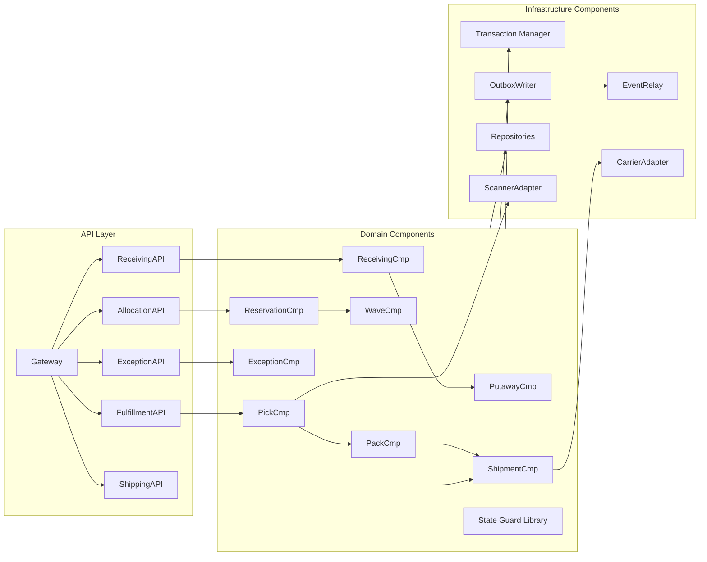

# Component Diagrams

```mermaid
flowchart LR
    subgraph API[API Layer]
      Gateway
      ReceivingAPI
      AllocationAPI
      FulfillmentAPI
      ShippingAPI
      ExceptionAPI
    end

    subgraph Domain[Domain Components]
      ReceivingCmp
      PutawayCmp
      ReservationCmp
      WaveCmp
      PickCmp
      PackCmp
      ShipmentCmp
      ExceptionCmp
      GuardLib[State Guard Library]
    end

    subgraph Infra[Infrastructure Components]
      TxManager[Transaction Manager]
      OutboxWriter
      EventRelay
      Repo[Repositories]
      CarrierAdapter
      ScannerAdapter
    end

    Gateway --> ReceivingAPI --> ReceivingCmp
    Gateway --> AllocationAPI --> ReservationCmp
    Gateway --> FulfillmentAPI --> PickCmp
    Gateway --> ShippingAPI --> ShipmentCmp
    Gateway --> ExceptionAPI --> ExceptionCmp

    ReceivingCmp --> PutawayCmp
    ReservationCmp --> WaveCmp
    PickCmp --> PackCmp --> ShipmentCmp

    Domain --> GuardLib
    Domain --> TxManager
    Domain --> OutboxWriter
    OutboxWriter --> EventRelay
    Domain --> Repo
    ShipmentCmp --> CarrierAdapter
    PickCmp --> ScannerAdapter
```

## Implementation Mapping
- Each component corresponds to a deployable module/package.
- GuardLib is shared to keep transition logic centralized and testable.
