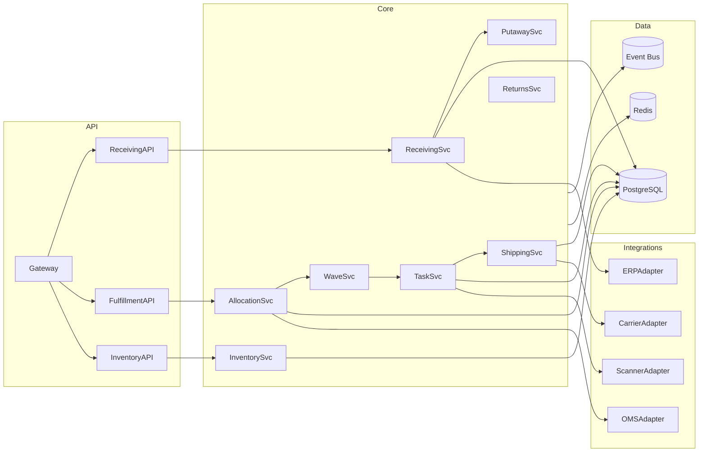

# Component Diagrams

```mermaid
flowchart LR
    subgraph API
      Gateway
      ReceivingAPI
      FulfillmentAPI
      InventoryAPI
    end

    subgraph Core
      ReceivingSvc
      PutawaySvc
      InventorySvc
      AllocationSvc
      WaveSvc
      TaskSvc
      ShippingSvc
      ReturnsSvc
    end

    subgraph Integrations
      OMSAdapter
      ERPAdapter
      CarrierAdapter
      ScannerAdapter
    end

    subgraph Data
      DB[(PostgreSQL)]
      MQ[(Event Bus)]
      Cache[(Redis)]
    end

    Gateway --> ReceivingAPI --> ReceivingSvc
    Gateway --> FulfillmentAPI --> AllocationSvc
    Gateway --> InventoryAPI --> InventorySvc

    ReceivingSvc --> PutawaySvc
    AllocationSvc --> WaveSvc --> TaskSvc
    TaskSvc --> ShippingSvc

    ReceivingSvc --> DB
    InventorySvc --> DB
    AllocationSvc --> DB
    TaskSvc --> DB
    ShippingSvc --> DB

    AllocationSvc --> OMSAdapter
    ReceivingSvc --> ERPAdapter
    ShippingSvc --> CarrierAdapter
    TaskSvc --> ScannerAdapter

    Core --> MQ
    Core --> Cache
```
