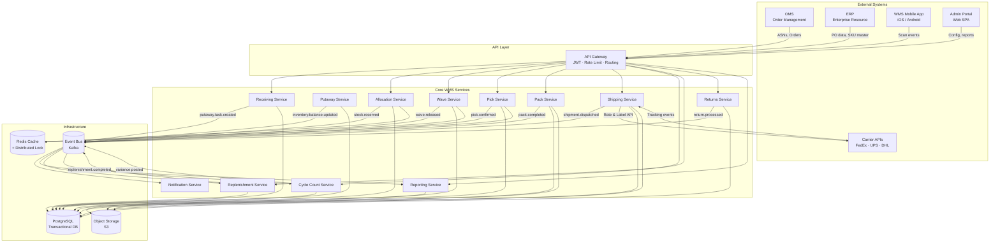
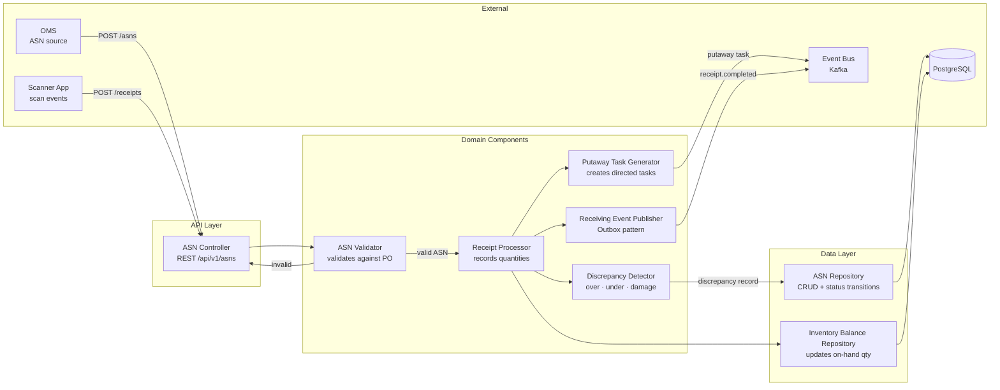
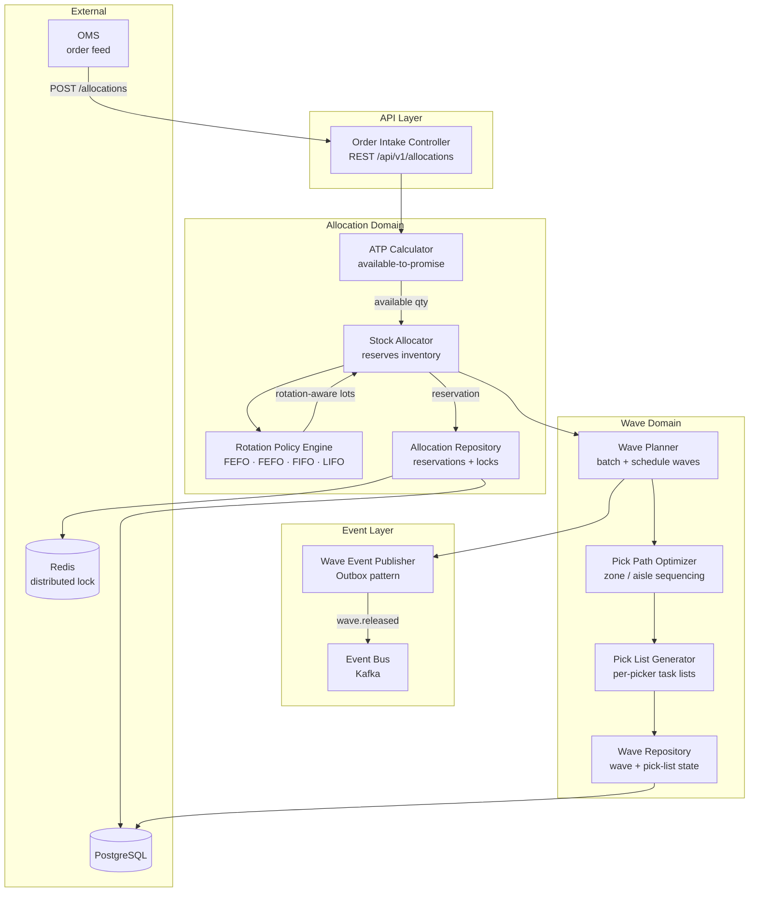
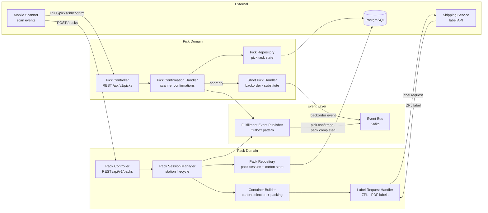
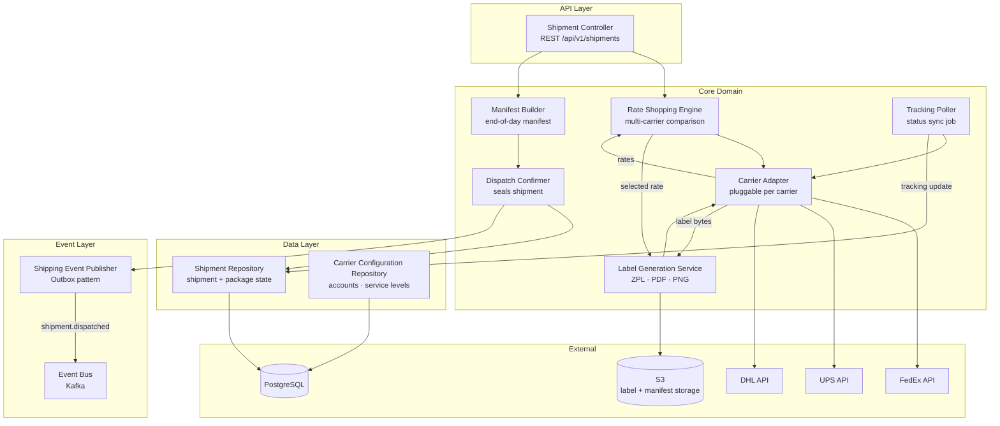

# Component Diagrams

## Overview

The Warehouse Management System (WMS) is built on a service-oriented architecture (SOA) in which each bounded domain is encapsulated as an independently deployable service. Services communicate synchronously over REST/gRPC for request-reply interactions and asynchronously over an event bus (Kafka) for domain-event propagation. All services share a common infrastructure layer consisting of PostgreSQL (persistence), Redis (caching and locking), Kafka (event streaming), and S3-compatible object storage (labels, manifests, reports).

| Service | Responsibility |
|---|---|
| **API Gateway** | TLS termination, JWT validation, rate limiting, request routing |
| **Receiving Service** | ASN ingestion, receipt recording, discrepancy detection, putaway task creation |
| **Putaway Service** | Directed putaway execution, slot assignment, inventory balance update |
| **Allocation Service** | ATP calculation, stock reservation, rotation policy enforcement |
| **Wave Service** | Wave planning, order batching, release scheduling |
| **Pick Service** | Pick task dispatch, scan confirmation, short-pick handling |
| **Pack Service** | Pack session management, carton building, label requests |
| **Shipping Service** | Carrier rate shopping, label generation, manifest building, dispatch |
| **Cycle Count Service** | Count task scheduling, variance detection, adjustment posting |
| **Replenishment Service** | Min/max triggers, replenishment task creation and execution |
| **Returns Service** | RMA ingestion, disposition routing, credit/restock posting |
| **Notification Service** | Fan-out of domain events to email, SMS, and push channels |
| **Reporting Service** | Operational dashboards, KPI aggregation, scheduled report generation |

---

## Service Architecture Overview

---

## Receiving Service Components

**Component Responsibilities:**

| Component | Responsibility |
|---|---|
| ASN Controller | Accepts inbound ASN payloads from OMS and scan confirmations from scanners; validates HTTP contract |
| ASN Validator | Cross-checks ASN line items against open purchase orders; enforces quantity and SKU constraints |
| Receipt Processor | Persists received quantities, drives state transitions on the ASN document |
| Discrepancy Detector | Compares expected vs. received quantities; raises over/under/damage events |
| Putaway Task Generator | Creates directed putaway tasks based on SKU putaway rules and available slot assignments |
| Receiving Event Publisher | Writes domain events to the transactional outbox; relay process forwards to Kafka |
| ASN Repository | Owns all persistence for ASN documents and their line-item status |
| Inventory Balance Repository | Applies delta updates to on-hand inventory balances on receipt confirmation |

---

## Allocation and Wave Service Components

**Component Responsibilities:**

| Component | Responsibility |
|---|---|
| Order Intake Controller | Accepts allocation requests from OMS; validates order lines and priority flags |
| ATP Calculator | Queries on-hand minus reserved quantities to determine what can be promised |
| Rotation Policy Engine | Enforces FEFO/FIFO/LIFO rotation per SKU class when selecting lots |
| Stock Allocator | Creates soft reservations using optimistic locking via Redis; commits to PostgreSQL |
| Wave Planner | Groups allocated orders into waves by zone, carrier cutoff, and priority |
| Pick Path Optimizer | Sequences pick locations to minimize travel distance using zone-aisle ordering |
| Pick List Generator | Produces per-picker task lists with optimized slot sequences |
| Wave Event Publisher | Emits `wave.released` events via outbox pattern for downstream services |
| Allocation Repository | Persists reservation records with concurrency-safe update patterns |
| Wave Repository | Stores wave headers, pick lists, and status lifecycle |

---

## Fulfillment Service Components

**Component Responsibilities:**

| Component | Responsibility |
|---|---|
| Pick Controller | Exposes pick task assignment and confirmation endpoints; routes scanner payloads |
| Pick Confirmation Handler | Validates scanned barcode against expected task; updates pick quantity |
| Short Pick Handler | Records shortage, triggers backorder or substitution workflow via event |
| Pack Controller | Manages pack station sessions; accepts scan-to-pack and close-carton commands |
| Pack Session Manager | Maintains the lifecycle of a pack station session from open to closed |
| Container Builder | Selects optimal carton size and records item-to-carton assignments |
| Label Request Handler | Requests shipping labels from Shipping Service; stores label reference |
| Fulfillment Event Publisher | Writes `pick.confirmed` and `pack.completed` events to outbox |
| Pick Repository | Persists pick task state including confirmations and shortage records |
| Pack Repository | Persists pack sessions, carton contents, and label associations |

---

## Shipping Service Components

**Component Responsibilities:**

| Component | Responsibility |
|---|---|
| Shipment Controller | Accepts shipment creation requests from Pack Service; exposes status endpoints |
| Carrier Adapter | Pluggable abstraction over carrier-specific APIs; normalises request/response models |
| Rate Shopping Engine | Queries multiple carriers in parallel; selects lowest cost or fastest service |
| Label Generation Service | Requests labels from chosen carrier; stores label to S3; returns label reference |
| Manifest Builder | Aggregates shipments into an end-of-day manifest per carrier account |
| Dispatch Confirmer | Marks shipment as dispatched; triggers manifest submission to carrier |
| Tracking Poller | Scheduled job that fetches tracking milestones and persists status updates |
| Shipping Event Publisher | Emits `shipment.dispatched` and `tracking.updated` events via outbox |
| Shipment Repository | Persists shipment headers, package details, label refs, and tracking history |
| Carrier Configuration Repository | Stores carrier account credentials, service levels, and rate card rules |

---

## Component Interface Contracts

| Component | Interface | Protocol | Input | Output | Error Contract |
|---|---|---|---|---|---|
| ASN Controller | `POST /api/v1/asns` | REST/JSON | `AsnPayload` (header + lines) | `201 AsnResponse` | `400` validation; `409` duplicate ASN |
| ASN Validator | Internal function | In-process | `AsnPayload`, PO data | `ValidationResult` | Throws `AsnValidationException` |
| Receipt Processor | Internal function | In-process | `ReceiptCommand` | `ReceiptRecord` | Throws `InventoryException` on balance conflict |
| Discrepancy Detector | Internal function | In-process | expected vs. actual qty | `DiscrepancyReport` | Returns empty list if no discrepancy |
| Putaway Task Generator | Internal function | In-process | `ReceiptRecord` | `List<PutawayTask>` | Throws `NoSlotAvailableException` |
| Order Intake Controller | `POST /api/v1/allocations` | REST/JSON | `AllocationRequest` | `202 AllocationRef` | `422` insufficient stock; `429` rate limit |
| ATP Calculator | Internal function | In-process | `SkuId`, `WarehouseId` | `AvailableQty` | Returns 0; never throws |
| Stock Allocator | Internal function | In-process | `AllocationRequest`, `AvailableQty` | `Reservation` | Throws `OptimisticLockException` on conflict |
| Wave Planner | Internal function | In-process | `List<Reservation>` | `Wave` | Throws `WaveConstraintException` |
| Pick Confirmation Handler | `PUT /api/v1/picks/:id/confirm` | REST/JSON | `ConfirmPayload` (scan + qty) | `200 PickTask` | `404` task not found; `409` already confirmed |
| Short Pick Handler | Internal function | In-process | `PickTask`, actualQty | `ShortageRecord` | Emits `pick.shorted` event; never throws |
| Pack Session Manager | `POST /api/v1/packs` | REST/JSON | `PackStartCommand` | `201 PackSession` | `400` invalid station; `409` session active |
| Container Builder | Internal function | In-process | `PackSession`, `ItemList` | `Carton` | Throws `CartonOverflowException` |
| Shipment Controller | `POST /api/v1/shipments` | REST/JSON | `ShipmentRequest` | `201 ShipmentResponse` | `400` invalid address; `503` carrier unavailable |
| Rate Shopping Engine | Internal function | In-process | `ShipmentRequest` | `List<RateQuote>` | Returns empty if all carriers fail |
| Carrier Adapter | Internal interface | In-process | `CarrierRequest` | `CarrierResponse` | Throws `CarrierApiException`; retried with backoff |
| Label Generation Service | Internal function | In-process | `RateQuote` | `LabelReference` (S3 key) | Throws `LabelGenerationException` |
| Manifest Builder | `POST /api/v1/manifests` | REST/JSON | `ManifestRequest` | `201 ManifestResponse` | `409` manifest already closed |
| Tracking Poller | Scheduled job | Cron/internal | Carrier tracking IDs | `TrackingUpdate` | Logs failures; skips on transient error |

---

## Component Dependencies Matrix

| Component | PostgreSQL | Redis | Kafka (publish) | Kafka (consume) | OMS | Carrier APIs | S3 |
|---|---|---|---|---|---|---|---|
| ASN Controller | ✓ read | — | — | — | — | — | — |
| ASN Validator | ✓ read (PO data) | — | — | — | — | — | — |
| Receipt Processor | ✓ write | — | — | — | — | — | — |
| Discrepancy Detector | ✓ write | — | — | — | — | — | — |
| Putaway Task Generator | ✓ write | — | ✓ | — | — | — | — |
| Receiving Event Publisher | ✓ outbox | — | ✓ | — | — | — | — |
| ATP Calculator | ✓ read | ✓ cache | — | — | — | — | — |
| Stock Allocator | ✓ write | ✓ lock | — | — | — | — | — |
| Rotation Policy Engine | ✓ read | — | — | — | — | — | — |
| Wave Planner | ✓ write | ✓ cache | ✓ | — | — | — | — |
| Pick Path Optimizer | ✓ read | — | — | — | — | — | — |
| Pick List Generator | ✓ write | — | — | — | — | — | — |
| Wave Event Publisher | ✓ outbox | — | ✓ | — | — | — | — |
| Pick Confirmation Handler | ✓ write | — | — | — | — | — | — |
| Short Pick Handler | ✓ write | — | ✓ | — | — | — | — |
| Pack Session Manager | ✓ write | — | — | — | — | — | — |
| Container Builder | ✓ write | — | — | — | — | — | — |
| Label Request Handler | ✓ write | — | — | — | — | — | ✓ |
| Fulfillment Event Publisher | ✓ outbox | — | ✓ | — | — | — | — |
| Rate Shopping Engine | ✓ read | ✓ cache | — | — | — | ✓ | — |
| Carrier Adapter | — | — | — | — | — | ✓ | — |
| Label Generation Service | ✓ write | — | — | — | — | ✓ | ✓ |
| Manifest Builder | ✓ write | — | — | — | — | — | ✓ |
| Dispatch Confirmer | ✓ write | — | ✓ | — | — | — | — |
| Tracking Poller | ✓ write | — | ✓ | — | — | ✓ | — |
| Shipping Event Publisher | ✓ outbox | — | ✓ | — | — | — | — |
| Cycle Count Engine | ✓ write | — | ✓ | — | — | — | — |
| Replenishment Engine | ✓ write | — | ✓ | ✓ | — | — | — |
| Returns Service | ✓ write | — | ✓ | — | ✓ | — | — |
| Notification Service | — | — | — | ✓ | — | — | — |
| Reporting Service | ✓ read | ✓ cache | — | ✓ | — | — | ✓ |

