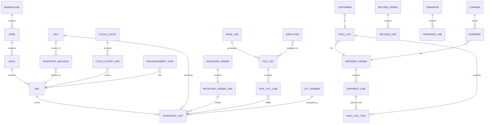

# ERD and Database Schema — Warehouse Management System

## Overview

This document defines the complete relational database schema for the Warehouse Management System (WMS). It covers entity relationships, table definitions with all column-level constraints, index strategy, foreign key catalogue, partitioning design, and data-retention policy.

### Technology Stack

- **Database engine:** PostgreSQL 16 (with `pg_partman` extension for automated partition management)
- **UUID generation:** `gen_random_uuid()` (pgcrypto / built-in PG 13+)
- **Timezone handling:** All timestamps stored as `TIMESTAMPTZ` (UTC); displayed in warehouse local timezone at the application layer
- **JSON columns:** `JSONB` for semi-structured payloads (carrier responses, shipping addresses, service level configs)
- **Generated columns:** Used for derived quantities (variance, available stock) to keep logic in the database and avoid sync drift

### Partitioning Strategy

High-volume operational tables are **range-partitioned by `warehouse_id`** (list partition). This keeps hot data for a single fulfilment centre on a limited set of pages, dramatically reducing I/O for warehouse-scoped queries.

Tables partitioned by `warehouse_id`:

| Table | Partition Key | Estimated Row Volume |
|---|---|---|
| `inventory_units` | `warehouse_id` | 10M+ rows per large DC |
| `inventory_balances` | `warehouse_id` | 1M+ rows per large DC |
| `inventory_ledger` | `warehouse_id` | 100M+ rows (append-only) |
| `pick_list_lines` | `warehouse_id` | 5M+ rows rolling 90 days |
| `wave_jobs` | `warehouse_id` | 500K+ rows rolling 90 days |

### Schema Design Principles

1. **Immutability for audit trails** — `inventory_ledger` is append-only; rows are never updated or deleted.
2. **Optimistic concurrency** — `inventory_balances` carries a `version` column; application increments it on every write and checks for conflicts.
3. **Soft deletes** — Operational entities use `is_active` flags rather than `DELETE` to preserve referential integrity and audit history.
4. **Generated columns for derived data** — `available_qty`, `variance_qty`, and `variance_pct` are `GENERATED ALWAYS AS` columns so they cannot drift from their source columns.
5. **JSONB for evolving payloads** — Carrier API responses and address blobs are stored as `JSONB` with GIN indexes to support ad-hoc JSON-path queries.
6. **Enum types** — Domain-constrained status and type columns use PostgreSQL native `ENUM` types for self-documentation and storage efficiency.

---

## Entity Relationship Diagram



---

## Table Definitions

### `warehouses`

Central registry of all physical fulfilment centres operated by the business.

| Column | Type | Nullable | Default | Constraints | Description |
|---|---|---|---|---|---|
| `id` | `UUID` | NO | `gen_random_uuid()` | PRIMARY KEY | Surrogate identifier |
| `code` | `VARCHAR(20)` | NO | — | UNIQUE NOT NULL | Short operational code, e.g. `DC-WEST-01` |
| `name` | `VARCHAR(200)` | NO | — | NOT NULL | Human-readable name |
| `address_line1` | `VARCHAR(200)` | YES | NULL | — | Street address line 1 |
| `address_line2` | `VARCHAR(200)` | YES | NULL | — | Street address line 2 (suite, building) |
| `city` | `VARCHAR(100)` | YES | NULL | — | City |
| `state_province` | `VARCHAR(100)` | YES | NULL | — | State or province |
| `country` | `CHAR(2)` | YES | NULL | — | ISO 3166-1 alpha-2 country code |
| `postal_code` | `VARCHAR(20)` | YES | NULL | — | Postal / ZIP code |
| `timezone` | `VARCHAR(50)` | YES | `'UTC'` | — | IANA timezone string, e.g. `America/Los_Angeles` |
| `is_active` | `BOOLEAN` | NO | `true` | NOT NULL | Soft-delete flag |
| `max_capacity_sqft` | `DECIMAL(10,2)` | YES | NULL | CHECK (> 0) | Total floor area capacity |
| `manager_employee_id` | `UUID` | YES | NULL | FK → `employees.id` | Current warehouse manager |
| `created_at` | `TIMESTAMPTZ` | NO | `now()` | NOT NULL | Record creation timestamp |
| `updated_at` | `TIMESTAMPTZ` | NO | `now()` | NOT NULL | Last update timestamp |

---

### `zones`

Logical sub-divisions of a warehouse (e.g., Cold Chain, Hazmat, Pick Face).

| Column | Type | Nullable | Default | Constraints | Description |
|---|---|---|---|---|---|
| `id` | `UUID` | NO | `gen_random_uuid()` | PRIMARY KEY | Surrogate identifier |
| `warehouse_id` | `UUID` | NO | — | FK → `warehouses.id` NOT NULL | Parent warehouse |
| `code` | `VARCHAR(20)` | NO | — | NOT NULL | Zone code, e.g. `ZONE-A` |
| `name` | `VARCHAR(200)` | NO | — | NOT NULL | Descriptive zone name |
| `zone_type` | `zone_type_enum` | NO | — | NOT NULL | ENUM: `RECEIVING`, `STORAGE`, `PICKING`, `PACKING`, `SHIPPING`, `QUARANTINE`, `HAZMAT`, `COLD_CHAIN`, `STAGING` |
| `temperature_min_c` | `DECIMAL(5,2)` | YES | NULL | — | Minimum required ambient temperature (°C) |
| `temperature_max_c` | `DECIMAL(5,2)` | YES | NULL | CHECK (≥ temperature_min_c) | Maximum required ambient temperature (°C) |
| `is_hazmat_allowed` | `BOOLEAN` | NO | `false` | NOT NULL | Whether hazardous materials may be stored here |
| `is_active` | `BOOLEAN` | NO | `true` | NOT NULL | Soft-delete flag |
| `sort_order` | `INT` | NO | `0` | NOT NULL | Display ordering within warehouse |
| `created_at` | `TIMESTAMPTZ` | NO | `now()` | NOT NULL | Record creation timestamp |
| `updated_at` | `TIMESTAMPTZ` | NO | `now()` | NOT NULL | Last update timestamp |

---

### `aisles`

Named corridors within a zone, used for routing pickers and organising bins.

| Column | Type | Nullable | Default | Constraints | Description |
|---|---|---|---|---|---|
| `id` | `UUID` | NO | `gen_random_uuid()` | PRIMARY KEY | Surrogate identifier |
| `zone_id` | `UUID` | NO | — | FK → `zones.id` NOT NULL | Parent zone |
| `code` | `VARCHAR(20)` | NO | — | NOT NULL | Aisle identifier, e.g. `A-01` |
| `name` | `VARCHAR(200)` | YES | NULL | — | Optional descriptive name |
| `aisle_type` | `VARCHAR(50)` | YES | NULL | — | E.g. `SINGLE_DEEP`, `DOUBLE_DEEP`, `DRIVE_IN` |
| `is_active` | `BOOLEAN` | NO | `true` | NOT NULL | Soft-delete flag |
| `sort_order` | `INT` | NO | `0` | NOT NULL | Optimised pick-path ordering within zone |
| `created_at` | `TIMESTAMPTZ` | NO | `now()` | NOT NULL | Record creation timestamp |

---

### `bins`

Individual storage locations (shelves, pallet positions, floor spots, virtual staging).

| Column | Type | Nullable | Default | Constraints | Description |
|---|---|---|---|---|---|
| `id` | `UUID` | NO | `gen_random_uuid()` | PRIMARY KEY | Surrogate identifier |
| `aisle_id` | `UUID` | YES | NULL | FK → `aisles.id` | Parent aisle (NULL for virtual/staging bins) |
| `zone_id` | `UUID` | NO | — | FK → `zones.id` NOT NULL | Parent zone (denormalised for query performance) |
| `warehouse_id` | `UUID` | NO | — | FK → `warehouses.id` NOT NULL | Parent warehouse (partition key) |
| `code` | `VARCHAR(50)` | NO | — | NOT NULL | Bin address, e.g. `A-01-L2-P04` |
| `bin_type` | `bin_type_enum` | NO | `'SHELF'` | NOT NULL | ENUM: `SHELF`, `PALLET`, `FLOOR`, `STAGING`, `VIRTUAL` |
| `level` | `INT` | YES | NULL | CHECK (> 0) | Vertical level number (1 = floor) |
| `position` | `INT` | YES | NULL | CHECK (> 0) | Horizontal position within aisle level |
| `max_weight_kg` | `DECIMAL(10,3)` | YES | NULL | CHECK (> 0) | Weight capacity |
| `max_volume_cm3` | `BIGINT` | YES | NULL | CHECK (> 0) | Volumetric capacity in cm³ |
| `max_units` | `INT` | YES | NULL | CHECK (> 0) | Maximum unit count |
| `is_active` | `BOOLEAN` | NO | `true` | NOT NULL | Soft-delete flag |
| `is_locked` | `BOOLEAN` | NO | `false` | NOT NULL | Prevents new stock movements when true |
| `lock_reason` | `TEXT` | YES | NULL | — | Free-text explanation for lock |
| `current_weight_kg` | `DECIMAL(10,3)` | NO | `0` | NOT NULL CHECK (≥ 0) | Live weight tracking |
| `current_volume_cm3` | `BIGINT` | NO | `0` | NOT NULL CHECK (≥ 0) | Live volume tracking |
| `current_unit_count` | `INT` | NO | `0` | NOT NULL CHECK (≥ 0) | Live unit count |
| `created_at` | `TIMESTAMPTZ` | NO | `now()` | NOT NULL | Record creation timestamp |
| `updated_at` | `TIMESTAMPTZ` | NO | `now()` | NOT NULL | Last update timestamp |

---

### `skus`

Master catalogue of all stock-keeping units the WMS manages.

| Column | Type | Nullable | Default | Constraints | Description |
|---|---|---|---|---|---|
| `id` | `UUID` | NO | `gen_random_uuid()` | PRIMARY KEY | Surrogate identifier |
| `sku_code` | `VARCHAR(100)` | NO | — | UNIQUE NOT NULL | Internal SKU code |
| `barcode` | `VARCHAR(100)` | YES | NULL | — | Primary scannable barcode (EAN-13, Code-128, etc.) |
| `upc` | `VARCHAR(20)` | YES | NULL | — | Universal Product Code |
| `description` | `TEXT` | YES | NULL | — | Full product description |
| `category_id` | `UUID` | YES | NULL | FK → `sku_categories.id` | Product category |
| `unit_of_measure` | `VARCHAR(20)` | NO | `'EA'` | NOT NULL | Base UOM (EA, CS, KG, LT, etc.) |
| `weight_kg` | `DECIMAL(10,4)` | YES | NULL | CHECK (≥ 0) | Unit weight in kilograms |
| `length_cm` | `DECIMAL(10,2)` | YES | NULL | CHECK (≥ 0) | Unit length in centimetres |
| `width_cm` | `DECIMAL(10,2)` | YES | NULL | CHECK (≥ 0) | Unit width in centimetres |
| `height_cm` | `DECIMAL(10,2)` | YES | NULL | CHECK (≥ 0) | Unit height in centimetres |
| `volume_cm3` | `DECIMAL(14,4)` | YES | NULL | GENERATED ALWAYS AS (length_cm * width_cm * height_cm) | Computed unit volume |
| `is_serialized` | `BOOLEAN` | NO | `false` | NOT NULL | Whether each unit carries a unique serial number |
| `is_lot_controlled` | `BOOLEAN` | NO | `false` | NOT NULL | Whether inventory is tracked at lot level |
| `is_hazmat` | `BOOLEAN` | NO | `false` | NOT NULL | Hazardous material flag |
| `hazmat_class` | `VARCHAR(20)` | YES | NULL | — | UN hazmat classification (e.g. `3`, `6.1`) |
| `rotation_policy` | `rotation_policy_enum` | NO | `'FIFO'` | NOT NULL | ENUM: `FIFO`, `FEFO`, `LIFO` |
| `min_stock_level` | `INT` | YES | NULL | CHECK (≥ 0) | Minimum acceptable on-hand quantity |
| `max_stock_level` | `INT` | YES | NULL | CHECK (≥ min_stock_level) | Maximum target on-hand quantity |
| `reorder_point` | `INT` | YES | NULL | CHECK (≥ 0) | Quantity threshold that triggers replenishment |
| `reorder_quantity` | `INT` | YES | NULL | CHECK (> 0) | Standard replenishment order quantity |
| `shelf_life_days` | `INT` | YES | NULL | CHECK (> 0) | Product shelf life in days from manufacture |
| `storage_temp_min_c` | `DECIMAL(5,2)` | YES | NULL | — | Minimum storage temperature (°C) |
| `storage_temp_max_c` | `DECIMAL(5,2)` | YES | NULL | CHECK (≥ storage_temp_min_c) | Maximum storage temperature (°C) |
| `is_active` | `BOOLEAN` | NO | `true` | NOT NULL | Soft-delete flag |
| `created_at` | `TIMESTAMPTZ` | NO | `now()` | NOT NULL | Record creation timestamp |
| `updated_at` | `TIMESTAMPTZ` | NO | `now()` | NOT NULL | Last update timestamp |

---

### `inventory_units`

Each row represents a discrete, traceable unit (or homogeneous batch) of a SKU physically present in a bin. Partitioned by `warehouse_id`.

| Column | Type | Nullable | Default | Constraints | Description |
|---|---|---|---|---|---|
| `id` | `UUID` | NO | `gen_random_uuid()` | PRIMARY KEY | Surrogate identifier |
| `sku_id` | `UUID` | NO | — | FK → `skus.id` NOT NULL | SKU reference |
| `warehouse_id` | `UUID` | NO | — | FK → `warehouses.id` NOT NULL | Partition key |
| `bin_id` | `UUID` | NO | — | FK → `bins.id` NOT NULL | Current storage location |
| `lot_id` | `UUID` | YES | NULL | FK → `lot_numbers.id` | Lot reference (when lot-controlled) |
| `serial_number` | `VARCHAR(100)` | YES | NULL | — | Serial number (when serialised) |
| `status` | `inv_unit_status_enum` | NO | `'RECEIVED'` | NOT NULL | ENUM: `RECEIVED`, `IN_PUTAWAY`, `STORED`, `RESERVED`, `PICKED`, `PACKED`, `SHIPPED`, `QUARANTINED`, `DAMAGED`, `RETURNED`, `EXPIRED` |
| `received_date` | `DATE` | YES | NULL | — | Date this unit was received into the warehouse |
| `expiry_date` | `DATE` | YES | NULL | — | Expiry date (drives FEFO rotation) |
| `quantity` | `INT` | NO | `1` | NOT NULL CHECK (> 0) | Number of units represented by this row |
| `unit_cost` | `DECIMAL(12,4)` | YES | NULL | CHECK (≥ 0) | Cost per unit at time of receipt |
| `origin_receiving_line_id` | `UUID` | YES | NULL | FK → `receiving_order_lines.id` | Inbound receipt provenance |
| `is_damaged` | `BOOLEAN` | NO | `false` | NOT NULL | Damage flag set during quality inspection |
| `quarantine_reason` | `TEXT` | YES | NULL | — | Reason text when status is QUARANTINED |
| `created_at` | `TIMESTAMPTZ` | NO | `now()` | NOT NULL | Record creation timestamp |
| `updated_at` | `TIMESTAMPTZ` | NO | `now()` | NOT NULL | Last update timestamp |

---

### `inventory_balances`

Aggregated on-hand and reservation counters per (warehouse, zone, bin, SKU, lot) tuple. Partitioned by `warehouse_id`. Uses optimistic locking via `version`.

| Column | Type | Nullable | Default | Constraints | Description |
|---|---|---|---|---|---|
| `id` | `UUID` | NO | `gen_random_uuid()` | PRIMARY KEY | Surrogate identifier |
| `warehouse_id` | `UUID` | NO | — | FK → `warehouses.id` NOT NULL | Partition key |
| `zone_id` | `UUID` | NO | — | FK → `zones.id` NOT NULL | Denormalised zone for fast zone-level rollups |
| `bin_id` | `UUID` | NO | — | FK → `bins.id` NOT NULL | Storage location |
| `sku_id` | `UUID` | NO | — | FK → `skus.id` NOT NULL | SKU reference |
| `lot_id` | `UUID` | YES | NULL | FK → `lot_numbers.id` | Lot reference (NULL when not lot-controlled) |
| `on_hand_qty` | `INT` | NO | `0` | NOT NULL CHECK (≥ 0) | Total physical units in this location |
| `reserved_qty` | `INT` | NO | `0` | NOT NULL CHECK (≥ 0) | Units allocated to open orders |
| `available_qty` | `INT` | NO | — | GENERATED ALWAYS AS (on_hand_qty - reserved_qty) | Available-to-promise quantity |
| `in_transit_qty` | `INT` | NO | `0` | NOT NULL CHECK (≥ 0) | Units moving between bins (replenishment) |
| `quarantined_qty` | `INT` | NO | `0` | NOT NULL CHECK (≥ 0) | Units held in quarantine |
| `version` | `BIGINT` | NO | `1` | NOT NULL | Optimistic concurrency version counter |
| `last_updated_at` | `TIMESTAMPTZ` | NO | `now()` | NOT NULL | Timestamp of last balance mutation |

---

### `inventory_ledger`

Immutable, append-only audit journal of every stock quantity change. Never updated or deleted. Partitioned by `warehouse_id` and sub-partitioned by `created_at` (monthly) for efficient archival.

| Column | Type | Nullable | Default | Constraints | Description |
|---|---|---|---|---|---|
| `id` | `UUID` | NO | `gen_random_uuid()` | PRIMARY KEY | Surrogate identifier |
| `warehouse_id` | `UUID` | NO | — | NOT NULL | Partition key |
| `sku_id` | `UUID` | NO | — | FK → `skus.id` NOT NULL | SKU reference |
| `bin_id` | `UUID` | NO | — | FK → `bins.id` NOT NULL | Affected bin |
| `lot_id` | `UUID` | YES | NULL | FK → `lot_numbers.id` | Lot reference |
| `movement_type` | `ledger_movement_enum` | NO | — | NOT NULL | ENUM: `RECEIPT`, `PUTAWAY`, `PICK`, `PACK`, `SHIP`, `ADJUSTMENT`, `TRANSFER_OUT`, `TRANSFER_IN`, `RETURN`, `CYCLE_COUNT_ADJ` |
| `quantity_change` | `INT` | NO | — | NOT NULL | Signed delta (negative = outbound) |
| `quantity_before` | `INT` | NO | — | NOT NULL | Balance before this movement |
| `quantity_after` | `INT` | NO | — | NOT NULL | Balance after this movement |
| `reference_type` | `VARCHAR(50)` | YES | NULL | — | Source document type (e.g. `receiving_order`, `shipment_order`) |
| `reference_id` | `UUID` | YES | NULL | — | Source document ID |
| `actor_id` | `UUID` | YES | NULL | FK → `employees.id` | Employee who triggered movement |
| `reason_code` | `VARCHAR(50)` | YES | NULL | — | Operational reason code |
| `correlation_id` | `UUID` | YES | NULL | — | Groups related ledger entries in one business event |
| `created_at` | `TIMESTAMPTZ` | NO | `now()` | NOT NULL | Immutable creation timestamp |

---

### `lot_numbers`

Tracks supplier and internal lot/batch identifiers for lot-controlled SKUs.

| Column | Type | Nullable | Default | Constraints | Description |
|---|---|---|---|---|---|
| `id` | `UUID` | NO | `gen_random_uuid()` | PRIMARY KEY | Surrogate identifier |
| `sku_id` | `UUID` | NO | — | FK → `skus.id` NOT NULL | Associated SKU |
| `lot_number` | `VARCHAR(100)` | NO | — | NOT NULL | Internal WMS lot number |
| `supplier_lot_number` | `VARCHAR(100)` | YES | NULL | — | Supplier's own lot/batch reference |
| `manufacture_date` | `DATE` | YES | NULL | — | Date of manufacture |
| `expiry_date` | `DATE` | YES | NULL | — | Expiry / best-before date |
| `origin_country` | `CHAR(2)` | YES | NULL | — | ISO 3166-1 alpha-2 country of origin |
| `is_quarantined` | `BOOLEAN` | NO | `false` | NOT NULL | Whether entire lot is quarantined |
| `quarantine_reason` | `TEXT` | YES | NULL | — | Reason for lot-level quarantine |
| `created_at` | `TIMESTAMPTZ` | NO | `now()` | NOT NULL | Record creation timestamp |
| `updated_at` | `TIMESTAMPTZ` | NO | `now()` | NOT NULL | Last update timestamp |

---

### `receiving_orders`

Inbound purchase order receipts (ASNs or walk-in deliveries).

| Column | Type | Nullable | Default | Constraints | Description |
|---|---|---|---|---|---|
| `id` | `UUID` | NO | `gen_random_uuid()` | PRIMARY KEY | Surrogate identifier |
| `warehouse_id` | `UUID` | NO | — | FK → `warehouses.id` NOT NULL | Receiving warehouse |
| `order_number` | `VARCHAR(50)` | NO | — | UNIQUE NOT NULL | WMS-generated receipt reference |
| `po_number` | `VARCHAR(100)` | YES | NULL | — | Purchase order number from ERP |
| `supplier_id` | `UUID` | YES | NULL | — | Reference to supplier master (external) |
| `expected_arrival_date` | `DATE` | YES | NULL | — | Planned delivery date from ASN |
| `actual_arrival_date` | `DATE` | YES | NULL | — | Date goods physically arrived |
| `status` | `receiving_status_enum` | NO | `'PENDING'` | NOT NULL | ENUM: `PENDING`, `IN_PROGRESS`, `COMPLETED`, `CLOSED`, `CANCELLED` |
| `total_expected_lines` | `INT` | NO | `0` | NOT NULL CHECK (≥ 0) | Line count from ASN |
| `total_received_lines` | `INT` | NO | `0` | NOT NULL CHECK (≥ 0) | Lines confirmed received |
| `has_discrepancies` | `BOOLEAN` | NO | `false` | NOT NULL | Set true when any line has a variance |
| `created_by` | `UUID` | YES | NULL | FK → `employees.id` | Employee who created the record |
| `notes` | `TEXT` | YES | NULL | — | Free-text delivery notes |
| `created_at` | `TIMESTAMPTZ` | NO | `now()` | NOT NULL | Record creation timestamp |
| `updated_at` | `TIMESTAMPTZ` | NO | `now()` | NOT NULL | Last update timestamp |

---

### `receiving_order_lines`

Individual SKU lines within a receiving order, with expected vs. actual quantities.

| Column | Type | Nullable | Default | Constraints | Description |
|---|---|---|---|---|---|
| `id` | `UUID` | NO | `gen_random_uuid()` | PRIMARY KEY | Surrogate identifier |
| `receiving_order_id` | `UUID` | NO | — | FK → `receiving_orders.id` NOT NULL | Parent receipt |
| `sku_id` | `UUID` | NO | — | FK → `skus.id` NOT NULL | SKU being received |
| `expected_qty` | `INT` | NO | — | NOT NULL CHECK (> 0) | Quantity expected per ASN |
| `received_qty` | `INT` | NO | `0` | NOT NULL CHECK (≥ 0) | Quantity physically counted and accepted |
| `variance_qty` | `INT` | NO | — | GENERATED ALWAYS AS (received_qty - expected_qty) | Signed variance |
| `variance_pct` | `DECIMAL(7,4)` | NO | — | GENERATED ALWAYS AS (CASE WHEN expected_qty = 0 THEN NULL ELSE (received_qty - expected_qty)::DECIMAL / expected_qty * 100 END) | Variance as percentage |
| `lot_number` | `VARCHAR(100)` | YES | NULL | — | Lot number declared at receipt |
| `expiry_date` | `DATE` | YES | NULL | — | Expiry date declared at receipt |
| `status` | `rcv_line_status_enum` | NO | `'PENDING'` | NOT NULL | ENUM: `PENDING`, `PARTIAL`, `COMPLETE`, `DISCREPANCY` |
| `discrepancy_reason` | `TEXT` | YES | NULL | — | Explanation for quantity or condition discrepancy |
| `created_at` | `TIMESTAMPTZ` | NO | `now()` | NOT NULL | Record creation timestamp |
| `updated_at` | `TIMESTAMPTZ` | NO | `now()` | NOT NULL | Last update timestamp |

---

### `wave_jobs`

A wave groups multiple outbound orders for coordinated, optimised picking. Partitioned by `warehouse_id`.

| Column | Type | Nullable | Default | Constraints | Description |
|---|---|---|---|---|---|
| `id` | `UUID` | NO | `gen_random_uuid()` | PRIMARY KEY | Surrogate identifier |
| `warehouse_id` | `UUID` | NO | — | FK → `warehouses.id` NOT NULL | Partition key |
| `wave_number` | `VARCHAR(30)` | NO | — | UNIQUE NOT NULL | Human-readable wave reference |
| `wave_type` | `wave_type_enum` | NO | — | NOT NULL | ENUM: `ZONE`, `BATCH`, `CLUSTER`, `SINGLE` |
| `status` | `wave_status_enum` | NO | `'PLANNED'` | NOT NULL | ENUM: `PLANNED`, `RELEASED`, `IN_PROGRESS`, `COMPLETED`, `CANCELLED` |
| `planned_start_at` | `TIMESTAMPTZ` | YES | NULL | — | Scheduled release time |
| `cut_off_time` | `TIMESTAMPTZ` | YES | NULL | — | Deadline; orders after this time excluded |
| `priority` | `INT` | NO | `50` | NOT NULL CHECK (BETWEEN 1 AND 100) | Priority score (100 = highest) |
| `order_count` | `INT` | NO | `0` | NOT NULL CHECK (≥ 0) | Number of shipment orders in this wave |
| `line_count` | `INT` | NO | `0` | NOT NULL CHECK (≥ 0) | Total pick lines across all orders |
| `total_units` | `INT` | NO | `0` | NOT NULL CHECK (≥ 0) | Total units to pick |
| `zone_ids` | `UUID[]` | YES | NULL | — | Array of zones included in this wave |
| `assigned_by` | `UUID` | YES | NULL | FK → `employees.id` | Supervisor who released the wave |
| `created_at` | `TIMESTAMPTZ` | NO | `now()` | NOT NULL | Record creation timestamp |
| `updated_at` | `TIMESTAMPTZ` | NO | `now()` | NOT NULL | Last update timestamp |

---

### `pick_lists`

A pick list is an executable work unit assigned to a single picker.

| Column | Type | Nullable | Default | Constraints | Description |
|---|---|---|---|---|---|
| `id` | `UUID` | NO | `gen_random_uuid()` | PRIMARY KEY | Surrogate identifier |
| `wave_job_id` | `UUID` | NO | — | FK → `wave_jobs.id` NOT NULL | Parent wave |
| `warehouse_id` | `UUID` | NO | — | FK → `warehouses.id` NOT NULL | Denormalised for partition alignment |
| `zone_id` | `UUID` | YES | NULL | FK → `zones.id` | Zone restriction (for zone-pick strategy) |
| `pick_strategy` | `VARCHAR(30)` | NO | `'DISCRETE'` | NOT NULL | E.g. `DISCRETE`, `CLUSTER`, `BATCH` |
| `status` | `pick_list_status_enum` | NO | `'PENDING'` | NOT NULL | ENUM: `PENDING`, `ASSIGNED`, `IN_PROGRESS`, `COMPLETED`, `CANCELLED`, `SHORT_PICKED` |
| `assigned_to_employee_id` | `UUID` | YES | NULL | FK → `employees.id` | Assigned picker |
| `assigned_at` | `TIMESTAMPTZ` | YES | NULL | — | Timestamp of assignment |
| `started_at` | `TIMESTAMPTZ` | YES | NULL | — | First scan / first pick |
| `completed_at` | `TIMESTAMPTZ` | YES | NULL | — | All lines resolved |
| `total_lines` | `INT` | NO | `0` | NOT NULL CHECK (≥ 0) | Total lines on this pick list |
| `picked_lines` | `INT` | NO | `0` | NOT NULL CHECK (≥ 0) | Lines with status COMPLETED |
| `created_at` | `TIMESTAMPTZ` | NO | `now()` | NOT NULL | Record creation timestamp |
| `updated_at` | `TIMESTAMPTZ` | NO | `now()` | NOT NULL | Last update timestamp |

---

### `pick_list_lines`

Individual pick instructions within a pick list. Partitioned by `warehouse_id`.

| Column | Type | Nullable | Default | Constraints | Description |
|---|---|---|---|---|---|
| `id` | `UUID` | NO | `gen_random_uuid()` | PRIMARY KEY | Surrogate identifier |
| `pick_list_id` | `UUID` | NO | — | FK → `pick_lists.id` NOT NULL | Parent pick list |
| `warehouse_id` | `UUID` | NO | — | NOT NULL | Partition key (denormalised) |
| `shipment_order_id` | `UUID` | NO | — | FK → `shipment_orders.id` NOT NULL | Target shipment order |
| `shipment_line_id` | `UUID` | NO | — | FK → `shipment_lines.id` NOT NULL | Target shipment line |
| `sku_id` | `UUID` | NO | — | FK → `skus.id` NOT NULL | SKU to pick |
| `bin_id` | `UUID` | NO | — | FK → `bins.id` NOT NULL | Directed source bin |
| `lot_id` | `UUID` | YES | NULL | FK → `lot_numbers.id` | Required lot (when lot-controlled) |
| `serial_number` | `VARCHAR(100)` | YES | NULL | — | Required serial number (when serialised) |
| `required_qty` | `INT` | NO | — | NOT NULL CHECK (> 0) | Units to pick |
| `picked_qty` | `INT` | NO | `0` | NOT NULL CHECK (≥ 0) | Units actually picked |
| `short_qty` | `INT` | NO | — | GENERATED ALWAYS AS (required_qty - picked_qty) | Unfulfilled quantity |
| `status` | `pick_line_status_enum` | NO | `'PENDING'` | NOT NULL | ENUM: `PENDING`, `IN_PROGRESS`, `COMPLETED`, `SHORT`, `SKIPPED` |
| `override_bin_id` | `UUID` | YES | NULL | FK → `bins.id` | Alternate bin used when directed bin was empty |
| `reason_code` | `VARCHAR(50)` | YES | NULL | — | SHORT / SKIPPED reason |
| `confirmed_at` | `TIMESTAMPTZ` | YES | NULL | — | Scanner confirmation timestamp |
| `created_at` | `TIMESTAMPTZ` | NO | `now()` | NOT NULL | Record creation timestamp |

---

### `shipment_orders`

Outbound customer orders to be picked, packed, and shipped.

| Column | Type | Nullable | Default | Constraints | Description |
|---|---|---|---|---|---|
| `id` | `UUID` | NO | `gen_random_uuid()` | PRIMARY KEY | Surrogate identifier |
| `warehouse_id` | `UUID` | NO | — | FK → `warehouses.id` NOT NULL | Fulfilling warehouse |
| `order_number` | `VARCHAR(50)` | NO | — | UNIQUE NOT NULL | External order reference (OMS/ERP) |
| `customer_id` | `UUID` | YES | NULL | — | Customer identifier (external) |
| `carrier_id` | `UUID` | YES | NULL | FK → `carriers.id` | Preferred carrier |
| `service_level` | `VARCHAR(50)` | YES | NULL | — | Carrier service level (e.g. `NEXT_DAY`, `GROUND`) |
| `ship_by_date` | `DATE` | YES | NULL | — | Latest acceptable ship date (SLA) |
| `status` | `shipment_order_status_enum` | NO | `'PENDING'` | NOT NULL | ENUM: `PENDING`, `ALLOCATED`, `WAVED`, `PICKING`, `PACKING`, `READY`, `SHIPPED`, `CANCELLED`, `BACKORDERED` |
| `priority` | `INT` | NO | `50` | NOT NULL CHECK (BETWEEN 1 AND 100) | Fulfilment priority score |
| `total_lines` | `INT` | NO | `0` | NOT NULL CHECK (≥ 0) | Number of order lines |
| `total_units` | `INT` | NO | `0` | NOT NULL CHECK (≥ 0) | Total units ordered |
| `shipping_address_json` | `JSONB` | YES | NULL | — | Delivery address payload (flexible schema) |
| `is_rush` | `BOOLEAN` | NO | `false` | NOT NULL | Rush / expedited order flag |
| `created_at` | `TIMESTAMPTZ` | NO | `now()` | NOT NULL | Record creation timestamp |
| `updated_at` | `TIMESTAMPTZ` | NO | `now()` | NOT NULL | Last update timestamp |

---

### `shipment_lines`

Individual SKU lines within a shipment order.

| Column | Type | Nullable | Default | Constraints | Description |
|---|---|---|---|---|---|
| `id` | `UUID` | NO | `gen_random_uuid()` | PRIMARY KEY | Surrogate identifier |
| `shipment_order_id` | `UUID` | NO | — | FK → `shipment_orders.id` NOT NULL | Parent order |
| `sku_id` | `UUID` | NO | — | FK → `skus.id` NOT NULL | SKU to ship |
| `ordered_qty` | `INT` | NO | — | NOT NULL CHECK (> 0) | Customer-requested quantity |
| `allocated_qty` | `INT` | NO | `0` | NOT NULL CHECK (≥ 0) | Quantity reserved from inventory |
| `picked_qty` | `INT` | NO | `0` | NOT NULL CHECK (≥ 0) | Quantity confirmed picked |
| `packed_qty` | `INT` | NO | `0` | NOT NULL CHECK (≥ 0) | Quantity confirmed packed |
| `shipped_qty` | `INT` | NO | `0` | NOT NULL CHECK (≥ 0) | Quantity included in dispatched shipment |
| `status` | `shipment_line_status_enum` | NO | `'PENDING'` | NOT NULL | ENUM: `PENDING`, `ALLOCATED`, `PICKED`, `PACKED`, `SHIPPED`, `CANCELLED`, `SHORT` |
| `created_at` | `TIMESTAMPTZ` | NO | `now()` | NOT NULL | Record creation timestamp |
| `updated_at` | `TIMESTAMPTZ` | NO | `now()` | NOT NULL | Last update timestamp |

---

### `shipments`

Carrier-level shipment records linking an order to a tracking number and dispatch event.

| Column | Type | Nullable | Default | Constraints | Description |
|---|---|---|---|---|---|
| `id` | `UUID` | NO | `gen_random_uuid()` | PRIMARY KEY | Surrogate identifier |
| `shipment_order_id` | `UUID` | NO | — | FK → `shipment_orders.id` NOT NULL | Source order |
| `carrier_id` | `UUID` | NO | — | FK → `carriers.id` NOT NULL | Carrier assigned |
| `tracking_number` | `VARCHAR(100)` | YES | NULL | — | Carrier-issued tracking number |
| `label_url` | `TEXT` | YES | NULL | — | S3/CDN URL for shipping label PDF |
| `manifest_id` | `VARCHAR(100)` | YES | NULL | — | Carrier manifest / collection reference |
| `status` | `shipment_status_enum` | NO | `'PENDING'` | NOT NULL | ENUM: `PENDING`, `LABEL_GENERATED`, `MANIFESTED`, `DISPATCHED`, `DELIVERED`, `EXCEPTION`, `RETURNED` |
| `dispatched_at` | `TIMESTAMPTZ` | YES | NULL | — | Timestamp of physical handover to carrier |
| `estimated_delivery_at` | `TIMESTAMPTZ` | YES | NULL | — | Carrier ETA |
| `actual_delivery_at` | `TIMESTAMPTZ` | YES | NULL | — | Confirmed delivery timestamp |
| `weight_kg` | `DECIMAL(10,3)` | YES | NULL | CHECK (≥ 0) | Total consignment weight |
| `carrier_response_json` | `JSONB` | YES | NULL | — | Raw carrier API response (label, rate, events) |
| `created_at` | `TIMESTAMPTZ` | NO | `now()` | NOT NULL | Record creation timestamp |
| `updated_at` | `TIMESTAMPTZ` | NO | `now()` | NOT NULL | Last update timestamp |

---

### `cycle_counts`

Planned or ad-hoc physical inventory verification campaigns.

| Column | Type | Nullable | Default | Constraints | Description |
|---|---|---|---|---|---|
| `id` | `UUID` | NO | `gen_random_uuid()` | PRIMARY KEY | Surrogate identifier |
| `warehouse_id` | `UUID` | NO | — | FK → `warehouses.id` NOT NULL | Target warehouse |
| `count_number` | `VARCHAR(30)` | NO | — | UNIQUE NOT NULL | Human-readable count reference |
| `count_type` | `cycle_count_type_enum` | NO | — | NOT NULL | ENUM: `FULL`, `PARTIAL`, `BLIND`, `ABC_ANALYSIS` |
| `status` | `cycle_count_status_enum` | NO | `'SCHEDULED'` | NOT NULL | ENUM: `SCHEDULED`, `IN_PROGRESS`, `UNDER_REVIEW`, `APPROVED`, `CLOSED` |
| `scheduled_date` | `DATE` | YES | NULL | — | Planned execution date |
| `started_at` | `TIMESTAMPTZ` | YES | NULL | — | Actual start timestamp |
| `completed_at` | `TIMESTAMPTZ` | YES | NULL | — | All lines counted timestamp |
| `approved_by` | `UUID` | YES | NULL | FK → `employees.id` | Supervisor who approved count results |
| `total_bins_to_count` | `INT` | NO | `0` | NOT NULL CHECK (≥ 0) | Bins in scope |
| `total_bins_counted` | `INT` | NO | `0` | NOT NULL CHECK (≥ 0) | Bins with at least one count line completed |
| `variance_detected` | `BOOLEAN` | NO | `false` | NOT NULL | Set true if any approved adjustment was non-zero |
| `created_at` | `TIMESTAMPTZ` | NO | `now()` | NOT NULL | Record creation timestamp |
| `updated_at` | `TIMESTAMPTZ` | NO | `now()` | NOT NULL | Last update timestamp |

---

### `cycle_count_lines`

Individual bin/SKU/lot counting records within a cycle count.

| Column | Type | Nullable | Default | Constraints | Description |
|---|---|---|---|---|---|
| `id` | `UUID` | NO | `gen_random_uuid()` | PRIMARY KEY | Surrogate identifier |
| `cycle_count_id` | `UUID` | NO | — | FK → `cycle_counts.id` NOT NULL | Parent cycle count |
| `bin_id` | `UUID` | NO | — | FK → `bins.id` NOT NULL | Bin being counted |
| `sku_id` | `UUID` | NO | — | FK → `skus.id` NOT NULL | SKU being counted |
| `lot_id` | `UUID` | YES | NULL | FK → `lot_numbers.id` | Lot (when lot-controlled) |
| `expected_qty` | `INT` | NO | — | NOT NULL CHECK (≥ 0) | System balance at count snapshot |
| `counted_qty` | `INT` | YES | NULL | CHECK (≥ 0) | Quantity physically counted |
| `variance_qty` | `INT` | YES | — | GENERATED ALWAYS AS (counted_qty - expected_qty) | Signed count variance |
| `variance_pct` | `DECIMAL(7,4)` | YES | — | GENERATED ALWAYS AS (CASE WHEN expected_qty = 0 THEN NULL ELSE (counted_qty - expected_qty)::DECIMAL / expected_qty * 100 END) | Variance as percentage |
| `status` | `count_line_status_enum` | NO | `'PENDING'` | NOT NULL | ENUM: `PENDING`, `COUNTED`, `RECOUNTED`, `APPROVED`, `ADJUSTED` |
| `counter_employee_id` | `UUID` | YES | NULL | FK → `employees.id` | Employee who performed the count |
| `counted_at` | `TIMESTAMPTZ` | YES | NULL | — | Timestamp of physical count |
| `notes` | `TEXT` | YES | NULL | — | Counter observations |
| `created_at` | `TIMESTAMPTZ` | NO | `now()` | NOT NULL | Record creation timestamp |
| `updated_at` | `TIMESTAMPTZ` | NO | `now()` | NOT NULL | Last update timestamp |

---

### `replenishment_tasks`

Work orders to move stock from bulk reserve to active pick face.

| Column | Type | Nullable | Default | Constraints | Description |
|---|---|---|---|---|---|
| `id` | `UUID` | NO | `gen_random_uuid()` | PRIMARY KEY | Surrogate identifier |
| `warehouse_id` | `UUID` | NO | — | FK → `warehouses.id` NOT NULL | Warehouse scope |
| `trigger_type` | `replen_trigger_enum` | NO | — | NOT NULL | ENUM: `MIN_MAX`, `DEMAND_DRIVEN`, `MANUAL` |
| `source_bin_id` | `UUID` | NO | — | FK → `bins.id` NOT NULL | Bulk reserve source location |
| `target_bin_id` | `UUID` | NO | — | FK → `bins.id` NOT NULL | Pick-face destination |
| `sku_id` | `UUID` | NO | — | FK → `skus.id` NOT NULL | SKU to replenish |
| `required_qty` | `INT` | NO | — | NOT NULL CHECK (> 0) | Units needed at target bin |
| `fulfilled_qty` | `INT` | NO | `0` | NOT NULL CHECK (≥ 0) | Units actually moved |
| `status` | `replen_status_enum` | NO | `'PENDING'` | NOT NULL | ENUM: `PENDING`, `ASSIGNED`, `IN_PROGRESS`, `COMPLETED`, `CANCELLED` |
| `priority` | `INT` | NO | `50` | NOT NULL CHECK (BETWEEN 1 AND 100) | Task urgency score |
| `assigned_to` | `UUID` | YES | NULL | FK → `employees.id` | Assigned warehouse operative |
| `triggered_by` | `UUID` | YES | NULL | FK → `employees.id` | Employee or system that raised the task |
| `created_at` | `TIMESTAMPTZ` | NO | `now()` | NOT NULL | Record creation timestamp |
| `updated_at` | `TIMESTAMPTZ` | NO | `now()` | NOT NULL | Last update timestamp |

---

### `employees`

Warehouse staff who interact with the WMS via scanners or desktop.

| Column | Type | Nullable | Default | Constraints | Description |
|---|---|---|---|---|---|
| `id` | `UUID` | NO | `gen_random_uuid()` | PRIMARY KEY | Surrogate identifier |
| `warehouse_id` | `UUID` | NO | — | FK → `warehouses.id` NOT NULL | Primary assigned warehouse |
| `employee_code` | `VARCHAR(30)` | NO | — | UNIQUE NOT NULL | HR-issued employee ID / badge number |
| `name` | `VARCHAR(200)` | NO | — | NOT NULL | Full legal name |
| `email` | `VARCHAR(254)` | NO | — | UNIQUE NOT NULL | Corporate email address |
| `role` | `employee_role_enum` | NO | — | NOT NULL | ENUM: `RECEIVER`, `PICKER`, `PACKER`, `SHIPPER`, `SUPERVISOR`, `MANAGER`, `ADMIN` |
| `scanner_device_id` | `VARCHAR(100)` | YES | NULL | — | RF/barcode scanner device pairing |
| `is_active` | `BOOLEAN` | NO | `true` | NOT NULL | Active employment flag |
| `shift` | `VARCHAR(20)` | YES | NULL | — | E.g. `DAY`, `AFTERNOON`, `NIGHT` |
| `hire_date` | `DATE` | YES | NULL | — | Employment start date |
| `created_at` | `TIMESTAMPTZ` | NO | `now()` | NOT NULL | Record creation timestamp |
| `updated_at` | `TIMESTAMPTZ` | NO | `now()` | NOT NULL | Last update timestamp |

---

### `carriers`

Carrier master with API integration metadata.

| Column | Type | Nullable | Default | Constraints | Description |
|---|---|---|---|---|---|
| `id` | `UUID` | NO | `gen_random_uuid()` | PRIMARY KEY | Surrogate identifier |
| `code` | `VARCHAR(20)` | NO | — | UNIQUE NOT NULL | Short carrier code, e.g. `UPS`, `FEDEX`, `DHL` |
| `name` | `VARCHAR(200)` | NO | — | NOT NULL | Full carrier name |
| `api_endpoint` | `TEXT` | YES | NULL | — | Base URL for carrier API |
| `api_key_secret_ref` | `VARCHAR(200)` | YES | NULL | — | Reference to secret manager key (not the raw key) |
| `service_levels_json` | `JSONB` | YES | NULL | — | Supported service levels and transit-day SLAs |
| `is_active` | `BOOLEAN` | NO | `true` | NOT NULL | Carrier operational flag |
| `max_weight_kg` | `DECIMAL(10,3)` | YES | NULL | CHECK (> 0) | Maximum parcel weight accepted |
| `created_at` | `TIMESTAMPTZ` | NO | `now()` | NOT NULL | Record creation timestamp |
| `updated_at` | `TIMESTAMPTZ` | NO | `now()` | NOT NULL | Last update timestamp |

---

## Index Definitions

The following indexes support the primary query patterns of the WMS. All primary keys are B-tree by default.

| Table | Index Name | Columns | Type | Partial Condition | Purpose |
|---|---|---|---|---|---|
| `warehouses` | `warehouses_pkey` | `id` | B-tree | — | Primary key |
| `warehouses` | `warehouses_code_key` | `code` | B-tree (UNIQUE) | — | Lookup by operational code |
| `warehouses` | `idx_warehouses_active` | `is_active` | B-tree | `WHERE is_active = true` | Filter active warehouses |
| `zones` | `zones_pkey` | `id` | B-tree | — | Primary key |
| `zones` | `idx_zones_warehouse` | `warehouse_id, zone_type` | B-tree | `WHERE is_active = true` | Zone listing per warehouse and type |
| `bins` | `bins_pkey` | `id` | B-tree | — | Primary key |
| `bins` | `idx_bins_warehouse_code` | `warehouse_id, code` | B-tree (UNIQUE) | — | Bin lookup by barcode scan |
| `bins` | `idx_bins_zone_aisle` | `zone_id, aisle_id` | B-tree | `WHERE is_active = true` | Aisle-level bin listing |
| `bins` | `idx_bins_unlocked` | `warehouse_id, is_locked` | B-tree | `WHERE is_locked = false AND is_active = true` | Eligible bins for putaway |
| `skus` | `skus_pkey` | `id` | B-tree | — | Primary key |
| `skus` | `skus_sku_code_key` | `sku_code` | B-tree (UNIQUE) | — | Lookup by SKU code |
| `skus` | `idx_skus_barcode` | `barcode` | B-tree | `WHERE barcode IS NOT NULL` | Scanner lookup by barcode |
| `skus` | `idx_skus_upc` | `upc` | B-tree | `WHERE upc IS NOT NULL` | Scanner lookup by UPC |
| `inventory_units` | `inventory_units_pkey` | `id` | B-tree | — | Primary key |
| `inventory_units` | `idx_inv_units_bin_sku` | `warehouse_id, bin_id, sku_id` | B-tree | `WHERE status NOT IN ('SHIPPED','RETURNED','EXPIRED')` | On-hand query by bin |
| `inventory_units` | `idx_inv_units_sku_status` | `warehouse_id, sku_id, status` | B-tree | — | SKU-level availability check |
| `inventory_units` | `idx_inv_units_lot` | `lot_id` | B-tree | `WHERE lot_id IS NOT NULL` | Lot recall / traceability query |
| `inventory_units` | `idx_inv_units_serial` | `serial_number` | B-tree | `WHERE serial_number IS NOT NULL` | Serial number lookup |
| `inventory_units` | `idx_inv_units_expiry` | `warehouse_id, expiry_date` | B-tree | `WHERE expiry_date IS NOT NULL AND status = 'STORED'` | FEFO rotation and expiry alerts |
| `inventory_balances` | `inventory_balances_pkey` | `id` | B-tree | — | Primary key |
| `inventory_balances` | `idx_inv_bal_wh_sku_bin` | `warehouse_id, sku_id, bin_id` | B-tree (UNIQUE) | `WHERE lot_id IS NULL` | ATP query (non-lot) |
| `inventory_balances` | `idx_inv_bal_wh_sku_bin_lot` | `warehouse_id, sku_id, bin_id, lot_id` | B-tree (UNIQUE) | `WHERE lot_id IS NOT NULL` | ATP query (lot-controlled) |
| `inventory_balances` | `idx_inv_bal_available` | `warehouse_id, sku_id, available_qty` | B-tree | `WHERE available_qty > 0` | Allocation engine: find available stock |
| `inventory_ledger` | `inventory_ledger_pkey` | `id` | B-tree | — | Primary key |
| `inventory_ledger` | `idx_ledger_wh_created` | `warehouse_id, created_at DESC` | B-tree | — | Time-ordered ledger feed per warehouse |
| `inventory_ledger` | `idx_ledger_sku_bin` | `warehouse_id, sku_id, bin_id, created_at DESC` | B-tree | — | SKU movement history |
| `inventory_ledger` | `idx_ledger_reference` | `reference_type, reference_id` | B-tree | — | Trace all ledger entries for a document |
| `inventory_ledger` | `idx_ledger_correlation` | `correlation_id` | B-tree | `WHERE correlation_id IS NOT NULL` | Group related entries by business event |
| `lot_numbers` | `lot_numbers_pkey` | `id` | B-tree | — | Primary key |
| `lot_numbers` | `idx_lot_sku_number` | `sku_id, lot_number` | B-tree (UNIQUE) | — | Lot lookup during receiving scan |
| `lot_numbers` | `idx_lot_expiry` | `expiry_date` | B-tree | `WHERE expiry_date IS NOT NULL AND is_quarantined = false` | Near-expiry monitoring |
| `receiving_orders` | `receiving_orders_pkey` | `id` | B-tree | — | Primary key |
| `receiving_orders` | `receiving_orders_number_key` | `order_number` | B-tree (UNIQUE) | — | Lookup by receipt number |
| `receiving_orders` | `idx_rcv_wh_status` | `warehouse_id, status` | B-tree | `WHERE status NOT IN ('CLOSED','CANCELLED')` | Active receipts per warehouse |
| `wave_jobs` | `wave_jobs_pkey` | `id` | B-tree | — | Primary key |
| `wave_jobs` | `wave_jobs_wave_number_key` | `wave_number` | B-tree (UNIQUE) | — | Human lookup by wave number |
| `wave_jobs` | `idx_waves_wh_status_start` | `warehouse_id, status, planned_start_at` | B-tree | `WHERE status NOT IN ('COMPLETED','CANCELLED')` | Supervisor wave dashboard |
| `pick_lists` | `pick_lists_pkey` | `id` | B-tree | — | Primary key |
| `pick_lists` | `idx_pl_wave_status` | `wave_job_id, status` | B-tree | — | Wave completion tracking |
| `pick_lists` | `idx_pl_employee_status` | `assigned_to_employee_id, status` | B-tree | `WHERE status IN ('ASSIGNED','IN_PROGRESS')` | Picker work queue |
| `pick_list_lines` | `pick_list_lines_pkey` | `id` | B-tree | — | Primary key |
| `pick_list_lines` | `idx_pll_list_status` | `pick_list_id, status` | B-tree | — | Line progress within a pick list |
| `pick_list_lines` | `idx_pll_shipment_order` | `shipment_order_id` | B-tree | — | Order fulfilment tracking |
| `pick_list_lines` | `idx_pll_bin` | `warehouse_id, bin_id` | B-tree | `WHERE status = 'PENDING'` | Pending picks at a bin |
| `shipment_orders` | `shipment_orders_pkey` | `id` | B-tree | — | Primary key |
| `shipment_orders` | `shipment_orders_number_key` | `order_number` | B-tree (UNIQUE) | — | Lookup by order number |
| `shipment_orders` | `idx_so_wh_status_priority` | `warehouse_id, status, priority DESC` | B-tree | `WHERE status NOT IN ('SHIPPED','CANCELLED')` | Wave planner order queue |
| `shipment_orders` | `idx_so_ship_by` | `warehouse_id, ship_by_date` | B-tree | `WHERE status NOT IN ('SHIPPED','CANCELLED')` | SLA breach monitoring |
| `shipment_orders` | `idx_so_shipping_addr` | `shipping_address_json` | GIN | — | JSON-path queries on address fields |
| `shipments` | `shipments_pkey` | `id` | B-tree | — | Primary key |
| `shipments` | `idx_shipments_tracking` | `tracking_number` | B-tree | `WHERE tracking_number IS NOT NULL` | Carrier tracking lookup |
| `shipments` | `idx_shipments_carrier_response` | `carrier_response_json` | GIN | — | JSON-path query on carrier events |
| `carriers` | `carriers_pkey` | `id` | B-tree | — | Primary key |
| `carriers` | `carriers_code_key` | `code` | B-tree (UNIQUE) | — | Lookup by carrier code |
| `carriers` | `idx_carriers_service_levels` | `service_levels_json` | GIN | — | Find carriers by service level |
| `cycle_counts` | `cycle_counts_pkey` | `id` | B-tree | — | Primary key |
| `cycle_counts` | `cycle_counts_number_key` | `count_number` | B-tree (UNIQUE) | — | Lookup by count reference |
| `cycle_counts` | `idx_cc_wh_status` | `warehouse_id, status` | B-tree | `WHERE status NOT IN ('CLOSED')` | Active counts per warehouse |
| `cycle_count_lines` | `cycle_count_lines_pkey` | `id` | B-tree | — | Primary key |
| `cycle_count_lines` | `idx_ccl_count_status` | `cycle_count_id, status` | B-tree | — | Line progress within a count |
| `replenishment_tasks` | `replenishment_tasks_pkey` | `id` | B-tree | — | Primary key |
| `replenishment_tasks` | `idx_replen_wh_status` | `warehouse_id, status, priority DESC` | B-tree | `WHERE status NOT IN ('COMPLETED','CANCELLED')` | Active replenishment queue |
| `replenishment_tasks` | `idx_replen_target_bin` | `target_bin_id` | B-tree | `WHERE status IN ('PENDING','ASSIGNED','IN_PROGRESS')` | Pending fills for a pick face |
| `employees` | `employees_pkey` | `id` | B-tree | — | Primary key |
| `employees` | `employees_code_key` | `employee_code` | B-tree (UNIQUE) | — | Badge / HR lookup |
| `employees` | `employees_email_key` | `email` | B-tree (UNIQUE) | — | Login lookup |
| `employees` | `idx_employees_wh_role` | `warehouse_id, role, is_active` | B-tree | `WHERE is_active = true` | Role-based assignment queries |

---

## Foreign Key Definitions

| Source Table | Source Column | References Table | References Column | On Delete | On Update |
|---|---|---|---|---|---|
| `warehouses` | `manager_employee_id` | `employees` | `id` | SET NULL | CASCADE |
| `zones` | `warehouse_id` | `warehouses` | `id` | RESTRICT | CASCADE |
| `aisles` | `zone_id` | `zones` | `id` | RESTRICT | CASCADE |
| `bins` | `aisle_id` | `aisles` | `id` | RESTRICT | CASCADE |
| `bins` | `zone_id` | `zones` | `id` | RESTRICT | CASCADE |
| `bins` | `warehouse_id` | `warehouses` | `id` | RESTRICT | CASCADE |
| `skus` | `category_id` | `sku_categories` | `id` | SET NULL | CASCADE |
| `inventory_units` | `sku_id` | `skus` | `id` | RESTRICT | CASCADE |
| `inventory_units` | `warehouse_id` | `warehouses` | `id` | RESTRICT | CASCADE |
| `inventory_units` | `bin_id` | `bins` | `id` | RESTRICT | CASCADE |
| `inventory_units` | `lot_id` | `lot_numbers` | `id` | RESTRICT | CASCADE |
| `inventory_units` | `origin_receiving_line_id` | `receiving_order_lines` | `id` | SET NULL | CASCADE |
| `inventory_balances` | `warehouse_id` | `warehouses` | `id` | RESTRICT | CASCADE |
| `inventory_balances` | `zone_id` | `zones` | `id` | RESTRICT | CASCADE |
| `inventory_balances` | `bin_id` | `bins` | `id` | RESTRICT | CASCADE |
| `inventory_balances` | `sku_id` | `skus` | `id` | RESTRICT | CASCADE |
| `inventory_balances` | `lot_id` | `lot_numbers` | `id` | RESTRICT | CASCADE |
| `inventory_ledger` | `sku_id` | `skus` | `id` | RESTRICT | CASCADE |
| `inventory_ledger` | `bin_id` | `bins` | `id` | RESTRICT | CASCADE |
| `inventory_ledger` | `lot_id` | `lot_numbers` | `id` | RESTRICT | CASCADE |
| `inventory_ledger` | `actor_id` | `employees` | `id` | SET NULL | CASCADE |
| `lot_numbers` | `sku_id` | `skus` | `id` | RESTRICT | CASCADE |
| `receiving_orders` | `warehouse_id` | `warehouses` | `id` | RESTRICT | CASCADE |
| `receiving_orders` | `created_by` | `employees` | `id` | SET NULL | CASCADE |
| `receiving_order_lines` | `receiving_order_id` | `receiving_orders` | `id` | CASCADE | CASCADE |
| `receiving_order_lines` | `sku_id` | `skus` | `id` | RESTRICT | CASCADE |
| `wave_jobs` | `warehouse_id` | `warehouses` | `id` | RESTRICT | CASCADE |
| `wave_jobs` | `assigned_by` | `employees` | `id` | SET NULL | CASCADE |
| `pick_lists` | `wave_job_id` | `wave_jobs` | `id` | RESTRICT | CASCADE |
| `pick_lists` | `warehouse_id` | `warehouses` | `id` | RESTRICT | CASCADE |
| `pick_lists` | `zone_id` | `zones` | `id` | SET NULL | CASCADE |
| `pick_lists` | `assigned_to_employee_id` | `employees` | `id` | SET NULL | CASCADE |
| `pick_list_lines` | `pick_list_id` | `pick_lists` | `id` | CASCADE | CASCADE |
| `pick_list_lines` | `shipment_order_id` | `shipment_orders` | `id` | RESTRICT | CASCADE |
| `pick_list_lines` | `shipment_line_id` | `shipment_lines` | `id` | RESTRICT | CASCADE |
| `pick_list_lines` | `sku_id` | `skus` | `id` | RESTRICT | CASCADE |
| `pick_list_lines` | `bin_id` | `bins` | `id` | RESTRICT | CASCADE |
| `pick_list_lines` | `lot_id` | `lot_numbers` | `id` | RESTRICT | CASCADE |
| `pick_list_lines` | `override_bin_id` | `bins` | `id` | SET NULL | CASCADE |
| `shipment_orders` | `warehouse_id` | `warehouses` | `id` | RESTRICT | CASCADE |
| `shipment_orders` | `carrier_id` | `carriers` | `id` | SET NULL | CASCADE |
| `shipment_lines` | `shipment_order_id` | `shipment_orders` | `id` | CASCADE | CASCADE |
| `shipment_lines` | `sku_id` | `skus` | `id` | RESTRICT | CASCADE |
| `shipments` | `shipment_order_id` | `shipment_orders` | `id` | RESTRICT | CASCADE |
| `shipments` | `carrier_id` | `carriers` | `id` | RESTRICT | CASCADE |
| `cycle_counts` | `warehouse_id` | `warehouses` | `id` | RESTRICT | CASCADE |
| `cycle_counts` | `approved_by` | `employees` | `id` | SET NULL | CASCADE |
| `cycle_count_lines` | `cycle_count_id` | `cycle_counts` | `id` | CASCADE | CASCADE |
| `cycle_count_lines` | `bin_id` | `bins` | `id` | RESTRICT | CASCADE |
| `cycle_count_lines` | `sku_id` | `skus` | `id` | RESTRICT | CASCADE |
| `cycle_count_lines` | `lot_id` | `lot_numbers` | `id` | RESTRICT | CASCADE |
| `cycle_count_lines` | `counter_employee_id` | `employees` | `id` | SET NULL | CASCADE |
| `replenishment_tasks` | `warehouse_id` | `warehouses` | `id` | RESTRICT | CASCADE |
| `replenishment_tasks` | `source_bin_id` | `bins` | `id` | RESTRICT | CASCADE |
| `replenishment_tasks` | `target_bin_id` | `bins` | `id` | RESTRICT | CASCADE |
| `replenishment_tasks` | `sku_id` | `skus` | `id` | RESTRICT | CASCADE |
| `replenishment_tasks` | `assigned_to` | `employees` | `id` | SET NULL | CASCADE |
| `replenishment_tasks` | `triggered_by` | `employees` | `id` | SET NULL | CASCADE |
| `employees` | `warehouse_id` | `warehouses` | `id` | RESTRICT | CASCADE |

---

## Partitioning Strategy

### Overview

Tables with high row velocity are list-partitioned by `warehouse_id`. Each warehouse gets its own partition. Queries that filter by `warehouse_id` (the overwhelming majority) touch only a single partition's pages, dramatically reducing I/O and vacuum overhead.

`pg_partman` manages automatic child partition creation and retention-based detachment.

### `inventory_units` — List Partition by `warehouse_id`

```sql
CREATE TABLE inventory_units (
    id               UUID        NOT NULL DEFAULT gen_random_uuid(),
    sku_id           UUID        NOT NULL,
    warehouse_id     UUID        NOT NULL,
    bin_id           UUID        NOT NULL,
    lot_id           UUID,
    serial_number    VARCHAR(100),
    status           inv_unit_status_enum NOT NULL DEFAULT 'RECEIVED',
    received_date    DATE,
    expiry_date      DATE,
    quantity         INT         NOT NULL DEFAULT 1 CHECK (quantity > 0),
    unit_cost        DECIMAL(12,4),
    origin_receiving_line_id UUID,
    is_damaged       BOOLEAN     NOT NULL DEFAULT false,
    quarantine_reason TEXT,
    created_at       TIMESTAMPTZ NOT NULL DEFAULT now(),
    updated_at       TIMESTAMPTZ NOT NULL DEFAULT now(),
    PRIMARY KEY (id, warehouse_id)
) PARTITION BY LIST (warehouse_id);

-- Example child partition for a specific warehouse:
CREATE TABLE inventory_units_wh_dc_west_01
    PARTITION OF inventory_units
    FOR VALUES IN ('a1b2c3d4-e5f6-7890-abcd-ef1234567890');
```

### `inventory_balances` — List Partition by `warehouse_id`

```sql
CREATE TABLE inventory_balances (
    id               UUID        NOT NULL DEFAULT gen_random_uuid(),
    warehouse_id     UUID        NOT NULL,
    zone_id          UUID        NOT NULL,
    bin_id           UUID        NOT NULL,
    sku_id           UUID        NOT NULL,
    lot_id           UUID,
    on_hand_qty      INT         NOT NULL DEFAULT 0 CHECK (on_hand_qty >= 0),
    reserved_qty     INT         NOT NULL DEFAULT 0 CHECK (reserved_qty >= 0),
    available_qty    INT         GENERATED ALWAYS AS (on_hand_qty - reserved_qty) STORED,
    in_transit_qty   INT         NOT NULL DEFAULT 0 CHECK (in_transit_qty >= 0),
    quarantined_qty  INT         NOT NULL DEFAULT 0 CHECK (quarantined_qty >= 0),
    version          BIGINT      NOT NULL DEFAULT 1,
    last_updated_at  TIMESTAMPTZ NOT NULL DEFAULT now(),
    PRIMARY KEY (id, warehouse_id)
) PARTITION BY LIST (warehouse_id);
```

### `inventory_ledger` — Two-level Partition: `warehouse_id` then `created_at` (monthly range)

```sql
CREATE TABLE inventory_ledger (
    id               UUID        NOT NULL DEFAULT gen_random_uuid(),
    warehouse_id     UUID        NOT NULL,
    sku_id           UUID        NOT NULL,
    bin_id           UUID        NOT NULL,
    lot_id           UUID,
    movement_type    ledger_movement_enum NOT NULL,
    quantity_change  INT         NOT NULL,
    quantity_before  INT         NOT NULL,
    quantity_after   INT         NOT NULL,
    reference_type   VARCHAR(50),
    reference_id     UUID,
    actor_id         UUID,
    reason_code      VARCHAR(50),
    correlation_id   UUID,
    created_at       TIMESTAMPTZ NOT NULL DEFAULT now(),
    PRIMARY KEY (id, warehouse_id, created_at)
) PARTITION BY LIST (warehouse_id);

-- Sub-partition a single warehouse's ledger by month:
CREATE TABLE inventory_ledger_wh_dc_west_01
    PARTITION OF inventory_ledger
    FOR VALUES IN ('a1b2c3d4-e5f6-7890-abcd-ef1234567890')
    PARTITION BY RANGE (created_at);

CREATE TABLE inventory_ledger_wh_dc_west_01_2025_01
    PARTITION OF inventory_ledger_wh_dc_west_01
    FOR VALUES FROM ('2025-01-01') TO ('2025-02-01');
```

### `wave_jobs` — List Partition by `warehouse_id`

```sql
CREATE TABLE wave_jobs (
    id               UUID        NOT NULL DEFAULT gen_random_uuid(),
    warehouse_id     UUID        NOT NULL,
    wave_number      VARCHAR(30) NOT NULL,
    wave_type        wave_type_enum NOT NULL,
    status           wave_status_enum NOT NULL DEFAULT 'PLANNED',
    planned_start_at TIMESTAMPTZ,
    cut_off_time     TIMESTAMPTZ,
    priority         INT         NOT NULL DEFAULT 50 CHECK (priority BETWEEN 1 AND 100),
    order_count      INT         NOT NULL DEFAULT 0,
    line_count       INT         NOT NULL DEFAULT 0,
    total_units      INT         NOT NULL DEFAULT 0,
    zone_ids         UUID[],
    assigned_by      UUID,
    created_at       TIMESTAMPTZ NOT NULL DEFAULT now(),
    updated_at       TIMESTAMPTZ NOT NULL DEFAULT now(),
    PRIMARY KEY (id, warehouse_id),
    UNIQUE (wave_number, warehouse_id)
) PARTITION BY LIST (warehouse_id);
```

### `pick_list_lines` — List Partition by `warehouse_id`

```sql
CREATE TABLE pick_list_lines (
    id                    UUID        NOT NULL DEFAULT gen_random_uuid(),
    pick_list_id          UUID        NOT NULL,
    warehouse_id          UUID        NOT NULL,
    shipment_order_id     UUID        NOT NULL,
    shipment_line_id      UUID        NOT NULL,
    sku_id                UUID        NOT NULL,
    bin_id                UUID        NOT NULL,
    lot_id                UUID,
    serial_number         VARCHAR(100),
    required_qty          INT         NOT NULL CHECK (required_qty > 0),
    picked_qty            INT         NOT NULL DEFAULT 0 CHECK (picked_qty >= 0),
    short_qty             INT         GENERATED ALWAYS AS (required_qty - picked_qty) STORED,
    status                pick_line_status_enum NOT NULL DEFAULT 'PENDING',
    override_bin_id       UUID,
    reason_code           VARCHAR(50),
    confirmed_at          TIMESTAMPTZ,
    created_at            TIMESTAMPTZ NOT NULL DEFAULT now(),
    PRIMARY KEY (id, warehouse_id)
) PARTITION BY LIST (warehouse_id);
```

---

## Enum Type Definitions

All PostgreSQL ENUM types used across the schema:

```sql
CREATE TYPE zone_type_enum AS ENUM (
    'RECEIVING', 'STORAGE', 'PICKING', 'PACKING',
    'SHIPPING', 'QUARANTINE', 'HAZMAT', 'COLD_CHAIN', 'STAGING'
);

CREATE TYPE bin_type_enum AS ENUM (
    'SHELF', 'PALLET', 'FLOOR', 'STAGING', 'VIRTUAL'
);

CREATE TYPE rotation_policy_enum AS ENUM ('FIFO', 'FEFO', 'LIFO');

CREATE TYPE inv_unit_status_enum AS ENUM (
    'RECEIVED', 'IN_PUTAWAY', 'STORED', 'RESERVED',
    'PICKED', 'PACKED', 'SHIPPED', 'QUARANTINED',
    'DAMAGED', 'RETURNED', 'EXPIRED'
);

CREATE TYPE ledger_movement_enum AS ENUM (
    'RECEIPT', 'PUTAWAY', 'PICK', 'PACK', 'SHIP',
    'ADJUSTMENT', 'TRANSFER_OUT', 'TRANSFER_IN',
    'RETURN', 'CYCLE_COUNT_ADJ'
);

CREATE TYPE receiving_status_enum AS ENUM (
    'PENDING', 'IN_PROGRESS', 'COMPLETED', 'CLOSED', 'CANCELLED'
);

CREATE TYPE rcv_line_status_enum AS ENUM (
    'PENDING', 'PARTIAL', 'COMPLETE', 'DISCREPANCY'
);

CREATE TYPE wave_type_enum AS ENUM ('ZONE', 'BATCH', 'CLUSTER', 'SINGLE');

CREATE TYPE wave_status_enum AS ENUM (
    'PLANNED', 'RELEASED', 'IN_PROGRESS', 'COMPLETED', 'CANCELLED'
);

CREATE TYPE pick_list_status_enum AS ENUM (
    'PENDING', 'ASSIGNED', 'IN_PROGRESS', 'COMPLETED',
    'CANCELLED', 'SHORT_PICKED'
);

CREATE TYPE pick_line_status_enum AS ENUM (
    'PENDING', 'IN_PROGRESS', 'COMPLETED', 'SHORT', 'SKIPPED'
);

CREATE TYPE shipment_order_status_enum AS ENUM (
    'PENDING', 'ALLOCATED', 'WAVED', 'PICKING', 'PACKING',
    'READY', 'SHIPPED', 'CANCELLED', 'BACKORDERED'
);

CREATE TYPE shipment_line_status_enum AS ENUM (
    'PENDING', 'ALLOCATED', 'PICKED', 'PACKED', 'SHIPPED', 'CANCELLED', 'SHORT'
);

CREATE TYPE shipment_status_enum AS ENUM (
    'PENDING', 'LABEL_GENERATED', 'MANIFESTED', 'DISPATCHED',
    'DELIVERED', 'EXCEPTION', 'RETURNED'
);

CREATE TYPE cycle_count_type_enum AS ENUM (
    'FULL', 'PARTIAL', 'BLIND', 'ABC_ANALYSIS'
);

CREATE TYPE cycle_count_status_enum AS ENUM (
    'SCHEDULED', 'IN_PROGRESS', 'UNDER_REVIEW', 'APPROVED', 'CLOSED'
);

CREATE TYPE count_line_status_enum AS ENUM (
    'PENDING', 'COUNTED', 'RECOUNTED', 'APPROVED', 'ADJUSTED'
);

CREATE TYPE replen_trigger_enum AS ENUM (
    'MIN_MAX', 'DEMAND_DRIVEN', 'MANUAL'
);

CREATE TYPE replen_status_enum AS ENUM (
    'PENDING', 'ASSIGNED', 'IN_PROGRESS', 'COMPLETED', 'CANCELLED'
);

CREATE TYPE employee_role_enum AS ENUM (
    'RECEIVER', 'PICKER', 'PACKER', 'SHIPPER',
    'SUPERVISOR', 'MANAGER', 'ADMIN'
);
```

---

## Transaction Boundaries

### `reserve_inventory`

Atomically allocates available stock to an outbound order line:

1. SELECT FOR UPDATE on `inventory_balances` where `available_qty >= required_qty`
2. UPDATE `inventory_balances` → increment `reserved_qty`, check `version` (optimistic lock)
3. UPDATE `shipment_lines` → set `allocated_qty`, update `status`
4. INSERT `inventory_ledger` (movement_type = `PICK`, negative `quantity_change`)
5. Publish outbox event `InventoryReserved`

### `confirm_pick`

Moves stock state from reserved to physically picked:

1. UPDATE `pick_list_lines` → set `picked_qty`, `status = COMPLETED`, `confirmed_at`
2. UPDATE `inventory_units` → set `status = PICKED`
3. UPDATE `inventory_balances` → decrement `on_hand_qty` and `reserved_qty`
4. INSERT `inventory_ledger` (movement_type = `PICK`)
5. UPDATE `pick_lists.picked_lines` counter
6. Publish outbox event `LinePickConfirmed`

### `confirm_shipment_dispatch`

Finalises stock decrement and triggers carrier notification:

1. UPDATE `shipments` → set `status = DISPATCHED`, `dispatched_at`
2. UPDATE `shipment_orders` → set `status = SHIPPED`
3. UPDATE `inventory_units` → set `status = SHIPPED` for all units in shipment
4. INSERT `inventory_ledger` (movement_type = `SHIP`)
5. Publish outbox event `ShipmentDispatched`

---

## Data Retention Policy

| Table | Retention Period | Archive Strategy | Notes |
|---|---|---|---|
| `inventory_ledger` | 7 years (live: 12 months) | Detach monthly partitions → cold storage (S3/Glacier) after 12 months | Regulatory / audit requirement; replay-safe; never deleted |
| `inventory_units` | Active only while status ≠ SHIPPED/EXPIRED | Soft status; rows aged > 2 years with terminal status archived to `inventory_units_archive` | Archive in place or export to columnar store |
| `inventory_balances` | Indefinite (live data) | No archival; rows updated in place | Small table relative to ledger |
| `wave_jobs` | 90 days live; 3 years archive | Partition detach after 90 days; export to reporting DB | Used for operational analytics |
| `pick_list_lines` | 90 days live; 3 years archive | Partition detach after 90 days | High velocity; large partition sizes expected |
| `shipments` | 3 years live | Export to data warehouse after 3 years | Carrier SLA reporting |
| `shipment_orders` | 7 years | Soft archive flag after fulfilment + 12 months | Finance / tax compliance |
| `receiving_orders` | 7 years | Soft archive flag after closing | Supplier payment reconciliation |
| `cycle_counts` | 5 years | Export to reporting DB after CLOSED + 6 months | Internal audit compliance |
| `cycle_count_lines` | 5 years | Cascade archive with parent `cycle_counts` | — |
| `replenishment_tasks` | 30 days live; delete after 90 days | Hard delete terminal tasks > 90 days | Low compliance value; high volume |
| `employees` | Indefinite (soft delete) | Anonymise PII for ex-employees after 2 years per GDPR | Retain IDs for ledger FK integrity |
| `lot_numbers` | 7 years post last shipment | Export to cold archive | Recall / traceability obligation |
| `skus` | Indefinite (soft delete) | Never deleted; `is_active = false` for discontinued items | Ledger references must remain resolvable |
| `carriers` | Indefinite (soft delete) | `is_active = false` for inactive carriers | Shipment history references must resolve |

---

## Automated Triggers

### `updated_at` Maintenance

```sql
CREATE OR REPLACE FUNCTION set_updated_at()
RETURNS TRIGGER LANGUAGE plpgsql AS $$
BEGIN
    NEW.updated_at = now();
    RETURN NEW;
END;
$$;

-- Applied to every table with an updated_at column:
CREATE TRIGGER trg_warehouses_updated_at
    BEFORE UPDATE ON warehouses
    FOR EACH ROW EXECUTE FUNCTION set_updated_at();
-- (repeated for zones, bins, skus, inventory_units, etc.)
```

### Optimistic Lock Enforcement on `inventory_balances`

```sql
CREATE OR REPLACE FUNCTION increment_balance_version()
RETURNS TRIGGER LANGUAGE plpgsql AS $$
BEGIN
    IF NEW.version != OLD.version + 1 THEN
        RAISE EXCEPTION 'Concurrency conflict on inventory_balances id=%', OLD.id;
    END IF;
    NEW.last_updated_at = now();
    RETURN NEW;
END;
$$;

CREATE TRIGGER trg_inv_bal_version
    BEFORE UPDATE ON inventory_balances
    FOR EACH ROW EXECUTE FUNCTION increment_balance_version();
```

### `available_qty` Non-Negative Guard

```sql
ALTER TABLE inventory_balances
    ADD CONSTRAINT chk_inv_bal_available_nonneg
    CHECK (on_hand_qty >= reserved_qty);
```

---

## Migration Baseline DDL Summary

The following is the recommended execution order for applying the schema from scratch:

```sql
-- 1. Extensions
CREATE EXTENSION IF NOT EXISTS pgcrypto;
CREATE EXTENSION IF NOT EXISTS pg_partman;

-- 2. Enum types (all CREATE TYPE statements listed in Enum Type Definitions section)

-- 3. Reference / master tables (no external FKs)
--    warehouses → sku_categories → carriers → employees (after warehouses)

-- 4. Location hierarchy
--    zones → aisles → bins

-- 5. Inventory master
--    skus → lot_numbers

-- 6. Inventory operational tables (partitioned)
--    inventory_units → inventory_balances → inventory_ledger

-- 7. Inbound flow
--    receiving_orders → receiving_order_lines

-- 8. Outbound flow
--    shipment_orders → shipment_lines → wave_jobs → pick_lists → pick_list_lines
--    → pack_lists → pack_list_items → shipments

-- 9. Operational support
--    cycle_counts → cycle_count_lines → replenishment_tasks

-- 10. Indexes (all CREATE INDEX statements in Index Definitions section)

-- 11. Triggers (updated_at + optimistic lock triggers)

-- 12. Foreign key constraints (add after all tables exist)
```
