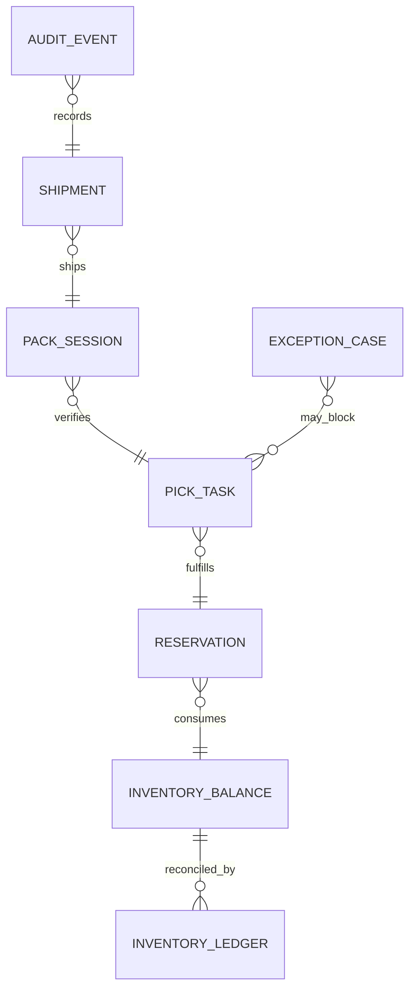

# ERD and Database Schema

## Core Tables

| Table | Purpose | Key Columns | Constraints |
|---|---|---|---|
| `inventory_balance` | Current on-hand and reserved quantities by bin | `warehouse_id, sku, bin_id` | `on_hand >= reserved >= 0` |
| `inventory_ledger` | Immutable stock movement journal | `ledger_id, mutation_type, correlation_id` | append-only |
| `reservation` | Allocation reservations for order lines | `reservation_id, order_line_id, qty` | unique active reservation per line |
| `pick_task` | Executable pick work | `task_id, wave_id, state` | state machine enforcement |
| `pack_session` | Packaging reconciliation context | `pack_session_id, shipment_id, state` | requires all lines reconciled before close |
| `shipment` | Outbound shipment state | `shipment_id, carrier_status, tracking_no` | confirm once semantics |
| `exception_case` | Operational exception lifecycle | `case_id, type, state, owner` | transition guards |
| `audit_event` | Compliance and forensic evidence | `audit_id, actor_id, action, reason_code` | immutable |

## Relationship Overview

## Transaction Boundaries
- `reserve_inventory`: updates `inventory_balance`, inserts `reservation`, inserts `inventory_ledger`, writes outbox event.
- `confirm_pick`: updates `pick_task`, updates `inventory_balance` (reserved decrement), inserts ledger + audit.
- `confirm_shipment`: updates `shipment`, finalizes decrement evidence, emits shipment-confirmed event.

## Index and Scale Guidance
- Partition hot tables by `warehouse_id`.
- Composite indexes:
  - `inventory_balance(warehouse_id, sku, bin_id)`
  - `reservation(order_line_id, state)`
  - `pick_task(wave_id, state, zone)`
- TTL/archive strategy for `audit_event` and `inventory_ledger` with replay-safe retention window.
