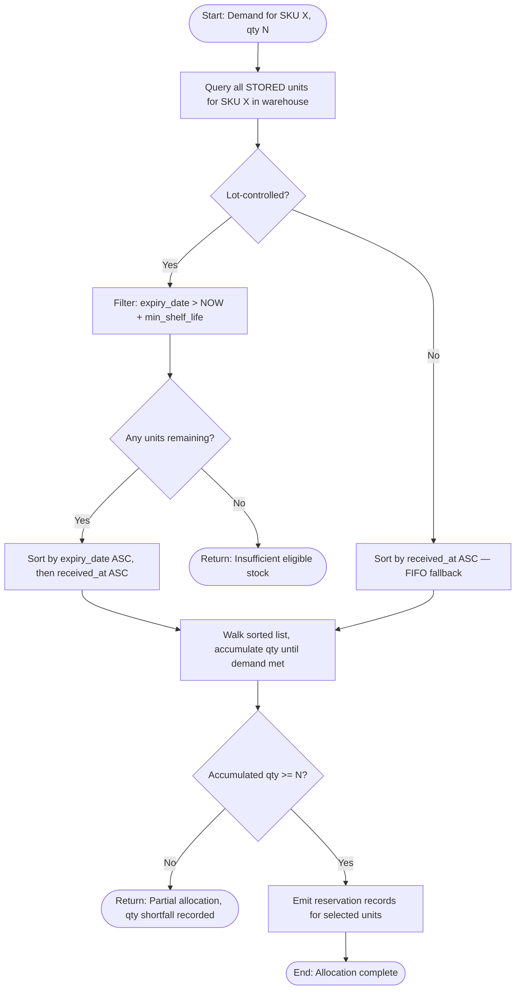
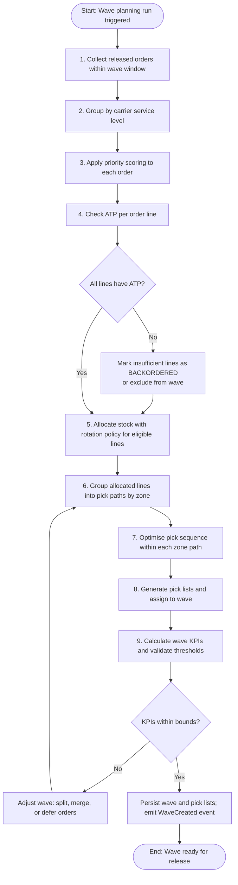

# Inventory Allocation and Wave Planning

## Problem Scope and Objectives

High-throughput warehouses face a core scheduling problem: given a pool of released orders, a snapshot of available inventory, and a set of physical constraints (zone layout, worker capacity, carrier cut-off times), produce a picking plan that ships as many orders on time as possible while minimising wasted picker travel and warehouse congestion.

The allocation and wave planning subsystem must satisfy the following objectives:

- **Maximise pick efficiency** — group lines that are physically close into a single picker path to reduce travel distance per unit picked.
- **Respect SLAs** — prioritise orders by service level tier and carrier cut-off time so premium shipments are never delayed by economy-tier work.
- **Minimise partial shipments** — prefer full-order fulfilment; only split or backorder when inventory genuinely does not exist.
- **Handle partial stock** — when total ATP is insufficient, apply deterministic partial allocation rules so the customer experience is predictable and the business impact is minimised.
- **Survive partial failures** — an allocation that partially commits must be fully compensatable. No orphaned reservations, no double-counting of ATP.

---

## Inventory Rotation Policies

Rotation policies determine which specific inventory units (lots, bins, serial numbers) are consumed first when demand exceeds a single storage unit's capacity.

### FIFO — First In, First Out

**Description:** The oldest received stock is consumed before newer stock, regardless of expiry date.

**When to use:** Non-perishable goods where unit cost varies over time (e.g., electronics, books, commodity hardware). Using older stock first reduces obsolescence risk and matches accounting treatment under FIFO costing.

**Algorithm:** Sort candidate inventory units ascending by `received_at` timestamp within the same SKU/warehouse scope. Allocate from the top of the list until the demand quantity is satisfied.

---

### FEFO — First Expired, First Out

**Description:** The unit closest to its expiry date is consumed first, regardless of receipt date.

**When to use:** Perishable or date-sensitive goods (food, pharmaceuticals, cosmetics, chemicals). Mandatory in regulated industries where selling expired goods carries legal liability.

**Algorithm:** Sort candidate inventory units ascending by `expiry_date`, then ascending by `received_at` as a tiebreaker. Exclude units whose `expiry_date < NOW() + min_remaining_shelf_life_threshold`. Allocate from the top.



---

### LIFO — Last In, First Out

**Description:** The most recently received stock is consumed first.

**When to use:** Rarely used in fulfilment warehouses; primarily applicable for bulk liquid or fungible commodities stored in tanks or silos where the most recently added material sits on top. Also used in some tax jurisdictions for LIFO inventory costing purposes.

**Algorithm:** Sort candidate inventory units descending by `received_at`. Allocate from the top. Note: LIFO is explicitly disabled for any SKU with a configured `expiry_date` field to prevent shipping near-expired goods.

---

## Bin Selection Algorithm

When multiple bins hold eligible stock for the same SKU/lot, the algorithm must score each candidate bin and select the highest-scoring combination that satisfies the demand quantity while respecting bin and weight constraints.

### Scoring Factors

| Factor              | Weight | Description                                                    | Calculation Method                                                        |
|---------------------|--------|----------------------------------------------------------------|---------------------------------------------------------------------------|
| Distance to pick station | 0.35 | Bins closer to the order's staging area reduce travel time   | `1 - (bin_distance / max_zone_distance)` normalised 0–1                  |
| Bin fullness ratio  | 0.20   | Prefer bins that will be emptied or close to empty after pick | `current_qty / bin_capacity`; score = `1 - remaining_ratio_after_pick`   |
| Lot expiry proximity | 0.25  | FEFO compliance; earlier expiry scores higher                 | `1 - (days_to_expiry / max_shelf_life_days)` clipped 0–1                 |
| Weight distribution | 0.10  | Balance pallet/cart weight for ergonomics                     | Penalty if running weight > `pick_cart_weight_limit * 0.8`               |
| Zone affinity       | 0.10  | Prefer bins in zones already included in the current pick path | `1` if zone already in path, `0` otherwise                               |

### Pseudocode

```text
function scoreBin(bin, demand, pickPath, rotationPolicy):
    eligibleUnits = getEligibleUnits(bin, demand.sku, demand.requiredExpiryBuffer)
    if eligibleUnits.totalQty == 0:
        return NULL  // bin ineligible

    distanceScore   = 1.0 - (bin.distanceToStation / zoneMaxDistance)
    expiryScore     = computeExpiryScore(eligibleUnits, rotationPolicy)
    fullnessScore   = 1.0 - ((bin.currentQty - demand.qty) / bin.capacity)
    weightPenalty   = pickPath.runningWeight + demand.unitWeight * demand.qty > CART_LIMIT * 0.8
                      ? 0.0 : 1.0
    zoneAffinityScore = pickPath.zones.contains(bin.zone) ? 1.0 : 0.0

    total = (distanceScore   * 0.35)
          + (expiryScore     * 0.25)
          + (fullnessScore   * 0.20)
          + (weightPenalty   * 0.10)
          + (zoneAffinityScore * 0.10)

    return BinScore(bin, eligibleUnits, total)

function selectBins(demand, candidates, pickPath, rotationPolicy):
    scored = [scoreBin(b, demand, pickPath, rotationPolicy) for b in candidates]
             .filter(not NULL)
             .sortDesc(by = score)

    allocated = []
    remaining = demand.qty
    for entry in scored:
        take = min(entry.eligibleUnits.totalQty, remaining)
        allocated.append(AllocationLine(entry.bin, take, entry.eligibleUnits))
        remaining -= take
        if remaining == 0: break

    if remaining > 0:
        return PartialAllocation(allocated, shortfall = remaining)
    return FullAllocation(allocated)
```

---

## Wave Planning Architecture

Waves are logical batches of pick work released together to optimise labour utilisation. The WMS supports four wave types.

| Type             | Description                                                                 | Best For                                    | Pros                                              | Cons                                                        |
|------------------|-----------------------------------------------------------------------------|---------------------------------------------|---------------------------------------------------|-------------------------------------------------------------|
| **Single Order** | One picker works all lines for a single order                               | Large or heavy orders, bespoke kitting       | Simple, easy to track per-order progress          | Inefficient for small orders; high picker travel            |
| **Zone Picking** | Each picker works one zone; pick lists are consolidated per zone            | Large warehouses with distinct product zones | Low picker travel; specialisation per zone        | Requires downstream consolidation step before packing       |
| **Batch Picking** | One picker fulfils multiple orders simultaneously on a cart                | Small, lightweight items; high order volume  | High lines/picker/hour; minimal idle time         | Requires sortation at pack station; harder to track errors  |
| **Cluster Picking** | One picker uses a multi-tote cart, sorting to order totes as they pick  | Medium item count, multi-SKU orders          | Balances efficiency and accuracy; no sort wall needed | Cart management overhead; tote assignment errors possible |

Wave type is selected per wave by the planning algorithm based on order profile, SKU velocity, and current zone congestion.

---

## Wave Planning Algorithm (Step-by-Step)



### Step Descriptions

**Step 1 — Collect released orders within wave window.**
Query `shipment_orders` where `status = ALLOCATED` and `carrier_cut_off <= wave_end_time`. The wave window is configurable per warehouse (typically 30–90 minutes). Include a hard cap on total line count to prevent oversized waves.

**Step 2 — Group by carrier and service level.**
Separate premium (same-day, next-day) orders from standard orders. This ensures premium work is assigned to the most experienced pickers and never starved by volume orders.

**Step 3 — Apply priority scoring.**
Each order receives a composite priority score:
`score = (sla_tier_weight * 0.6) + (1 / hours_to_cut_off * 0.3) + (order_age_hours * 0.1)`
Orders are sorted descending by score. This score drives sequencing in the allocation step.

**Step 4 — Check ATP per order line.**
For each order line, query the real-time ATP view: `on_hand_qty - reserved_qty`. Lines with ATP = 0 are flagged. Depending on backorder policy, the whole order or just the short line is excluded from the wave.

**Step 5 — Allocate stock with rotation policy.**
For each eligible line, call the bin selection algorithm (see above) with the warehouse's configured rotation policy (FEFO by default). Reservation records are written to `inventory_reservations` with optimistic concurrency (`version` check). Any concurrency failure triggers a retry (see Allocation Conflict Resolution).

**Step 6 — Group allocated lines into pick paths by zone.**
Group allocated bins by warehouse zone. Apply wave type heuristic to decide whether to use zone, batch, cluster, or single-order picking. Build abstract `PickPath` objects that represent the set of bins a single picker will visit.

**Step 7 — Optimise pick sequence.**
Within each zone pick path, sort bins using a nearest-neighbour heuristic on the warehouse coordinate grid (aisle/bay/level). This minimises backtracking. For batch picks, additionally interleave order totes to minimise touches per cart stop.

**Step 8 — Generate pick lists.**
Materialise `PickList` records with individual `PickTask` line items. Each task includes: `bin_id`, `sku_id`, `lot_id`, `requested_qty`, `tote_id` (batch/cluster only), `sequence_no`.

**Step 9 — Calculate wave KPIs and validate thresholds.**
Compute: estimated_duration (lines ÷ target_lines_per_hour), picker_utilisation, zone_balance, backorder_line_count. If any threshold is breached (e.g., estimated_duration > wave_window * 1.1), rebalance by deferring low-priority orders to the next wave.

---

## Allocation Conflict Resolution

Concurrent allocation requests for the same high-velocity SKU are a normal occurrence in a busy warehouse. The system handles this with optimistic concurrency and a bounded retry strategy.

### Optimistic Concurrency

Every `inventory_unit` row carries a `version` integer column. An allocation update uses a conditional update:

```sql
UPDATE inventory_units
SET    reserved_qty = reserved_qty + :qty,
       version      = version + 1
WHERE  id           = :unit_id
  AND  version      = :expected_version
  AND  (on_hand_qty - reserved_qty) >= :qty;
```

If `rows_affected = 0` after this update, a conflict is detected.

### Retry Strategy

```text
MAX_RETRIES    = 5
BASE_DELAY_MS  = 50
BACKOFF_FACTOR = 2

for attempt in 1..MAX_RETRIES:
    snapshot = fetchFreshInventorySnapshot(sku, warehouse)
    result   = attemptAllocation(snapshot, demand)
    if result.success:
        return result
    if result.reason == INSUFFICIENT_STOCK:
        return PartialOrBackorder  // no point retrying
    delay = BASE_DELAY_MS * (BACKOFF_FACTOR ^ attempt) + jitter(0..20ms)
    sleep(delay)

return AllocationFailed(reason = MAX_RETRIES_EXCEEDED)
```

### Compensation

If all retries fail, the service:
1. Rolls back any partial reservation records for this order.
2. Publishes an `AllocationFailed` event to the outbox.
3. Marks the `ShipmentOrder` as `BACKORDERED`.
4. Schedules a re-allocation attempt for the next wave cycle.

No reservations are left in a partial state. The invariant `on_hand_qty - sum(reserved_qty) >= 0` is always maintained.

---

## Short Pick Handling and Reallocation

A **short pick** occurs when a picker arrives at a designated bin and finds fewer units than the pick task specifies (damaged stock, mis-count, prior unrecorded pick).

### Detection

The picker enters the actual quantity found on the pick device. If `actual_qty < requested_qty`, the system records a short pick event.

### Reallocation Steps

```text
1. Record ShortPickEvent(taskId, requestedQty, actualQty, binId, reportedBy)

2. Compute shortfall = requestedQty - actualQty

3. Search for alternate eligible bins:
   candidates = findEligibleBins(sku, lot, shortfall, excludeBin = binId)

4. If candidates found:
   a. Score and select best alternate bin(s) using bin selection algorithm
   b. Create supplemental PickTask(s) appended to same or new pick list
   c. Update reservation records atomically

5. If no candidates found:
   a. Attempt inventory adjustment (trigger cycle count for that bin)
   b. If partial fill acceptable (per order SLA policy):
      - Mark ShipmentOrder line as PARTIALLY_FULFILLED
      - Backorder shortfall qty
   c. If partial fill not acceptable:
      - Escalate to BACKORDERED
      - Release all reservations for this order line

6. Publish ShortPickResolved or ShortPickBackordered event
```

### Partial Fulfillment Decision

| SLA Tier     | Partial Fill Allowed | Action on Short                        |
|--------------|----------------------|----------------------------------------|
| SAME_DAY     | No                   | Hold entire order; escalate to manager |
| NEXT_DAY     | Yes (≥ 80% fill rate)| Ship partial; backorder remainder      |
| STANDARD     | Yes (≥ 50% fill rate)| Ship partial; backorder remainder      |
| ECONOMY      | Yes (any qty > 0)    | Ship partial; backorder remainder      |

---

## Wave Cut-off Time Management

### Cut-off Enforcement

Each carrier service level has a `carrier_cut_off_time` stored as a daily UTC time. The wave planning scheduler runs every `WAVE_INTERVAL_MINUTES` (default: 30). At each run it queries orders whose cut-off is within the next `WAVE_LOOKAHEAD_MINUTES` (default: 90).

### Late Order Policy

Orders that arrive after the last wave for their carrier cut-off has been released are handled as follows:

1. **Within 15 minutes of cut-off** — system checks if an existing in-progress wave has capacity to absorb the order. If yes, the order is appended (requires planner approval for waves already IN_PROGRESS).
2. **15–60 minutes past cut-off** — order is flagged as `LATE_FOR_CARRIER`. A `LateOrderAlert` notification is sent to the warehouse supervisor. The order is queued for the next available wave.
3. **More than 60 minutes past cut-off** — order is automatically downgraded to the next available service level, or held for the next business day with a customer notification triggered via the OMS event.

### Emergency Wave Creation

A supervisor can trigger a manual emergency wave for a set of orders:

```text
POST /api/v1/waves/emergency
{
  "order_ids": [...],
  "reason": "VIP_CUSTOMER_ESCALATION",
  "override_cut_off": true
}
```

Emergency waves bypass the normal `PLANNED → RELEASED` flow and are created directly in `RELEASED` state. They are capped at 50 order lines by default to prevent resource starvation.

---

## Performance Considerations

### Database Indexes

The following indexes are essential for allocation and wave planning query performance:

```sql
-- ATP query: hot path for every allocation
CREATE INDEX idx_inv_units_sku_wh_status
    ON inventory_units (warehouse_id, sku_id, status)
    WHERE status = 'STORED';

-- FEFO sort
CREATE INDEX idx_inv_units_expiry
    ON inventory_units (sku_id, warehouse_id, expiry_date, received_at)
    WHERE status = 'STORED';

-- Reservation lookup
CREATE INDEX idx_reservations_order
    ON inventory_reservations (shipment_order_id, status);

-- Wave planning order eligibility
CREATE INDEX idx_shipment_orders_wave
    ON shipment_orders (warehouse_id, status, carrier_cut_off)
    WHERE status IN ('ALLOCATED', 'BACKORDERED');
```

### Batching Strategy

Allocation runs in batches of `ALLOCATION_BATCH_SIZE` order lines (default: 200). This limits the size of a single transaction, keeping lock hold times short and reducing the blast radius of a failure.

### Parallelism

Wave planning is embarrassingly parallel at the zone level. After step 6 (group by zone), each zone's pick path optimisation runs in a separate worker thread or async task. Results are merged before pick list generation.

### Caching of Bin Scores

Bin distance scores are static (bin coordinates don't change). They are pre-computed and cached in an in-memory map keyed by `(bin_id, pick_station_id)`. Cache is invalidated only when warehouse layout changes. This eliminates repeated distance calculations during high-frequency wave planning.

### Approximate ATP Checks

For the initial wave planning eligibility filter (step 4), an approximate ATP view built from a read replica is acceptable. The precise, lock-protected check is only performed at the point of the actual reservation write (step 5). This two-phase approach prevents the read replica lag from causing over-eager backordering while still keeping the planning query fast.

---

## Metrics and KPIs

| Metric                        | Formula                                                                 | Target                 | Alert Threshold         |
|-------------------------------|-------------------------------------------------------------------------|------------------------|-------------------------|
| Lines per picker per hour     | `total_lines_picked / (total_picker_hours)`                            | ≥ 120 lines/hr         | < 90 lines/hr           |
| Wave build time               | `wave_released_at - wave_planning_start_at` (seconds)                  | ≤ 30 s                 | > 60 s                  |
| Allocation conflict rate      | `conflict_retries / total_allocation_attempts * 100`                   | ≤ 2%                   | > 5%                    |
| Short pick rate               | `short_pick_tasks / total_pick_tasks * 100`                            | ≤ 1%                   | > 3%                    |
| Wave on-time completion rate  | `waves_completed_before_cut_off / total_waves * 100`                   | ≥ 98%                  | < 95%                   |
| Pick accuracy rate            | `correct_picks / total_picks * 100`                                    | ≥ 99.8%                | < 99.5%                 |
| Backorder rate                | `backordered_lines / total_order_lines * 100`                          | ≤ 0.5%                 | > 2%                    |
| Reallocation rate             | `short_pick_reallocations / total_pick_tasks * 100`                    | ≤ 0.8%                 | > 2%                    |
