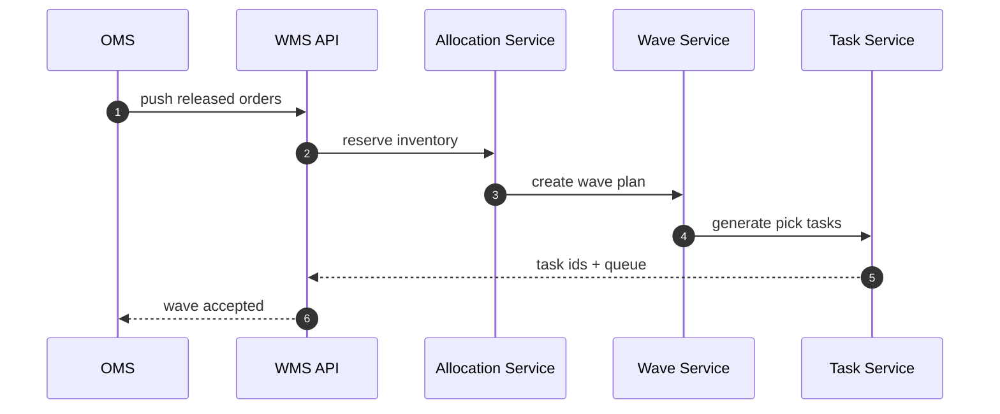
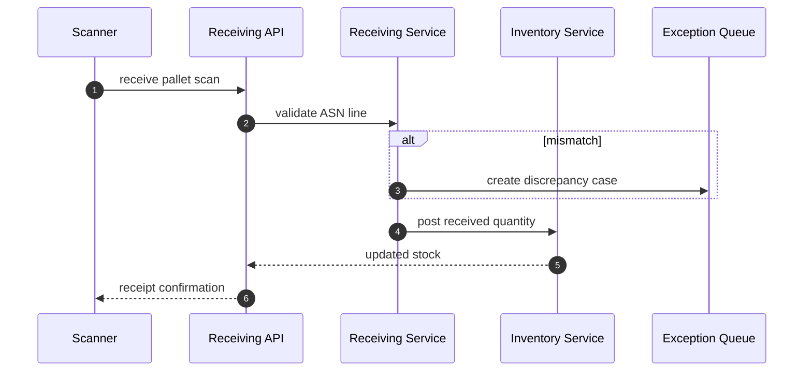

# Sequence Diagrams

## Wave Creation and Task Dispatch

```mermaid
sequenceDiagram
    autonumber
    participant OMS as OMS
    participant API as WMS API
    participant ALLOC as Allocation Service
    participant WAVE as Wave Service
    participant TASK as Task Service

    OMS->>API: push released orders
    API->>ALLOC: reserve inventory
    ALLOC->>WAVE: create wave plan
    WAVE->>TASK: generate pick tasks
    TASK-->>API: task ids + queue
    API-->>OMS: wave accepted
```

## Goods Receipt with Discrepancy

```mermaid
sequenceDiagram
    autonumber
    participant Scanner
    participant API as Receiving API
    participant REC as Receiving Service
    participant INV as Inventory Service
    participant QA as Exception Queue

    Scanner->>API: receive pallet scan
    API->>REC: validate ASN line
    alt mismatch
      REC->>QA: create discrepancy case
    end
    REC->>INV: post received quantity
    INV-->>API: updated stock
    API-->>Scanner: receipt confirmation
```
