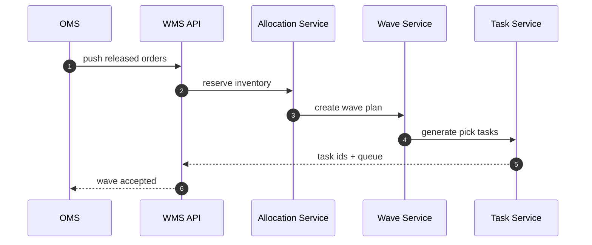
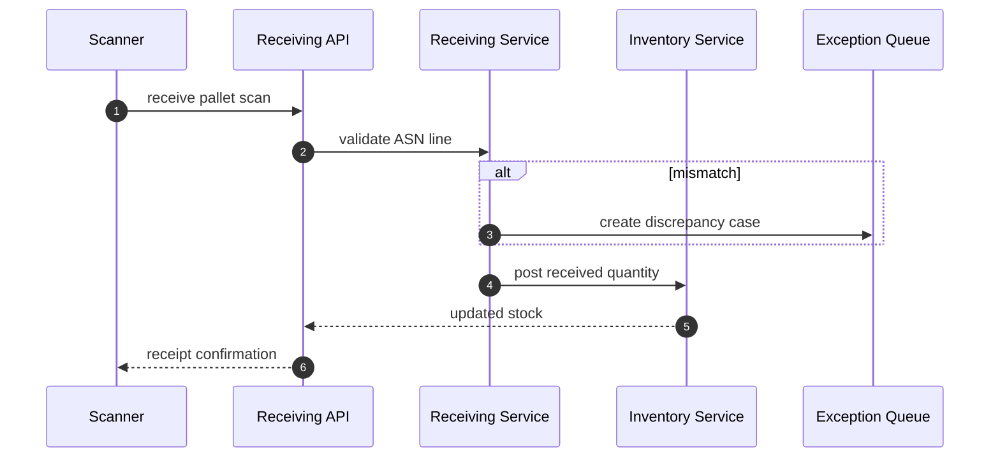
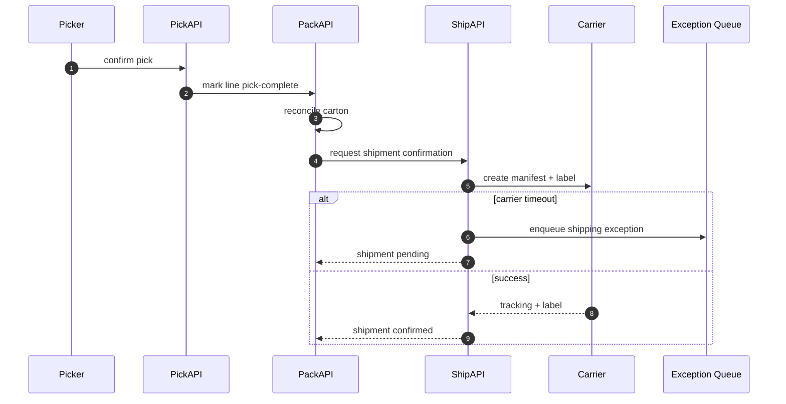

# Sequence Diagrams

## Wave Creation and Task Dispatch

**Critical Guarantees**
- Allocation reservation and wave creation are linked by correlation id.
- Duplicate OMS release message must return same `wave_id` (idempotent).

## Goods Receipt with Discrepancy

## Pick -> Pack -> Ship with Carrier Failure Path

## Implementation Guidance
- Use outbox relay between command DB and event bus.
- Ensure retries are safe via business idempotency, not transport dedupe alone.
- Persist external request/response hash for carrier disputes.
