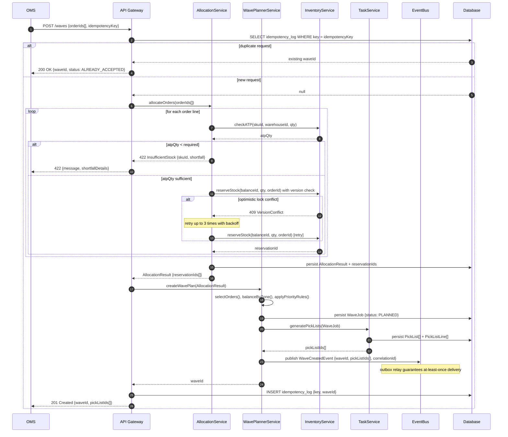
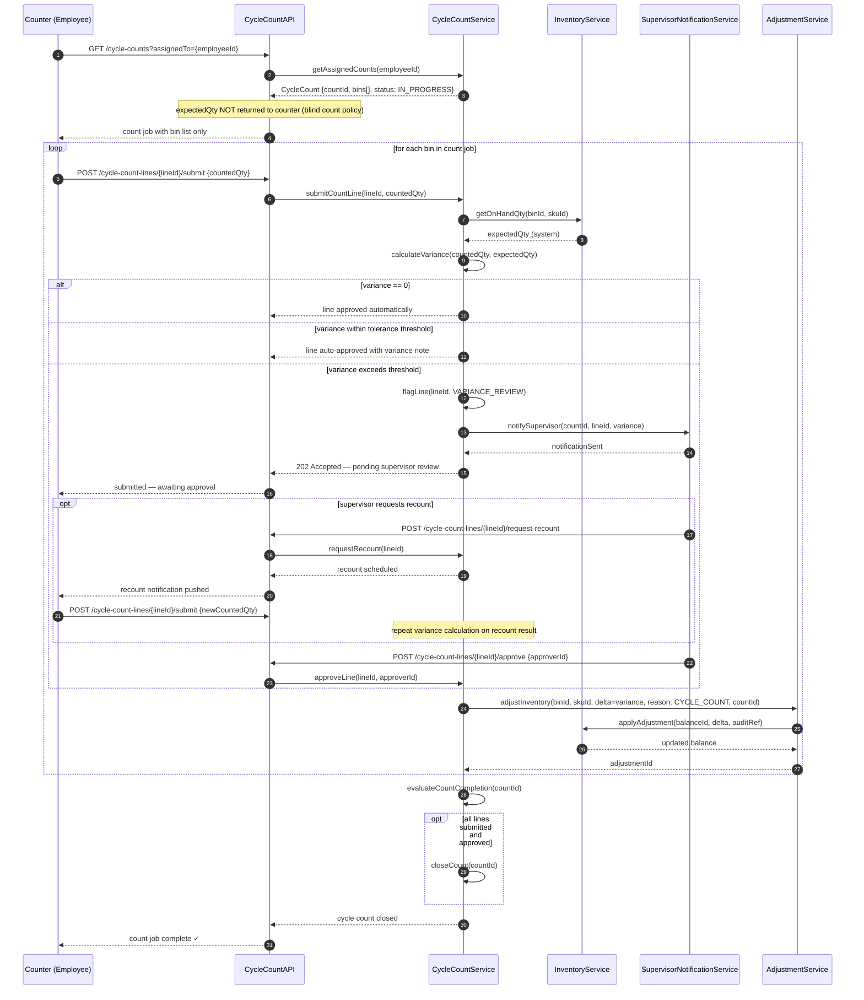
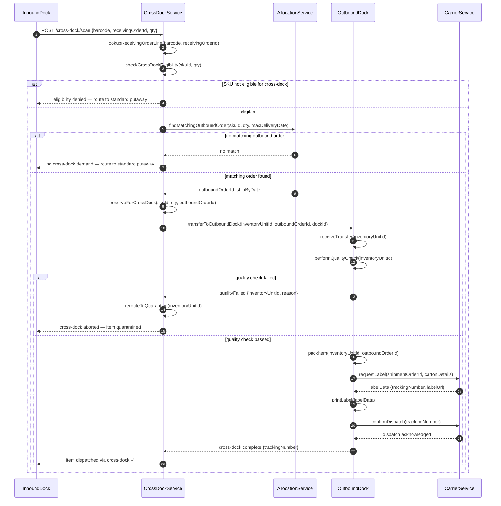

# Sequence Diagrams — Warehouse Management System

## Overview

This document contains eight detailed sequence diagrams covering the primary operational flows in the WMS. Each diagram uses `autonumber` for step traceability. Participants are named consistently with the service architecture. `alt`, `opt`, and `loop` fragments model conditional and repetitive behaviour explicitly.

---

## 1. Wave Creation and Task Dispatch

Covers: order intake from OMS, ATP validation, optimistic-lock inventory reservation, wave plan creation, pick list generation, and idempotent event publishing.



**Key guarantees:** Idempotency key prevents duplicate waves on OMS retry. Optimistic locking on `InventoryBalance.version` prevents oversell under concurrent allocation. The `WaveCreatedEvent` is written to the outbox table in the same DB transaction as the wave, ensuring no lost events on crash.

---

## 2. Goods Receipt with Discrepancy Handling

Covers: ASN lookup, barcode scan, quantity and lot validation, discrepancy detection, QA hold, and putaway task generation.

```mermaid
sequenceDiagram
    autonumber
    participant MOB as Scanner / Mobile
    participant RAPI as ReceivingAPI
    participant REC as ReceivingService
    participant INV as InventoryService
    participant QA as QualityService
    participant EXC as ExceptionService
    participant NOTIF as NotificationService

    MOB->>RAPI: GET /receiving-orders/{orderId}
    RAPI->>REC: getReceivingOrder(orderId)
    REC-->>RAPI: ReceivingOrder {lines[], expectedArrivalDate}
    RAPI-->>MOB: ReceivingOrder details
    loop for each pallet / carton
        MOB->>RAPI: POST /receiving-orders/{orderId}/scan {barcode, scannedQty, lotNumber, expiryDate}
        RAPI->>REC: receiveItem(orderId, barcode, scannedQty, lotData)
        REC->>REC: matchBarcodeToLine(barcode)
        alt barcode not found on order
            REC-->>RAPI: 422 UnexpectedItem {barcode}
            RAPI-->>MOB: 422 — item not on this order
        else barcode matched
            REC->>REC: calculateVariance(expectedQty, scannedQty)
            alt variance exceeds tolerance
                REC->>EXC: createDiscrepancyCase(orderId, lineId, variance, reason)
                EXC-->>REC: discrepancyCaseId
                REC->>NOTIF: notifyReceivingManager(discrepancyCaseId)
                Note over REC: line flagged hasDiscrepancy=true; receipt continues
            end
            opt SKU is lot-controlled
                REC->>REC: validateLot(lotNumber, expiryDate, skuId)
                alt lot invalid or expired
                    REC->>QA: flagForInspection(lineId, reason: LOT_INVALID)
                    QA-->>REC: inspectionTaskId
                end
            end
            REC->>INV: createInventoryUnit(skuId, binId=RECEIVING_DOCK, qty, lotId, serialNumber)
            INV->>INV: updateBalance(binId, skuId, +qty)
            INV-->>REC: inventoryUnitId
            REC->>REC: generatePutawayTask(inventoryUnitId)
            REC-->>RAPI: ReceiptResult {inventoryUnitId, putawayTaskId, hasDiscrepancy}
            RAPI-->>MOB: receipt confirmation + putaway directions
        end
    end
    REC->>REC: evaluateOrderCompletion(orderId)
    opt all lines received within tolerance
        REC->>REC: closeReceivingOrder(orderId)
    end
```

**Key guarantees:** Discrepancies are recorded non-blocking—receipt proceeds but the line is flagged. Lot validation failures trigger a QA hold before putaway. `createInventoryUnit` and `updateBalance` are committed atomically.

---

## 3. Pick → Pack → Ship with Carrier Failure Path

Covers: pick confirmation, lot and serial verification, short-pick alt, pack close, carrier API call with timeout retry, label generation, and dispatch confirmation.

```mermaid
sequenceDiagram
    autonumber
    participant PICK as Picker
    participant PAPI as PickAPI
    participant PSVC as PickService
    participant PACK as PackStation
    participant SHIP as ShippingService
    participant CAR as CarrierAdapter
    participant BUS as EventBus
    participant EXQ as ExceptionQueue

    PICK->>PAPI: GET /pick-lists/{pickListId}/next-line
    PAPI->>PSVC: getNextLine(pickListId, employeeId)
    PSVC-->>PAPI: PickListLine {binId, skuId, lotId, requiredQty, sortSeq}
    PAPI-->>PICK: directed pick instruction
    PICK->>PAPI: POST /pick-lines/{lineId}/confirm {scannedBin, scannedLot, pickedQty, serialNumbers[]}
    PAPI->>PSVC: confirmPickLine(lineId, pickedQty, lotId, serials[])
    PSVC->>PSVC: validateBinMatch(scannedBin, expectedBin)
    PSVC->>PSVC: validateLotSerial(lotId, serials[], skuId)
    alt pickedQty < requiredQty
        PSVC->>PSVC: recordShortPick(lineId, shortQty, reason)
        PSVC->>BUS: publish ShortPickEvent {lineId, shortQty}
        Note over PSVC: short pick allowed; line closed as SHORT
    end
    PSVC->>PSVC: updatePickedQty(lineId, pickedQty)
    PSVC->>PACK: notifyLinePickComplete(pickListLineId, pickedItems[])
    PACK->>PACK: scanItemsIntoCarton(pickedItems[])
    PACK->>PACK: verifyCartonContents(shipmentOrderId)
    alt contents mismatch
        PACK-->>PAPI: 409 CartonMismatch — recount required
        PAPI-->>PICK: error — rescan required
    else contents verified
        PACK->>PACK: closeCarton(cartonId, weight, dimensions)
        PACK->>SHIP: requestShipment(shipmentOrderId, cartonDetails)
        loop carrier API call, up to 3 retries
            SHIP->>CAR: POST /shipments {carton, serviceLevel, recipient}
            alt timeout or 5xx from carrier
                CAR-->>SHIP: timeout / error
                Note over SHIP: wait exponential backoff; retry
            else carrier success
                CAR-->>SHIP: {trackingNumber, labelUrl, rate}
                SHIP->>SHIP: persistShipment(trackingNumber, labelUrl)
                SHIP-->>PACK: shipment confirmed {trackingNumber}
            end
        end
        opt all retries exhausted
            SHIP->>EXQ: enqueue CarrierFailureException {shipmentOrderId, attempt: 3}
            SHIP-->>PACK: 202 Accepted — shipment pending manual intervention
        end
        SHIP->>BUS: publish ShipmentDispatchedEvent {shipmentId, trackingNumber}
        PACK-->>PICK: carton closed and dispatched
    end
```

**Key guarantees:** Short picks are non-blocking but trigger a real-time event for re-slotting decisions. Carrier adapter retries are idempotent via a client-generated request UUID sent in the header. Carrier failures are queued for supervisor review without blocking the pack station.

---

## 4. Directed Putaway to Optimal Bin

Covers: putaway task lookup, bin scoring, capacity validation, temperature check, employee override flow, confirmation, and inventory balance update.

```mermaid
sequenceDiagram
    autonumber
    participant MOB as Mobile Scanner
    participant PAPI as PutawayAPI
    participant PSVC as PutawayService
    participant BSEL as BinSelectorService
    participant INV as InventoryService
    participant CAP as CapacityService

    MOB->>PAPI: GET /putaway-tasks?employeeId={id}
    PAPI->>PSVC: getAssignedTasks(employeeId)
    PSVC-->>PAPI: PutawayTask[] {inventoryUnitId, suggestedBinId, skuId, qty}
    PAPI-->>MOB: task list with suggested bin
    MOB->>PAPI: POST /putaway-tasks/{taskId}/start
    PAPI->>PSVC: startTask(taskId)
    PSVC->>BSEL: selectBin(inventoryUnit, warehouseId)
    loop evaluate candidate bins
        BSEL->>CAP: checkWeightCapacity(binId, itemWeightKg)
        CAP-->>BSEL: capacityOk bool
        BSEL->>CAP: checkVolumeCapacity(binId, itemVolumeCm3)
        CAP-->>BSEL: capacityOk bool
        BSEL->>BSEL: checkTemperatureCompatibility(binId, skuStorageConstraints)
        BSEL->>BSEL: scoreBin(bin, inventoryUnit)
    end
    BSEL-->>PSVC: rankedBins[] {binId, score}[]
    PSVC-->>PAPI: suggestedBin {binId, aisle, bay, level, directions}
    PAPI-->>MOB: navigate to bin with directions
    MOB->>PAPI: POST /putaway-tasks/{taskId}/confirm {scannedBinId, scannedItemId}
    PAPI->>PSVC: confirmPutaway(taskId, scannedBinId)
    alt scannedBinId != suggestedBinId
        PSVC->>PSVC: validateOverrideBin(scannedBinId, inventoryUnit)
        opt override bin fails hard constraints
            PSVC-->>PAPI: 422 BinNotEligible {reason}
            PAPI-->>MOB: 422 — override rejected, use suggested bin
        end
        Note over PSVC: soft override accepted; log overrideReason
    end
    PSVC->>INV: moveInventoryUnit(unitId, targetBinId=scannedBinId)
    INV->>INV: updateBalance(sourceBin, skuId, -qty)
    INV->>INV: updateBalance(targetBin, skuId, +qty)
    INV-->>PSVC: updated balance
    PSVC->>PSVC: closeTask(taskId, status: COMPLETED)
    PSVC-->>PAPI: success
    PAPI-->>MOB: putaway complete ✓
```

**Key guarantees:** Weight, volume, and temperature are hard constraints enforced before bin suggestion. Employee override is permitted only if the hard constraints also pass for the override bin. `moveInventoryUnit` debits the source bin and credits the target bin in the same transaction.

---

## 5. Cycle Count with Variance Approval

Covers: count job lookup, blind count data entry, variance calculation, recount request, supervisor approval gate, inventory adjustment, and ledger write.



**Key guarantees:** Blind count prevents counter bias. Auto-approval threshold keeps low-variance lines out of the supervisor queue. The adjustment and ledger write are committed atomically with the line approval, preventing partial updates on crash.

---

## 6. Replenishment Trigger and Completion

Covers: min/max threshold evaluation, task creation, priority calculation, employee assignment, pick from bulk storage, delivery to pick face, confirmation, and balance update.

```mermaid
sequenceDiagram
    autonumber
    participant SCH as ReplenishmentScheduler
    participant RSVC as ReplenishmentService
    participant INV as InventoryService
    participant TASK as TaskService
    participant EMP as Employee Scanner
    participant BUS as EventBus

    SCH->>RSVC: runThresholdCheck(warehouseId)
    RSVC->>INV: getBinsAtOrBelowReorderPoint(warehouseId)
    INV-->>RSVC: lowStockBins[] {binId, skuId, onHandQty, reorderPoint, maxQty}
    loop for each low-stock pick-face bin
        RSVC->>INV: findBulkStockBin(skuId, requiredQty)
        alt bulk stock available
            INV-->>RSVC: sourceBinId, availableQty
            RSVC->>RSVC: calculateReplenishQty(currentQty, maxQty, availableQty)
            RSVC->>RSVC: calculatePriority(onHandQty, reorderPoint, pendingPickDemand)
            RSVC->>TASK: createReplenishmentTask(sourceBinId, targetBinId, skuId, qty, priority)
            TASK-->>RSVC: taskId
            RSVC->>TASK: assignToAvailableEmployee(taskId, warehouseId, zone)
            TASK-->>RSVC: assignedEmployeeId
            RSVC->>BUS: publish ReplenishmentTaskCreatedEvent {taskId, assignedEmployeeId}
        else no bulk stock
            RSVC->>BUS: publish StockoutAlertEvent {skuId, binId}
            Note over RSVC: skip; purchasing team alerted via event
        end
    end
    EMP->>TASK: GET /replenishment-tasks?employeeId={id}
    TASK-->>EMP: task {sourceBinId, targetBinId, skuId, qty, directions}
    EMP->>TASK: POST /replenishment-tasks/{taskId}/start
    TASK-->>EMP: task started
    EMP->>TASK: POST /replenishment-tasks/{taskId}/confirm {scannedSourceBin, scannedTargetBin, fulfilledQty}
    TASK->>INV: moveStock(skuId, sourceBinId, targetBinId, fulfilledQty)
    INV->>INV: updateBalance(sourceBin, skuId, -fulfilledQty)
    INV->>INV: updateBalance(targetBin, skuId, +fulfilledQty)
    INV-->>TASK: updated balances
    TASK->>TASK: closeTask(taskId, status: COMPLETED, fulfilledQty)
    TASK->>BUS: publish ReplenishmentCompletedEvent {taskId, fulfilledQty}
    TASK-->>EMP: replenishment complete ✓
```

**Key guarantees:** Tasks are only created when bulk stock exists, preventing phantom tasks. Priority ordering ensures pick-face bins with the highest pick demand and lowest stock are replenished first. Stock movement is atomic: both source debit and target credit are in one transaction.

---

## 7. Cross-Dock Processing

Covers: inbound receipt scan, cross-dock eligibility check, order matching, transfer to outbound dock, quality check, packing, label generation, and dispatch.



**Key guarantees:** Eligibility check runs before any reservation to avoid holding stock speculatively. Quality failure routes inventory to quarantine atomically—no inventory is lost in transit. Label generation and dispatch confirmation are synchronous within the outbound dock workflow.

---

## 8. Return Order Processing

Covers: RMA creation, return receipt scan, item inspection, condition-based disposition (restock / quarantine / dispose / refurbish), inventory update, and financial credit trigger.

```mermaid
sequenceDiagram
    autonumber
    participant CS as CustomerService
    participant RAPI as ReturnAPI
    participant RSVC as ReturnService
    participant QIS as QualityInspectionService
    participant INV as InventoryService
    participant DISP as DispositionService
    participant FIN as FinanceService

    CS->>RAPI: POST /returns {orderId, lineItems[], returnReason}
    RAPI->>RSVC: createRMA(orderId, lineItems[], returnReason)
    RSVC->>RSVC: validateReturnEligibility(orderId, lineItems[])
    alt order not returnable
        RSVC-->>RAPI: 422 ReturnNotEligible {reason}
        RAPI-->>CS: return rejected
    else eligible
        RSVC-->>RAPI: rmaId {rmaNumber, shippingLabel}
        RAPI-->>CS: RMA created {rmaNumber, prepaidLabel}
        CS->>RAPI: POST /returns/{rmaId}/receive {barcode, qty}
        RAPI->>RSVC: receiveReturn(rmaId, barcode, qty)
        RSVC->>RSVC: matchBarcodeToRMALine(barcode, rmaId)
        RSVC->>QIS: inspectReturnedItem(inventoryUnitId, skuId)
        QIS->>QIS: assessCondition(itemId)
        alt condition: LIKE_NEW or UNOPENED
            QIS-->>RSVC: disposition: RESTOCK
            RSVC->>INV: restockItem(inventoryUnitId, returnsBinId)
            INV->>INV: updateBalance(returnsBin, skuId, +qty)
            INV-->>RSVC: restocked
            RSVC->>FIN: triggerFullCredit(orderId, lineId, qty)
        else condition: DAMAGED_REPAIRABLE
            QIS-->>RSVC: disposition: REFURBISH
            RSVC->>DISP: createRefurbishTask(inventoryUnitId, skuId)
            DISP-->>RSVC: refurbishTaskId
            RSVC->>INV: moveToRefurbishZone(inventoryUnitId)
            RSVC->>FIN: triggerPartialCredit(orderId, lineId, qty, pct=50)
        else condition: CONTAMINATED or BROKEN
            QIS-->>RSVC: disposition: QUARANTINE
            RSVC->>INV: quarantineItem(inventoryUnitId, reason: RETURN_DEFECTIVE)
            INV-->>RSVC: quarantined
            RSVC->>FIN: triggerNoCredit(orderId, lineId)
        else condition: UNSALVAGEABLE
            QIS-->>RSVC: disposition: DISPOSE
            RSVC->>DISP: scheduleDisposal(inventoryUnitId, disposalMethod: RECYCLE)
            RSVC->>FIN: triggerFullCredit(orderId, lineId, qty)
            Note over RSVC: credit issued as goodwill; item written off
        end
        RSVC->>RSVC: closeRMALine(rmaId, lineId, disposition)
    end
    RSVC->>RSVC: evaluateRMACompletion(rmaId)
    opt all lines processed
        RSVC->>RSVC: closeRMA(rmaId)
        RSVC->>FIN: finalizeReturnCredit(rmaId)
    end
    FIN-->>RSVC: creditNoteId
    RSVC-->>RAPI: return processed {disposition, creditNoteId}
    RAPI-->>CS: RMA closed ✓ {creditNoteId}
```

**Key guarantees:** Condition assessment drives both inventory disposition and financial credit atomically—no partial states. Quarantined items have their inventory status set before the financial message is sent to prevent any accidental re-allocation. Refurbish tasks are created before the item leaves the returns zone.

---

## Implementation Notes

### Outbox Pattern for Events

All `EventBus.publish` calls in the diagrams above represent writes to an **outbox table** in the same relational transaction as the business state change. A background relay process reads unprocessed outbox rows and forwards them to the message broker (e.g., Kafka or RabbitMQ), then marks them delivered. This guarantees:
- **No lost events** if the broker is temporarily unavailable.
- **No phantom events** if the DB transaction rolls back.
- **Exactly-once delivery semantics** when the consumer deduplicates on `eventId`.

### Idempotency Guarantees

| Flow | Idempotency Mechanism |
|---|---|
| Wave creation | Client supplies `idempotencyKey`; server checks log before processing |
| Inventory reservation | Optimistic lock on `InventoryBalance.version`; retry on conflict |
| Carrier label request | Client-generated `requestId` sent as `X-Request-ID` header |
| Inventory adjustment | `adjustmentRef = (countId, lineId)` unique constraint on ledger |
| RMA credit | `(rmaId, lineId)` unique constraint on `FinanceCreditEvent` |

### Retry Strategies

- **Optimistic lock conflicts** (inventory reservation): exponential backoff, max 3 retries, then surface as `AllocationConflict` error.
- **Carrier API timeouts**: exponential backoff starting at 1 s, max 3 attempts; failures enqueued to `ExceptionQueue` for human review.
- **Event relay** (outbox → broker): unlimited retries with exponential backoff; alert fired if lag exceeds 60 s.
- **Putaway task bin selection**: if top-ranked bin becomes unavailable between selection and confirmation, re-run `BinSelectorService` for the next best bin.

### Compensation Transactions

| Failure Scenario | Compensation Action |
|---|---|
| Wave cancelled after allocation | `AllocationEngine.rollbackAllocation()` releases all reservations for the wave |
| Carrier dispatch fails permanently | `ShippingService` voids any partially created label; shipment reverts to `PENDING` |
| Putaway to wrong bin confirmed | Supervisor-initiated transfer task moves stock to the correct bin; audit log updated |
| Cross-dock quality failure | Quarantine move is the compensation; reservation released; outbound order re-allocated |
| Return credit sent before inventory update | Finance service holds credit note in `PENDING` state until inventory confirmation event received |

### Concurrency Model

- `InventoryBalance` rows use **optimistic concurrency** (version column) — no row-level locks in the hot path.
- `Bin.isLocked` is toggled under a **pessimistic advisory lock** for putaway and replenishment to prevent double-assignment.
- Wave plans are built from a **snapshot** of ATP at plan time; real-time conflicts are caught at reservation time with the version check.

