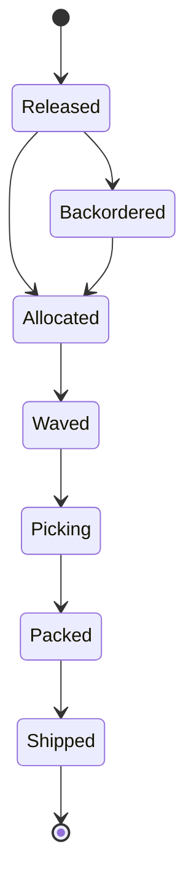
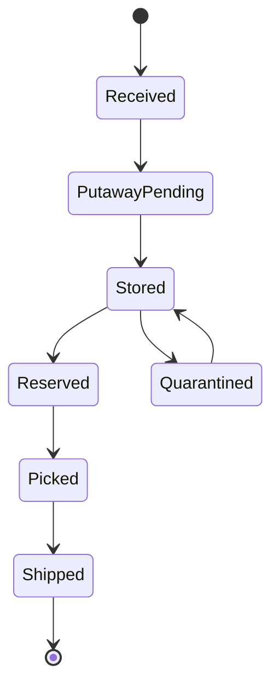
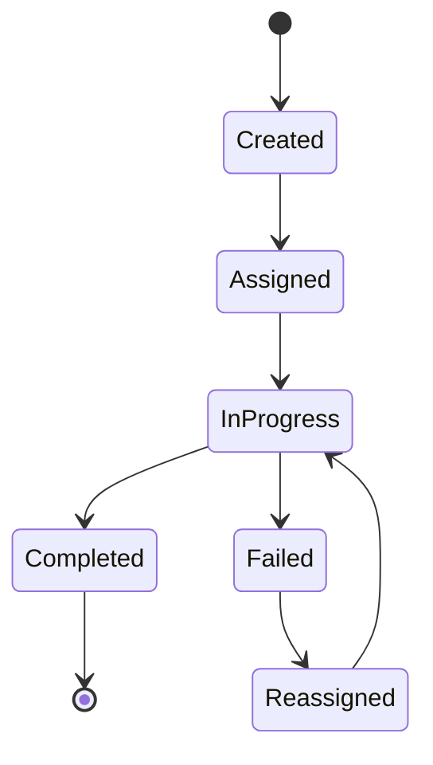

# State Machine Diagrams

## Order Fulfillment Lifecycle

```mermaid
stateDiagram-v2
    [*] --> Released
    Released --> Allocated
    Allocated --> Waved
    Waved --> Picking
    Picking --> Packed
    Packed --> Shipped
    Released --> Backordered
    Backordered --> Allocated
    Shipped --> [*]
```

## Inventory Unit Lifecycle

```mermaid
stateDiagram-v2
    [*] --> Received
    Received --> PutawayPending
    PutawayPending --> Stored
    Stored --> Reserved
    Reserved --> Picked
    Picked --> Shipped
    Stored --> Quarantined
    Quarantined --> Stored
    Shipped --> [*]
```

## Task Lifecycle

```mermaid
stateDiagram-v2
    [*] --> Created
    Created --> Assigned
    Assigned --> InProgress
    InProgress --> Completed
    InProgress --> Failed
    Failed --> Reassigned
    Reassigned --> InProgress
    Completed --> [*]
```
